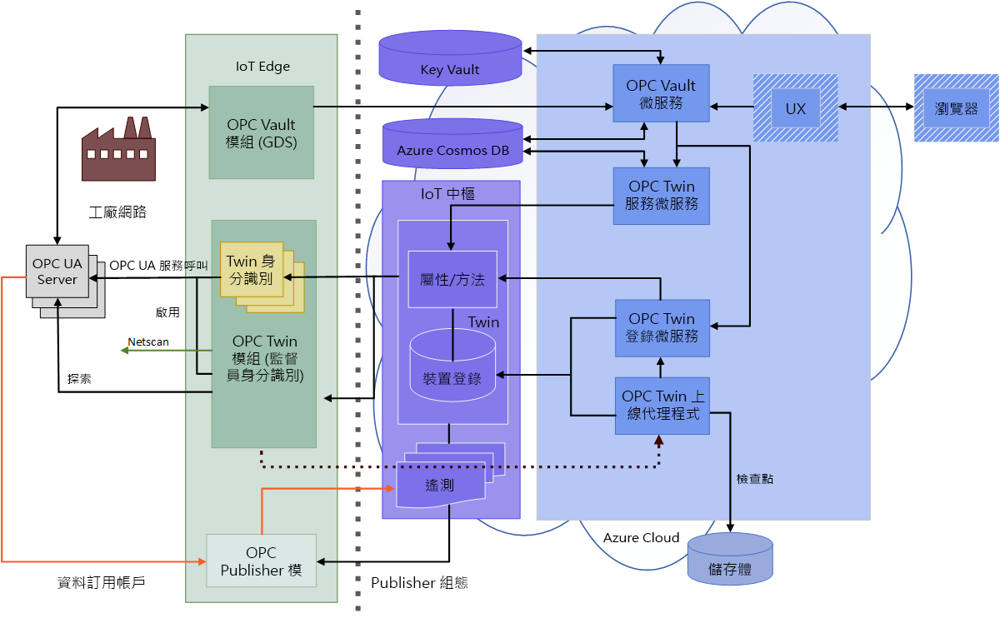

# OPC 保存庫架構

本文提供 OPC 保存庫微服務和 OPC 保存庫 IoT Edge 模組的概觀。

OPC UA 應用程式會使用應用程式執行個體憑證，提供應用程式層級的安全性。 系統會使用非對稱式加密建立安全連線，而應用程式憑證會為其提供公開和私密金鑰組。 憑證可以自我簽署，或由憑證授權單位 (CA) 簽署。

OPC UA 應用程式有一份信任憑證清單，代表其信任的應用程式。 這些憑證可以自我簽署、由 CA 簽署，或者可以是根 CA 或子 CA 本身。 如果信任的憑證屬於較大的憑證鏈，則應用程式會信任所有鏈結到信任清單中憑證的憑證。 前提是完整的憑證鏈可通過驗證。

信任自我簽署憑證和信任 CA 憑證之間的主要差異是部署和維護信任所需的安裝工作。 此外還有裝載公司專屬 CA 的額外工作。 

若要使用單一用戶端應用程式為多部伺服器散發自我簽署憑證的信任，您必須在用戶端應用程式信任清單上安裝所有伺服器應用程式憑證。 此外，您必須在所有伺服器應用程式信任清單上安裝用戶端應用程式憑證。 此管理工作的負擔相當沉重，而在您必須考慮憑證存留期及更新憑證的情況下，甚至會加重負擔。

使用公司專屬 CA 可大幅簡化搭配多部伺服器和用戶端的信任管理。 在此情況下，系統管理員會一次為所使用的每個用戶端和伺服器產生 CA 簽署的應用程式執行個體憑證。 此外，CA 憑證會安裝在所有伺服器和用戶端上的每個應用程式信任清單中。 使用此方法時，只需針對受影響的應用程式更新過期的憑證及替換憑證。

Azure 產業 IoT 的 OPC UA 憑證管理服務可協助您管理 OPC UA 應用程式適用的公司專屬 CA。 此服務是以 OPC 保存庫微服務為基礎。 OPC 保存庫提供一項微服務，以在安全的雲端中裝載公司專屬 CA。 此解決方案是由 Azure Active Directory (Azure AD) 所保護的服務支援、具有硬體安全模組 (HSM) 的 Azure Key Vault、Azure Cosmos DB，以及選擇性地以 IoT 中樞作為應用程式存放區。

OPC 保存庫微服務旨在用來支援角色型工作流程，而在 Azure Key Vault 中具有簽署權利的安全性管理員和核准者會核准或拒絕要求。

為了與現有 OPC UA 解決方案相容，服務包含對於 OPC 保存庫微服務所支援邊緣模組的支援。 這會實作 **OPC UA 全域探索伺服器和憑證管理**介面，以根據規格的第 12 部分來散發憑證和信任清單。 

## 架構

此架構以 OPC 保存庫微服務為基礎，其中包含適用於中心網路的 OPC 保存庫 IoT Edge 模組，以及用來控制工作流程的 Web 範例 UX：

## OPC 保存庫微服務

OPC 保存庫微服務包含下列介面，可實作工作流程來散發和管理 OPC UA 應用程式的公司專屬 CA。

### Application 
- OPC UA 應用程式可以是伺服器或用戶端 (或兩者皆是)。 在此案例中，OPC 保存庫是應用程式登錄授權單位。 
- 除了註冊、更新和取消註冊應用程式的基本作業以外，還有介面可搭配搜尋運算式來尋找及查詢應用程式。 
- 憑證要求必須參考有效的應用程式，才能處理要求，並使用所有 OPC UA 專屬的擴充功能來發行已簽署的憑證。 
- 應用程式服務是由 Azure Cosmos DB 中的資料庫所支援。

### 憑證群組
- 「憑證群組」是一個實體，用於儲存根 CA 或子 CA 憑證，包括用來簽署憑證的私密金鑰。 
- 您可以為簽發者 CA 和已簽署的應用程式憑證設定 RSA 金鑰長度、SHA-2 雜湊長度和存留期。 
- 您會將 CA 憑證儲存在 Azure Key Vault 中，並由 FIPS 140-2 Level 2 HSM 支援。 私密金鑰永遠不會離開安全儲存體，因為簽署是由受 AzureAD 保護的 Key Vault 作業來完成。 
- 因為有 Key Vault 歷程記錄，您可以隨著時間更新 CA 憑證，並將其留在安全的儲存體中。 
- 每個 CA 憑證的撤銷清單也會以秘密的形式儲存在 Key Vault 中。 取消註冊應用程式後，系統管理員也會在憑證撤銷清單 (CRL) 中撤銷應用程式憑證。
- 您可以撤銷單一憑證，以及分批處理的憑證。

### 憑證要求
憑證要求會使用 OPC UA 應用程式的憑證簽署要求 (CSR) 來實作工作流程，以產生新的金鑰組或已簽署憑證。 
- 要求會儲存在具有隨附資訊的資料庫中，這些資訊包括主體或 CSR，以及 OPC UA 應用程式的參考。 
- 服務中的商務邏輯會根據應用程式資料庫中儲存的資訊來驗證要求。 例如，資料庫中的應用程式 URI 必須符合 CSR 中的應用程式 URI。
- 具有簽署權的安全性管理員 (也就是核准者角色) 會核准或拒絕要求。 如果要求已核准，則會產生新的金鑰組或已簽署的憑證 (或兩者)。 新的私密金鑰會安全地儲存在 KeyVault 中，而新的已簽署公用憑證則會儲存在憑證要求資料庫中。
- 要求者可以輪詢要求狀態，直到要求核准或撤銷為止。 如果要求已通過核准，則可以下載私密金鑰和憑證並安裝在 OPC UA 應用程式的憑證存放區中。
- 要求者現在可以接受從要求資料庫中刪除不必要資訊的要求。 

在已簽署憑證的存留期內，應用程式可能會遭到刪除，或金鑰可能會遭到入侵。 在這種情況下，CA 管理員可以：
- 刪除應用程式，這也會刪除應用程式上所有擱置和核准的憑證要求。 
- 只有在金鑰已更新或遭入侵時，刪除只是單一憑證要求。

現在，遭入侵的「已核准」及「已接受」憑證要求會標示為已刪除。

管理員可以定期更新簽發者 CA CRL。 更新時，所有已刪除的憑證要求都會撤銷，而憑證序號會新增至 CRL 撤銷清單。 已撤銷的憑證要求會標示為已撤銷。 在緊急事件中，您也可以撤銷單一憑證要求。

最後，已更新的 CRL 就可以散發給參與的 OPC UA 用戶端和伺服器。

## OPC 保存庫的 IoT Edge 模組
若要支援中心網路全域探索伺服器，您可以在邊緣部署 OPC 保存庫模組。 以本機 .NET Core 應用程式的形式執行它，或在 Docker 容器中啟動它。 請注意，由於目前的 OPC UA .NET Standard 堆疊中缺少 Auth2 驗證支援，所以 OPC 保存庫邊緣模組的功能受限於讀取者角色。 無法使用 OPC UA GDS 標準介面，將使用者從邊緣模組模擬至微服務。

## 後續步驟

您現在已了解 OPC 保存庫架構，您可以：

> [!div class="nextstepaction"]
> [建置及部署 OPC 保存庫](howto-opc-vault-deploy.md)
