# 快速入門：嘗試以雲端式解決方案管理我的工業用 IoT 裝置

本快速入門會示範如何部署 Azure IoT 的連線工廠解決方案加速器，以執行雲端式監視和工業用 IoT 裝置的管理模擬。 當您部署連線工廠的解決方案加速器時，它會預先填入可讓您逐步執行常見工業用 IoT 案例的模擬資源。 有多個模擬工廠會連線至解決方案，並報告計算整體設備效率 (OEE) 和關鍵效能指標 (KPI) 所需的資料值。 本快速入門會示範如何使用解決方案儀表板來進行下列作業：

* 監視工廠、生產線、工作站 OEE 和 KPI 值。
* 分析這些裝置產生的遙測資料。
* 回應警示。

若要完成本快速入門，您需要有效的 Azure 訂用帳戶。

如果您沒有 Azure 訂用帳戶，請在開始前建立 [免費帳戶](https://azure.microsoft.com/free/?WT.mc_id=A261C142F) 。

## 部署解決方案

在將解決方案加速器部署到 Azure 訂用帳戶時，必須設定一些組態選項。

使用 Azure 帳戶認證登入 [azureiotsolutions.com](https://www.azureiotsolutions.com/Accelerators)。

按一下 [連線工廠] 圖格上的 [立即試用]。

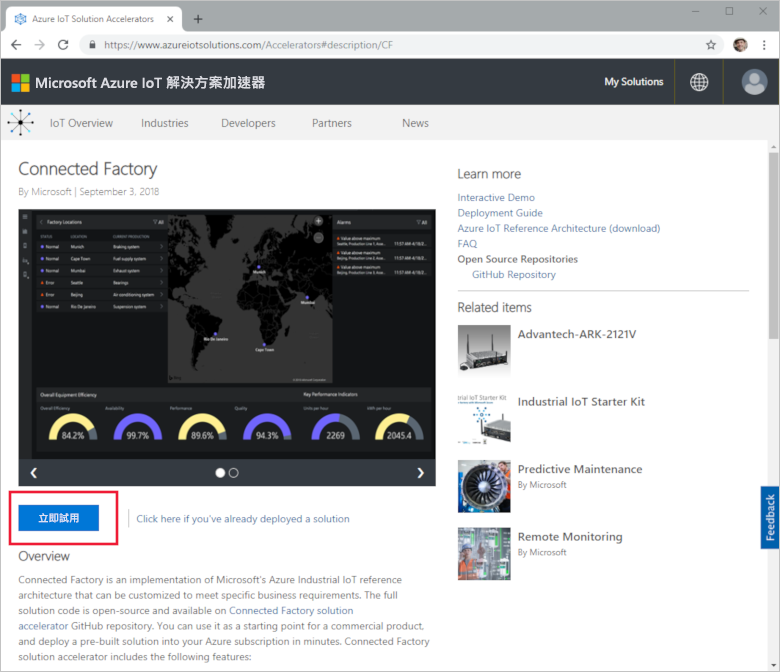

在 [建立連線工廠解決方案] 頁面上，為您的連線工廠解決方案加速器，輸入唯一的**解決方案名稱**。 此名稱是包含所有解決方案加速器資源的 Azure 資源群組名稱。 本快速入門中，我們的名稱是 **MyDemoConnectedFactory**。

選取您要用來部署解決方案加速器的 [訂用帳戶] 和 [區域]。 一般而言，您會選擇與您最接近的區域。 在本快速入門中，我們會使用 **Visual Studio Enterprise** 和**美國東部**。 您必須是訂用帳戶中的[全域管理員或使用者](iot-accelerators-permissions.md)。

按一下 [建立解決方案] 來開始部署。 此程序至少需要執行五分鐘：

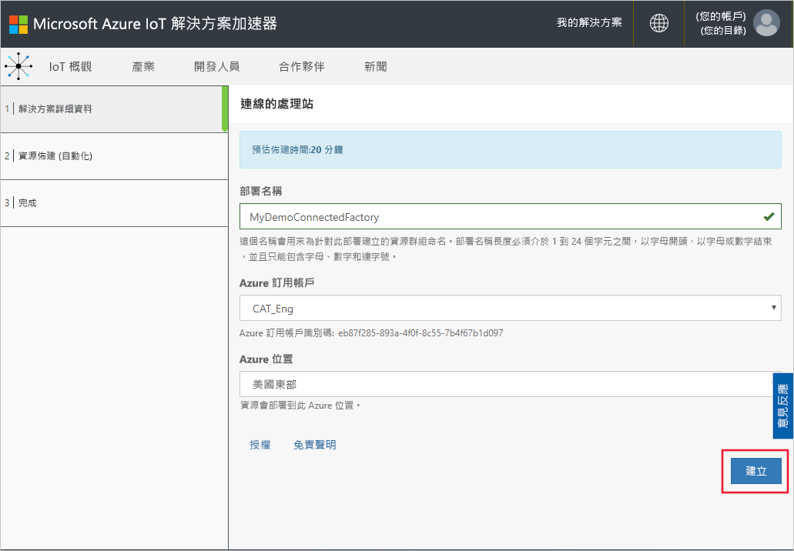

## 登入解決方案

當您完成部署至 Azure 訂用帳戶時，會看到解決方案圖格上的綠色核取記號和 [就緒]。 您現在可以登入連線工廠解決方案加速器的儀表板。

在 [已佈建的解決方案] 頁面上，按一下新的連線處理器解決方案加速器：

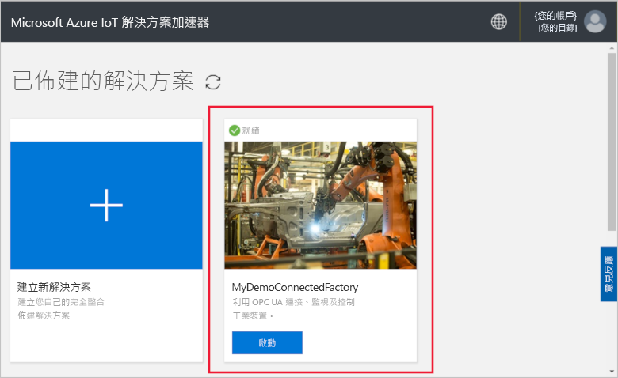

您可以在出現的面板中檢視有關連線工廠解決方案加速器的資訊。 選擇 [解決方案儀表板] 以檢視連線工廠解決方案加速器：

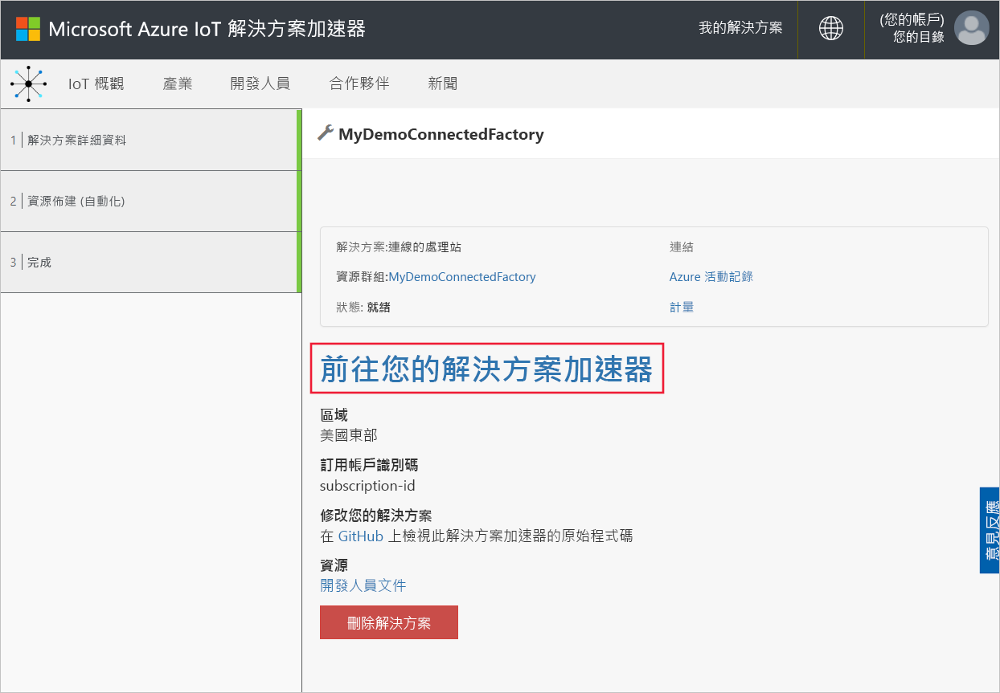

按一下 [接受] 來接受使用權限要求，瀏覽器中隨即會顯示連線工廠解決方案儀表板。 其中會顯示一組模擬工廠、生產線和工作站。

## 檢視儀表板

預設檢視是「儀表板」。 若要瀏覽至入口網站的其他區域，請使用頁面左側的功能表：

[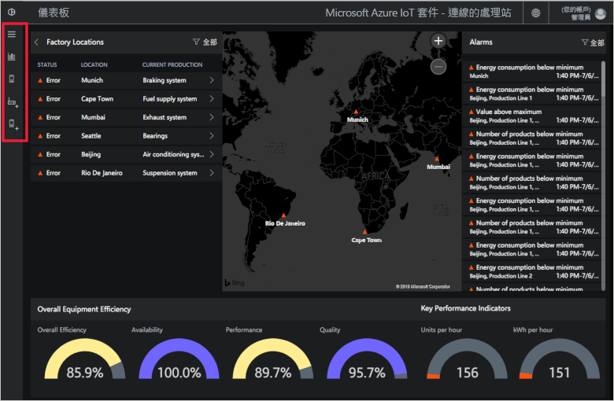](./media/quickstart-connected-factory-deploy/dashboard-expanded.png#lightbox)

您可以使用儀表板來管理您的工業用 IoT 裝置。 連線工廠會使用階層來顯示全體工廠組態。 階層最上層是包含一個或多個工廠的企業，每個工廠會包含生產線，而每個生產線則是由工作站組成。 在每一層級上，您都可以檢視 OEE 和 KPI、針對遙測發佈新節點及回應警示。

在儀表板上，您可以看到：

## 整體設備效率

**整體設備效率**面板可針對整個企業或您所檢視的工廠/生產線/工作區顯示 OEE 值。 此值會從站區檢視彙總至企業層級。 您可以進一步分析 OEE 數字及其組成元素。

[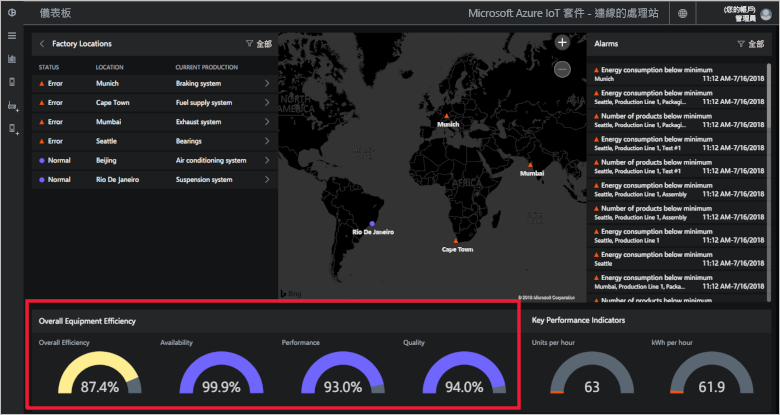](./media/quickstart-connected-factory-deploy/oee-expanded.png#lightbox)

OEE 會使用生產相關作業參數來評比製造程序的效率。 OEE 是一種業界標準量值，其計算方式是將可用率、效能率和品質率相乘︰OEE = 可用項 x 效能 x 品質。

您可以進一步分析階層資料中任何層級的 OEE。 請按一下 OEE、可用性、效能或品質百分比刻度盤。 內容面板會隨即出現，並顯示不同時間範圍的資料視覺效果：

[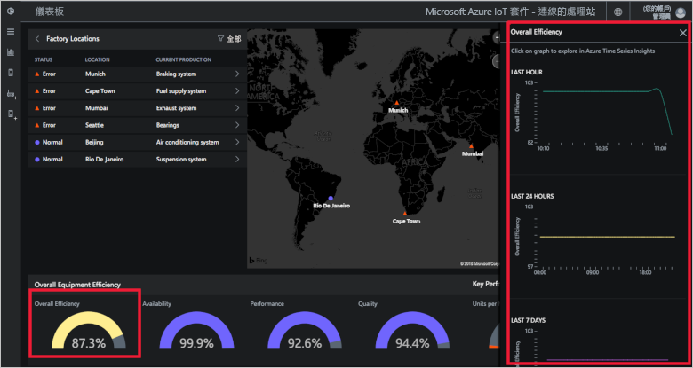](./media/quickstart-connected-factory-deploy/oeedetail-expanded.png#lightbox)

您可以按一下圖表，以進行進一步的資料分析。

### 關鍵效能指標

**關鍵效能指標**面板會顯示每小時所產生的單位數，以及整個企業或您所檢視的工廠/生產線/工作站所用能源 (kWh)。 這些值會從站區檢視彙總至企業層級。

[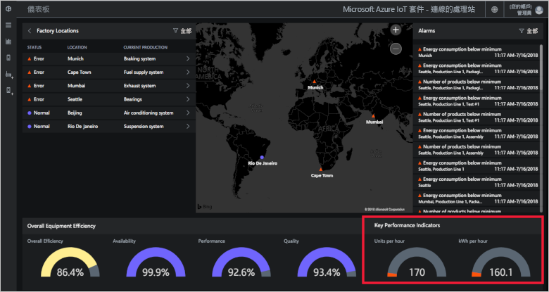](./media/quickstart-connected-factory-deploy/kpis-expanded.png#lightbox)

您可以進一步分析階層資料中任何層級的 KPI。 請按一下 OEE、可用性、效能或品質百分比刻度盤。 內容面板會隨即出現，並顯示不同時間範圍的資料視覺效果：

[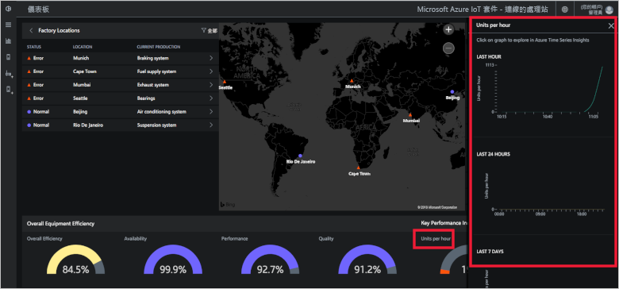](./media/quickstart-connected-factory-deploy/kpidetail-expanded.png#lightbox)

您可以按一下圖表，以進行進一步的資料分析。

### 工廠位置

[處理站位置] 面板，可顯示解決方案的狀態、位置和目前生產組態。 當您第一次執行解決方案加速器時，儀表板會顯示一組模擬的工廠。 每個生產線模擬都是由執行模擬工作及共用資料的三部實際 OPC UA 伺服器所構成。 如需 OPC UA 的詳細資訊，請參閱[連線工廠常見問題集](iot-accelerators-faq-cf.md)：

[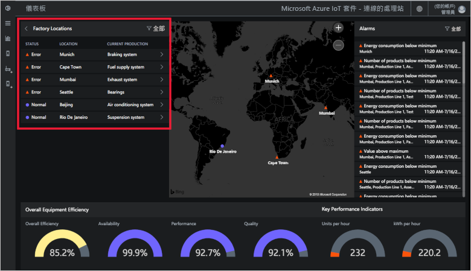](./media/quickstart-connected-factory-deploy/factorylocations-expanded.png#lightbox)

您可以瀏覽解決方案階層，並在每個層級上檢視 OEE 值和 KPI：

1. 在 [工廠位置] 中，按一下 [孟買]。 您會看到此位置上的生產線。

1. 按一下 [生產線 1]。 您會看到此生產線上的工作站。

1. 按一下 [封裝]。 您會看到此工作站發佈的 OPC UA 節點。

1. 按一下 [能源消耗]。 您會看到以不同時間範圍呈現此值的一些圖表。 您可以按一下圖表，以進行進一步的資料分析。

[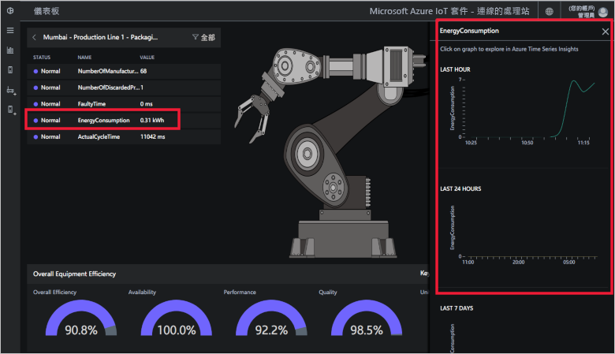](./media/quickstart-connected-factory-deploy/explorelocations-expanded.png#lightbox)

### 對應

如果您的訂用帳戶可存取 [Bing 地圖服務 API](iot-accelerators-faq-cf.md)，則「工廠」地圖會顯示解決方案中所有工廠的地理位置和狀態。 若要深入探詢位置詳細資料，請按一下地圖上顯示的位置。

[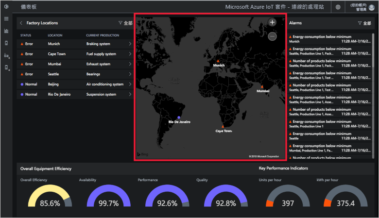](./media/quickstart-connected-factory-deploy/map-expanded.png#lightbox)

### 警示

[警示] 面板會顯示當回報的值或計算的 OEE/KPI 值超過其所設閾值時產生的警示。 此面板會顯示階層中每個層級的警示 (從工作區層級到企業層級)。 每個警示都會包含描述、日期、時間、位置和發生次數：

[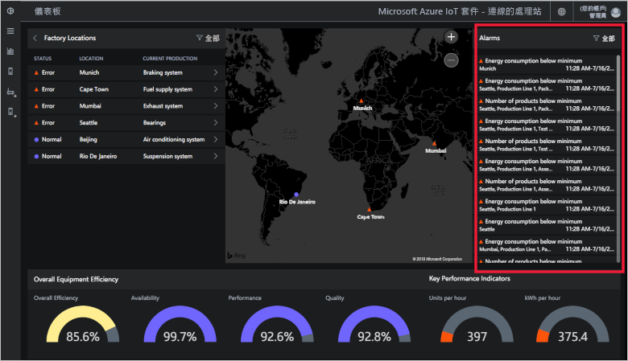](./media/quickstart-connected-factory-deploy/alarms-expanded.png#lightbox)

您可以從儀表板分析造成警示的資料。 如果您是系統管理員，您可以對警示採取預設動作，例如︰

* 關閉警示。
* 認知警示。

按一下其中一個警示，在 [選擇動作] 下拉式清單中，選擇 [確認警示]，然後按一下 [套用]：

[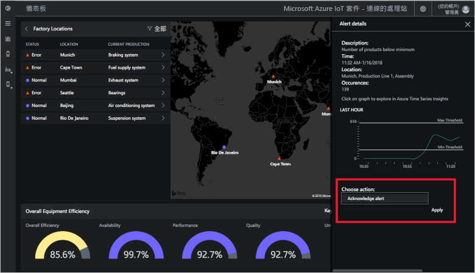](./media/quickstart-connected-factory-deploy/acknowledge-expanded.png#lightbox)

若要進一步分析警示資料，請按一下警示面板上的圖表。

這些警示是由解決方案加速器中的組態檔指定的規則所產生。 當 OEE 或 KPI 數字或 OPC UA 節點值超過其設定的閾值時，這些規則即可產生警示。

## 清除資源

如果您打算進一步探索，請讓連線工廠解決方案加速器維持部署。

如果您不再需要解決方案加速器，可加以選取，然後按一下 [刪除解決方案]，從[已佈建的解決方案](https://www.azureiotsolutions.com/Accelerators#dashboard)頁面中加以刪除：

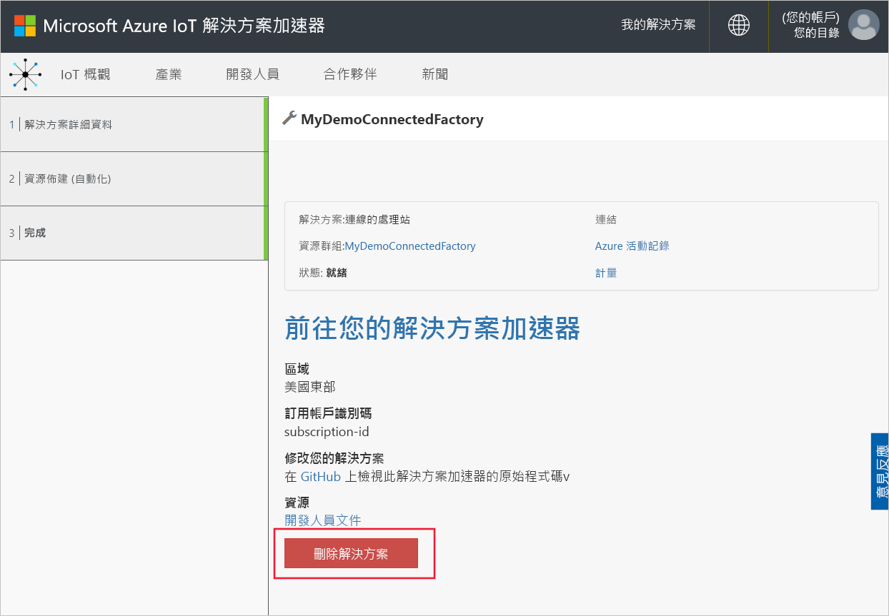

## 後續步驟

在本快速入門中，您已部署連線工廠解決方案加速器，並了解如何瀏覽您的工廠、生產線和工作站。 您也看到了如何在階層中的每個層級上檢視 OEE 和 KPI 值，以及如何回應警示。

若要了解如何使用儀表板中的其他功能，來管理您的工業用 IoT 裝置，請繼續閱讀下列使用說明指南：

> [!div class="nextstepaction"]
> [使用連線工廠儀表板](iot-accelerators-connected-factory-dashboard.md)