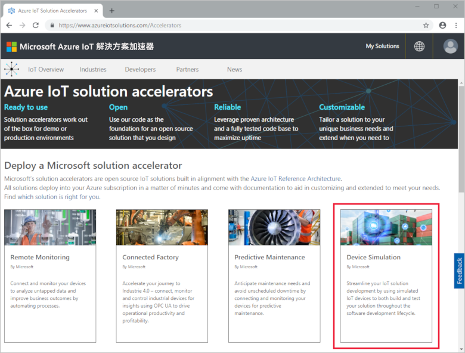
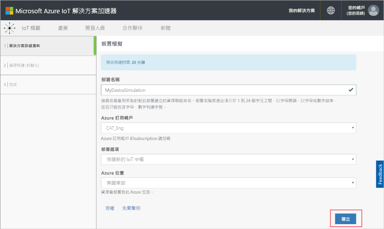
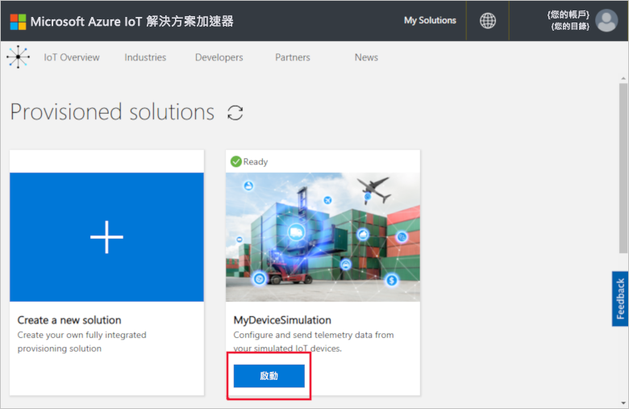
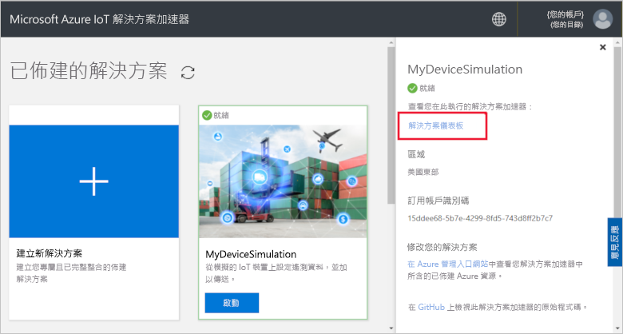
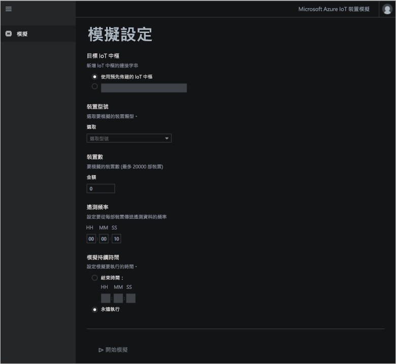
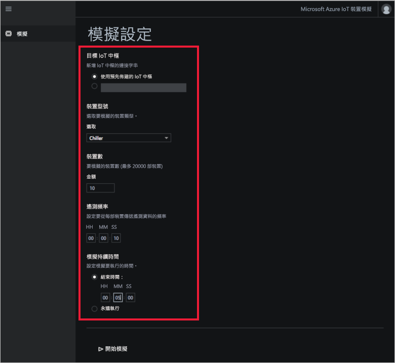
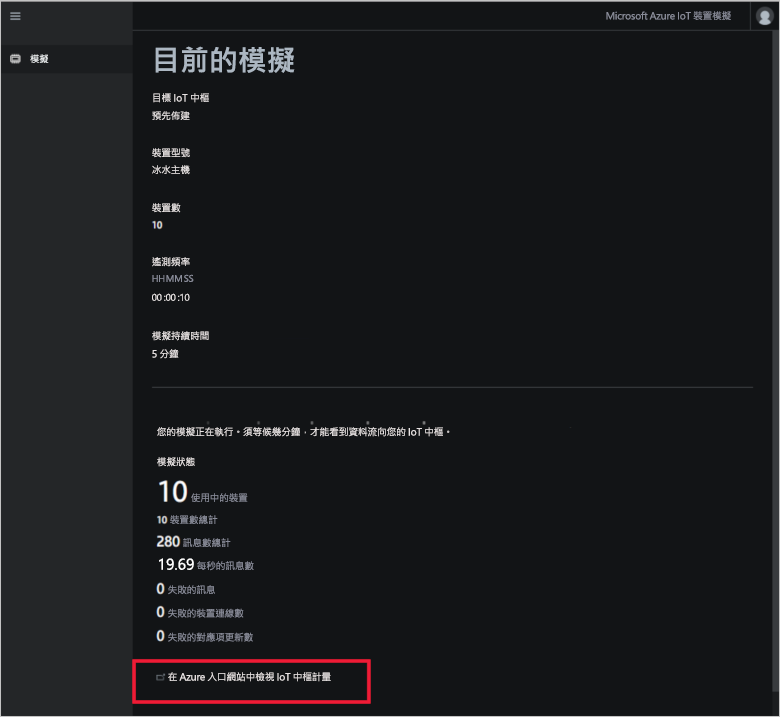
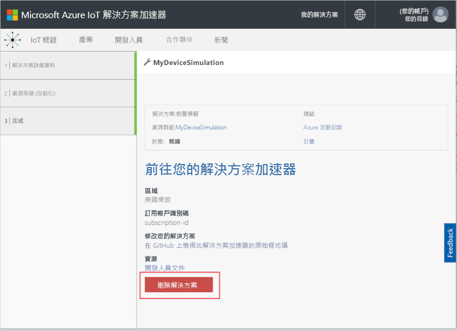

# 快速入門：部署和執行雲端型裝置模擬解決方案

本快速入門會示範如何部署 Azure IoT 裝置模擬解決方案加速器，以用來測試您的 IoT 解決方案。 在部署解決方案加速器之後，您要使用 [模擬] 頁面來建立及執行模擬。

若要完成本快速入門，您需要有效的 Azure 訂用帳戶。

如果您沒有 Azure 訂用帳戶，請在開始前建立 [免費帳戶](https://azure.microsoft.com/free/?WT.mc_id=A261C142F) 。

## 部署解決方案

在將解決方案加速器部署到 Azure 訂用帳戶時，必須設定一些組態選項。

使用 Azure 帳戶認證登入 [azureiotsolutions.com](https://www.azureiotsolutions.com/Accelerators)。

按一下 [裝置模擬] 圖格上的 [立即試用]。

在 [建立裝置模擬解決方案] 頁面上，輸入唯一的 [解決方案名稱]。 請記下您的解決方案名稱，這是包含所有解決方案資源的 Azure 資源群組名稱。

選取您要用來部署解決方案加速器的 [訂用帳戶] 和 [區域]。 一般而言，您會選擇與您最接近的區域。 您必須是訂用帳戶中的[全域管理員或使用者](iot-accelerators-permissions.md)。

核取方塊來部署 IoT 中樞，以與裝置模擬解決方案搭配使用。 稍後您可以隨時變更模擬所使用的 IoT 中樞。

按一下 [建立解決方案]  以開始佈建解決方案。 此程序至少需要執行五分鐘：

## 登入解決方案

佈建程序完成時，您可以登入裝置模擬解決方案加速器儀表板。

在 [已佈建的解決方案] 頁面上，按一下新的裝置模擬解決方案加速器：

您可以在出現的面板中檢視有關裝置模擬解決方案加速器的資訊。 選擇 [解決方案儀表板] 以檢視裝置模擬解決方案加速器：

按一下 [接受] 來接受使用權限要求，瀏覽器中隨即會顯示裝置模擬解決方案儀表板：

## 設定模擬

您可以從儀表板中設定及執行模擬。 請使用下表中的值來設定您的模擬：

| 設定             | 值                       |
| ------------------- | --------------------------- |
| 目標 IoT 中樞      | 使用預先佈建的 IoT 中樞 |
| 裝置型號        | Chiller                     |
| 裝置數目   | 10                          |
| 遙測頻率 | 10 秒                  |
| 模擬持續時間 | 5 分鐘                   |

## 執行模擬

按一下 [開始模擬]。 模擬會在您選擇的時間內持續執行。 您可以按一下 [停止模擬]，以隨時停止模擬。 模擬會顯示目前執行的統計資料。 按一下 [在 Azure 入口網站中檢視 IoT 中樞計量]，以查看 IoT 中樞所報告的計量：

您一次只能從已佈建的解決方案加速器執行個體執行一個模擬。

## 清除資源

如果您打算進一步探索，請讓裝置模擬解決方案加速器維持部署。

如果您不再需要解決方案加速器，可加以選取，然後按一下 [刪除解決方案]，從[已佈建的解決方案](https://www.azureiotsolutions.com/Accelerators#dashboard)頁面中加以刪除：

## 後續步驟

在本快速入門中，您已部署裝置模擬解決方案加速器，並執行 IoT 裝置模擬。

若要了解如何在模擬中使用現有的 IoT 中樞，請參閱下列操作指南：

> [!div class="nextstepaction"]
> [使用現有的 IoT 中樞搭配裝置模擬解決方案加速器](iot-accelerators-device-simulation-choose-hub.md)
