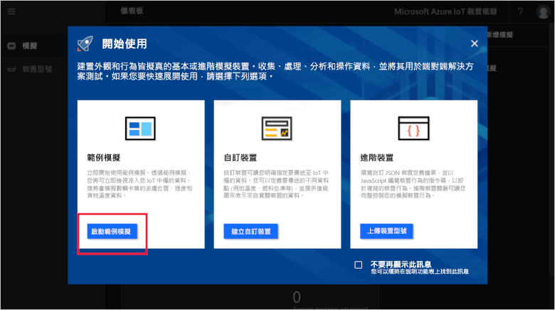
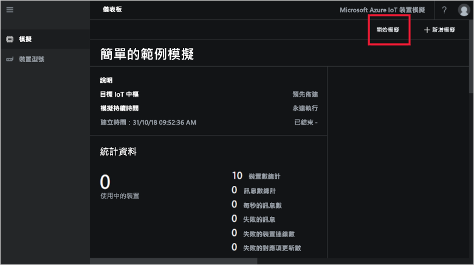
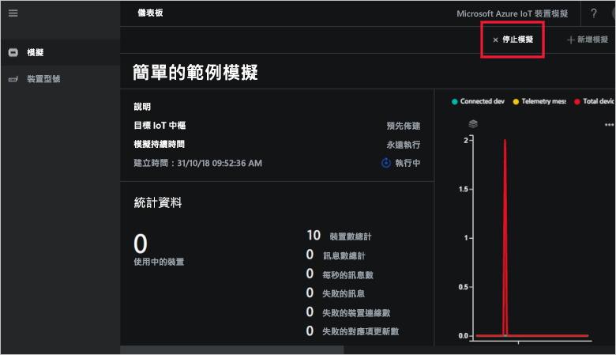

# 快速入門：在 Azure 中部署和執行 IoT 裝置模擬

本快速入門將說明如何部署 Azure IoT 裝置模擬以測試您的 IoT 解決方案。 在部署解決方案加速器之後，您可以執行範例模擬開始使用此加速器。

若要完成本快速入門，您需要有效的 Azure 訂用帳戶。

如果您沒有 Azure 訂用帳戶，請在開始前建立 [免費帳戶](https://azure.microsoft.com/free/?WT.mc_id=A261C142F) 。

## 部署裝置模擬

將裝置模擬部署到 Azure 訂用帳戶後，您必須設定一些組態選項。

使用 Azure 帳戶認證登入 [azureiotsolutions.com](https://www.azureiotsolutions.com/Accelerators)。

按一下 [裝置模擬] 圖格：

按一下裝置模擬描述頁面上的 [立即試用]：

![按一下 [立即試用]](./media/quickstart-device-simulation-deploy/devicesimulationPDP.png)

在 [建立裝置模擬解決方案] 頁面上，輸入唯一的 [解決方案名稱]。

選取您要用來部署解決方案加速器的 [訂用帳戶] 和 [區域]。 一般而言，您會選擇與您最接近的區域。 您必須是訂用帳戶中的[全域管理員或使用者](iot-accelerators-permissions.md)。

核取方塊來部署 IoT 中樞，以與裝置模擬解決方案搭配使用。 稍後您可以隨時變更模擬所使用的 IoT 中樞。

按一下 [建立解決方案]  以開始佈建解決方案。 此程序至少需要執行五分鐘：

## 登入解決方案

佈建程序完成後，您可以按一下 [啟動] 按鈕以登入裝置模擬的執行個體：

按一下 [接受] 以接受權限要求，瀏覽器中隨即會顯示裝置模擬解決方案儀表板。

第一次開啟時，您會看到含有**開始使用**指南的裝置模擬儀表板。 按一下第一個圖格，以開啟範例模擬。 如果您關閉**開始使用**指南，您可以在儀表板中按一下**簡易範例模擬**的圖格加以開啟：

## 範例模擬

範例模擬無法進行編輯。 此模擬可進行下列設定：

| 設定             | 值                       |
| ------------------- | --------------------------- |
| 目標 IoT 中樞      | 使用預先佈建的 IoT 中樞 |
| 裝置型號        | 卡車                       |
| 裝置數目   | 10                          |
| 遙測頻率 | 10 秒                  |
| 模擬持續時間 | 無限期執行            |

## 執行模擬

按一下 [開始模擬]。 模擬會依設定無限期執行。 您可以按一下 [停止模擬]，以隨時停止模擬。 模擬會顯示目前執行的統計資料。

您一次只能從裝置模擬執行個體執行一個模擬。

## 清除資源

如果您打算進一步探索，請保留已部署的裝置模擬。

如果您不再需要裝置模擬，請按一下其圖格，然後按一下 [刪除解決方案]，從 [已佈建的解決方案](https://www.azureiotsolutions.com/Accelerators#dashboard) 頁面中加以刪除：

## 後續步驟

在本快速入門中，您已部署裝置模擬並執行範例 IoT 裝置模擬。

> [!div class="nextstepaction"]
> [使用一或多個裝置類型來建立模擬](iot-accelerators-device-simulation-create-simulation.md)