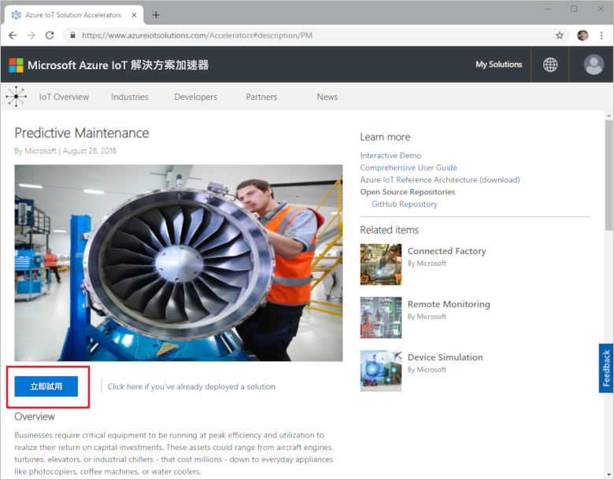
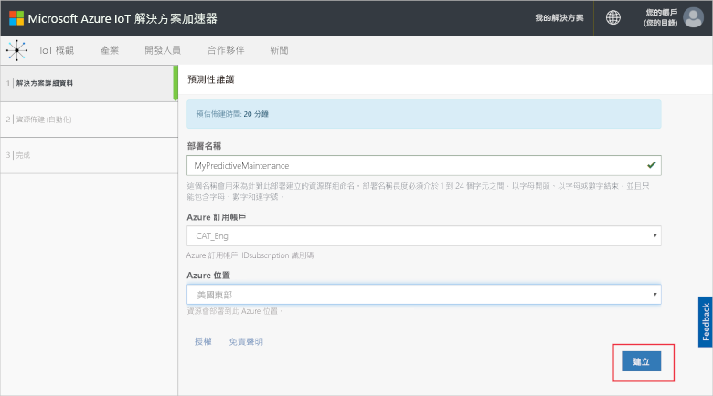
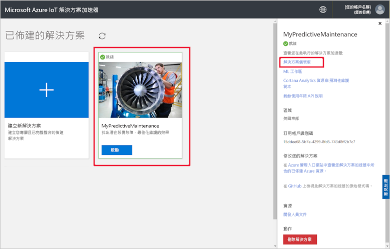
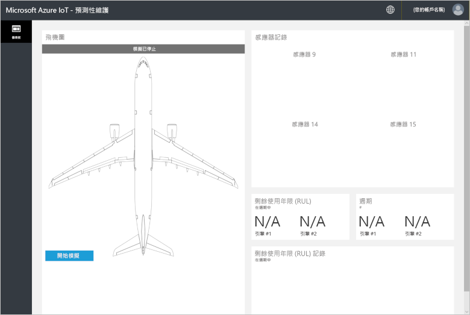
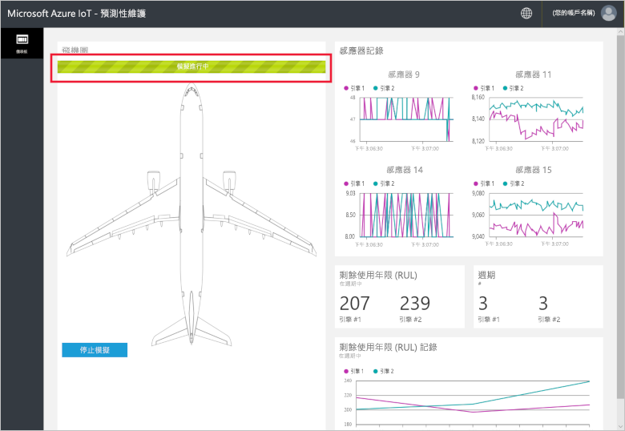
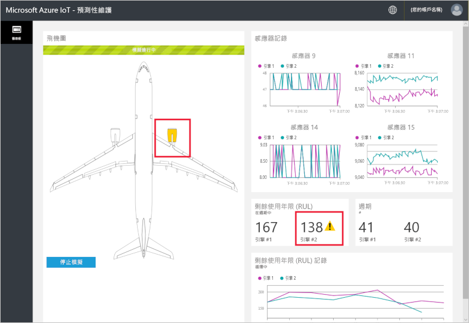
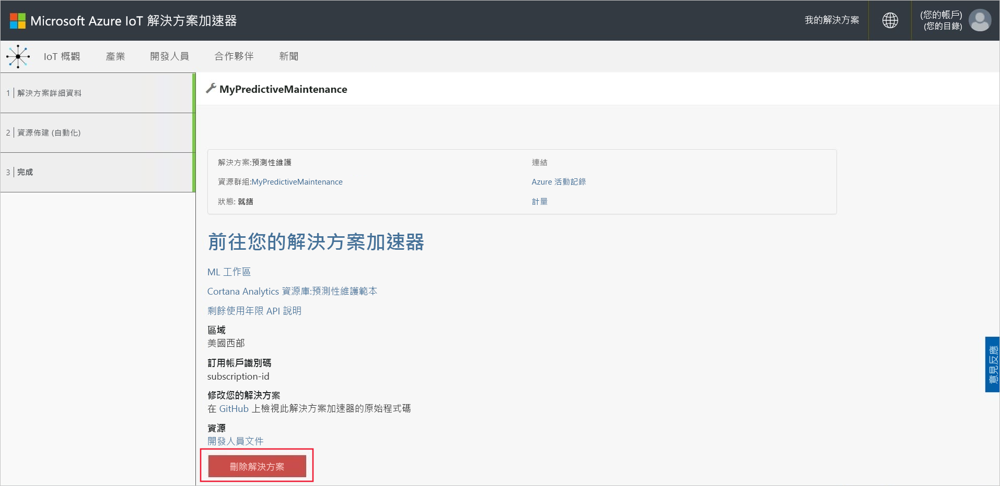

# 快速入門：嘗試以雲端式解決方案對我的連線裝置執行預測性維護分析

本快速入門會說明如何部署 Azure IoT 預測性維護解決方案加速器，來執行雲端式預測性維護模擬。 在部署解決方案加速器之後，您要使用解決方案的 [儀表板] 頁面，針對模擬飛機引擎的資料執行預測性維護分析。 您可以使用這個解決方案加速器，作為您自己實作的起點，或是作為學習工具。

在此模擬中，Fabrikam 是區域性航空公司；以優惠的價格為客戶提供優良的服務，是該公司努力的目標。 維護問題是造成航班延誤的原因之一，而引擎維護又是其中最為棘手的項目。 Fabrikam 必須嚴防飛行期間發生引擎故障，所以會定期檢查其引擎，並根據計劃安排維護時間表。 但因為飛機引擎的問題不一。 所以有一些引擎維護工作並非必要。 但嚴重者若在執行維護工作之前發生問題，可能會造成飛機停飛。 如果飛機所在地點缺少適當的技術人員或備品零件，這些問題會更嚴重。

Fabrikam 的飛機引擎由各種感應器進行檢測，而這些感應器會監視飛行期間的引擎狀況。 經過多年累積引擎運作資料與失敗資料之後，Fabrikam 的資料科學家開發出一個模型，可以預測飛機引擎的剩餘使用壽命 (RUL)。 此模型會在四個引擎感應器的資料和最終導致故障的引擎耗損之間找出相互關聯。 Fabrikam 現在除了繼續執行定期檢查來確保安全之外，還會在每次飛行後，使用這些模型來計算每具引擎的 RUL。 Fabrikam 現在已可預測未來的失敗點並據以規劃維修，將飛機停飛時間縮到最短，並降低營運成本，同時確保乘客與機組員的安全。

若要完成本快速入門，您需要有效的 Azure 訂用帳戶。

如果您沒有 Azure 訂用帳戶，請在開始前建立 [免費帳戶](https://azure.microsoft.com/free/?WT.mc_id=A261C142F) 。

## 部署解決方案

在將解決方案加速器部署到 Azure 訂用帳戶時，必須設定一些組態選項。

使用 Azure 帳戶認證登入 [azureiotsolutions.com](https://www.azureiotsolutions.com/Accelerators)。

按一下 [預測性維護] 圖格上的 [立即試用]。

在 [建立預測性維護解決方案] 頁面上，輸入預測性維護解決方案加速器的唯一 [解決方案名稱]。 在本快速入門中，我們會使用 **MyPredictiveMaintenance**。

選取您要用來部署解決方案加速器的 [訂用帳戶] 和 [區域]。 一般而言，您會選擇與您最接近的區域。 在本快速入門中，我們會使用 **Visual Studio Enterprise** 和**美國東部**。 您必須是訂用帳戶中的[全域管理員或使用者](iot-accelerators-permissions.md)。

按一下 [建立解決方案] 來開始部署。 此程序至少需要執行五分鐘：

## 登入解決方案

當您完成部署至 Azure 訂用帳戶時，會看到解決方案圖格上的綠色核取記號和 [就緒]。 您現在可以登入預測性維護解決方案加速器儀表板。

在 [已佈建的解決方案] 頁面上，按一下新的預測性維護解決方案加速器。 您可以在顯示的面板中檢視解決方案加速器的相關資訊。 選擇 [解決方案儀表板] 以檢視預測性維護解決方案加速器：

按一下 [接受] 以接受使用權限要求，瀏覽器中隨即會顯示預測性維護解決方案儀表板：

按一下 [開始模擬] 來開始模擬。 感應器記錄、RUL、週期和 RUL 記錄會填入儀表板：

當 RUL 小於 160 時 (為了示範目的而選擇的任意臨界值)，解決方案入口網站會在 RUL 旁邊顯示警告符號。 解決方案入口網站也會將飛機引擎醒目標示成黃色。 請注意 RUL 值有整體向下的趨勢，但傾向於上下波動。 此行為起因於變動的週期長度和模型精確度。

完整模擬需要約 35 分鐘的時間才能完成 148 個週期。 160 RUL 臨界值第一次在大約 5 分鐘的時候達到，而這兩個引擎在大約 8 分鐘的時候同時達到臨界值。

模擬會徹底執行 148 個週期的完整資料集並確定最終的 RUL 和週期值。

您可以隨時停止模擬，但按一下 [開始模擬]  會從資料集的開頭重新執行模擬。

## 清除資源

如果您打算進一步探索，請讓預測性維護解決方案加速器維持部署。

如果您不再需要解決方案加速器，可加以選取，然後按一下 [刪除解決方案]，從[已佈建的解決方案](https://www.azureiotsolutions.com/Accelerators#dashboard)頁面中加以刪除：

## 後續步驟

在本快速入門中，您已部署預測性維護解決方案加速器，並執行模擬。

如需有關解決方案加速器與模擬飛機引擎的詳細資訊，請繼續下列文章。

> [!div class="nextstepaction"]
> [預測性維護解決方案加速器概觀](iot-accelerators-predictive-walkthrough.md)
