# 快速入門：嘗試雲端式遠端監視解決方案

本快速入門會說明如何部署 Azure IoT 遠端監視解決方案加速器，來執行雲端式遠端監視模擬。 部署了解決方案加速器之後，您會使用解決方案的 [儀表板] 頁面在地圖上以視覺化方式呈現模擬裝置，以及使用 [維護] 頁面以回應模擬冷卻器裝置的壓力警示。 您可以使用這個解決方案加速器，作為您自己實作的起點，或是作為學習工具。

初始部署會針對稱為 Contoso 的公司設定遠端監視解決方案加速器。 Contoso 管理了一組部署在不同實體環境的不同裝置類型 (例如冷卻器)。 冷卻器裝置會將溫度、溼度和壓力遙測資料傳送給遠端監視解決方案加速器。

若要完成本快速入門，您需要有效的 Azure 訂用帳戶。

如果您沒有 Azure 訂用帳戶，請在開始前建立 [免費帳戶](https://azure.microsoft.com/free/?WT.mc_id=A261C142F) 。

## 部署解決方案

在將解決方案加速器部署到 Azure 訂用帳戶時，必須設定一些組態選項。

使用 Azure 帳戶認證登入 [azureiotsolutions.com](https://www.azureiotsolutions.com/Accelerators)。

按一下 [遠端監視] 圖格上的 [立即試用]。

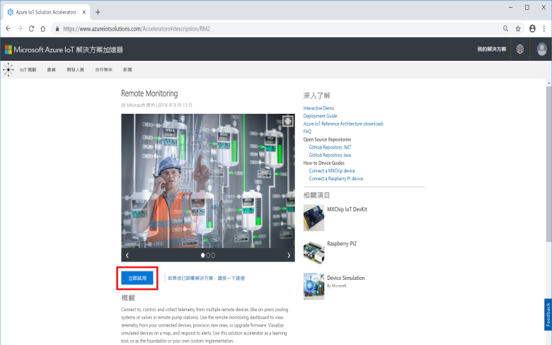

在 [建立遠端監視解決方案] 頁面上，選取 [基本] 部署。 如果您要部署解決方案加速器來了解其運作方式或是執行示範，請選擇 [基本] 選項來將成本降至最低。

選擇 [.NET] 作為語言。 Java 和 .NET 實作的功能相同。

為遠端監視解決方案加速器輸入唯一的 [解決方案名稱]。 本快速入門中，我們的名稱是 **contoso-rm2**。

選取您要用來部署解決方案加速器的 [訂用帳戶] 和 [區域]。 一般而言，您會選擇與您最接近的區域。 在本快速入門中，我們會使用 **Visual Studio Enterprise** 和**西歐**。 您必須是訂用帳戶中的[全域管理員或使用者](iot-accelerators-permissions.md)。

按一下 [建立解決方案] 來開始部署。 此程序至少需要執行五分鐘：

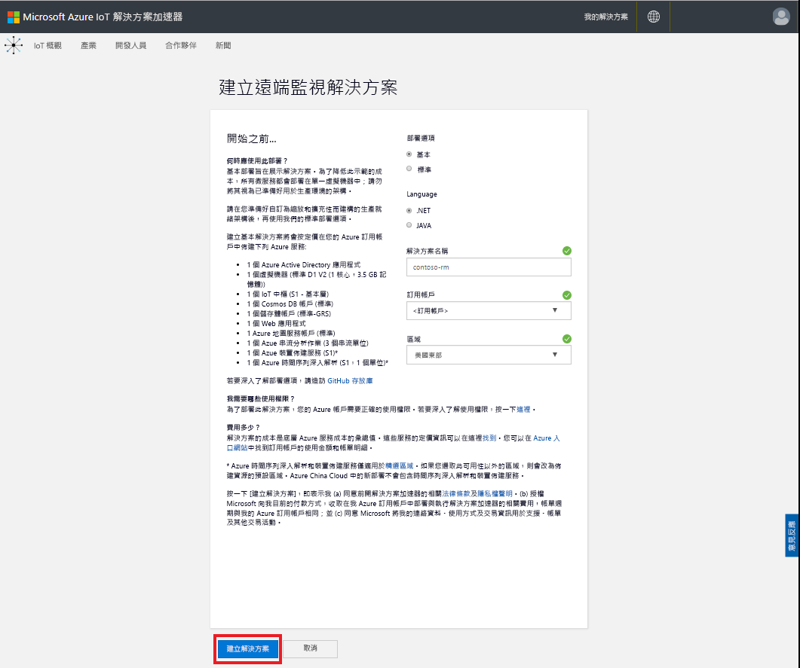

## 登入解決方案

當您完成部署至 Azure 訂用帳戶時，會看到解決方案圖格上的綠色核取記號和 [就緒]。 您現在可以登入遠端監視解決方案加速器的儀表板。

在 [已佈建的解決方案] 頁面上，按一下新的遠端監視解決方案加速器：

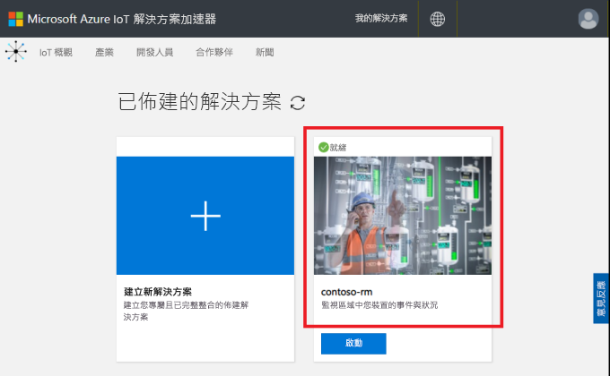

您可以檢視所出現面板中遠端監視解決方案加速器的相關資訊。 選擇 [解決方案儀表板] 以檢視遠端監視解決方案加速器：

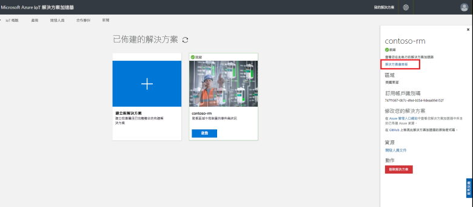

按一下 [接受] 來接受使用權限要求，瀏覽器中隨即會顯示遠端監視解決方案儀表板：

[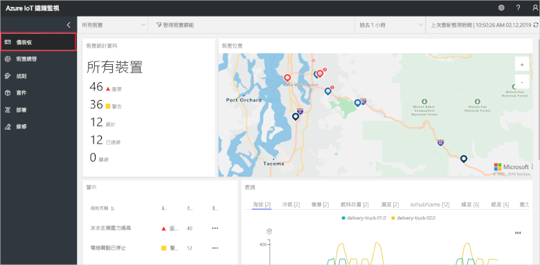](./media/quickstart-remote-monitoring-deploy/solutiondashboard-expanded.png#lightbox)

## 檢視您的裝置

解決方案儀表板會顯示下列關於 Contoso 模擬裝置的資訊：

* **裝置統計資料**會顯示警示的相關摘要資訊和裝置總數。 在預設部署中，Contoso 有 10 個不同類型的模擬裝置。

* **裝置位置**會顯示裝置實際所在的位置。 裝置有警示時，便會顯示圖釘顏色。

* **警示**會顯示裝置警示的詳細資料。

* **遙測資料**會顯示裝置的遙測資料。 您可以按一下頂端的遙測資料類型，以檢視不同的遙測資料串流。

* **分析**會顯示有關於裝置警示的合併資訊。

## 回應警示

身為 Contoso 的操作員，您可以從解決方案儀表板監視裝置。 [裝置統計資料] 面板會顯示已有一些重大警示，[警示] 面板則會顯示這些警示大多來自冷卻器裝置。 對於 Contoso 的冷卻器裝置來說，內部壓力超過 250 PSI 表示該裝置未正常運作。

### 識別問題

在 [儀表板] 頁面的 [警示] 面板中，您可以看到 [冷卻器壓力過高] 警示。 冷卻器在地圖上具有紅色圖釘 (您可能需要移動瀏覽和縮放地圖)：

[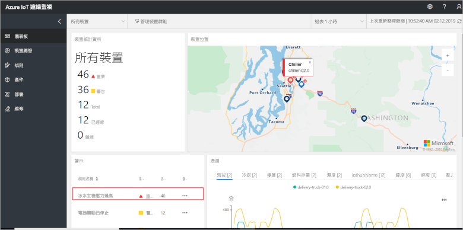](./media/quickstart-remote-monitoring-deploy/dashboardalarm-expanded.png#lightbox)

在 [警示] 面板中，於 [瀏覽] 資料行中按一下 [冷卻器壓力過高] 規則旁的 [...]。 此動作會將您導向 [維護] 頁面，以供您檢視觸發了警示的規則詳細資料。

[冷卻器壓力過高] 維護頁面會顯示觸發了警示的規則詳細資料。 此頁面也會列出警示的發生時間，以及有哪些裝置觸發了這些警示：

[![[維護] 頁面會顯示已觸發的警示清單](./media/quickstart-remote-monitoring-deploy/maintenancealarmlist-inline.png)](./media/quickstart-remote-monitoring-deploy/maintenancealarmlist-expanded.png#lightbox)

您現在已識別出觸發警示及相關聯裝置的問題。 身為操作員，後續步驟是認可警示並修正問題。

### 修正問題

若要向其他操作員指出您目前正在處理警示，請選取該警示，然後將 [警示狀態] 變更為 [已認可]：

[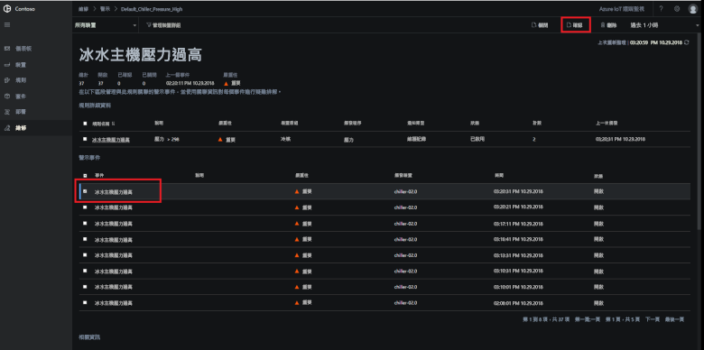](./media/quickstart-remote-monitoring-deploy/maintenanceacknowledge-expanded.png#lightbox)

[狀態] 資料行中的值會變更為 [已認可]。

若要對冷卻器採取行動，請向下捲動至 [相關資訊]，選取 [發出警示的裝置] 清單中的冷卻器裝置，然後選擇 [作業]：

[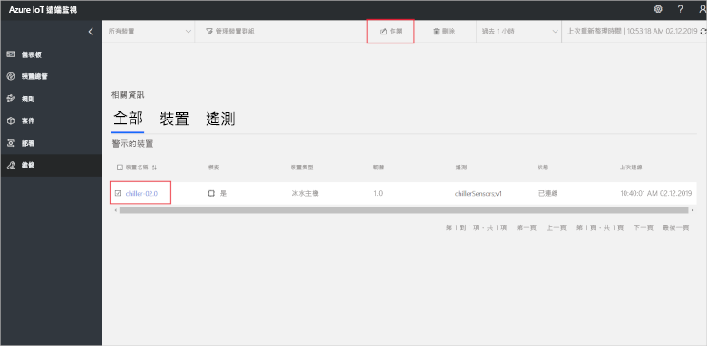](./media/quickstart-remote-monitoring-deploy/maintenanceschedule-expanded.png#lightbox)

在 [作業] 面板中，選擇 [執行方法]，然後選擇 [EmergencyValveRelease] 方法。 新增作業名稱 **ChillerPressureRelease**，然後按一下 [套用]。 這些設定會建立可立即執行的作業。

若要檢視作業狀態，請返回 [維護] 頁面，然後在 [作業] 檢視中檢視作業清單。 您可能需要等候幾秒鐘的時間才能看到作業開始執行，從而釋放冷卻器上的閥門壓力：

[![[作業] 檢視中的作業狀態](./media/quickstart-remote-monitoring-deploy/maintenancerunningjob-inline.png)](./media/quickstart-remote-monitoring-deploy/maintenancerunningjob-expanded.png#lightbox)

### 檢查壓力是否已回復正常

若要檢視冷卻器的壓力遙測資料，請瀏覽至 [儀表板] 頁面，選取 [遙測資料] 面板中的 [壓力]，然後確認 **chiller-02.0** 的壓力已回復正常：

[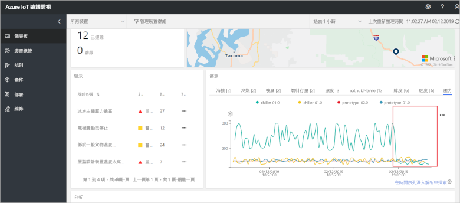](./media/quickstart-remote-monitoring-deploy/pressurenormal-expanded.png#lightbox)

若要關閉事件，瀏覽至 [維護] 頁面、選取警示，然後將狀態設為 [已關閉]：

[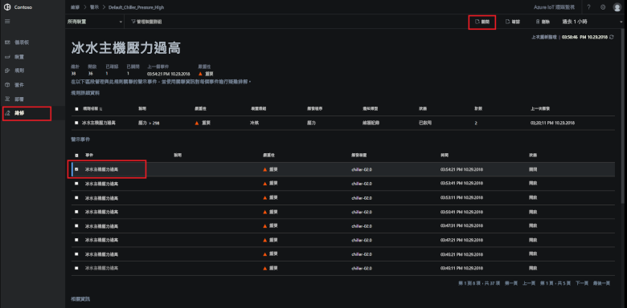](./media/quickstart-remote-monitoring-deploy/maintenanceclose-expanded.png#lightbox)

[狀態] 資料行中的值會變更為 [已關閉]。

## 清除資源

如果您打算繼續進行教學課程，請將已部署的遠端監視解決方案加速器保留下來。

如果您不再需要解決方案加速器，可加以選取，然後按一下 [刪除解決方案]，從[已佈建的解決方案](https://www.azureiotsolutions.com/Accelerators#dashboard)頁面中加以刪除：

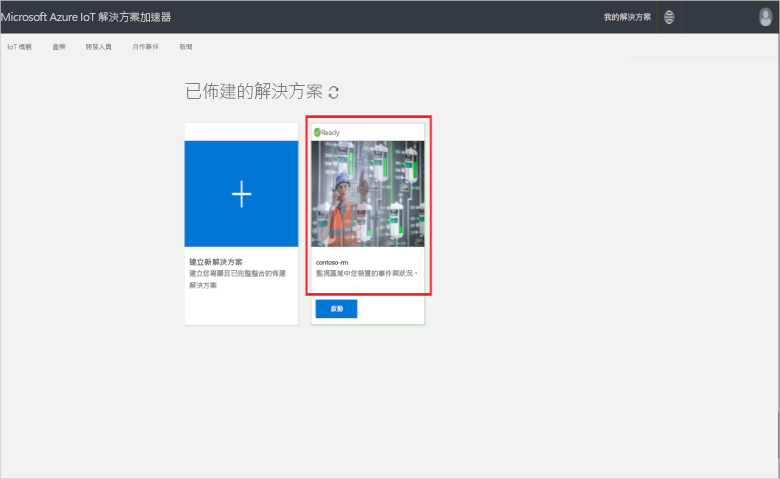

## 後續步驟

在本快速入門中，您已使用預設 Contoso 部署中的模擬裝置，部署了遠端監視解決方案加速器並完成監視工作。

如需有關使用模擬裝置的解決方案加速器詳細資訊，請繼續下列教學課程。

> [!div class="nextstepaction"]
> [教學課程：監視 IoT 裝置](iot-accelerators-remote-monitoring-monitor.md)