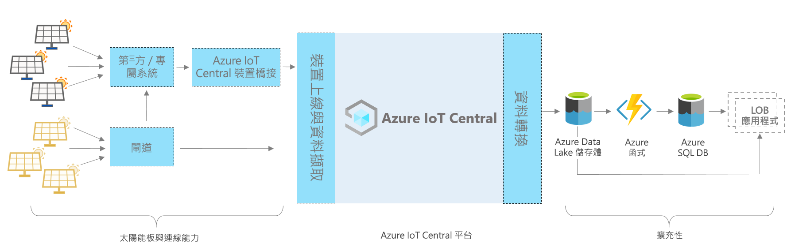

# Azure IoT Central - 太陽能板應用程式架構

[!INCLUDE [iot-central-pnp-original](../../../includes/iot-central-pnp-original-note.md)]

此文章提供太陽能板監視應用程式範本架構的概觀。 下圖顯示在 Azure 上使用 IoT Central 平台之太陽能板應用程式的常用架構。

> [!div class="mx-imgBorder"]
> 

此架構由下列元件組成。 有些應用程式可能不需要此處所列的每個元件。

## 太陽能板與連線能力 

太陽能板是可再生能源的重要來源之一。 根據太陽能板類型和設定而定，您可以透過閘道或透過其他中繼裝置和專屬系統來與它連線。 您可能需要建置 IoT Central 裝置橋接器，來連線無法直接連線的裝置。 IoT Central 裝置橋接器是一個開放原始碼解決方案，您可以[在這裡](https://docs.microsoft.com/azure/iot-central/core/howto-build-iotc-device-bridge) \(部分機器翻譯\) 找到完整詳細資料。 

## IoT Central 平台
Azure IoT Central 是一個平台，能簡化 IoT 解決方案的建置，有助於降低 IoT 管理、作業與開發的負擔及費用。 利用 IoT Central，您可以輕鬆地大規模連線、監視並管理您的物聯網 (IoT) 資產。 將太陽能板連線到 IoT Central 之後，應用程式範本就會使用裝置模型、命令和儀表板等內建功能。 應用程式範本也會針對暖路徑案例使用 IoT Central 儲存體，例如，近乎即時的電表資料監視、分析、規則和視覺效果。

## 透過 IoT Central 建置的擴充性選項
IoT Central 平台提供兩個擴充性選項：連續資料匯出 (CDE) 和 API。 客戶和夥伴可以在這些選項之間進行選擇，以根據特定需求自訂解決方案。 例如，我們的其中一個夥伴使用 Azure Data Lake Storage (ADLS) 設定了 CDE。 他們使用 ADLS 來進行長期資料保留和其他冷路徑儲存案例，例如批次處理、稽核和報告用途。 

## 後續步驟

* 既然您已了解架構，請[免費建立太陽能板應用程式](https://apps.azureiotcentral.com/build/new/solar-panel-monitoring) \(英文\)
* 若要深入了解 IoT Central，請參閱 [IoT Central 概觀](https://docs.microsoft.com/azure/iot-central/)