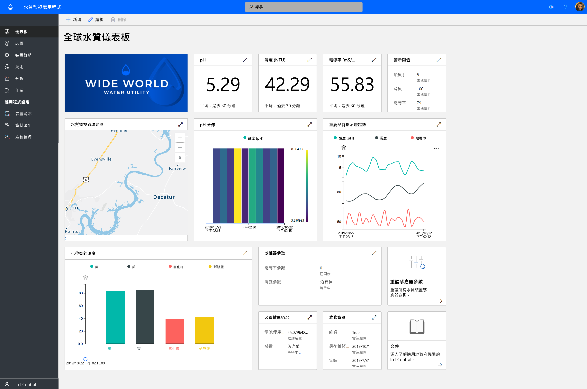
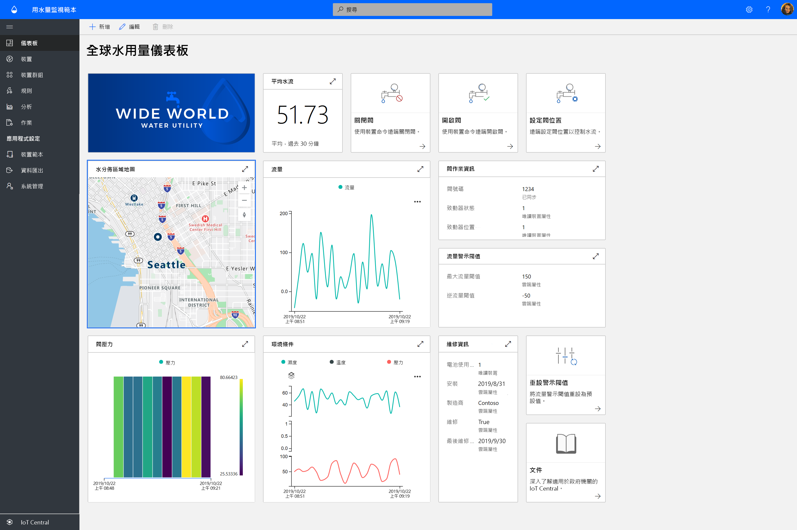

# 使用 Azure IoT Central 建置政府機關解決方案

[!INCLUDE [iot-central-pnp-original](../../../includes/iot-central-pnp-original-note.md)]

開始使用 Azure IoT Central 應用程式範本來建置智慧城市解決方案。 立即開始使用**水質監視**、**用水量監視**，以及**連線廢棄物管理**。

## 什麼是水質監視應用程式範本？   

傳統的水質監視依賴手動取樣技術和現場實驗室分析，這種做法相當費時而且成本昂貴。 從遠端即時監視水質，可以在市民受影響之前管理水質問題。 此外，透過進階分析，水源公用事業和環境機關即可針對潛在水質問題的早期警告採取行動，並且事先規劃水處理方式。  

「水質監視」應用程式是一個 IoT Central 應用程式範本，可協助您開始進行 IoT 解決方案開發，且讓水源公用事業能夠以數位方式監視智慧城市的水質。 

應用程式範本包含：
* 範例操作員儀表板
* 範例水質監視裝置範本
* 模擬水質監視裝置
* 預先設定的規則和作業
* 使用白標的商標 

開始使用[水質監視應用程式教學課程](./tutorial-water-quality-monitoring.md)。

## 什麼是用水量監視應用程式範本？ 

傳統的用水量追蹤依賴用水操作員手動讀取計量網站上的用水量計量。 越來越多城市以先進的智慧計量取代傳統計量，讓您能夠遠端監視使用量，以及從遠端控制水閥來控制水流量。 用水量監視搭配給市民的數位意見反應訊息，可以提升認知並減少用水量。 

「用水量監視」應用程式是一個 IoT Central 應用程式範本，可協助您開始進行 IoT 解決方案開發，讓水源公用事業和市政機關能夠從遠端監視和控制水流量，以減少用水量。 

  

「用水量監視」應用程式範本包含預先設定的：
* 範例操作員儀表板
* 範例水質監視裝置範本
* 模擬水質監視裝置
* 預先設定的規則和作業
* 使用白標的商標 

 開始使用[用水量監視應用程式教學課程](./tutorial-water-consumption-monitoring.md)。

## 什麼是連線廢棄物管理應用程式範本？ 

「連線廢棄物管理」應用程式是一個 IoT Central 應用程式範本，可協助您開始進行 IoT 解決方案開發，讓智慧城市能夠進行遠端監視，以充分發揮廢棄物收集的效率。 

 

「連線廢棄物管理」應用程式範本包含預先設定的：
* 範例操作員儀表板
* 範例連線垃圾箱裝置範本
* 模擬連線垃圾箱裝置
* 預先設定的規則和作業
* 使用白標的商標 

開始使用[連線廢棄物管理應用程式教學課程](./tutorial-connected-waste-management.md)。

## 後續步驟

* 免費試用 IoT Central 中任何的政府機關應用程式範本來[建立應用程式](https://apps.azureiotcentral.com/build/government)
* 了解[水質監視概念](./concepts-waterqualitymonitoring-architecture.md)
* 了解[用水量監視概念](./concepts-waterconsumptionmonitoring-architecture.md)
* 了解[連線廢棄物管理概念](./concepts-connectedwastemanagement-architecture.md)  
* 若要了解 IoT Central，請參閱 [IoT Central 概觀](https://docs.microsoft.com/azure/iot-central/core/overview-iot-central)
 