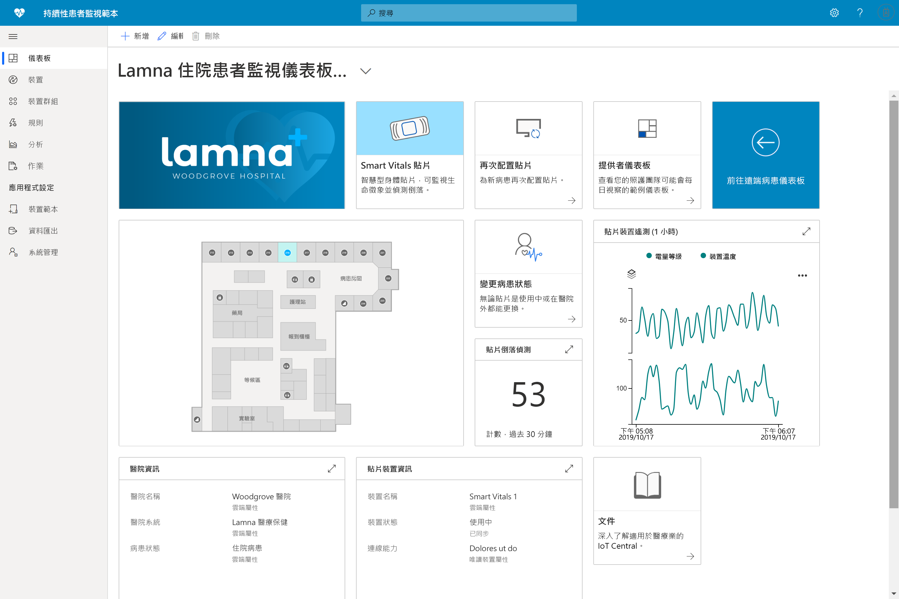

# 使用 Azure IoT Central 建置醫療保健解決方案 

[!INCLUDE [iot-central-pnp-original](../../../includes/iot-central-pnp-original-note.md)]

了解如何透過 Azure IoT Central 使用應用程式範本來建置醫療保健解決方案。

## 什麼是持續性患者監視範本？

在醫療保健 IoT 空間中，「持續性患者監視」是降低再住院風險、更有效地管理慢性疾病，以及改善患者療效的關鍵促成因子之一。 持續性患者監視可以分成兩個主要類別：

1. **住院患者監視**：使用醫療穿戴式裝置和醫院中的其他裝置，護理小組得以監視患者的生命徵象及醫療狀況，而無須派護士一日查看患者數次。 護理小組可透過通知即時了解患者需要密切注意，並有效安排他們的時間。
1. **遠端患者監視**：藉由使用醫療穿戴式裝置和患者回報的結果 (PRO) 來監視院外患者，可以大幅降低再住院的風險。 院方可收集慢性疾病患者和康復患者的資料，以確保患者遵守護理計劃，並在患者病情變得更嚴重之前，讓護理小組獲得病情惡化的警示。

此應用程式範本可用來建置兩種持續性患者監視的解決方案。 其優點包括：

* 順暢地將各種醫療穿戴式裝置連線至 IoT Central 執行個體。
* 監視及管理裝置，以確保它們保持良好狀態。
* 建立裝置資料的自訂規則，以觸發適當的警示。
* 將患者的健康情況資料匯出至 Azure API for FHIR 這個符合規範的資料存放區。
* 將彙總的深入解析匯出到現有或全新的商務應用程式，以輔助護理小組的作業。

>[!div class="mx-imgBorder"] 
>

## 後續步驟

若要開始建置持續性患者監視解決方案：

* [部署應用程式範本](tutorial-continuous-patient-monitoring.md)
* [查看範例架構](concept-continuous-patient-monitoring-architecture.md)