# 開始導覽 Azure IoT Central UI (預覽功能)

[!INCLUDE [iot-central-pnp-original](../../../includes/iot-central-pnp-original-note.md)]

本文為您介紹 Microsoft Azure IoT 中心 UI。 您可以使用此 UI 來建立、管理和使用 Azure IoT 中心解決方案及其連線的裝置。

身為_解決方案建置者_，您可以使用 Azure IoT Central UI 來定義 Azure IoT Central 解決方案。 您可以使用 UI：

* 定義可連線到您的解決方案的裝置類型。
* 為您的裝置設定規則和動作。 
* 為使用您的解決方案的「操作員」  自訂 UI。

「操作員」  可使用 Azure IoT 中心 UI 來管理 Azure IoT 中心解決方案。 您可以使用 UI：

* 監視您的裝置。
* 設定您的裝置。
* 針對裝置問題進行移難排解並修復。
* 佈建新裝置。

## IoT Central 首頁

[IoT Central 首頁](https://aka.ms/iotcentral-get-started)頁面可讓您深入了解 IoT Central 的最新消息和可用功能、建立新的應用程式，以及查看和啟動現有的應用程式。

> [!div class="mx-imgBorder"]
> 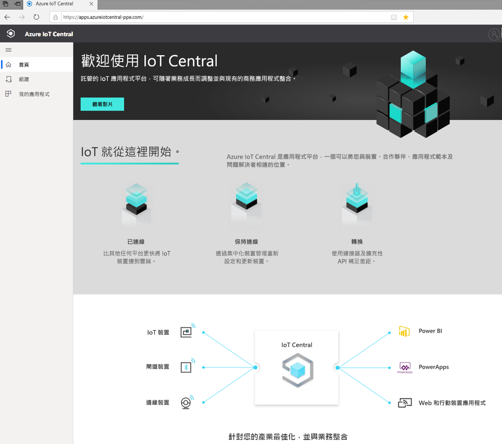

### 建立應用程式

在 [建置] 區段中，您可以瀏覽產業相關 IoT Central 範本清單，以利快速著手建立，或使用自訂應用程式範本從頭開始建立。  
> [!div class="mx-imgBorder"]
> 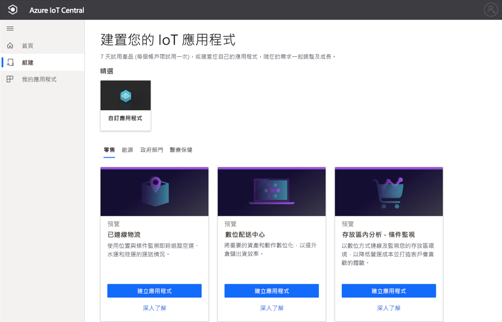

若要深入了解，請參閱[建立 Azure IoT Central 應用程式](quick-deploy-iot-central.md)快速入門。

### 啟動您的應用程式

您可以前往您或解決方案建置者在應用程式建立期間選擇的 URL，以啟動您的 IoT Central 應用程式。 您也可以在 [IoT Central 應用程式管理員](https://aka.ms/iotcentral-apps)中查看您可以存取的所有應用程式清單。

> [!div class="mx-imgBorder"]
> 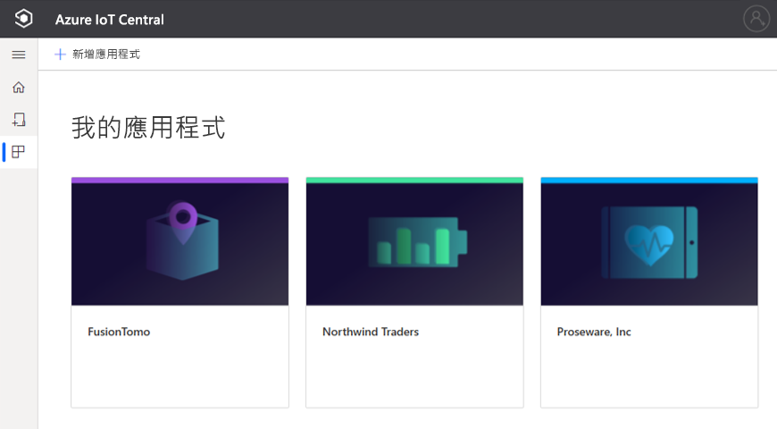

## 瀏覽您的應用程式

在您進入 IoT 應用程式後，請使用左窗格存取不同的區域。 您可以藉由選取導覽列頂端的三條線圖示，來展開或摺疊導覽列：

> [!NOTE]
> 您在導覽列上看到的項目將取決於您的使用者角色。 深入了解如何[管理使用者和角色](howto-manage-users-roles.md)。 

:::row:::
  :::column span="":::
      > [!div class="mx-imgBorder"]
      > 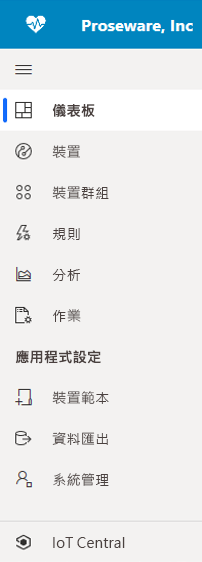
  :::column-end:::
  :::column span="2":::
     **儀表板**會顯示您的應用程式儀表板。 身為*解決方案建置者*，您可以為操作員自訂全域儀表板。 操作員也可以根據其使用者角色，建立自己的個人儀表板。
     
     **裝置** 可讓您管理已連線的裝置 - 包括實際和模擬的。

     **裝置群組** 可讓您檢視和建立查詢所指定之裝置的邏輯集合。 您可以儲存此查詢，並透過應用程式使用裝置群組執行大量作業。

     **規則** 可讓您建立和編輯用來監視裝置的規則。 系統會根據裝置遙測評估規則，並觸發可自訂的動作。

     **分析** 可讓您根據裝置資料建立自訂檢視，以從您的應用程式衍生深入解析。

     **作業** 可讓您執行大量作業，藉以大規模管理您的裝置。

     **裝置範本** 可讓您對連線至應用程式的裝置建立及管理其特性。

     **資料匯出** 可讓您設定對外部服務的連續匯出 - 例如儲存體和佇列。

     **系統管理** 可讓您管理應用程式的設定、自訂、計費、使用者和角色。

     **IoT Central** 可讓 *系統管理員* 切換回 IoT Central 的應用程式管理員。
     
   :::column-end:::
:::row-end:::

### 搜尋、說明、佈景主題和支援

頂端功能表會出現在每個頁面上：

> [!div class="mx-imgBorder"]
> 

* 若要搜尋裝置範本與裝置，請輸入 [搜尋]  值。
* 若要變更 UI 語言或佈景主題，請選擇 [語言]  圖示。 深入了解如何[管理您的應用程式喜好設定](../core/howto-manage-preferences.md?toc=/azure/iot-central/preview/toc.json&bc=/azure/iot-central/preview/breadcrumb/toc.json)
* 若要登出應用程式，請選擇 [帳戶]  圖示。
* 若要取得說明及支援，請選擇 [說明]  下拉式功能表以取得資源清單。 在試用版的應用程式中，支援資源會包括[即時聊天](../core/howto-show-hide-chat.md?toc=/azure/iot-central/preview/toc.json&bc=/azure/iot-central/preview/breadcrumb/toc.json)的存取權。

您可以為 UI 選擇淺色佈景主題或深色調佈景主題：

> [!NOTE]
> 如果您的系統管理員已為應用程式設定自訂佈景主題，則無法選擇淺色與深色佈景主題選項。

> [!div class="mx-imgBorder"]
> 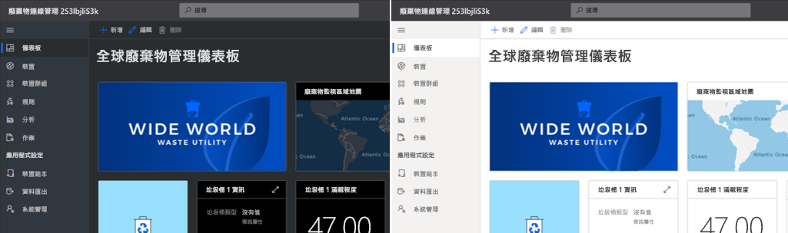

### 儀表板
> [!div class="mx-imgBorder"]
> 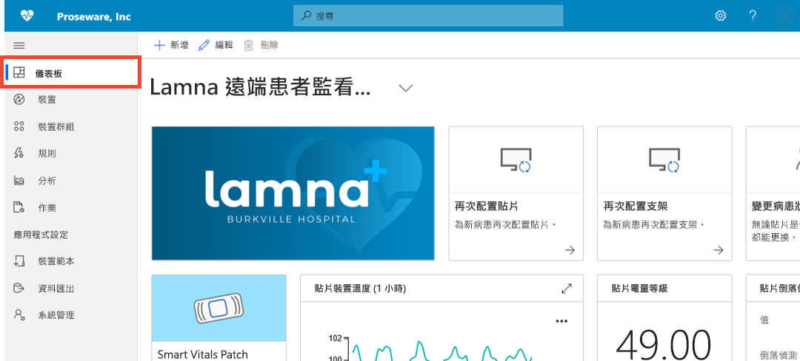

* 儀表板是您登入 Azure IoT Central 應用程式時所看到的第一個頁面。 身為*解決方案建置者*，您可以為其他使用者建立和自訂多個全域應用程式儀表板。 深入了解如何[將圖格新增至您的儀表板](../core/howto-add-tiles-to-your-dashboard.md?toc=/azure/iot-central/preview/toc.json&bc=/azure/iot-central/preview/breadcrumb/toc.json)

* 身為*操作員*，如果您的使用者角色允許，您可以建立個人儀表板以監視您關注的項目。 若要深入了解，請參閱[建立 Azure IoT Central 個人儀表板](../core/howto-create-personal-dashboards.md?toc=/azure/iot-central/preview/toc.json&bc=/azure/iot-central/preview/breadcrumb/toc.json)操作說明文章。

### 裝置

> [!div class="mx-imgBorder"]
> 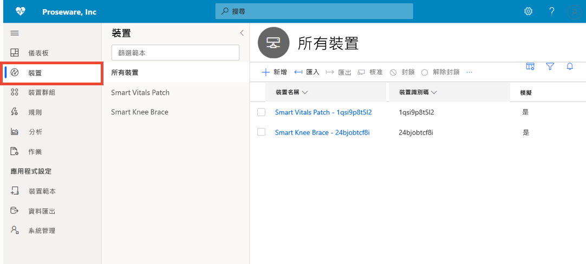

總管頁面可顯示您 Azure IoT Central 應用程式中依_裝置範本_分組的_裝置_。 

* 裝置範本會定義可以連線到您應用程式的裝置類型。
* 裝置代表應用程式中的實際或模擬裝置。

若要深入了解，請參閱[監視您的裝置](./quick-monitor-devices.md)快速入門。 

### 裝置群組

> [!div class="mx-imgBorder"]
> 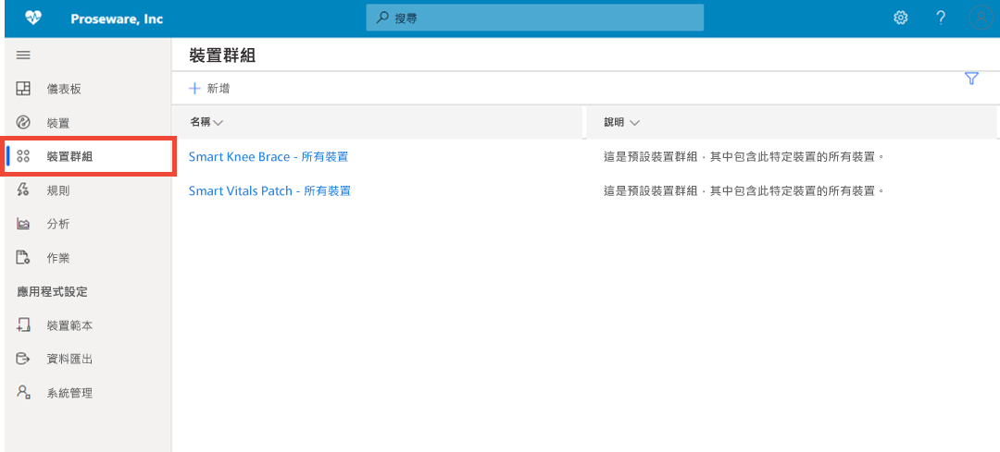

裝置群組是相關裝置的集合。 *解決方案建置者*可定義查詢，以識別裝置群組中包含的裝置。 您可以使用裝置群組在應用程式中執行大量作業。 若要深入了解，請參閱[在 Azure IoT Central 應用程式中使用裝置群組](tutorial-use-device-groups.md)一文。

### 規則
> [!div class="mx-imgBorder"]
> 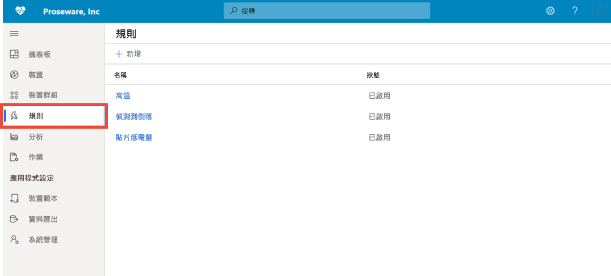

規則頁面可讓您根據裝置的遙測、狀態或事件來定義規則。 規則引發時，會觸發一或多個動作，例如傳送電子郵件、透過 Webhook 警示通知外部系統等。若要了解相關資訊，請參閱[設定規則](tutorial-create-telemetry-rules.md)教學課程。 

### 分析

> [!div class="mx-imgBorder"]
> 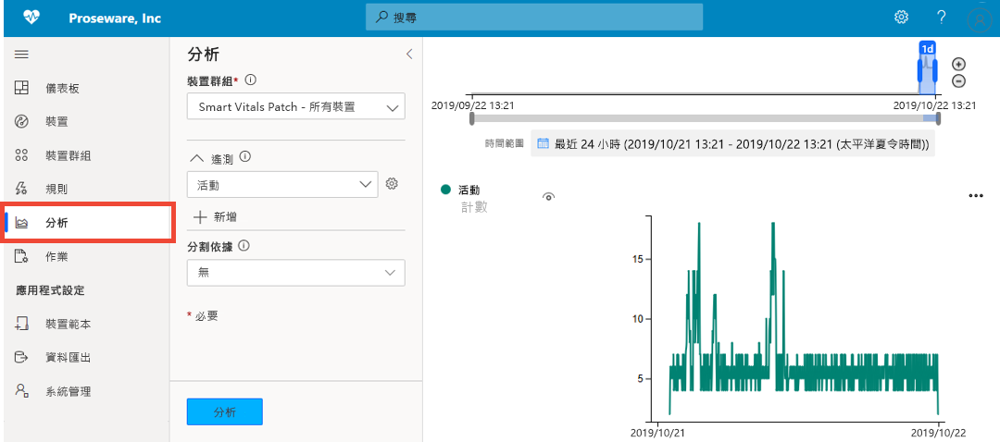

分析可讓您根據裝置資料建立自訂檢視，以從您的應用程式衍生深入解析。 若要深入了解，請參閱[為 Azure IoT Central 應用程式建立分析](howto-create-analytics.md)一文。

### 工作

> [!div class="mx-imgBorder"]
> 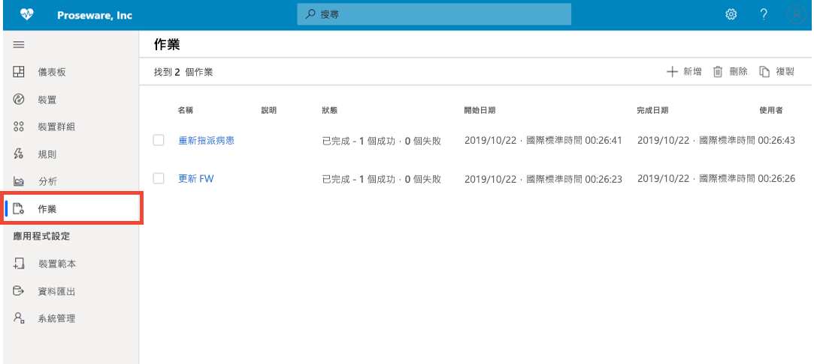

[作業] 頁面可讓您在您的裝置上執行大量裝置管理作業。 您可以對裝置群組更新裝置屬性、設定和執行命令。 若要深入了解，請參閱[執行作業](../core/howto-run-a-job.md?toc=/azure/iot-central/preview/toc.json&bc=/azure/iot-central/preview/breadcrumb/toc.json)一文。

### 裝置範本

> [!div class="mx-imgBorder"]
> 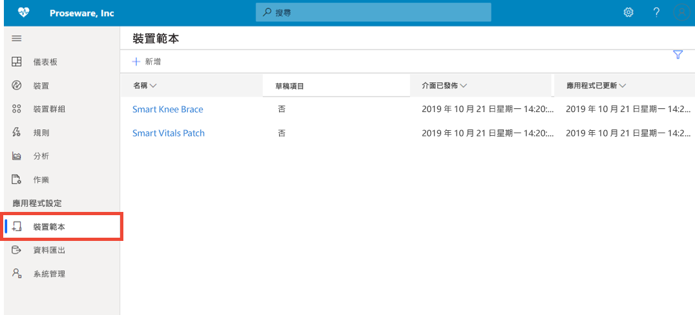

[裝置範本] 頁面是建置者在應用程式中建立和管理裝置範本之處。 裝置範本會指定裝置特性，例如：

* 遙測、狀態和事件量值
* properties
* 命令
* 檢視

*解決方案建置者*也可以建立表單和儀表板，供操作員用來管理裝置。

若要深入了解，請參閱[在 Azure IoT 中心應用程式中定義新的裝置類型](howto-set-up-template.md)。 

### 資料匯出
> [!div class="mx-imgBorder"]
> 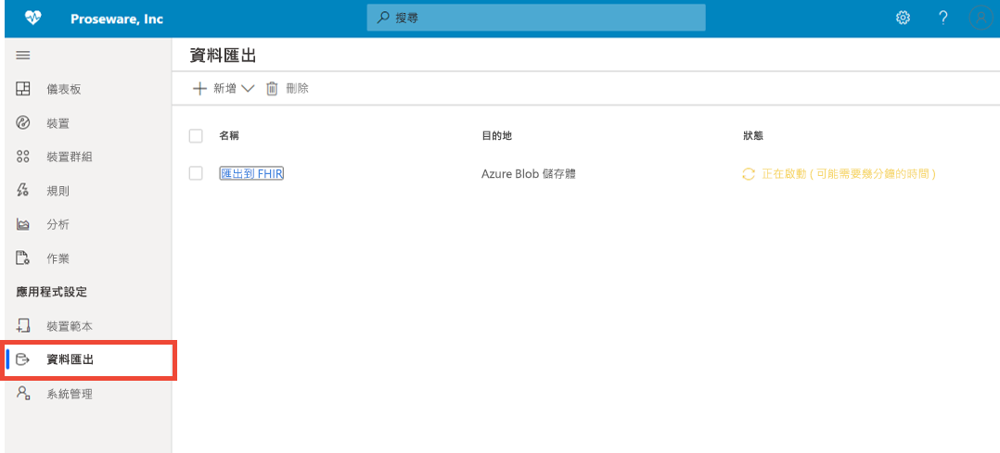

資料匯出可讓您設定從應用程式到外部系統的資料串流，例如遙測資料。 若要深入了解，請參閱[匯出 Azure IoT Central 中的資料](./howto-export-data.md)一文。

### 系統管理
> [!div class="mx-imgBorder"]
> 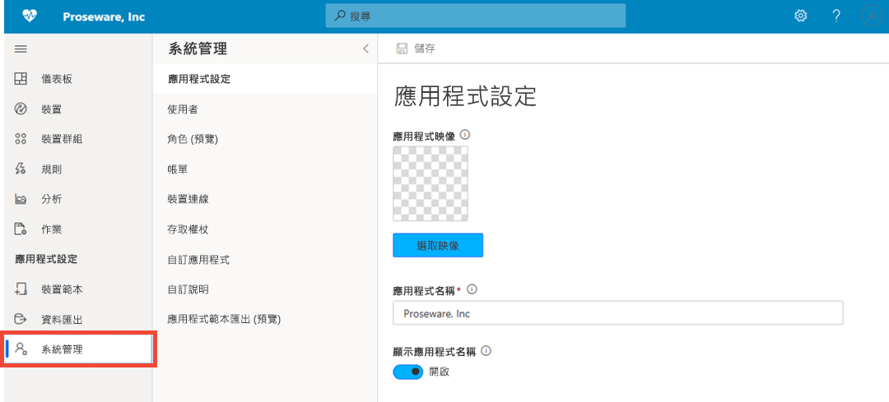

系統管理頁面可讓您設定和自訂 IoT Central 應用程式。 您可以在這裡變更應用程式名稱、URL、主題、管理使用者和角色、建立 API 權杖，以及匯出您的應用程式。 若要深入了解，請參閱[管理 Azure IoT 中心應用程式](howto-administer.md)一文。

## 後續步驟

您現在已大致了解 Azure IoT 中心並熟悉 UI 版面配置，下一個建議步驟是完成[建立 Azure IoT 中心應用程式](quick-deploy-iot-central.md)快速入門。
