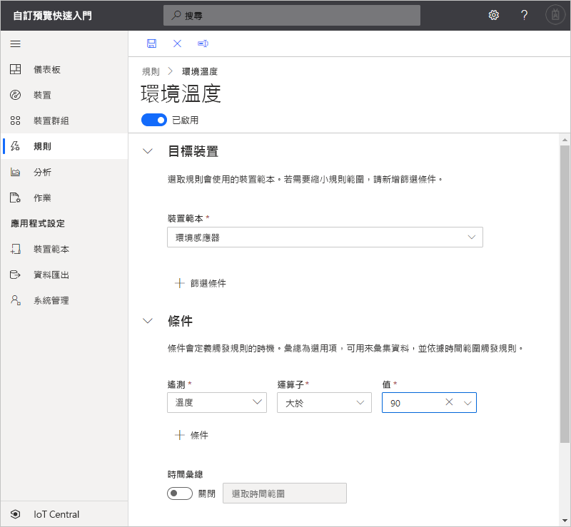

# 快速入門：在 Azure IoT Central 中為您的裝置設定規則和動作 (預覽功能)

*本文適用於操作員、建置員及系統管理員。*

[!INCLUDE [iot-central-pnp-original](../../../includes/iot-central-pnp-original-note.md)]

在本快速入門中，您會建立在環境感應器裝置的溫度超過 90&deg; F 時傳送電子郵件的規則。

## 必要條件

開始之前，請先完成[建立 Azure IoT Central 應用程式](./quick-deploy-iot-central.md)和[將模擬裝置新增至 IoT Central 應用程式](./quick-create-pnp-device.md)這兩個先前的快速入門，以建立要使用的**環境感應器**裝置範本。

## 建立以遙測為基礎的規則

1. 若要將以遙測為基礎的新規則新增至應用程式，請在左窗格中選取 [規則]  。

1. 若要建立新的規則，請選取 [+ 新增]  。

1. 輸入**環境溫度**作為規則名稱。

1. 在 [目標裝置]  區段中，選取 [環境感應器]  作為裝置範本。 此選項會依據裝置範本類型篩選要套用規則的裝置。 您可以選擇 [+ 篩選]  以新增更多篩選準則。

1. 在 [條件]  區段中，您可以定義規則所觸發的動作。 使用下列資訊來定義以溫度遙測為基礎的條件：

    | 欄位                                        | 值                             |
    | -------------------------------------------- | ------------------------------    |
    | 測量                                  | 溫度                       |
    | 運算子                                     | 大於                   |
    | 值                                        | 90                                |

    若要新增更多條件，請選取 [+ 條件]  。

    

1. 若要新增要在規則觸發時所執行的電子郵件動作，請選取 [+ 電子郵件]  。

1. 請使用下表中的資訊來定義您的動作：

    | 設定   | 值                                             |
    | --------- | ------------------------------------------------- |
    | 顯示名稱 | 操作員電子郵件動作                          |
    | 至        | 您的電子郵件地址                                |
    | 注意     | 環境溫度已超出臨界值。 |

    > [!NOTE]
    > 若要接收電子郵件通知，電子郵件地址必須是[應用程式中的使用者識別碼](howto-administer.md)，且該使用者必須已至少登入應用程式一次。

    

1. 選取 [儲存]  。 您的規則會列在 [規則]  頁面上。

## 測試規則

規則在您儲存之後，不久即會生效。 符合規則中定義的條件時，應用程式即會傳送訊息至您在動作中指定的電子郵件地址。

> [!NOTE]
> 測試完成後，請關閉規則以停止在收件匣中接收警示。

## 後續步驟

在此快速入門中，您已了解如何：

* 建立以遙測為基礎的規則
* 新增動作

若要深入了解如何監視連線至應用程式的裝置，請繼續進行下列快速入門：

> [!div class="nextstepaction"]
> [使用 Azure IoT Central 監視您的裝置](quick-monitor-devices.md)。
