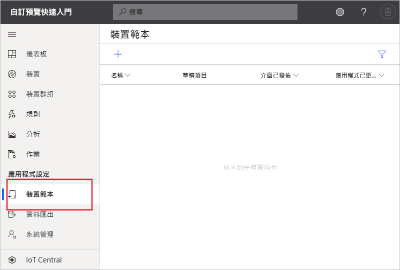
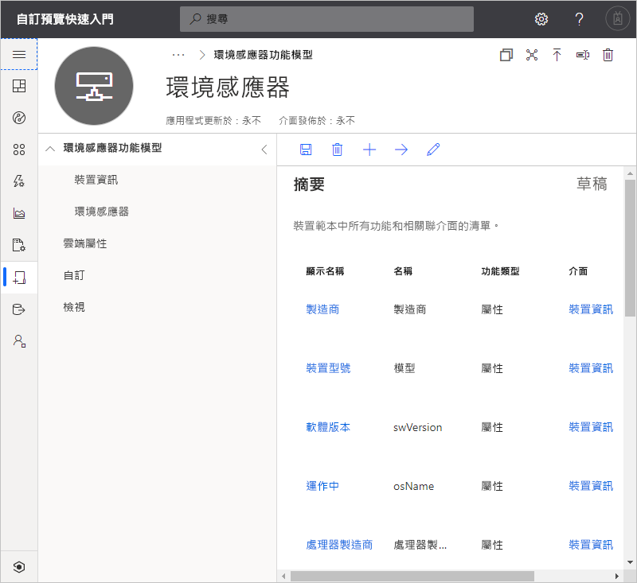
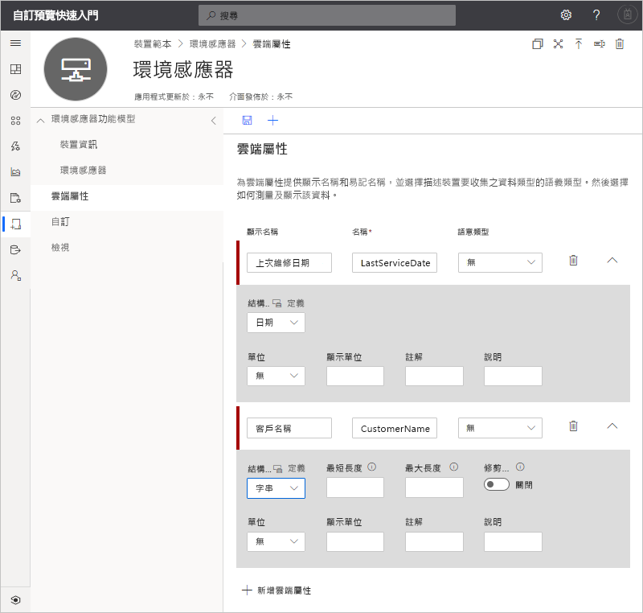
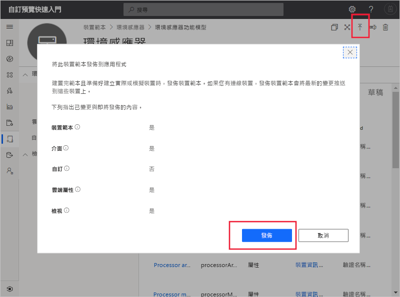
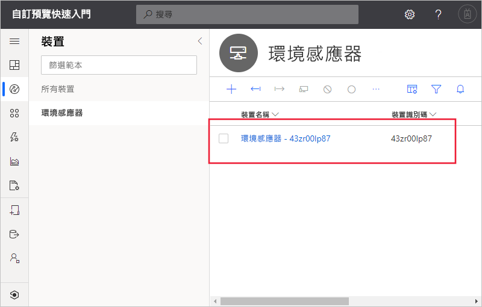
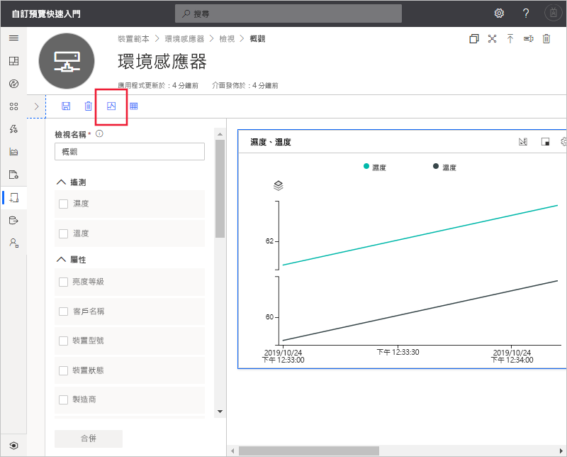

# 快速入門：將模擬裝置新增至 IoT Central 應用程式 (預覽功能)

*本文適用於操作員、建置員及系統管理員。*

[!INCLUDE [iot-central-pnp-original](../../../includes/iot-central-pnp-original-note.md)]

裝置範本會為連線至 IoT Central 應用程式的裝置定義功能。 這些功能包括裝置傳送的遙測資料、裝置屬性，以及裝置所回應的命令。 建置者或操作員可從裝置範本將實際和模擬的裝置新增至應用程式。 模擬裝置可讓您在連線實際裝置之前先測試應用程式的行為。

在本快速入門中，您會建立**環境感應器**裝置範本，並新增模擬裝置。 環境感應器裝置：

* 傳送遙測資料，例如溫度。
* 報告裝置特定屬性，例如亮度層級。
* 回應命令，例如開啟和關閉。
* 報告一般裝置屬性，例如裝置的韌體版本和序號。

## 必要條件

完成[建立 Azure IoT Central 應用程式 (預覽功能)](./quick-deploy-iot-central.md) 快速入門，以使用**自訂應用程式 > 預覽版應用程式**範本建立 IoT Central 應用程式。

您也需要 **EnvironmentalSensorInline.capabilitymodel.json** 檔案的本機複本，其中包含 [IoT 隨插即用](../../iot-pnp/overview-iot-plug-and-play.md)裝置功能模型。 您可以從 [這裡](https://raw.githubusercontent.com/Azure/IoTPlugandPlay/master/samples/EnvironmentalSensorInline.capabilitymodel.json)下載。 以滑鼠右鍵按一下頁面，然後選取 [另存新檔]  。

下載檔案之後，請在文字編輯器中開啟檔案，並將 `<YOUR_COMPANY_NAME_HERE>` 的兩個執行個體取代為您的名稱。 您只能使用字元 a-z、A-Z、0-9 和底線。

## 建立範本

身為建置者，您可以在應用程式中建立和編輯裝置範本。 發佈裝置範本之後，您可以產生模擬裝置，或連接實作裝置範本的實際裝置。 模擬裝置可讓您在連線實際裝置之前先測試您應用程式的行為。

若要將新的裝置範本新增至應用程式，請移至 [裝置範本]  頁面。 若要這樣做，請選取左窗格中的 [裝置範本]  索引標籤。

### 新增裝置功能模型

有數個選項可用來在 IoT Central 中製作裝置功能模型。 您可以選擇從頭開始建立自訂模型、從檔案匯入、從裝置目錄中選取，或透過已將裝置功能模型發佈於公用存放庫中的裝置優先連線來連接 IoT 隨插即用裝置。 在本教學課程中，您會從檔案匯入裝置功能模型。

下列步驟說明如何匯入**環境感應器**裝置的功能模型。 這些裝置會將遙測資料 (例如溫度) 傳送至您的應用程式：

1. 若要新增裝置範本，請選取 [裝置範本]  頁面上的 **+** 。

1. 從自訂裝置範本清單中選擇 [IoT 裝置]  ，然後選取 **[下一步：自訂]** ，然後選取 **[下一步：檢閱]** ，然後選取 [建立]  。

1. 輸入**環境感應器**作為裝置範本的名稱。

1. 選擇 [匯入功能模型]  ，以從 JSON 檔案建立新的裝置功能模型。 瀏覽至您在本機電腦上儲存 **EnvironmentalSensorInline.capabilitymodel.json** 檔案的資料夾。 選取 **EnvironmentalSensorInline.capabilitymodel.json** 檔案，然後選取 [開啟]  。 環境感應器功能模型包含**環境感應器**和**裝置資訊**介面：

    

    這些介面會定義**環境感應器**裝置的功能。 這些功能包括裝置傳送的遙測資料、裝置所報告的屬性，以及裝置所回應的命令。

### 新增雲端屬性

裝置範本可包含雲端屬性。 雲端屬性僅存在於 IoT Central 應用程式中，且一律不會傳送至或接收自裝置。

1. 依序選取 [雲端屬性]  和 [+ 新增雲端屬性]  。 請使用下表中的資訊，將雲端屬性新增至您的裝置範本。

    | 顯示名稱      | 語意類型 | 結構描述 |
    | ----------------- | ------------- | ------ |
    | 上次維修日期 | None          | Date   |
    | 客戶名稱     | None          | 字串 |

1. 選取 [儲存]  以儲存變更：

    

## 建立檢視

身為建置者，您可以自訂應用程式，以對操作員顯示環境感應器裝置的相關資訊。 您的自訂將使操作員能夠管理已連線至應用程式的環境感應器裝置。 您可以建立兩種類型的檢視，讓操作員用來與裝置互動：

* 用於檢視及編輯裝置和雲端屬性的表單。
* 用來將裝置視覺化的儀表板。

### 產生預設檢視

產生預設檢視，是開始將重要裝置資訊視覺化的快速方式。 您最多可以為裝置範本產生三個預設檢視：

* [命令]  檢視可讓您的操作員將命令分派至裝置。
* [概觀]  檢視會使用圖表和計量來顯示裝置遙測資料。
* [關於]  檢視會顯示裝置屬性。

選取 [檢視]  ，然後選取 [產生預設檢視]  。

### 設定將裝置視覺化的檢視

裝置儀表板可讓操作員使用圖表和計量將裝置視覺化。 身為建置者，您可以定義要在裝置儀表板上顯示哪些資訊。 您可以為裝置定義多個儀表板。 若要建立將環境感應器遙測資料視覺化的儀表板，請選取 [檢視]  ，然後**將裝置視覺化**：

1. 所有的裝置屬性、雲端屬性、遙測資料和靜態選項都會列在 [屬性]  下方。 您可以將其中任何項目拖放到此檢視中。 將 [亮度層級]  屬性拖曳至檢視中。 您可以使用齒輪圖示來設定圖格。

1. 若要新增繪製遙測資料的圖表，請選取 [濕度]  和 [溫度]  ，然後選取 [合併]  。 若要以不同的格式 (例如圓形圖或橫條圖) 來檢視此圖表，請選取圖格頂端的 [變更視覺效果]  按鈕。

1. 選取 [儲存]  以儲存檢視：

您可以新增更多顯示其他屬性或遙測值的圖格。 您也可以新增靜態文字、連結和影像。 若要移動儀表板上的圖格或調整其大小，請將滑鼠指標移至圖格上方，然後將圖格拖曳到新位置或調整其大小。

### 新增裝置表單

裝置表單可讓操作員編輯可寫入的裝置屬性和雲端屬性。 身為建置者，您可以定義多個表單，並選擇要在每個表單上顯示的裝置和雲端屬性。 您也可以在表單上顯示唯讀裝置屬性。

若要建立表單以檢視和編輯環境感應器屬性：

1. 流覽至**環境感應器**範本中的 [檢視]  。 選取 [編輯裝置和雲端資料]  圖格來新增檢視。

1. 輸入表單名稱**環境感應器屬性**。

1. 將 [客戶名稱]  和 [上次維修日期]  雲端屬性拖曳到表單上的現有區段。

1. 選取 [亮度層級]  和 [裝置狀態]  裝置屬性。 然後，選取 [新增區段]  。 編輯要作為**感應器屬性**之區段的標題。 選取 [套用]  。

1. 選取 [裝置型號]  、[軟體版本]  、[製造商]  和 [處理器製造商]  裝置屬性。 然後，選取 [新增區段]  。 編輯要作為**裝置屬性**之區段的標題。 選取 [套用]  。

1. 選取 [儲存]  以儲存檢視。

## 發佈裝置範本

您必須先發佈裝置範本，才能建立模擬的環境感應器或連接實際的環境感應器。

若要發佈裝置範本：

1. 從 [裝置範本]  頁面移至您的裝置範本。

1. 選取 [發佈]  。

1. 在 [發佈裝置範本]  對話方塊中，選擇[發佈]  ：

    

裝置範本發佈後，將會顯示在 [裝置]  頁面上，並且對操作員顯示。 在已發佈的裝置範本中，您無法直接編輯裝置功能模型而不建立新版本。 不過，您可以直接在已發佈的裝置範本中更新雲端屬性、自訂和檢視，而無須進行版本控制。 進行任何變更之後，請選取 [發佈]  ，將這些變更推送給您的操作員。

## 新增模擬裝置

若要將模擬裝置新增至應用程式，您應使用您所建立的**環境感應器**裝置範本。

1. 若要以操作員的身分新增裝置，請選擇左窗格中的 [裝置]  。 [裝置]  索引標籤會顯示 [所有裝置]  和 [環境感應器]  裝置範本。 選取 [環境感應器]  。

1. 若要新增模擬的環境感應器裝置，請選取 [+ 新增]  。 請使用建議的**裝置識別碼**，或輸入您自己的小寫**裝置識別碼**。 您也可以輸入新裝置的名稱。 將 [模擬]  切換開關切換為 [開啟]  ，然後選取 [建立]  。

    

現在，您可以與建置者使用模擬資料為裝置範本建立的檢視進行互動。

## 使用模擬裝置來改善檢視

在您建立新的模擬裝置之後，建置者可以使用此裝置繼續改善及建置裝置範本的檢視。

1. 選擇左窗格中的 [裝置範本]  ，然後選取 [環境感應器]  範本。

1. 選取您要編輯的任何檢視，或建立新的檢視。 按一下 [設定預覽裝置]  ，然後按 [從執行中的裝置選取]  。 在此，您可以選擇沒有預覽裝置、使用您可設定以進行測試的實際裝置，或您已新增至 IoT Central 的現有裝置。

1. 在清單中選擇您的模擬裝置。 然後，選取 [套用]  。 現在，您可以在裝置範本檢視建置體驗中看到相同的模擬裝置。 此檢視適用於圖表和其他視覺效果。

    

## 後續步驟

在本快速入門中，您已了解如何建立**環境感應器**裝置範本，並將模擬裝置新增至應用程式。

若要深入了解如何監視連線至應用程式的裝置，請繼續進行下列快速入門：

> [!div class="nextstepaction"]
> [設定規則和動作](./quick-configure-rules.md)
