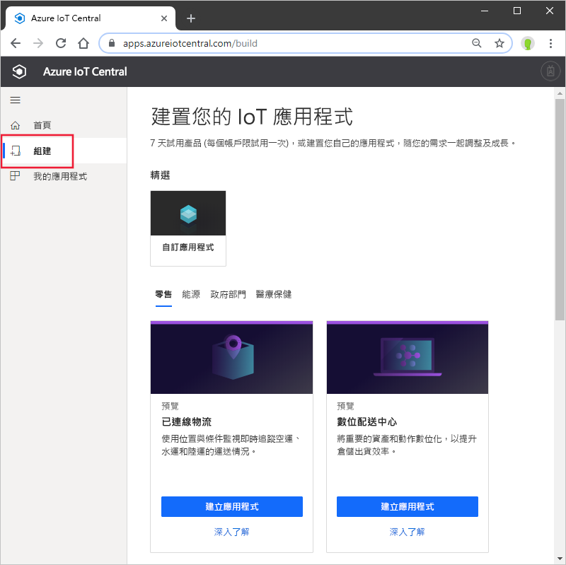
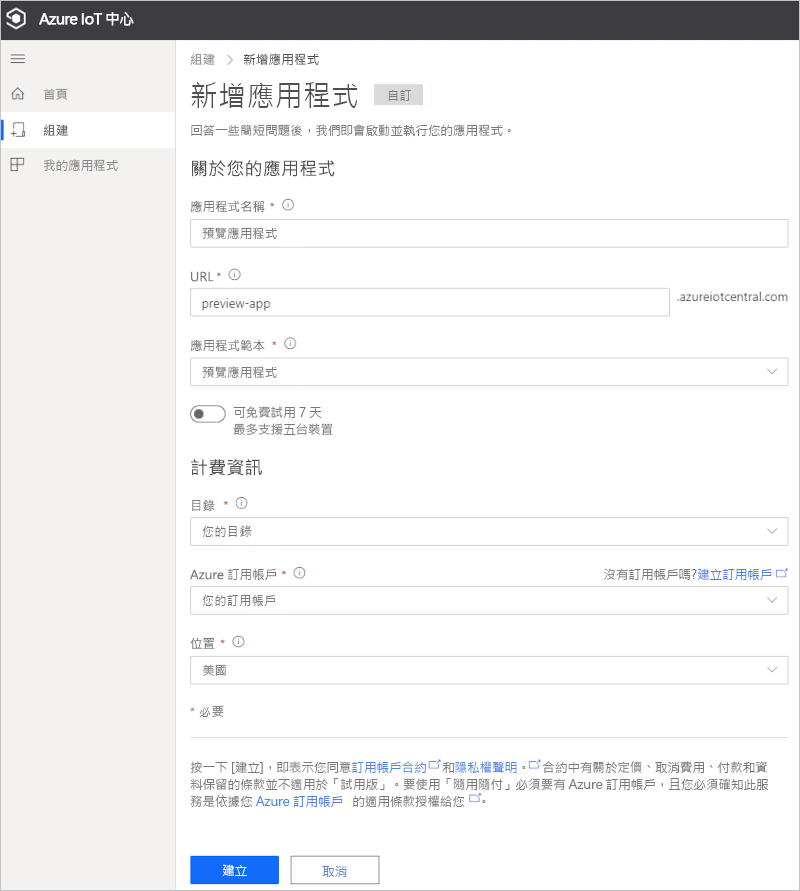

# 建立 Azure IoT Central 應用程式 (預覽功能)

[!INCLUDE [iot-central-pnp-original](../../../includes/iot-central-pnp-original-note.md)]

本快速入門說明如何建立包含預覽功能 (例如 IoT 隨插即用) 的 Azure IoT Central 應用程式。

> [!WARNING]
> Azure IoT Central 中的 IoT 隨插即用功能目前為公開預覽狀態。 請勿將已啟用 IoT 隨插即用的 IoT Central 應用程式用於生產工作負載。 針對生產環境，請使用從目前正式推出的應用程式範本建立的 IoT Central 應用程式。

## 建立應用程式

瀏覽至 [Azure IoT Central 組建](https://aka.ms/iotcentral)網站。 然後，使用 Microsoft 的個人、公司或學校帳戶登入。

您可以從產業相關的 IoT Central 範本清單建立新的應用程式，以便快速開始使用，或使用**自訂應用程式**範本從頭開始建立。

若要建立新的 Azure IoT Central 應用程式：

1. 若要從*產業範本*建立新的 Azure IoT Central 應用程式，請從其中一個產業底下的可用範本清單中選取應用程式範本。 您也可以選擇 [自訂應用程式]  從頭開始建立。
1. Azure IoT Central 會根據您所選取的應用程式範本自動建議**應用程式名稱**。 您可以使用此名稱，或自行輸入易記的應用程式名稱。
1. Azure IoT Central 也會根據應用程式名稱，為您產生唯一的**應用程式 URL** 前置詞。 您可以使用此 URL 來存取應用程式。 您可以依個人需求，將其變更為更好記的 URL 前置詞。

    

    > [!NOTE]
    > 如果您使用自訂應用程式範本，您將會看到 [應用程式範本]  下拉式欄位。 在此處，您可以在預覽與正式推出的範本之間切換。 您可能也會看到已提供給您的組織的其他範本。

1. 選擇您要使用 7 天免費試用版來建立此應用程式，還是要使用隨用隨付訂用帳戶。
    - **試用版**應用程式可以免費試用七天，且最多可支援五個裝置。 此類應用程式可在到期前隨時轉換成隨用隨付。 如果您建立試用版應用程式，則必須輸入連絡資訊，並選擇是否要收到來自 Microsoft 的資訊和提示。
    - **隨用隨付**應用程式會依據個別裝置收費，前兩個裝置免費。 深入了解 [IoT Central 價格](https://aka.ms/iotcentral-pricing)。 如果您建立隨用隨付應用程式，則必須選取*目錄*、*Azure 訂用帳戶*和*區域*：
        - *目錄*是您將用來建立應用程式的 Azure Active Directory (AAD)。 Azure AD 中包含使用者身分識別、認證和其他組織資訊。 如果您沒有 Azure AD，系統會在您建立 Azure 訂用帳戶時為您建立。
        - *Azure 訂用帳戶*可讓您建立 Azure 服務執行個體。 IoT Central 會在您的訂用帳戶中佈建資源。 如果您沒有 Azure 訂用帳戶，您可以在 [Azure 註冊頁面](https://aka.ms/createazuresubscription)上建立一個。 建立 Azure 訂用帳戶之後，請瀏覽回到 [建立應用程式]  頁面。 新的訂用帳戶會出現在 [Azure 訂用帳戶]  下拉式清單中。
        - *區域*是用來儲存裝置資料的實體位置。 一般而言，您應選擇實際上最接近您裝置的區域，以取得最佳效能，以及確保資料主權合規性。 選擇區域後，即無法將應用程式移到不同的區域。

        > [!NOTE]
        > 在公開預覽期間，**預覽應用程式**的唯一可用區域為**歐洲北部**和**美國中部**。

1. 檢閱條款和條件，然後選取頁面底部的 [建立]  。

## 後續步驟

在本快速入門中，您已建立 IoT Central 應用程式。 以下是建議的後續步驟：

> [!div class="nextstepaction"]
> [將模擬裝置新增至 IoT Central 應用程式](./quick-create-pnp-device.md)
