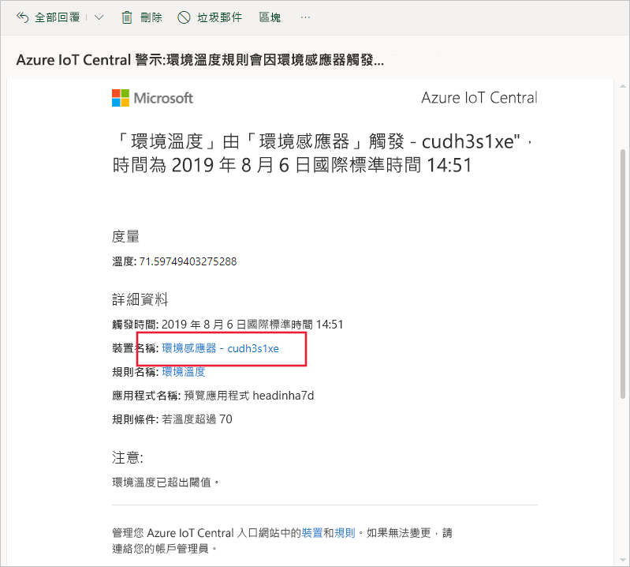
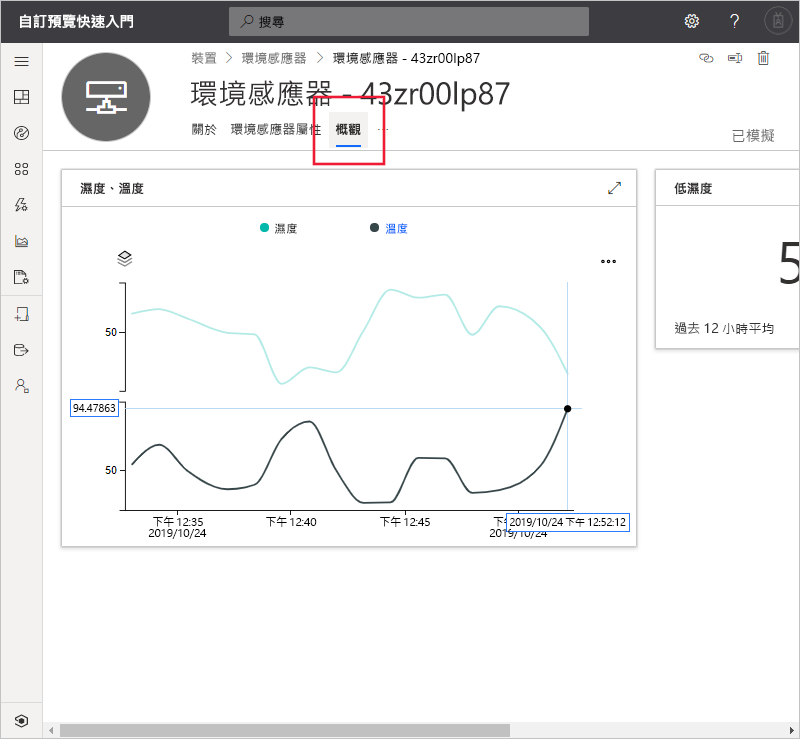
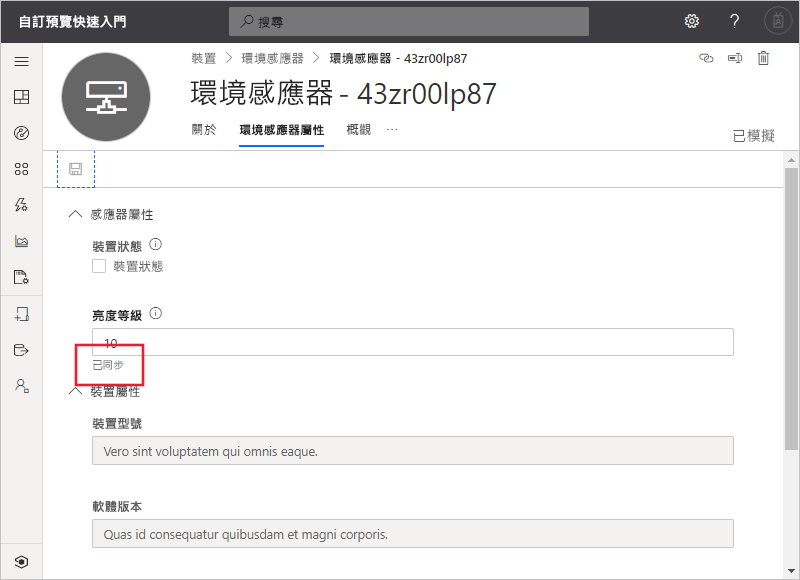

# 快速入門：使用 Azure IoT Central 監視您的裝置 (預覽功能)

*本文適用於操作員、建置員及系統管理員。*

[!INCLUDE [iot-central-pnp-original](../../../includes/iot-central-pnp-original-note.md)]

本快速入門將為操作員說明如何使用 Microsoft Azure IoT Central 應用程式監視您的裝置和變更設定。

## 必要條件

開始之前，請先完成[建立 Azure IoT Central 應用程式](./quick-deploy-iot-central.md)、[將模擬裝置新增至 IoT Central 應用程式](./quick-create-pnp-device.md)和[為您的裝置設定規則和動作](quick-configure-rules.md)這三個先前的快速入門。

## 接收通知

Azure IoT Central 會以電子郵件訊息傳送關於裝置的通知。 建置者已新增會在連線的環境感應器裝置溫度超出臨界值時傳送通知的規則。 請查看傳送至建置者選擇要接收通知之帳戶的電子郵件。

開啟您在[為您的裝置設定規則和動作](quick-configure-rules.md)快速入門結束時收到的電子郵件訊息。 在電子郵件中，選取裝置的連結：

您在先前的快速入門中建立的環境感應器模擬裝置的 [儀表板]  檢視，會在您的瀏覽器中開啟：

## 調查問題

身為操作員，您可以在 [概觀]  、[環境感應器屬性]  和 [命令]  頁面上檢視裝置的相關資訊。 建置者自訂了 [儀表板]  和 [環境感應器屬性]  頁面，以顯示與已連線的環境感應器裝置有關的重要資訊。

選擇 [概觀]  檢視以查看裝置的相關資訊。

儀表板上的圖表會顯示裝置溫度的繪圖。 您判定裝置溫度過高。

## 補救問題

若要對裝置進行變更，請使用 [環境感應器屬性]  頁面。

選擇 [環境感應器屬性]  。 將 [亮度層級]  變更為 10。 選擇 [儲存]  以更新裝置。 在裝置確認設定變更後，屬性的狀態會變更為 [已同步]  ：

## 後續步驟

在此快速入門中，您已了解如何：

* 接收通知
* 調查問題
* 補救問題

現在您已了解如何監視您的裝置，建議的下一個步驟是：

> [!div class="nextstepaction"]
> [建置和管理裝置範本](howto-set-up-template.md)。
