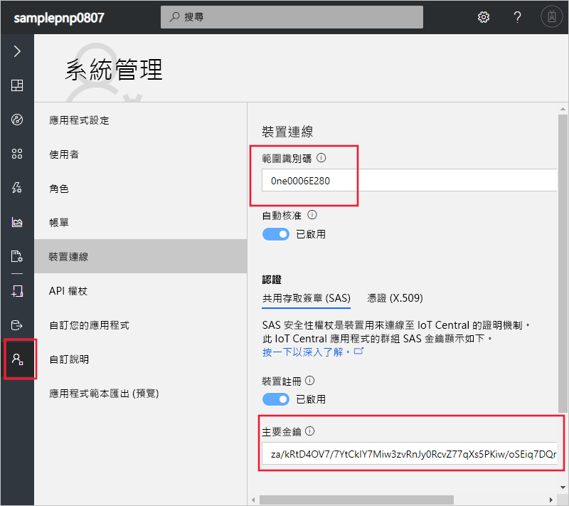
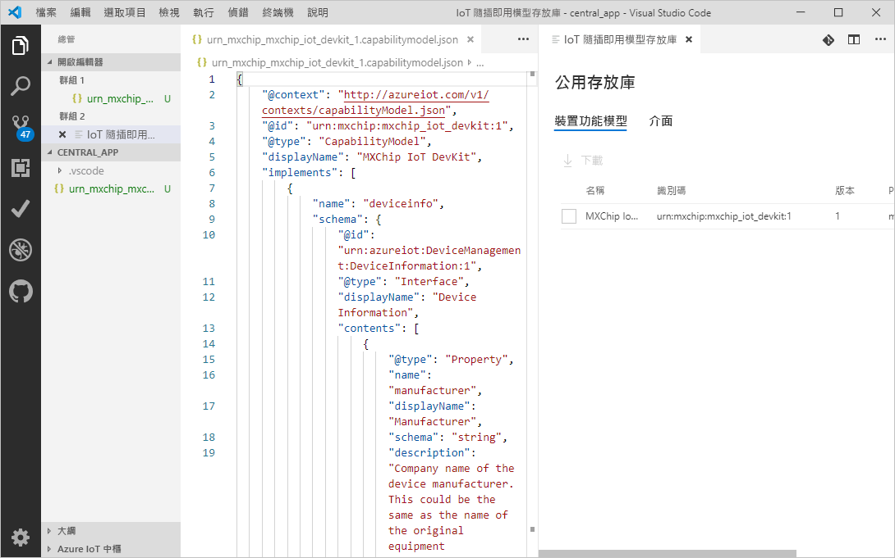
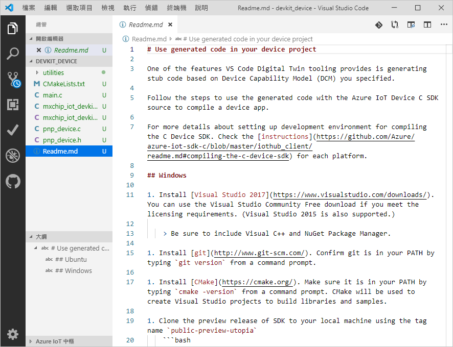
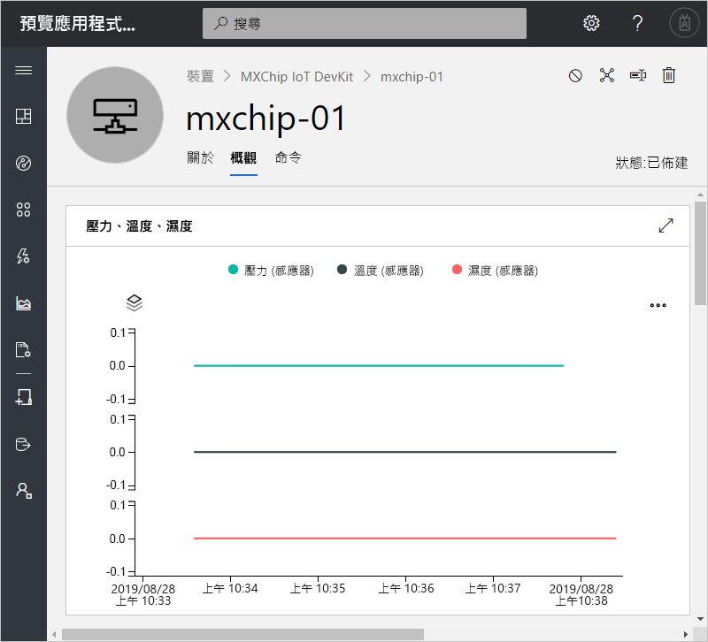
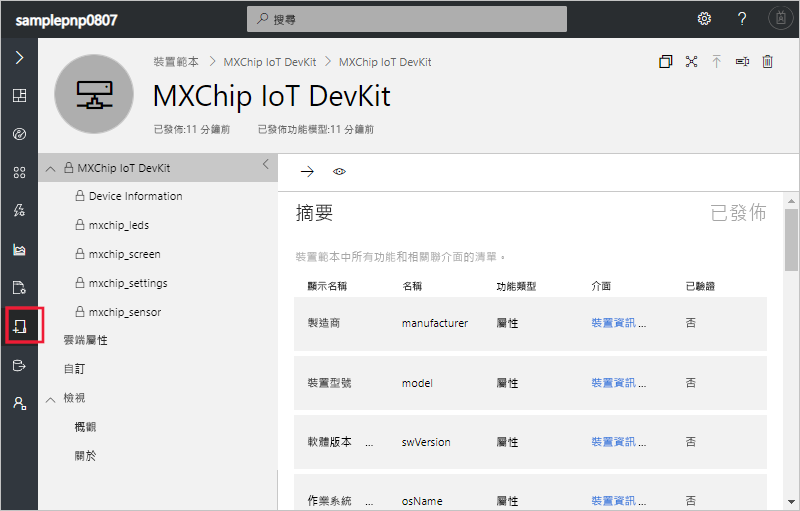

# <a name="quickstart-use-a-device-capability-model-to-create-an-iot-plug-and-play-device-and-connect-it-to-your-iot-central-application"></a>快速入門：使用裝置功能模型建立 IoT 隨插即用裝置，並將其連線至您的 IoT Central 應用程式

[!INCLUDE [iot-central-pnp-original](../../includes/iot-central-pnp-original-note.md)]

_裝置功能模型_ (DCM) 可說明 [IoT 隨插即用](../iot-pnp/overview-iot-plug-and-play.md)裝置的功能。 IoT Central 可在裝置第一次連接時，使用 DCM 來建立裝置的裝置範本和視覺效果。 本快速入門示範如何：

* 在 Visual Studio Code 中使用 DCM 建立 IoT 隨插即用裝置。
* 在 Windows 中執行裝置程式碼，並查看它是否連線至您的 IoT Central 應用程式。
* 檢視裝置所傳送的模擬遙測。

## <a name="prerequisites"></a>必要條件

完成[建立 Azure IoT Central 應用程式 (預覽功能)](./quick-deploy-iot-central-pnp.md?toc=/azure/iot-central-pnp/toc.json&bc=/azure/iot-central-pnp/breadcrumb/toc.json) 快速入門，以使用**預覽版應用程式**範本建立 IoT Central 應用程式。

若要完成本快速入門，您必須在本機電腦上安裝下列軟體：

* [Visual Studio (Community、Professional 或 Enterprise)](https://visualstudio.microsoft.com/downloads/) - 在安裝 Visual Studio 時，請確實包含 **NuGet 套件管理員**元件和**使用 C++ 的桌面開發**工作負載。
* [Git](https://git-scm.com/download/)。
* [CMake](https://cmake.org/download/) - 當您安裝 **CMake** 時，請選取 [將 CMake 新增至系統路徑]  選項。
* [Visual Studio Code](https://code.visualstudio.com/)。
* [Node.js](https://nodejs.org/)
* `dps-keygen` 公用程式：

    ```cmd/sh
    npm i -g dps-keygen
    ```

### <a name="install-azure-iot-tools"></a>安裝 Azure IoT Tools

請使用下列步驟安裝在 VS Code 中安裝 Azure IoT Tools 擴充套件：

1. 在 VS Code 中，選取 [延伸模組]  索引標籤。
1. 搜尋 **Azure IoT Tools**。
1. 選取 [安裝]  。

## <a name="prepare-the-development-environment"></a>準備開發環境

### <a name="get-azure-iot-device-sdk-for-c"></a>適用於 C 的 Azure IoT 裝置 SDK

準備可用來建置 Azure IoT C 裝置 SDK 的開發環境。

1. 開啟命令提示字元。 執行下列命令以複製 [Azure IoT C SDK](https://github.com/Azure/azure-iot-sdk-c) GitHub 存放庫：

    ```cmd/sh
    git clone https://github.com/Azure/azure-iot-sdk-c --recursive -b public-preview
    ```

    預期此作業需要幾分鐘的時間才能完成。

1. 在存放庫本機複本的根目錄中建立 `central_app` 資料夾。 您可以使用此資料夾來存放裝置模型檔案和裝置程式碼 Stub。

    ```cmd/sh
    cd azure-iot-sdk-c
    mkdir central_app
    ```

## <a name="generate-device-key"></a>產生裝置金鑰

若要將裝置連線至 IoT Central 應用程式，您必須要有裝置金鑰。 若要產生裝置金鑰：

1. 登入您在先前的快速入門中建立的 IoT Central 應用程式。

1. 移至 [管理]  頁面，然後選取 [裝置連線]  。

1. 記下**範圍識別碼**和**主要金鑰**。 您稍後會在本快速入門中使用這些值。

    

1. 開啟命令提示字元並執行下列命令，以產生裝置金鑰：

    ```cmd/sh
    dps-keygen  -di:mxchip-01 -mk:{Primary Key from previous step}
    ```

    記下產生的_裝置金鑰_，您將在本快速入門的後續步驟中使用此值。

## <a name="download-your-model"></a>下載您的模型

在本快速入門中，您會使用 MxChip IoT DevKit 裝置的公用 DCM。 您不需要以實際的 DevKit 裝置執行程式碼，在本快速入門中，您會編譯要在 Windows 上執行的程式碼。

1. 使用 VS Code 開啟 `azure-iot-sdk-c\central_app` 資料夾。

1. 使用 **Ctrl+Shift+P** 開啟命令選擇區，輸入 **IoT 隨插即用**，然後選取 [開啟模型存放庫]  。 選取 [公用存放庫]  。 VS Code 會顯示公用模型存放庫中的 DCM 清單。

1. 選取識別碼為 `urn:mxchip:mxchip_iot_devkit:1` 的 **MXChip IoT DevKit** DCM。 然後，選取 [下載]  。 現在，您在 `central_app` 資料夾中已有 DCM 的複本。



> [!NOTE]
> 若要使用 IoT Central，裝置功能模型必須具有在相同檔案中以內嵌方式定義的所有介面。

## <a name="generate-the-c-code-stub"></a>產生 C 程式碼 Stub

現在您已有 **MXChip IoT DevKit** DCM 及其相關聯的介面，您可以產生實作模型的裝置程式碼。 若要在 VS Code 中產生 C 程式碼 Stub：

1. 開啟含有 DCM 檔案的資料夾，使用 **Ctrl+Shift+P** 開啟命令選擇區，輸入 **IoT 隨插即用**，然後選取 [產生裝置程式碼 Stub]  。

    > [!NOTE]
    > 第一次使用 IoT 隨插即用程式碼產生器公用程式時，需要幾秒鐘的時間才能下載。

1. 選取您剛才下載的 **MXChip IoT DevKit** DCM 檔案。

1. 輸入專案名稱 **devkit_device**。

1. 選擇 [ANSI C]  作為您的語言。

1. 選擇 [CMake 專案]  作為您的專案類型。 請勿選擇 [MXChip IoT DevKit 專案]  ，此選項適用於您有實際的 DevKit 裝置時。

1. 選擇 [透過 DPS (裝置佈建服務) 對稱金鑰]  作為連線方法。

1. VS Code 會開啟新視窗，其中包含在 `devkit_device` 資料夾中產生的裝置程式碼 Stub 檔案。



若要將連線資訊新增至產生的裝置程式碼：

1. 進入VS Code 視窗，其中包含已產生的 C 程式碼。 開啟 `main.c` 檔案。

1. 將 [範圍識別碼]`[DPS Id Scope]`**取代為您先前所記下的**。

1. 將 `[DPS symmetric key]` 取代為您在先前的步驟中產生的裝置金鑰。

1. 將 `[device registration Id]` 取代為 `mxchip-01`。

1. 儲存您的變更。

## <a name="build-the-code"></a>建置程式碼

您可以使用裝置 SDK 來建置產生的裝置程式碼 Stub。 您建置的應用程式會模擬 **MXChip IoT DevKit** 裝置，並連線至您的 IoT Central 應用程式。 應用程式會傳送遙測資料和屬性，並接收命令。

1. 在 VS Code 中，開啟 `azure-iot-sdk-c` 資料夾中的 `CMakeLists.txt` 檔案。 請確定您開啟的是 `azure-iot-sdk-c` 資料夾中的 `CMakeLists.txt` 檔案，而不是 `devkit_device` 資料夾中的檔案。

1. 在編譯時，在 `CMakeLists.txt` 檔案底部新增以下這一行，以包含裝置程式碼 Stub 資料夾：

    ```txt
    add_subdirectory(central_app/devkit_device)
    ```

1. 在資料夾 `azure-iot-sdk-c` 中建立 `cmake` 資料夾，並在命令提示字元中瀏覽至該資料夾：

    ```cmd\sh
    mkdir cmake
    cd cmake
    ```

1. 執行下列命令，以建置裝置 SDK 和產生的程式碼 Stub：

    ```cmd\sh
    cmake .. -Duse_prov_client=ON -Dhsm_type_symm_key:BOOL=ON
    cmake --build . -- /m /p:Configuration=Release
    ```

1. 組件順利完成後，請在相同的命令提示字元中執行您的應用程式：

    ```cmd\sh
    .\central_app\devkit_device\Release\devkit_device.exe
    ```

1. 裝置應用程式會開始將資料傳送至您的 IoT Central 應用程式。

## <a name="view-the-device"></a>檢視裝置

當您的裝置程式碼連線至 IoT Central 之後，您就可以檢視它所傳送的屬性和遙測資料：

1. 在您的 IoT Central 應用程式中，移至 [裝置]  頁面，然後選取 **mxchip-01** 裝置。 此裝置會在裝置程式碼連線時自動新增：

    

    幾分鐘後，此頁面會顯示裝置所傳送之遙測資料的圖表。

1. 選取 [關於]  頁面，以查看裝置所傳送的屬性值。

1. 選取 [命令]  頁面，以在裝置上呼叫命令。 您可以在執行裝置程式碼的命令提示字元中查看裝置回應。

1. 移至 [裝置範本]  頁面，以查看 IoT Central 從公用存放庫中的 DCM 建立的範本：

    

## <a name="next-steps"></a>後續步驟

在本快速入門中，您已了解如何連接從公用模型存放庫中的 DCM 產生的 IoT 隨插即用裝置。

若要深入了解 DCM 以及如何建立您自己的模型，請繼續進行操作指南：

> [!div class="nextstepaction"]
> [設定和管理裝置範本](./howto-set-up-template-pnp.md?toc=/azure/iot-central-pnp/toc.json&bc=/azure/iot-central-pnp/breadcrumb/toc.json)
