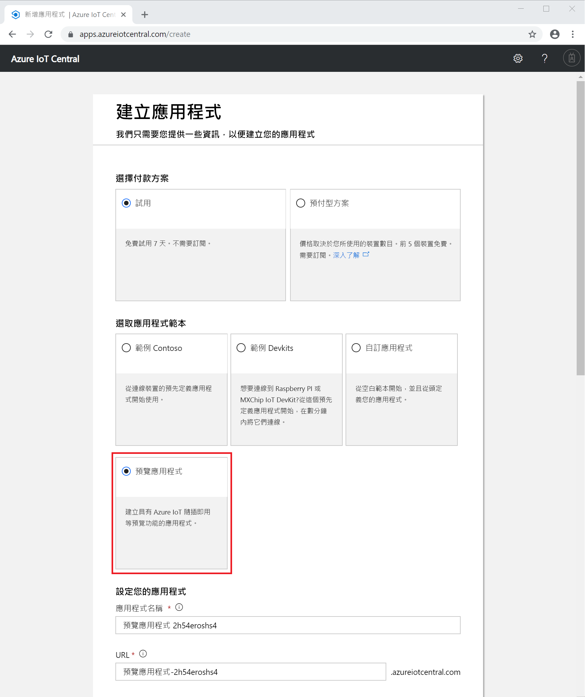

# 建立 Azure IoT Central 應用程式 (預覽功能)

[!INCLUDE [iot-central-pnp-original](../../includes/iot-central-pnp-original-note.md)]

本快速入門說明如何建立使用預覽功能 (例如 IoT 隨插即用) 的 Azure IoT Central 應用程式。

> [!WARNING]
> Azure IoT Central 中的 IoT 隨插即用功能目前為公開預覽狀態。 請勿將已啟用 IoT 隨插即用的 IoT Central 應用程式用於生產工作負載。 針對生產環境，請使用從目前正式推出的應用程式範本建立的 IoT Central 應用程式。

## 建立應用程式

瀏覽至 [Azure IoT Central 的應用程式管理員](https://aka.ms/iotcentral)網站。 然後，使用 Microsoft 的個人、公司或學校帳戶登入。

若要開始建立新的 Azure IoT Central 應用程式，請選取 [新增應用程式]  。 此連結會將您導向至 [建立應用程式]  頁面。

若要建立包含預覽功能 (例如 IoT 隨插即用) 的新 Azure IoT Central 應用程式：

1. 選擇付款方案：
   - **試用版**應用程式可以免費試用七天。 此類應用程式可在到期前隨時轉換成**隨用隨付**。 如果您建立**試用版**應用程式，則必須輸入連絡資訊，並選擇是否要收到來自 Microsoft 的資訊和提示。
   - **隨用隨付**應用程式會依據裝置收費，前五個裝置免費。 如果您建立**隨用隨付**應用程式，則必須選取*目錄*、*Azure 訂用帳戶*和*區域*：
        - *目錄*是用來建立應用程式的 Azure Active Directory (AD)。 其中包含使用者識別、認證和其他組織資訊。 如果您沒有 Azure AD，系統會在您建立 Azure 訂用帳戶時為您建立。
        - *Azure 訂用帳戶*可讓您建立 Azure 服務執行個體。 IoT Central 會在您的訂用帳戶中佈建資源。 如果您沒有 Azure 訂用帳戶，您可以在 [Azure 註冊頁面](https://aka.ms/createazuresubscription)上建立一個。 建立 Azure 訂用帳戶之後，請瀏覽回到 [建立應用程式]  頁面。 新的訂用帳戶會出現在 [Azure 訂用帳戶]  下拉式清單中。
        - *區域*是您要在其中建立應用程式的實體位置。 一般而言，您應該選擇實際上最接近您裝置的區域，以取得最佳效能。 在公開預覽期間，**預覽應用程式**的唯一可用區域為**歐洲北部**和**美國中部**。 選擇區域後，即無法將應用程式移到不同的區域。

        在 [Azure IoT Central 定價頁面](https://azure.microsoft.com/pricing/details/iot-central/)上深入了解定價。

1. 選取**預覽版應用程式**範本。 應用程式範本可包含預先定義的項目 (例如裝置範本和儀表板)，協助您開始使用。

1. Azure IoT Central 會根據您所選取的應用程式範本自動建議應用程式名稱。 您可以接受此名稱，或自行輸入易記的應用程式名稱，例如 **Contoso IoT**。 Azure IoT Central 也會根據應用程式名稱，為您產生唯一的 URL 前置詞。 您可以依個人需求，將其變更為更好記的 URL 前置詞。

1. 填入您先前在步驟 1 中選取的付款方案所需的其他資訊。

1. 選取頁面底部的 [建立]  。

## 後續步驟

在本快速入門中，您已建立使用預覽功能的 IoT Central 應用程式。 以下是建議的後續步驟：

> [!div class="nextstepaction"]
> [在 Azure IoT Central 應用程式中定義新的裝置類型](./tutorial-define-device-type-pnp.md?toc=/azure/iot-central-pnp/toc.json&bc=/azure/iot-central-pnp/breadcrumb/toc.json)
