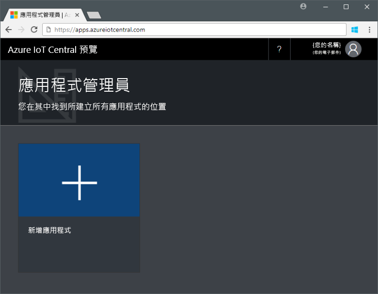
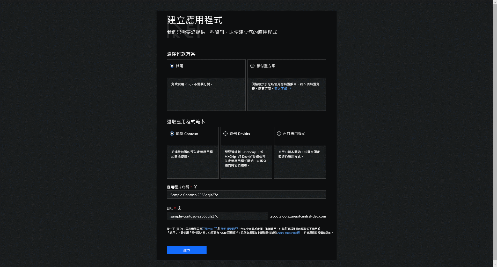

# 建立 Azure IoT Central 應用程式

「建置者」可使用 Azure IoT Central UI 來定義 Microsoft Azure IoT Central 應用程式。 本快速入門示範如何：

- 建立包含範例_裝置範本_和模擬_裝置_的 Azure IoT Central 應用程式。
- 在應用程式中檢視**冷飲自動販賣機**裝置範本的功能。
- 檢視從模擬的**冰箱**裝置產生的遙測和分析資料。

在本快速入門中，您會檢視裝置範本中的模擬**冰箱**裝置。 模擬裝置：

* 將遙測資料 (例如溫度和壓力) 傳送至您的應用程式。
* 將裝置屬性值 (例如動態警示) 回報給您的應用程式。
* 具有可在應用程式中設定的裝置設定，例如風扇速度。

當您從 Azure IoT Central 應用程式中的裝置範本建立模擬裝置時，模擬裝置可讓您先測試應用程式再連接實際裝置。

## 建立應用程式

若要完成本快速入門，您必須從**範例 Contoso** 應用程式範本建立 Azure IoT Central 應用程式。

瀏覽至 Azure IoT Central 的[應用程式管理員](https://aka.ms/iotcentral)頁面。 然後，輸入您用來存取 Azure 訂用帳戶的電子郵件地址和密碼：

若要開始建立新的 Azure IoT Central 應用程式，請選擇 [新增應用程式]：

若要建立新的 Azure IoT Central 應用程式：

1. 選擇 [免費試用版應用程式] 付款方案。
1. 選擇易記的應用程式名稱，例如 **Contoso IoT**。 Azure IoT Central 會為您產生唯一的 URL 前置詞。 您可以將其變更為更好記的 URL 前置詞。
1. 選擇**範例 Contoso** 應用程式範本。
1. 然後選擇 [建立]。

## 後續步驟

在本快速入門中，您已建立預先填入的 Azure IoT Central 應用程式，其中包含**冷飲自動販賣基**裝置範本和模擬裝置。 請參閱[在應用程式中定義新的裝置範本](tutorial-define-device-type.md)，以建置者的立場深入了解如何定義您自己的裝置範本。
