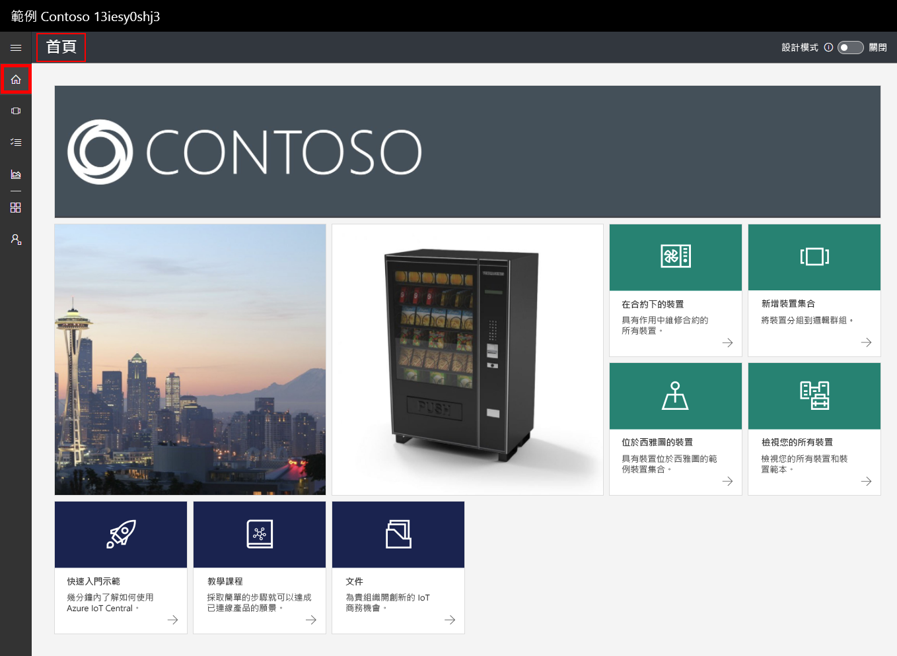
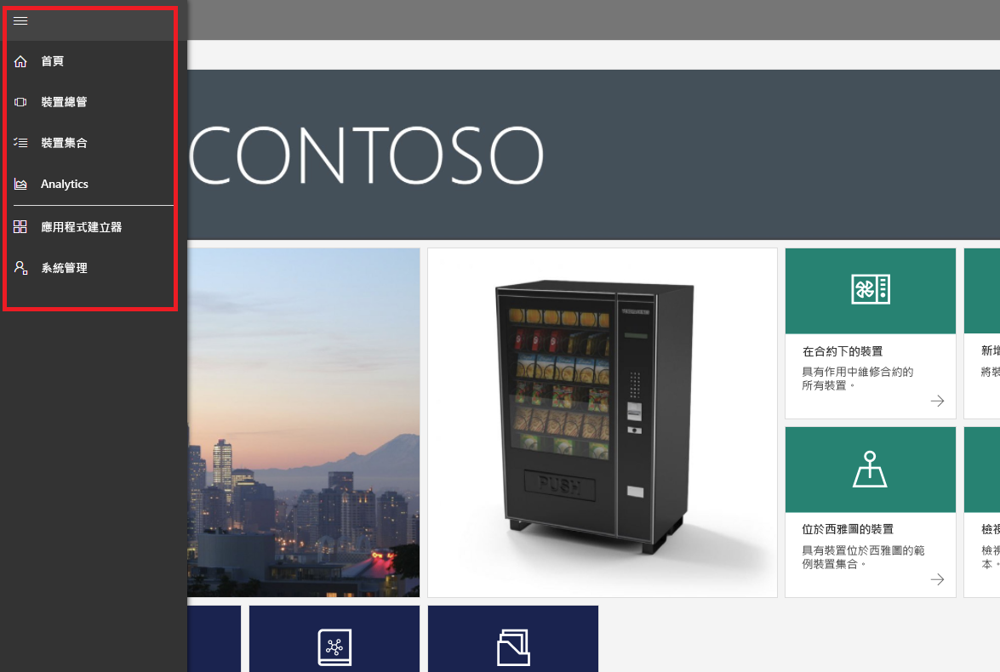
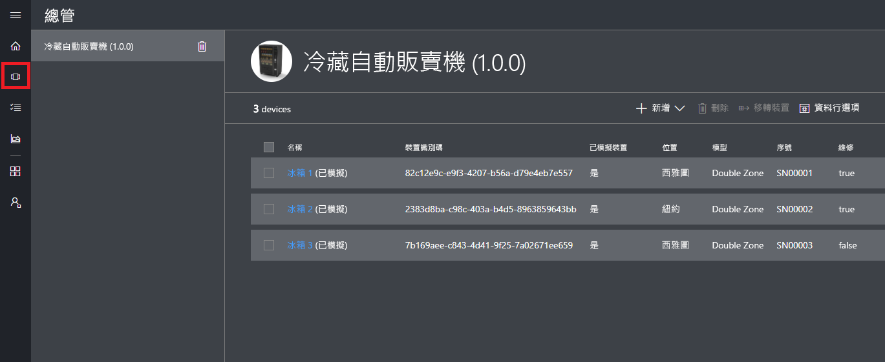
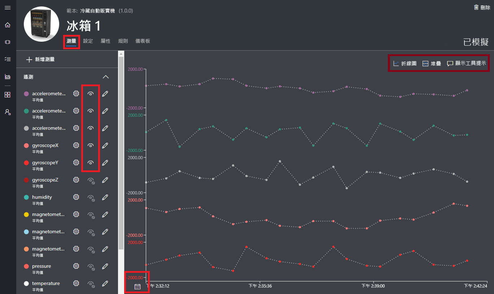
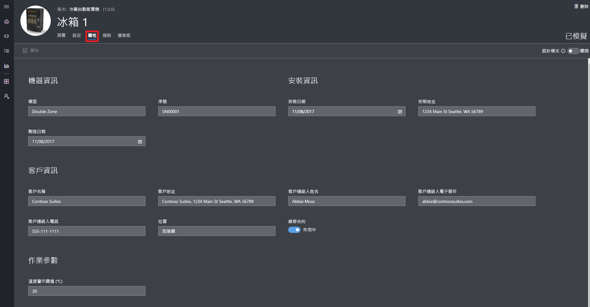
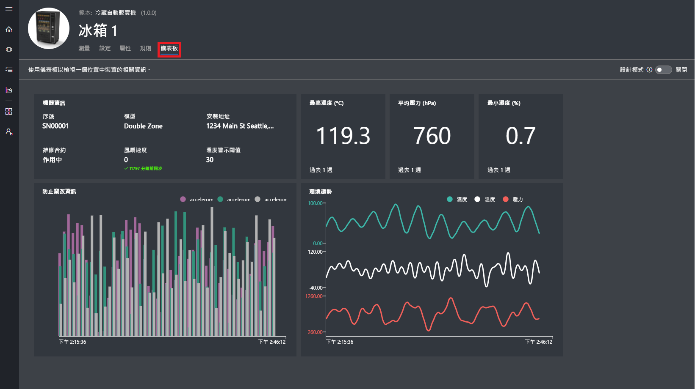
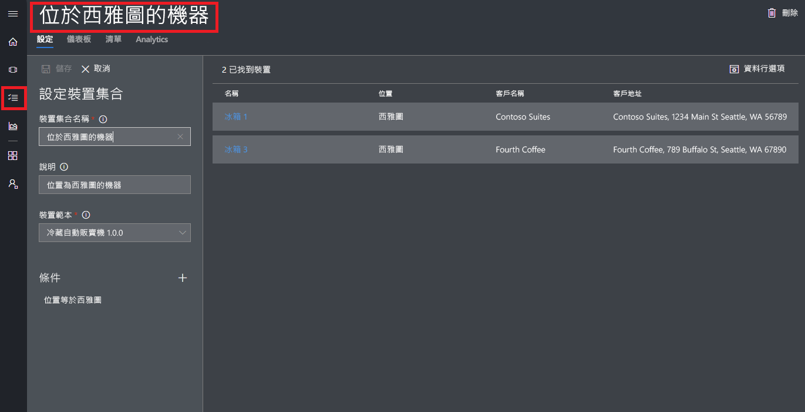
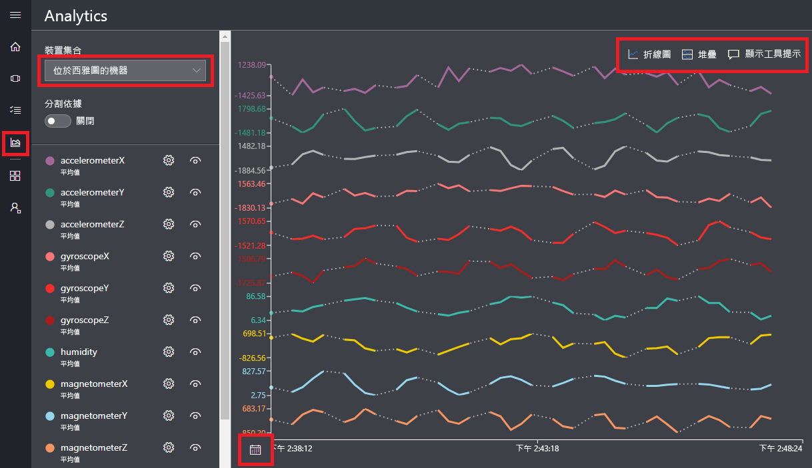

# 建立 Azure IoT Central 應用程式

「建置者」可使用 Azure IoT Central UI 來定義 Microsoft Azure IoT Central 應用程式。 本快速入門示範如何：

- 建立包含範例_裝置範本_和模擬_裝置_的 Azure IoT Central 應用程式。
- 在應用程式中檢視**冷飲自動販賣機**裝置範本的功能。
- 檢視從模擬的**冰箱**裝置產生的遙測和分析資料。

在本快速入門中，您會檢視裝置範本中的模擬**冰箱**裝置。 模擬裝置：

* 將遙測資料 (例如溫度和壓力) 傳送至您的應用程式。
* 將裝置屬性值 (例如動態警示) 回報給您的應用程式。
* 具有可在應用程式中設定的裝置設定，例如風扇速度。

當您從 Azure IoT Central 應用程式中的裝置範本建立模擬裝置時，模擬裝置可讓您先測試應用程式再連接實際裝置。

## 建立應用程式

若要完成本快速入門，您必須從**範例 Contoso** 應用程式範本建立 Azure IoT Central 應用程式。

瀏覽至 Azure IoT Central 的[應用程式管理員](https://aka.ms/iotcentral)頁面。 然後，輸入您用來存取 Azure 訂用帳戶的電子郵件地址和密碼：

若要開始建立新的 Azure IoT Central 應用程式，請選擇 [新增應用程式]：

若要建立新的 Azure IoT Central 應用程式：

1. 選擇 [免費試用版應用程式] 付款方案。
1. 選擇易記的應用程式名稱，例如 **Contoso IoT**。 Azure IoT Central 會為您產生唯一的 URL 前置詞。 您可以將其變更為更好記的 URL 前置詞。
1. 選擇**範例 Contoso** 應用程式範本。
1. 然後選擇 [建立]。

## 瀏覽至應用程式

當您的應用程式就緒時，即會顯示應用程式的**首頁**。 您可以切換右上方的「設計模式」，以編輯首頁。 應用程式 URL 是您在上一個步驟中指定的 URL：

使用_左側導覽功能表_，可存取新的 Azure IoT Central 應用程式的不同區域：

若要檢視應用程式中的裝置範本和裝置，請選擇左側導覽功能表上的 [裝置總管]。 範例應用程式中包含**冷飲自動販賣機**裝置範本。 已有三個從這個範本建立的模擬裝置：

## 檢視裝置範本和裝置

請使用下列步驟，檢視從**冷飲自動販賣機**裝置範本建立的冰箱裝置。 裝置範本會定義：

* 從裝置傳送的_測量_，例如溫度遙測資料。
* 可讓您控制裝置的_設定_，例如風扇速度。
* 儲存裝置相關資訊的_屬性_，例如序號。
* 可讓您根據裝置的行為自動執行動作的[規則](howto-create-telemetry-rules.md)。
* 顯示裝置相關資訊的可自訂_儀表板_。

您可以從裝置範本建立模擬和實際裝置。

### 測量

顯示 [冰箱 1] 裝置的 [測量] 頁面。 您可以檢視從模擬裝置傳送的測量清單。 頁面中也會顯示可見測量的可自訂圖表：

您可以切換個別項目的可見性，並自訂圖表。 目前的圖表顯示來自模擬裝置的遙測資料。 如果您有適當權限，則可以將新的測量新增至裝置範本。

> [!NOTE]
> 您可能需要稍加等待，模擬的資料才會出現在圖表上。

### 設定

選擇 [設定]。 在 [設定] 頁面上，您可以控制裝置。 例如，您可以更新冰箱的風扇速度：

裝置確認變更時，會出現顯示為**同步**的設定。

### properties

選擇 [屬性]。 在 [屬性] 頁面上，您可以：

* 維護裝置的相關資訊，例如客戶名稱。
* 檢視裝置回報的屬性值，例如動態警示。

### 儀表板

選擇 [儀表板]。 儀表板是裝置相關資訊的可自訂檢視，例如測量、屬性和 KPI：

## 檢視分析

上一節已說明如何檢視個別裝置的相關資訊。 您可以使用[裝置集合](howto-use-device-sets.md)和[分析](howto-create-analytics.md)，檢視來自多個裝置的彙總資訊。

裝置集合會使用的查詢動態選取一組符合準則的裝置。 例如，**位於西雅圖的機器**裝置集合會選取位置為西雅圖的冰箱裝置。 若要檢視**位於西雅圖的機器**裝置集合，請選擇左側導覽功能表中的 [裝置集合]，然後選擇 [位於西雅圖的機器]：

您可以在 [分析] 頁面上，檢視裝置集合中各項裝置的分析資料：

## 後續步驟

在本快速入門中，您已建立預先填入的 Azure IoT Central 應用程式，其中包含**冷飲自動販賣基**裝置範本和模擬裝置。 請參閱[在應用程式中定義新的裝置範本](tutorial-define-device-type.md)，以建置者的立場深入了解如何定義您自己的裝置範本。
