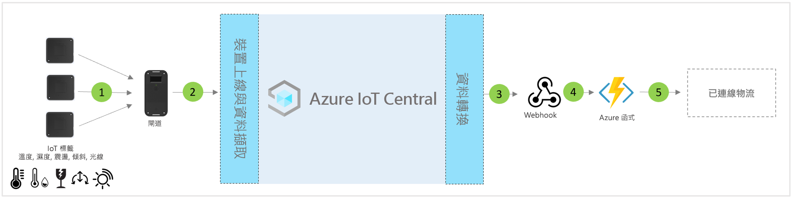

# IoT Central 聯網物流應用程式範本的架構

[!INCLUDE [iot-central-pnp-original](../../../includes/iot-central-pnp-original-note.md)]

夥伴與客戶可以利用應用程式範本及下列指引，來開發端對端**聯網物流解決方案**。

> [!div class="mx-imgBorder"]
> 

1. 將遙測資料傳送至閘道裝置的一組 IoT 標籤
2. 將遙測資料和彙總的見解傳送至 IoT Central 的閘道裝置
3. 資料會路由傳送至所需的 Azure 服務以進行操作
4. 您可以利用 Azure 服務 (例如 ASA 或 Azure Functions) 來將資料流重新格式化，並將其傳送至所需的儲存體帳戶 
5. 終端使用者的商務應用程式可以增強各種商務工作流程

## 詳細資料
下一節將概述從 IoT 標籤與閘道進行概念性架構遙測擷取的每個部分

## IoT 標籤
IoT 標籤提供實體、周遭及環境感應器功能，例如溫度、濕度、震動、傾斜及光線。 IoT 標籤通常會透過 Zigbee (802.15.4) 連線到閘道裝置。 標籤是成本低廉的感應器；因此，可以在一般物流旅程結束時捨棄它們，以避免發生反向物流所帶來的挑戰。

## 閘道器
閘道也可搭配其周遭環境感應功能用來作為 IoT 標籤。 閘道可透過行動電話、Wi-Fi 通道來啟用上游 Azure IoT 雲端連線 (MQTT)。  藍芽、NFC 及 802.15.4 無線感應器網路 (WSN) 模式均可用於與 IoT 標籤進行下游通訊。 閘道提供端對端安全雲端連線、IoT 標籤配對、感應器資料彙總、資料保留，以及設定警示閾值的能力。

## 透過 IoT Central 進行裝置管理 
Azure IoT Central 是一個解決方案開發平台，能簡化 IoT 裝置的連線能力、設定和管理。 此平台可大幅降低 IoT 裝置管理、作業及相關開發的負擔和成本。 客戶與夥伴可以建置端對端企業解決方案，以在物流中達成數位意見反應迴圈。

## 透過資料輸出的商業見解與動作 
IoT Central 平台會透過連續資料匯出 (CDE) 和 API 來提供豐富的擴充性選項。 以遙測資料處理或原始遙測為基礎的商業見解，通常會匯出到慣用的企業營運應用程式。 這可透過 Webhook、服務匯流排、事件中樞或 Blob 儲存體來達成，以建置、定型和部署機器學習模型，並取得進一步的豐富見解。

## 後續步驟
* 了解如何部署[聯網物流解決方案範本](./tutorial-iot-central-connected-logistics-pnp.md)
* 深入了解 [IoT Central 零售範本](./overview-iot-central-retail-pnp.md)
* 若要深入了解 IoT Central，請參閱 [IoT Central 概觀](../core/overview-iot-central-pnp.md)
