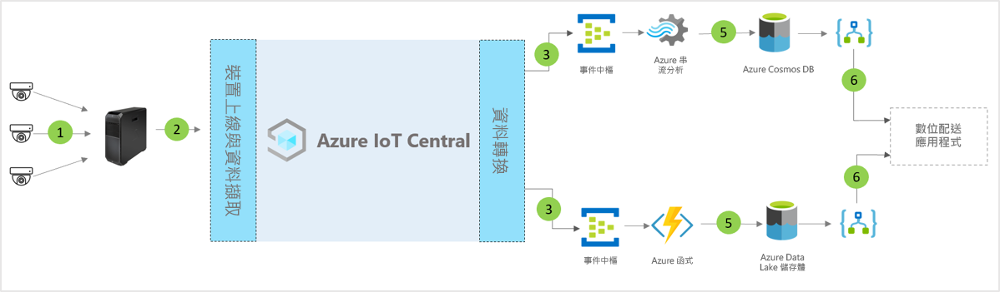

# IoT Central 數位配送中心應用程式範本的架構

[!INCLUDE [iot-central-pnp-original](../../../includes/iot-central-pnp-original-note.md)]

夥伴與客戶可以利用應用程式範本及下列指引，來開發端對端**數位配送中心**解決方案。

> [!div class="mx-imgBorder"]
> 

1. 將遙測資料傳送至閘道裝置的一組 IoT 感應器
2. 將遙測資料和彙總的見解傳送至 IoT Central 的閘道裝置
3. 資料會路由傳送至所需的 Azure 服務以進行操作
4. 您可以利用 Azure 服務 (例如 ASA 或 Azure Functions) 來將資料流重新格式化，並將其傳送至所需的儲存體帳戶 
5. 已處理的資料會以進行近乎即時的動作儲存於經常性儲存體，或儲存於冷儲存體以根據 ML 或批次分析來增強其他見解。 
6. Logic Apps 可在終端使用者的商務應用程式中，用來增強各種商務工作流程

## 詳細資料
下一節將概述概念性架構的每個部分

## 攝影機 
攝影機是這個企業級數位連線生態系統中的主要感應器。 隨著機器學習和人工智慧的進步，可讓影片轉換為結構化資料，並在傳送到雲端之前在邊緣進行處理。 我們可以使用 IP 攝影機來擷取影像、在攝影機上壓縮它們，然後透過邊緣計算將壓縮的資料傳送到影片分析管線，或使用 GigE 攝影機來擷取感應器上的影像，接著將這些影像直接傳送到 Azure IoT Edge，然後在影片分析管線中進行處理之前先加以壓縮。 

## Azure IoT Edge 閘道
「攝影機即感應器」和邊緣工作負載會透過 Azure IoT Edge 在本機管理，而攝影機串流會透過分析管線來處理。 Azure IoT Edge 上的影片分析處理管線帶來許多優點，包括減少回應時間、低頻寬耗用量，從而降低快速資料處理的延遲。 只有最重要的中繼資料、見解或動作會傳送到雲端，以進行進一步的動作或調查。 

## 透過 IoT Central 進行裝置管理 
Azure IoT Central 是一個解決方案開發平台，能簡化 IoT 裝置與 Azure IoT Edge 閘道的連線能力、設定和管理。 此平台可大幅降低 IoT 裝置管理、作業及相關開發的負擔和成本。 客戶與夥伴可以建置端對端企業解決方案，以在配送中心達成數位意見反應迴圈。

## 透過資料輸出的商業見解與動作 
IoT Central 平台透過連續資料匯出 (CDE) 和 API 來提供豐富的擴充性選項。 以遙測資料處理或原始遙測為基礎的商業見解，通常會匯出到慣用的企業營運應用程式。 這可透過 Webhook、服務匯流排、事件中樞或 Blob 儲存體來達成，以建置、定型和部署機器學習模型，並取得進一步的豐富見解。

## 後續步驟
* 了解如何部署[數位配送中心範本](./tutorial-iot-central-digital-distribution-center-pnp.md)
* 深入了解 [IoT Central 零售範本](./overview-iot-central-retail-pnp.md)
* 若要深入了解 IoT Central，請參閱 [IoT Central 概觀](../preview/overview-iot-central.md)
