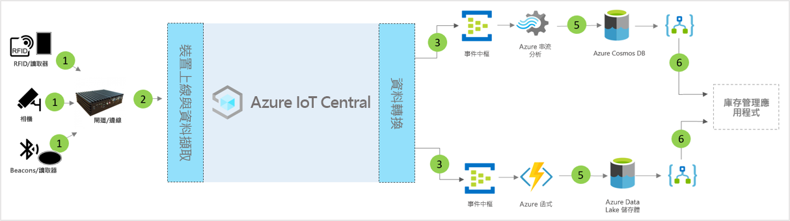

# IoT Central 智慧庫存管理應用程式範本的架構

夥伴與客戶可以使用應用程式範本及下列指引，來開發端對端**智慧庫存管理**解決方案。

> [!div class="mx-imgBorder"]
> 

1. 將遙測資料傳送至閘道裝置的一組 IoT 感應器
2. 將遙測資料和彙總的見解傳送至 IoT Central 的閘道裝置
3. 資料會路由傳送至所需的 Azure 服務以進行操作
4. 您可以利用 Azure 服務 (例如 ASA 或 Azure Functions) 來將資料流重新格式化，並將其傳送至所需的儲存體帳戶 
5. 已處理的資料會以進行近乎即時的動作儲存於經常性儲存體，或儲存於冷儲存體以根據 ML 或批次分析來增強其他見解。 
6. Logic Apps 可在終端使用者的商務應用程式中，用來增強各種商務工作流程

## 詳細資料
下一節將概述從無線頻率識別 (RFID)、藍牙低功耗 (BLE) 標籤中進行概念性架構遙測擷取的每個部分

## RFID 標籤
RFID 標籤會透過無線電波傳輸項目相關資料。 除非已指定，否則 RFID 標籤通常不含電池。 標籤會接收來自讀取器所產生之無線電波的能源，並將信號傳輸回 RFID 讀取器。

## BLE 標籤
能源指標會以固定間隔廣播資料封包。 BLE 讀取器或安裝於智慧型手機的服務會偵測到指標資料，然後將其傳輸到雲端。

## RFID 和 BLE 讀取器
RFID 讀取器會將無線電波轉換為更容易使用的資料形式。 從標籤收集的資訊之後會儲存於本地邊緣伺服器，或透過 JSON-RPC 2.0 over MQTT 傳送至雲端。
BLE 讀取器也稱為存取點 (AP)，類似於 RFID 讀取器。 這些可用來偵測附近的藍牙信號，並透過 JSON-RPC 2.0 over MQTT 將其訊息轉送至本地 Azure IoT Edge 或雲端。
許多讀取器都能讀取 RFID 和指標信號，以及提供與溫度、濕度、加速計 & 迴轉器相關的其他感應器功能。

## Azure IoT Edge 閘道
Azure IoT Edge 伺服器提供一個位置，在將資料傳送到雲端之前，先在本機預先處理該資料。 我們也可以透過標準容器來部署雲端工作負載人工智慧、Azure 和協力廠商服務、商務邏輯。

## 透過 IoT Central 進行裝置管理 
Azure IoT Central 是一個解決方案開發平台，能簡化 IoT 裝置的連線能力、設定和管理。 此平台可大幅降低 IoT 裝置管理、作業及相關開發的負擔和成本。 客戶與夥伴可以建置端對端企業解決方案，以在庫存管理中達成數位意見反應迴圈。

## 透過資料輸出的商業見解與動作 
IoT Central 平台透過連續資料匯出 (CDE) 和 API 來提供豐富的擴充性選項。 以遙測資料處理或原始遙測為基礎的商業見解，通常會匯出到慣用的企業營運應用程式。 這可透過 Webhook、服務匯流排、事件中樞或 Blob 儲存體來達成，以建置、定型和部署機器學習模型，並取得進一步的豐富見解。

## 後續步驟
* 了解如何部署[智慧庫存管理範本](./tutorial-iot-central-smart-inventory-management-pnp.md)
* 深入了解 [IoT Central 零售範本](./overview-iot-central-retail-pnp.md)
* 若要深入了解 IoT Central，請參閱 [IoT Central 概觀](../preview/overview-iot-central.md)
