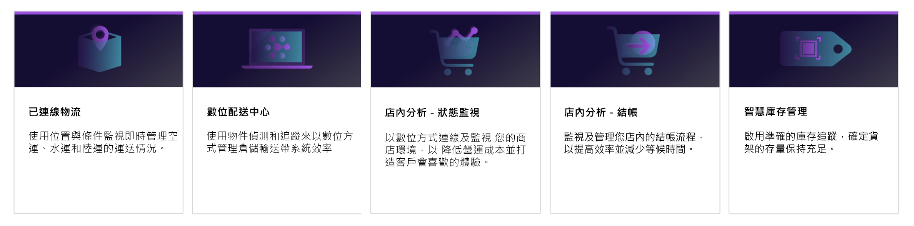
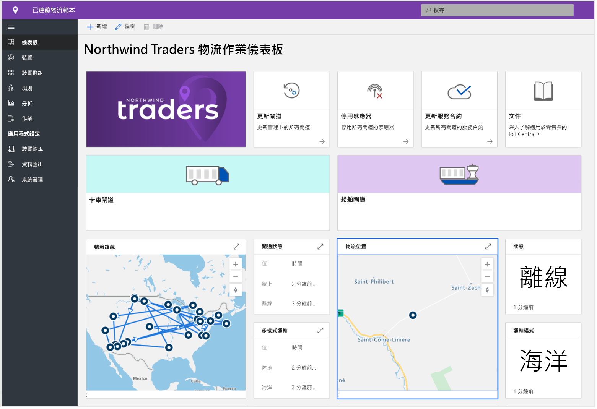
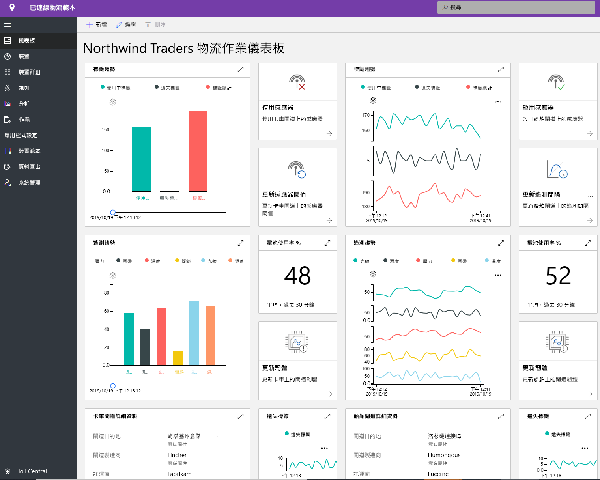
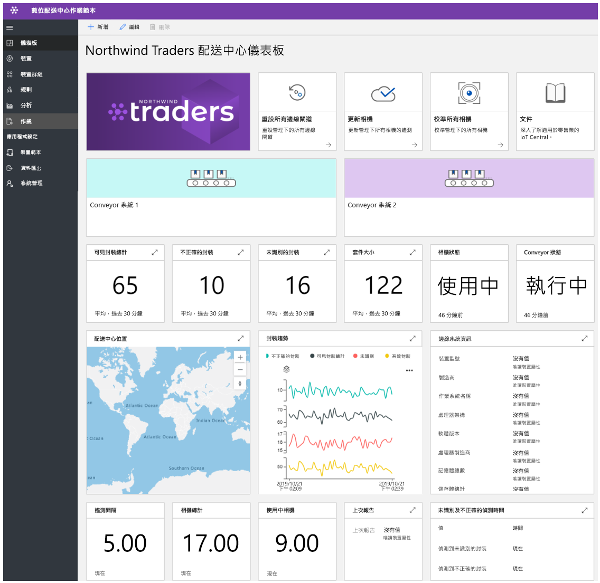
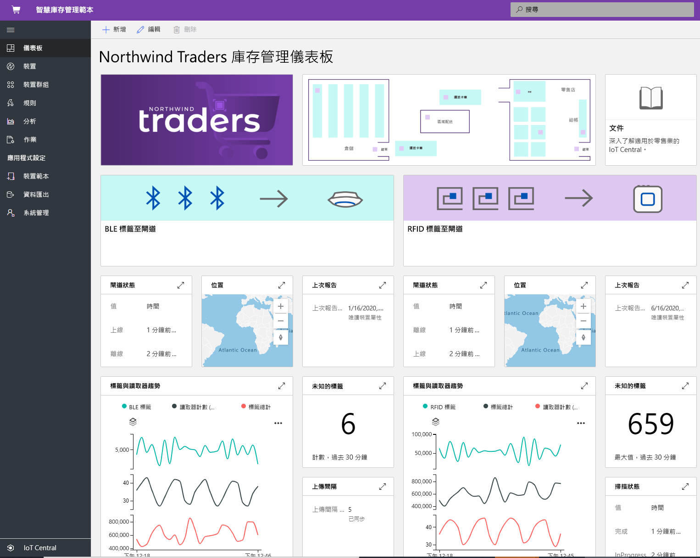

# 使用 Azure IoT Central 建置零售解決方案

[!INCLUDE [iot-central-pnp-original](../../../includes/iot-central-pnp-original-note.md)]

Azure IoT Central 是適用解決方案建置者的物聯網 (IoT) 應用程式平台，可簡化建置和管理擴充型應用程式的挑戰。 本文將重點介紹 IoT Central 中的幾個零售特定應用程式範本。 解決方案建置者可以利用已發佈的範本建立 IoT 解決方案，將供應鏈最佳化、改善客戶的店內體驗，並且更有效地追蹤庫存。

> [!div class="mx-imgBorder"]
> 

## 什麼是連線物流解決方案？
預計到 2020 年，全球物流支出將達到 10.6 兆美元，這是各產業中最高的 GDP。 貨物運輸佔了物流總費用的一大部分 (70%)。 運輸服務供應商面臨龐大的競爭壓力和侷限。 3PL 提供者正在處理時間範圍逐漸縮短且補償成本持續提高的問題。 地緣政治、極端氣候事件和犯罪帶來的風險導致物流更處於不利的狀態。 

我們可以藉由 IoT 感應器，透過 GPS 進行多種模式的轉換 (例如，空氣、水、地面) 收集和監視環境狀態，例如溫度、濕度、傾斜度、震動、光線和出貨的地點。 從感應器、裝置、天氣和事件收集而來的資料可以與雲端式商業智慧系統整合。 連線物流解決方案的優勢在於，
* 能夠即時查詢和追蹤的貨物轉運 
* 能夠即時監視環境狀況和冷鏈的運輸完整性
* 防範竊盜、遺失或運輸損壞
* 地理柵欄、最佳化路線、車隊管理。 車輛分析
* 預測出發和抵達時間 

### 全新體驗
合作夥伴可以使用範本開發端對端的連線物流解決方案並獲得上述優勢。 這個發佈的範本著重於 IoT Central 中的裝置連線、設定和管理。 

> [!div class="mx-imgBorder"]
> 

> [!div class="mx-imgBorder"]
> 

請注意，上述儀表板是範例操作方式，您可以完全自訂此應用程式來符合您的所需情況。

開始使用[端對端教學課程](./tutorial-iot-central-connected-logistics-pnp.md)，這可逐步引導您使用其中一個連線物流解決方案範本建立解決方案。

## 什麼是數位配送中心解決方案？
隨著愈來愈多的製造商和零售商在全球開拓業務，製造商和零售商的供應鏈已經向外發展到比以往更複雜的程度。 配送中心逐漸成為主要挑戰。 配送中心/倉庫承受著來自電子商務的壓力。 如今，消費者希望有大量的產品可供選擇，而且這些商品能夠在購買後的一兩天內送達。 配送中心必須因應這些趨勢，同時克服現有的效率不彰狀況。 

配送中心目前過度依賴人工，其揀貨和包裝佔成本的 55-65%。 雖然人工造成配送中心的效率降低，不過人力需求的快速變化 (假日的人力需求增加 10 倍) 導致出貨量更不容易獲得滿足。 如此的季節性波動會導致人員變動率升高，而且也增加錯誤發生以及高成本的重工需求可能。
IoT 攝影機解決方案可以啟用數位回饋迴圈，藉此帶來轉型優勢。 大量資料從整個配送中心湧入，提供了確實可行的見解，藉以產生更有益的資料。

優勢在於， 
* 攝影機能監視貨物透過輸送帶系統的送達和移動
* 找出有瑕疵的貨物並送修
* 有效追蹤訂單
* 降低成本、提高生產力，並將使用率最大化

### 全新體驗
合作夥伴可以使用此應用程式範本建立數位配送中心，獲得確實可行的見解和上述優勢。 這個發佈的範本著重於 IoT Central 中的攝影機和邊緣裝置連線、設定和管理。 

> [!div class="mx-imgBorder"]
> 

請注意，上述儀表板是範例操作方式，您可以完全自訂此應用程式來符合您的所需情況。

開始使用[端對端教學課程](./tutorial-iot-central-digital-distribution-center-pnp.md)，這可逐步引導您使用其中一個數位配送中心範本建立解決方案。

## 什麼是店內分析條件監視？
在現今的競爭環境中，零售商正在尋找新的方式為顧客提供獨特或特殊的商品，以提升實體商店吸引的人潮。 許多零售商體認到運用商店內部的環境條件，與競爭對手加以區隔的重要性。 零售商希望確保商店內部始終保持舒適，以便為顧客提供滿意的體驗。  

IoT Central 的店內分析條件監視應用程式範本，為解決方案建置者提供了一個可用來建立端對端解決方案的畫布。 應用程式範本可供零售商使用各種感應器裝置以數位方式連接並監視零售商店環境。 這些感應器裝置能夠擷取有意義的訊號，將這些訊號轉換為商業性的見解，以便零售商降低營運成本並創造顧客滿意的體驗。

應用程式範本可用於：

*  將各種 IoT 感應器緊密連接到 IoT Central 應用程式執行個體。
*  監視和管理環境中的感應器網路和閘道裝置兩者的健康情況。
*  根據商店內的環境狀態自訂觸發適當警報的規則。
*  將商店內部環境狀態轉換為零售商店團隊可以運用的見解。
* 將見解彙總並匯出到現有或全新的商務應用程式，加強零售人員的作業能力。

### 全新體驗
應用程式範本提供一組裝置範本和全新的操作人員體驗， 可運用一組模擬裝置填入儀表板元素。 使用[店內分析條件監視](https://aka.ms/conditiontemplate)應用程式範本部署 IoT Central 應用程式後，即可進入預設的應用程式儀表板，如下所示。 

> [!div class="mx-imgBorder"]
> 

請注意，上述儀表板是範例操作方式，您可以完全自訂此應用程式來符合您的所需情況。 

開始使用[端對端教學課程](./tutorial-in-store-analytics-create-app-pnp.md)，這可逐步引導您使用其中一個店內分析條件監視範本建立解決方案。

## 什麼是店內分析結帳？
在競爭日益激烈的環境中，現代零售商持續面臨愈來愈大的壓力，需要提供超越客戶期望的店內體驗並吸引顧客再度光臨。 雖然有些零售商已開始部署技術來滿足這方面的需求，不過結帳體驗仍然並未獲得廣泛的關注。

IoT Central 的店內分析結帳應用程式範本可供解決方案建置者建立體驗，以便零售人員獲得對於商店結帳區域而言有意義的見解。 這運用一組模擬裝置確認零售商店的每個結帳通道呈現的佔用量狀態。 感應器可用來擷取每個結帳通道的人數和平均等待時間。

這個範本提供基準物聯網解決方案協助解決方案建置者加速推出上市計畫，以便能夠： 

* 將各種 IoT 感應器緊密連接到 IoT Central 應用程式執行個體。
* 監視和管理環境中的感應器網路和閘道裝置兩者的健康情況。
* 根據商店內的結帳狀態建立觸發適當警報的自訂規則。
* 將商店內部結帳狀態轉換為零售商店團隊可以運用的見解。
* 將見解彙總並匯出到現有或全新的商務應用程式，加強零售人員的作業能力。

### 全新體驗
應用程式範本提供一組裝置範本和全新的操作人員體驗， 可運用一組模擬裝置填入儀表板元素。 使用[店內分析結帳](https://aka.ms/checkouttemplate)應用程式範本部署 IoT Central 應用程式後，即可進入預設的應用程式儀表板，如下所示。 

> [!div class="mx-imgBorder"]
> 

請注意，上述儀表板是範例操作方式，您可以完全自訂此應用程式來符合您的所需情況。 

開始使用[端對端教學課程](./tutorial-in-store-analytics-create-app-pnp.md)，這可逐步引導您使用其中一個店內分析結帳範本建立解決方案。

## 什麼是智慧庫存管理解決方案？
「庫存」是指零售商的商品存貨。 每個零售商都需要庫存來因應供應和物流的前置時間。 庫存確實是每個零售商進行交易所需的最重要資源。 在現今的全通路世界中，庫存管理是確保正確產品在正確時間送達正確地點的關鍵要求。 過多或過少的庫存都可能不利於零售商的業務。 由於缺乏庫存管理功能，故導致零售商每年損失 8-10% 的收益。

透過無線頻率識別 (RFID)、指標和攝影機獲得的 IoT 資料，可為零售商爭取機會解決這項重大挑戰。 物聯網訊號固有的連線和即時分析已成為改變零售商庫存難題的解方。  從感應器、裝置、天氣和事件收集而來的資料可以與雲端式商業智慧系統整合。  
智慧庫存管理的優勢在於， 
* 防止組織缺貨，並確實達到所需的顧客服務層級。 
* 近乎即時深入分析和了解庫存精確度
* 決定滿足顧客訂單的正確庫存量

### 全新體驗
合作夥伴可以使用範本開發端對端的智慧庫存管理解決方案並獲得上述優勢。 這個發佈的範本著重於 IoT Central 中的 RFID 和藍牙低功耗 (BLE) 讀取器連線、設定和管理。 

> [!div class="mx-imgBorder"]
> 

請注意，上述儀表板是範例操作方式，您可以完全自訂此應用程式來符合您的所需情況。 

開始使用[端對端教學課程](./tutorial-iot-central-smart-inventory-management-pnp.md)，這可逐步引導您使用其中一個智慧庫存管理範本建立解決方案。

## 後續步驟
若要開始建立零售解決方案：
* 開始使用[端對端教學課程](./tutorial-in-store-analytics-create-app-pnp.md)，這可逐步引導您使用其中一個店內分析應用程式範本建立解決方案。
* 了解如何部署[連線物流解決方案範本](./tutorial-iot-central-connected-logistics-pnp.md)
* 了解如何部署[數位配送中心範本](./tutorial-iot-central-digital-distribution-center-pnp.md)
* 了解如何部署[智慧庫存管理範本](./tutorial-iot-central-smart-inventory-management-pnp.md)
* 若要深入了解 IoT Central，請參閱 [IoT Central 概觀](../core/overview-iot-central-pnp.md)
