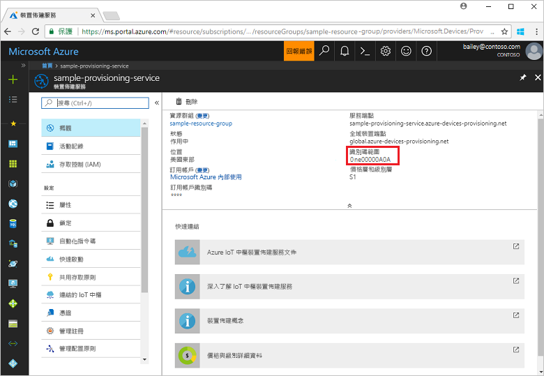
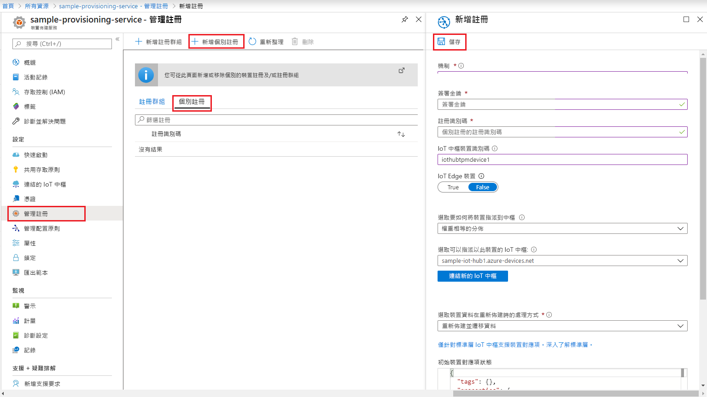
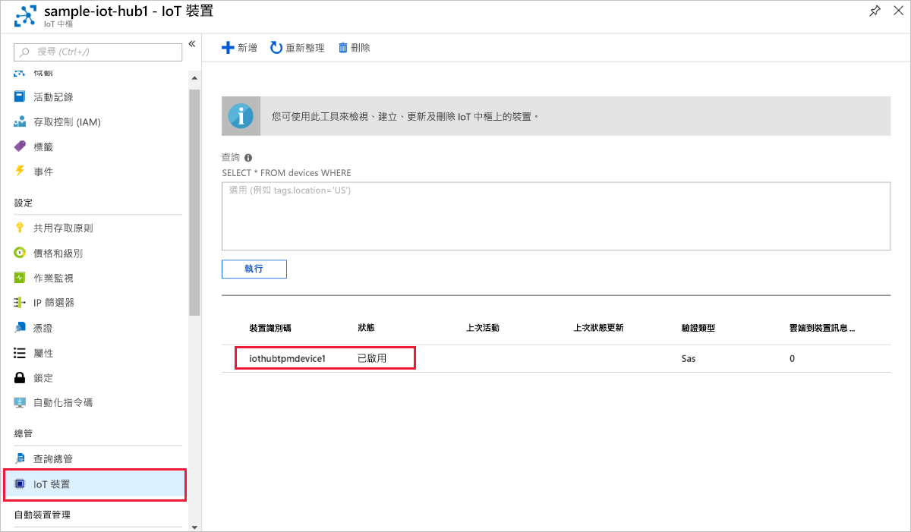

# <a name="create-and-provision-a-simulated-tpm-device-using-c-device-sdk-for-iot-hub-device-provisioning-service"></a>使用適用於 IoT 中樞裝置佈建服務的 C# 裝置 SDK 來建立及佈建模擬 TPM 裝置

[!INCLUDE [iot-dps-selector-quick-create-simulated-device-tpm](../../includes/iot-dps-selector-quick-create-simulated-device-tpm.md)]

這些步驟會示範如何使用[適用於 C# 的 Azure IoT 範例](https://github.com/Azure-Samples/azure-iot-samples-csharp)，在執行 Windows OS 的開發電腦上，模擬 TPM 裝置。 此範例也會使用裝置佈建服務，將模擬的裝置連線至 IoT 中樞。 

此程式碼範例會使用 Windows TPM 模擬器作為裝置的[硬體安全性模組 (HSM)](https://azure.microsoft.com/blog/azure-iot-supports-new-security-hardware-to-strengthen-iot-security/)。 

如果您不熟悉自動佈建程序，請務必也要檢閱[自動佈建概念](concepts-auto-provisioning.md)。 繼續之前，請務必完成[使用 Azure 入口網站設定 IoT 中樞裝置佈建服務](./quick-setup-auto-provision.md)中的步驟。 

Azure IoT 裝置佈建服務支援兩種類型的註冊：
- [註冊群組](concepts-service.md#enrollment-group)：用來註冊多個相關的裝置。
- [個別註冊](concepts-service.md#individual-enrollment)：用來註冊單一裝置。

本文將示範個別註冊。

[!INCLUDE [IoT Device Provisioning Service basic](../../includes/iot-dps-basic.md)]

<a id="setupdevbox"></a>
## <a name="prepare-the-development-environment"></a>準備開發環境 

1. 確定您已在電腦上安裝 [.NET Core 2.1 SDK 或更新版本](https://www.microsoft.com/net/download/windows)。 

1. 確定 `git` 已安裝在電腦上，並已新增至命令視窗可存取的環境變數。 請參閱[軟體自由保護協會的 Git 用戶端工具](https://git-scm.com/download/)以取得所要安裝的最新版 `git` 工具，其中包括 **Git Bash** (您可用來與本機 Git 存放庫互動的命令列應用程式)。 

1. 開啟命令提示字元或 Git Bash。 複製 C# GitHub 存放庫的 Azure IoT 範例：
    
    ```cmd
    git clone https://github.com/Azure-Samples/azure-iot-samples-csharp.git
    ```

## <a name="provision-the-simulated-device"></a>佈建模擬的裝置


1. 登入 Azure 入口網站。 按一下左側功能表上的 [所有資源] 按鈕，然後開啟您的裝置佈建服務。 在 [概觀] 刀鋒視窗中，記下 [識別碼範圍] 值。

     


2. 在命令提示字元中，將目錄變更到 TPM 裝置佈建範例的專案目錄。

    ```cmd
    cd .\azure-iot-samples-csharp\provisioning\Samples\device\TpmSample
    ```

2. 輸入下列命令以建置並執行 TPM 裝置佈建範例。 使用佈建服務的識別碼範圍取代 `<IDScope>` 值。 

    ```cmd
    dotnet run <IDScope>
    ```

    此命令會在個別的命令提示字元下啟動 TPM 晶片模擬器。  

1. 命令視窗會顯示裝置註冊所需的 [簽署金鑰]、[註冊識別碼] 和建議的 [裝置識別碼]。 記下這些值。 您將使用這些值，在裝置佈建服務執行個體中建立個別註冊。 
   > [!NOTE]
   > 請勿將包含命令輸出的視窗與包含 TPM 模擬器之輸出的視窗混淆。 您可能必須按一下命令視窗才能讓其出現在前景。

     

4. 在 Azure 入口網站的 [裝置佈建服務摘要] 刀鋒視窗上，選取 [管理註冊]。 選取 [個別註冊] 索引標籤，然後按一下頂端的 [新增個別註冊] 按鈕。 

5. 在 [新增註冊] 之下，輸入下列資訊：
   - 選取 [TPM] 作為身分識別證明「機制」。
   - 輸入先前所記下的 TPM 裝置 [註冊識別碼] 和 [簽署金鑰]。
   - (選擇性) 選取與佈建服務連結的 IoT 中樞。
   - 輸入唯一的裝置識別碼。 您可以輸入輸出範例中所建議的裝置識別碼，或輸入您自己的裝置識別碼。 如果您使用自己的裝置識別碼，則在替裝置命名時，請務必要避免使用敏感性資料。 
   - 選擇性地使用裝置所需的初始組態，更新**初始裝置對應項狀態**。
   - 完成後，按一下 [儲存] 按鈕。 

       

   註冊成功時，您裝置的「登錄識別碼」將會出現在「個別註冊」索引標籤之下的清單中。 

6. 在命令視窗 (其中顯示 [簽署金鑰]、[註冊識別碼] 和建議的 [裝置識別碼]) 中按 Enter 鍵，以註冊模擬裝置。 請注意，模擬裝置開機並連線至裝置佈建服務的訊息，以取得您的 IoT 中樞資訊。 

1. 確認裝置已佈建好。 模擬裝置成功佈建到與佈建服務連結的 IoT 中樞時，裝置識別碼會出現在中樞的 [IoT 裝置] 刀鋒視窗上。 

     

    如果您在裝置的註冊項目中變更了*初始裝置對應項狀態* (變更自預設值)，它即可從中樞提取所需的對應項狀態並採取適當的動作。 如需詳細資訊，請參閱[了解和使用 Azure IoT 中樞的裝置對應項](../iot-hub/iot-hub-devguide-device-twins.md)


## <a name="clean-up-resources"></a>清除資源

如果您打算繼續使用並探索裝置用戶端範例，請勿清除在此快速入門中建立的資源。 如果您不打算繼續，請使用下列步驟來刪除本快速入門建立的所有資源。

1. 在您的電腦上關閉裝置用戶端範例輸出視窗。
1. 在您的電腦上關閉 TPM 模擬器視窗。
1. 從 Azure 入口網站的左側功能表中，按一下 [所有資源]，然後選取您的裝置佈建服務。 在 [所有資源] 刀鋒視窗的頂端，按一下 [刪除]。  
1. 從 Azure 入口網站的左側功能表中，按一下 [所有資源]，然後選取您的 IoT 中樞。 在 [所有資源] 刀鋒視窗的頂端，按一下 [刪除]。  

## <a name="next-steps"></a>後續步驟

在本快速入門中，您已在電腦上建立的 TPM 模擬裝置，並使用 IoT 中樞裝置佈建服務將它佈建到 IoT 中樞。 若要了解如何以程式設計方式註冊您的 TPM 裝置，請繼續閱讀以程式設計方式註冊 TPM 裝置的快速入門。 

> [!div class="nextstepaction"]
> [Azure 快速入門 - 向 Azure IoT 中樞裝置佈建服務註冊 TPM 裝置](quick-enroll-device-tpm-csharp.md)
