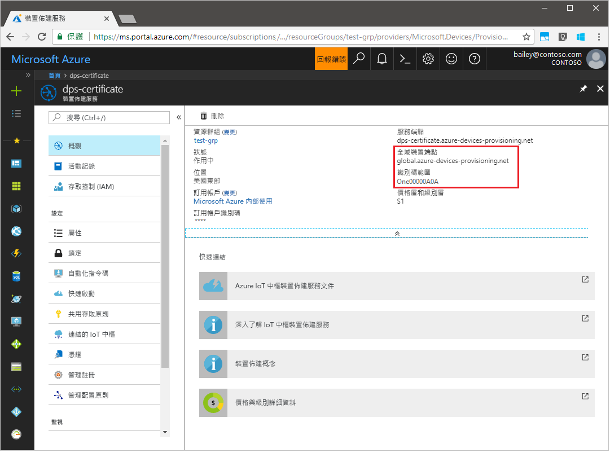
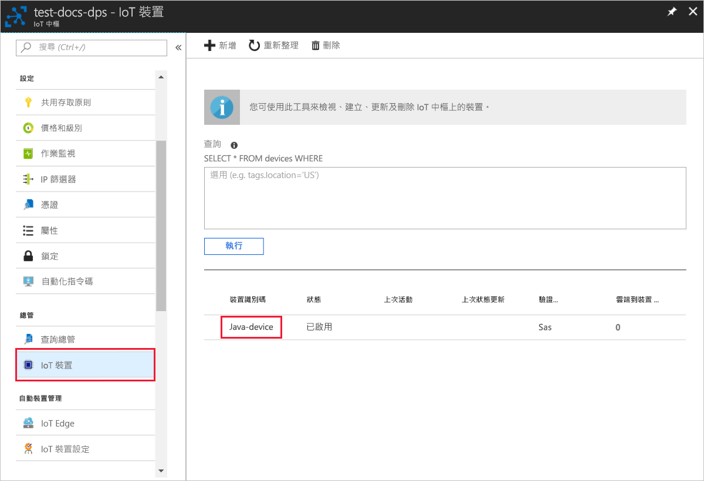

# <a name="create-and-provision-a-simulated-tpm-device-using-java-device-sdk-for-azure-iot-hub-device-provisioning-service"></a>使用適用於 Azure IoT 中樞裝置佈建服務的 Java 裝置 SDK 來建立及佈建模擬 TPM 裝置

[!INCLUDE [iot-dps-selector-quick-create-simulated-device-tpm](../../includes/iot-dps-selector-quick-create-simulated-device-tpm.md)]

這些步驟顯示如何在執行 Windows 作業系統的開發電腦上建立模擬裝置、執行 Windows TPM 模擬器作為裝置的[硬體安全性模組 (HSM)](https://azure.microsoft.com/blog/azure-iot-supports-new-security-hardware-to-strengthen-iot-security/)，並使用程式碼範例來連線模擬裝置與裝置佈建服務和 IoT 中樞。 

如果您不熟悉自動佈建程序，請務必也要檢閱[自動佈建概念](concepts-auto-provisioning.md)。 繼續之前，請務必完成[使用 Azure 入口網站設定 IoT 中樞裝置佈建服務](./quick-setup-auto-provision.md)中的步驟。 

[!INCLUDE [IoT Device Provisioning Service basic](../../includes/iot-dps-basic.md)]

## <a name="prepare-the-environment"></a>準備環境 

1. 請確定您已在電腦上安裝 [Java SE 開發套件 8](http://www.oracle.com/technetwork/java/javase/downloads/jdk8-downloads-2133151.html)。

1. 下載並安裝 [Maven](https://maven.apache.org/install.html)。

1. 確定 `git` 已安裝在電腦上，並已新增至命令視窗可存取的環境變數。 請參閱[軟體自由保護協會的 Git 用戶端工具](https://git-scm.com/download/)以取得所要安裝的最新版 `git` 工具，其中包括 **Git Bash** (您可用來與本機 Git 存放庫互動的命令列應用程式)。 

1. 開啟命令提示字元。 複製裝置模擬程式碼範例的 GitHub 存放庫。
    
    ```cmd/sh
    git clone https://github.com/Azure/azure-iot-sdk-java.git --recursive
    ```

1. 執行 [TPM](https://docs.microsoft.com/windows/device-security/tpm/trusted-platform-module-overview) 模擬器。 按一下 [允許存取] ，以允許變更 [Windows 防火牆] 設定。 它會透過連接埠 2321年和 2322 上的通訊端接聽。 請勿關閉此視窗；您必須讓此模擬器保持執行，直到此快速入門指南結束。 

    ```cmd/sh
    .\azure-iot-sdk-java\provisioning\provisioning-tools\tpm-simulator\Simulator.exe
    ```

    

1. 在個別的命令提示字元中，瀏覽至根資料夾並建置範例相依性。

    ```cmd/sh
    cd azure-iot-sdk-java
    mvn install -DskipTests=true
    ```

1. 瀏覽至範例資料夾。

    ```cmd/sh
    cd provisioning/provisioning-samples/provisioning-tpm-sample
    ```

1. 登入 Azure 入口網站，按一下左側功能表上的 [所有資源] 按鈕，然後開啟您的裝置佈建服務。 記下您的_識別碼範圍_和_佈建服務全域端點_。

    

1. 編輯 `src/main/java/samples/com/microsoft/azure/sdk/iot/ProvisioningTpmSample.java`，使其包含您前面記下的_識別碼範圍_和_佈建服務全域端點_。  

    ```java
    private static final String idScope = "[Your ID scope here]";
    private static final String globalEndpoint = "[Your Provisioning Service Global Endpoint here]";
    private static final ProvisioningDeviceClientTransportProtocol PROVISIONING_DEVICE_CLIENT_TRANSPORT_PROTOCOL = ProvisioningDeviceClientTransportProtocol.HTTPS;
    ```

1. 建置專案。 瀏覽至目標資料夾並執行建立的 jar 檔案。

    ```cmd/sh
    mvn clean install
    cd target
    java -jar ./provisioning-tpm-sample-{version}-with-deps.jar
    ```

1. 程式便會開始執行。 記下下一節會用到的_簽署金鑰_和_註冊識別碼_，然後讓程式保持執行。

    
    

## <a name="create-a-device-enrollment-entry"></a>建立裝置註冊項目

1. 登入 Azure 入口網站，按一下左側功能表上的 [所有資源] 按鈕，然後開啟您的裝置佈建服務。

1. 在裝置佈建服務摘要刀鋒視窗上，選取 [管理註冊]。 選取 [個別註冊] 索引標籤，然後按一下頂端的 [新增個別註冊] 按鈕。 

1. 在 [新增註冊] 之下，輸入下列資訊：
    - 選取 [TPM] 作為身分識別證明「機制」。
    - 輸入先前所記下的 TPM 裝置 [註冊識別碼] 和 [簽署金鑰]。 
    - 選取與您的佈建服務連結的 IoT 中樞。
    - 輸入唯一的裝置識別碼。 替您的裝置命名時，務必避免使用敏感性資料。
    - 使用裝置所需的初始組態更新**初始裝置對應項狀態**。
    - 完成後，按一下 [儲存] 按鈕。 

      

   註冊成功時，您裝置的「註冊識別碼」會出現在 [個別註冊] 索引標籤之下的清單中。 


## <a name="simulate-the-device"></a>模擬裝置

1. 在機器上負責執行 Java 範例程式碼的命令視窗中，按一下 Enter 鍵以繼續執行應用程式。 請注意，模擬裝置開機並連線至裝置佈建服務的訊息，以取得您的 IoT 中樞資訊。  

    

1. 模擬裝置成功佈建到與佈建服務連結的 IoT 中樞時，裝置識別碼會出現在中樞的 [裝置總管] 刀鋒視窗上。

     

    如果您在裝置的註冊項目中變更了*初始裝置對應項狀態* (變更自預設值)，它即可從中樞提取所需的對應項狀態並採取適當的動作。 如需詳細資訊，請參閱[了解和使用 Azure IoT 中樞的裝置對應項](../iot-hub/iot-hub-devguide-device-twins.md)


## <a name="clean-up-resources"></a>清除資源

如果您打算繼續使用並探索裝置用戶端範例，請勿清除在此快速入門中建立的資源。 如果您不打算繼續，請使用下列步驟來刪除本快速入門建立的所有資源。

1. 在您的電腦上關閉裝置用戶端範例輸出視窗。
1. 在您的電腦上關閉 TPM 模擬器視窗。
1. 從 Azure 入口網站的左側功能表中，按一下 [所有資源]，然後選取您的裝置佈建服務。 開啟您服務的 [管理註冊] 刀鋒視窗，然後按一下 [個別註冊] 索引標籤。選取您在本快速入門中註冊的裝置之 [註冊識別碼]，然後按一下頂端的 [刪除] 按鈕。 
1. 從 Azure 入口網站的左側功能表中，按一下 [所有資源]，然後選取您的 IoT 中樞。 開啟您中樞的 [IoT 裝置] 刀鋒視窗，選取您在本快速入門中註冊之裝置的 [裝置識別碼]，然後按一下頂端的 [刪除] 按鈕。

## <a name="next-steps"></a>後續步驟

在本快速入門中，您已在電腦上建立的 TPM 模擬裝置，並使用 IoT 中樞裝置佈建服務將它佈建到 IoT 中樞。 若要了解如何以程式設計方式註冊您的 TPM 裝置，請繼續閱讀以程式設計方式註冊 TPM 裝置的快速入門。 

> [!div class="nextstepaction"]
> [Azure 快速入門 - 向 Azure IoT 中樞裝置佈建服務註冊 TPM 裝置](quick-enroll-device-tpm-java.md)
