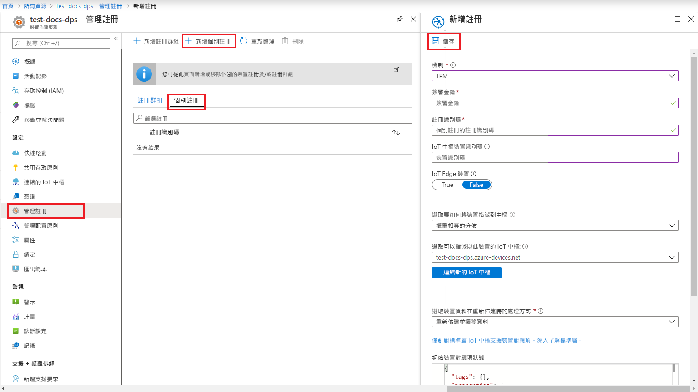

# <a name="create-and-provision-a-simulated-tpm-device-using-nodejs-device-sdk-for-iot-hub-device-provisioning-service"></a>使用適用於 IoT 中樞裝置佈建服務的 Node.js 裝置 SDK 來建立及佈建模擬 TPM 裝置

[!INCLUDE [iot-dps-selector-quick-create-simulated-device-tpm](../../includes/iot-dps-selector-quick-create-simulated-device-tpm.md)]

這些步驟顯示如何在執行 Windows 作業系統的開發電腦上建立模擬裝置、執行 Windows TPM 模擬器作為裝置的[硬體安全性模組 (HSM)](https://azure.microsoft.com/blog/azure-iot-supports-new-security-hardware-to-strengthen-iot-security/)，並使用程式碼範例來連線模擬裝置與裝置佈建服務和 IoT 中樞。 

如果您不熟悉自動佈建程序，請務必也要檢閱[自動佈建概念](concepts-auto-provisioning.md)。 繼續之前，請務必完成[使用 Azure 入口網站設定 IoT 中樞裝置佈建服務](./quick-setup-auto-provision.md)中的步驟。 

[!INCLUDE [IoT Device Provisioning Service basic](../../includes/iot-dps-basic.md)]

## <a name="prepare-the-environment"></a>準備環境 

1. 請確定您在電腦上已安裝 [Node.js 4.0 或更新版本](https://nodejs.org)。

1. 確定 `git` 已安裝在電腦上，並已新增至命令視窗可存取的環境變數。 請參閱[軟體自由保護協會的 Git 用戶端工具](https://git-scm.com/download/)以取得所要安裝的最新版 `git` 工具，其中包括 **Git Bash** (您可用來與本機 Git 存放庫互動的命令列應用程式)。 


## <a name="simulate-a-tpm-device"></a>模擬 TPM 裝置

1. 開啟命令提示字元或 Git Bash。 複製 `azure-utpm-c` GitHub 存放庫：
    
    ```cmd/sh
    git clone https://github.com/Azure/azure-utpm-c.git
    ```

1. 瀏覽至 GitHub 根資料夾並執行 [TPM](https://docs.microsoft.com/windows/device-security/tpm/trusted-platform-module-overview) 模擬器。 它會透過連接埠 2321年和 2322 上的通訊端接聽。 請勿關閉此命令視窗；您必須讓此模擬器保持執行，直到此快速入門指南結束： 

    ```cmd/sh
    .\azure-utpm-c\tools\tpm_simulator\Simulator.exe
    ```

1. 建立名為 **registerdevice** 的新空白資料夾。 在 **registerdevice** 資料夾中，於命令提示字元使用下列命令建立 package.json 檔案。 請務必回答 `npm` 所問的所有問題，或接受預設值 (如果符合的話)：
   
    ```cmd/sh
    npm init
    ```

1. 安裝下列先驅套件：

    ```cmd/sh
    npm install node-gyp -g
    npm install ffi -g
    ```

    > [!NOTE]
    > 安裝上述套件時有一些已知的問題。 若要解決這些問題，請在 [以系統管理員身分執行] 模式中，使用命令提示字元執行 `npm install --global --production windows-build-tools`，在路徑取代為您安裝的版本之後執行 `SET VCTargetsPath=C:\Program Files (x86)\MSBuild\Microsoft.Cpp\v4.0\V140`，然後重新執行上述安裝命令。
    >

1. 安裝下列套件，其中包含在註冊期間使用的元件：

    - 搭配 TPM 運作的安全性用戶端：`azure-iot-security-tpm`
    - 可供裝置連線至裝置佈建服務的傳輸：不是 `azure-iot-provisioning-device-http` 就是 `azure-iot-provisioning-device-amqp`
    - 要使用傳輸的用戶端和安全性用戶端：`azure-iot-provisioning-device`

    註冊裝置後，您可以使用在註冊期間提供的認證，利用一般 IoT 中樞裝置用戶端套件來連接裝置。 您將需要：

    - 裝置用戶端：`azure-iot-device`
    - 傳輸：`azure-iot-device-amqp`、`azure-iot-device-mqtt` 或 `azure-iot-device-http` 任何一項
    - 您已安裝的安全性用戶端：`azure-iot-security-tpm`

    > [!NOTE]
    > 以下範例會使用 `azure-iot-provisioning-device-http` 和 `azure-iot-device-mqtt` 傳輸。
    > 

    您可以在 **registerdevice** 資料夾中，於命令提示字元執行下列命令，一次安裝所有套件：

        ```cmd/sh
        npm install --save azure-iot-device azure-iot-device-mqtt azure-iot-security-tpm azure-iot-provisioning-device-http azure-iot-provisioning-device
        ```

1. 使用文字編輯器，在 **registerdevice** 資料夾中建立新的 **ExtractDevice.js** 檔案。

1. 在 **ExtractDevice.js** 檔案開頭新增下列 `require` 陳述式：
   
    ```
    'use strict';

    var tpmSecurity = require('azure-iot-security-tpm');
    var tssJs = require("tss.js");

    var myTpm = new tpmSecurity.TpmSecurityClient(undefined, new tssJs.Tpm(true));
    ```

1. 新增下列函式以實作方法︰
   
    ```
    myTpm.getEndorsementKey(function(err, endorsementKey) {
      if (err) {
        console.log('The error returned from get key is: ' + err);
      } else {
        console.log('the endorsement key is: ' + endorsementKey.toString('base64'));
        myTpm.getRegistrationId((getRegistrationIdError, registrationId) => {
          if (getRegistrationIdError) {
            console.log('The error returned from get registration id is: ' + getRegistrationIdError);
          } else {
            console.log('The Registration Id is: ' + registrationId);
            process.exit();
          }
        });
      }
    });
    ```

1. 儲存並關閉 **ExtractDevice.js** 檔案。 執行範例：

    ```cmd/sh
    node ExtractDevice.js
    ```

1. 輸出視窗會顯示裝置註冊所需的 **_簽署金鑰_** 和 **_登錄識別碼_**。 請記下這些值。 


## <a name="create-a-device-entry"></a>建立裝置項目

1. 登入 Azure 入口網站，按一下左側功能表上的 [所有資源] 按鈕，然後開啟您的裝置佈建服務。

1. 在裝置佈建服務摘要刀鋒視窗上，選取 [管理註冊]。 選取 [個別註冊] 索引標籤，然後按一下頂端的 [新增個別註冊] 按鈕。 

1. 在 [新增註冊] 之下，輸入下列資訊：
    - 選取 [TPM] 作為身分識別證明「機制」。
    - 輸入 TPM 裝置的 [註冊識別碼] 和 [簽署金鑰]。
    - 您可以選擇性地提供下列資訊：
        - 選取與您的佈建服務連結的 IoT 中樞。
        - 輸入唯一的裝置識別碼。 替您的裝置命名時，務必避免使用敏感性資料。
        - 使用裝置所需的初始組態更新**初始裝置對應項狀態**。
    - 完成後，按一下 [儲存] 按鈕。 

      

   註冊成功時，您裝置的「註冊識別碼」會出現在 [個別註冊] 索引標籤之下的清單中。 


## <a name="register-the-device"></a>註冊裝置

1. 在 Azure 入口網站中，選取裝置佈建服務的 **概觀** 刀鋒視窗，並記下 **_全域裝置端點_** 和 **_識別碼範圍_** 值。

     

1. 使用文字編輯器，在 **registerdevice** 資料夾中建立新的 **RegisterDevice.js** 檔案。

1. 在 **RegisterDevice.js** 檔案開頭新增下列 `require` 陳述式：
   
    ```
    'use strict';

    var ProvisioningTransport = require('azure-iot-provisioning-device-http').Http;
    var iotHubTransport = require('azure-iot-device-mqtt').Mqtt;
    var Client = require('azure-iot-device').Client;
    var Message = require('azure-iot-device').Message;
    var tpmSecurity = require('azure-iot-security-tpm');
    var ProvisioningDeviceClient = require('azure-iot-provisioning-device').ProvisioningDeviceClient;
    ```

    > [!NOTE]
    > **Azure IoT SDK for Node.js** 支援額外的通訊協定，像是 _AMQP_、_AMQP WS_ 和 _MQTT WS_。  如需詳細資訊，請參閱[適用於 Node.js 的裝置佈建服務 SDK 範例](https://github.com/Azure/azure-iot-sdk-node/tree/master/provisioning/device/samples)。
    > 

1. 新增 **globalDeviceEndpoint** 和 **idScope** 變數，並用來建立 **ProvisioningDeviceClient** 執行個體。 使用**步驟 1** 的 [全域裝置端點] 和 [識別碼範圍] 值，取代 **{globalDeviceEndpoint}** 和 **{idScope}**：
   
    ```
    var provisioningHost = '{globalDeviceEndpoint}';
    var idScope = '{idScope}';

    var tssJs = require("tss.js");
    var securityClient = new tpmSecurity.TpmSecurityClient('', new tssJs.Tpm(true));
    // if using non-simulated device, replace the above line with following:
    //var securityClient = new tpmSecurity.TpmSecurityClient();

    var provisioningClient = ProvisioningDeviceClient.create(provisioningHost, idScope, new ProvisioningTransport(), securityClient);
    ```

1. 新增下列函式，在裝置上實作方法︰
   
    ```
    provisioningClient.register(function(err, result) {
      if (err) {
        console.log("error registering device: " + err);
      } else {
        console.log('registration succeeded');
        console.log('assigned hub=' + result.registrationState.assignedHub);
        console.log('deviceId=' + result.registrationState.deviceId);
        var tpmAuthenticationProvider = tpmSecurity.TpmAuthenticationProvider.fromTpmSecurityClient(result.registrationState.deviceId, result.registrationState.assignedHub, securityClient);
        var hubClient = Client.fromAuthenticationProvider(tpmAuthenticationProvider, iotHubTransport);

        var connectCallback = function (err) {
          if (err) {
            console.error('Could not connect: ' + err.message);
          } else {
            console.log('Client connected');
            var message = new Message('Hello world');
            hubClient.sendEvent(message, printResultFor('send'));
          }
        };

        hubClient.open(connectCallback);

        function printResultFor(op) {
          return function printResult(err, res) {
            if (err) console.log(op + ' error: ' + err.toString());
            if (res) console.log(op + ' status: ' + res.constructor.name);
            process.exit(1);
          };
        }
      }
    });
    ```

1. 儲存並關閉 **RegisterDevice.js** 檔案。 執行範例：

    ```cmd/sh
    node RegisterDevice.js
    ```

1. 請注意，模擬裝置開機並連線至裝置佈建服務的訊息，以取得您的 IoT 中樞資訊。 模擬裝置成功佈建到與佈建服務連結的 IoT 中樞時，裝置識別碼會出現在中樞的 [IoT 裝置] 刀鋒視窗上。 

     

    如果您在裝置的註冊項目中變更了*初始裝置對應項狀態* (變更自預設值)，它即可從中樞提取所需的對應項狀態並採取適當的動作。 如需詳細資訊，請參閱[了解和使用 Azure IoT 中樞的裝置對應項](../iot-hub/iot-hub-devguide-device-twins.md)


## <a name="clean-up-resources"></a>清除資源

如果您打算繼續使用並探索裝置用戶端範例，請勿清除在此快速入門中建立的資源。 如果您不打算繼續，請使用下列步驟來刪除本快速入門建立的所有資源。

1. 在您的電腦上關閉裝置用戶端範例輸出視窗。
1. 在您的電腦上關閉 TPM 模擬器視窗。
1. 從 Azure 入口網站的左側功能表中，按一下 [所有資源]，然後選取您的裝置佈建服務。 開啟您服務的 [管理註冊] 刀鋒視窗，然後按一下 [個別註冊] 索引標籤。選取您在本快速入門中註冊的裝置之 [註冊識別碼]，然後按一下頂端的 [刪除] 按鈕。 
1. 從 Azure 入口網站的左側功能表中，按一下 [所有資源]，然後選取您的 IoT 中樞。 開啟您中樞的 [IoT 裝置] 刀鋒視窗，選取您在本快速入門中註冊之裝置的 [裝置識別碼]，然後按一下頂端的 [刪除] 按鈕。


## <a name="next-steps"></a>後續步驟

在本快速入門中，您已在電腦上建立的 TPM 模擬裝置，並使用 IoT 中樞裝置佈建服務將它佈建到 IoT 中樞。 若要了解如何以程式設計方式註冊您的 TPM 裝置，請繼續閱讀以程式設計方式註冊 TPM 裝置的快速入門。 

> [!div class="nextstepaction"]
> [Azure 快速入門 - 向 Azure IoT 中樞裝置佈建服務註冊 TPM 裝置](quick-enroll-device-tpm-node.md)
