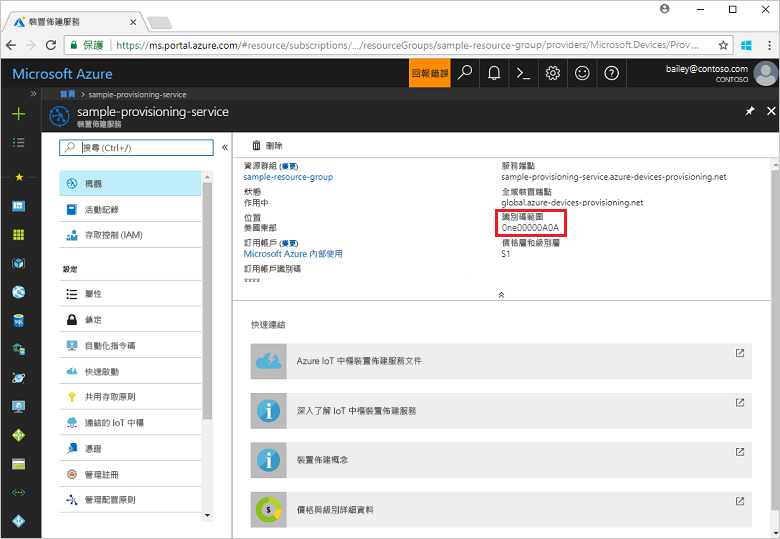
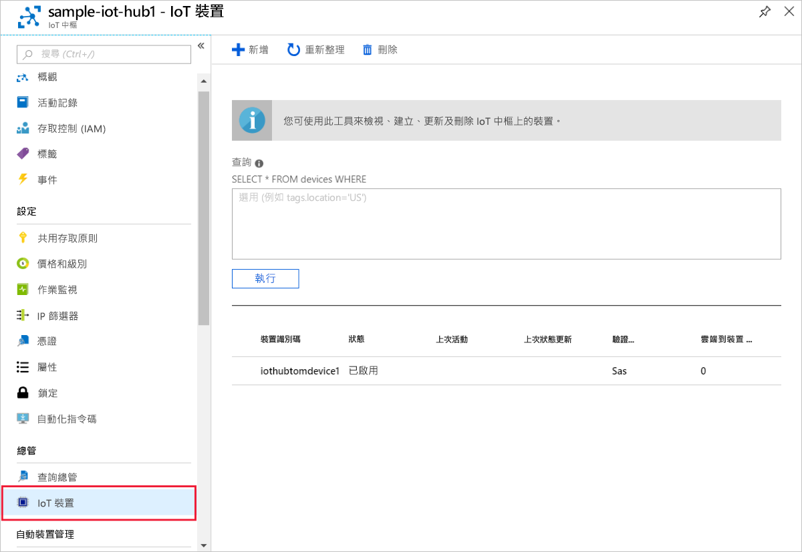

# <a name="create-and-provision-a-simulated-x509-device-using-c-device-sdk-for-iot-hub-device-provisioning-service"></a>使用適用於 IoT 中樞裝置佈建服務的 C# 裝置 SDK 來建立及佈建模擬 X.509 裝置
[!INCLUDE [iot-dps-selector-quick-create-simulated-device-x509](../../includes/iot-dps-selector-quick-create-simulated-device-x509.md)]

這些步驟示範如何在執行 Windows OS 的開發機器上建置 [Azure IoT 中樞 C# SDK](https://github.com/Azure/azure-iot-sdk-csharp) 所模擬的 X.509 裝置範例，並將模擬的裝置與裝置佈建服務和 IoT 中樞連線。

如果您不熟悉自動佈建程序，請務必也要檢閱[自動佈建概念](concepts-auto-provisioning.md)。 繼續之前，請務必完成[使用 Azure 入口網站設定 IoT 中樞裝置佈建服務](./quick-setup-auto-provision.md)中的步驟。 

[!INCLUDE [IoT Device Provisioning Service basic](../../includes/iot-dps-basic.md)]

<a id="setupdevbox"></a>
## <a name="prepare-the-development-environment"></a>準備開發環境 

1. 確定您已在電腦上安裝 [.Net Core SDK](https://www.microsoft.com/net/download/windows)。 

1. 確定 `git` 已安裝在電腦上，並已新增至命令視窗可存取的環境變數。 請參閱[軟體自由保護協會的 Git 用戶端工具](https://git-scm.com/download/)以取得所要安裝的最新版 `git` 工具，其中包括 **Git Bash** (您可用來與本機 Git 存放庫互動的命令列應用程式)。 

4. 開啟命令提示字元或 Git Bash。 複製 [Azure IoT SDK for C#](https://github.com/Azure/azure-iot-sdk-csharp) GitHub 存放庫：
    
    ```cmd
    git clone --recursive https://github.com/Azure/azure-iot-sdk-csharp.git
    ```

## <a name="create-a-self-signed-x509-device-certificate-and-individual-enrollment-entry"></a>建立自我簽署的 X.509 裝置憑證和個別的註冊項目

在本節中，您會使用自我簽署 X.509 憑證，請務必記住下列事項：

* 自我簽署憑證僅適用於測試，不應該用於生產環境。
* 自我簽署憑證的預設到期日為 1 年。

您會使用[適用於 .NET 的 Azure IoT SDK](https://github.com/Azure/azure-iot-sdk-csharp.git) 中的範例程式碼建立憑證，以便與模擬裝置的個別註冊項目搭配使用。


1. 在命令提示字元中，將目錄變更到 X.509 裝置佈建範例的專案目錄。

    ```cmd
    cd .\azure-iot-sdk-csharp\provisioning\device\samples\ProvisioningDeviceClientX509
    ```

2. 範例程式碼設定為使用儲存在受密碼保護之 PKCS12 格式檔案 (certificate.pfx) 內的 X.509 憑證。 此外，您需要公開金鑰憑證檔案 (certificate.cer)，稍後才能在本快速入門中建立個別的註冊。 若要產生自我簽署的憑證及其相關聯的 .cer 和 .pfx 檔案，請執行下列命令：

    ```cmd
    powershell .\GenerateTestCertificate.ps1
    ```

3. 指令碼會提示您輸入 PFX 密碼。 請記住這個密碼，當您執行範例時必須用到。

      


4. 登入 Azure 入口網站，按一下左側功能表上的 [所有資源] 按鈕，然後開啟您的佈建服務。

5. 在裝置佈建服務摘要刀鋒視窗上，選取 [管理註冊]。 選取 [個別註冊] 索引標籤，然後按一下頂端的 [新增個別註冊] 按鈕。 

6. 在 [新增註冊] 面板之下，輸入下列資訊：
    - 選取 [X.509] 作為身分識別證明「機制」。
    - 在 [主要 .pem 或 .cer 憑證檔案] 之下，按一下 [選取檔案] 以選取在先前步驟中建立的憑證檔案 **certificate.cer**。
    - 將 [裝置識別碼] 保留空白。 您的裝置會進行佈建，其裝置識別碼在 X.509 憑證中會設為一般名稱 (CN)，**iothubx509device1**。 這也就是用於個別註冊項目之註冊識別碼的名稱。 
    - 您可以選擇性地提供下列資訊：
        - 選取與您的佈建服務連結的 IoT 中樞。
        - 使用裝置所需的初始組態更新**初始裝置對應項狀態**。
    - 完成後，按一下 [儲存] 按鈕。 

    [](./media/quick-create-simulated-device-x509-csharp/device-enrollment.png#lightbox)
    
   註冊成功時，您的 X.509 註冊項目會在 [個別註冊] 索引標籤下的 [註冊識別碼] 資料行中顯示為 **iothubx509device1**。 

## <a name="provision-the-simulated-device"></a>佈建模擬的裝置

1. 從您佈建服務的 [概觀] 刀鋒視窗中，記下 [識別碼範圍] 值。

     


2. 輸入下列命令以建置並執行 X.509裝置佈建範例。 使用佈建服務的識別碼範圍取代 `<IDScope>` 值。 

    ```cmd
    dotnet run <IDScope>
    ```

3. 出現提示時，輸入您先前建立的 PFX 檔案之密碼。 請注意，模擬裝置開機並連線至裝置佈建服務的訊息，以取得您的 IoT 中樞資訊。 

     

4. 確認裝置已佈建好。 模擬裝置成功佈建到與佈建服務連結的 IoT 中樞時，裝置識別碼會出現在中樞的 [IoT 裝置] 刀鋒視窗上。 

     

    如果您在裝置的註冊項目中變更了*初始裝置對應項狀態* (變更自預設值)，它即可從中樞提取所需的對應項狀態並採取適當的動作。 如需詳細資訊，請參閱[了解和使用 Azure IoT 中樞的裝置對應項](../iot-hub/iot-hub-devguide-device-twins.md)


## <a name="clean-up-resources"></a>清除資源

如果您打算繼續使用並探索裝置用戶端範例，請勿清除在此快速入門中建立的資源。 如果您不打算繼續，請使用下列步驟來刪除本快速入門建立的所有資源。

1. 在您的電腦上關閉裝置用戶端範例輸出視窗。
1. 在您的電腦上關閉 TPM 模擬器視窗。
1. 從 Azure 入口網站的左側功能表中，按一下 [所有資源]，然後選取您的裝置佈建服務。 在 [所有資源] 刀鋒視窗的頂端，按一下 [刪除]。  
1. 從 Azure 入口網站的左側功能表中，按一下 [所有資源]，然後選取您的 IoT 中樞。 在 [所有資源] 刀鋒視窗的頂端，按一下 [刪除]。  

## <a name="next-steps"></a>後續步驟

在本快速入門中，您已在 Windows 電腦上建立 X.509 模擬裝置，並使用入口網站上的 Azure IoT 中樞裝置佈建服務，將它佈建到 IoT 中樞。 若要了解如何以程式設計方式註冊您的 X.509 裝置，請繼續閱讀以程式設計方式註冊 X.509 裝置的快速入門。 

> [!div class="nextstepaction"]
> [Azure 快速入門 - 向 Azure IoT 中樞裝置佈建服務註冊 X.509 裝置](quick-enroll-device-x509-csharp.md)
