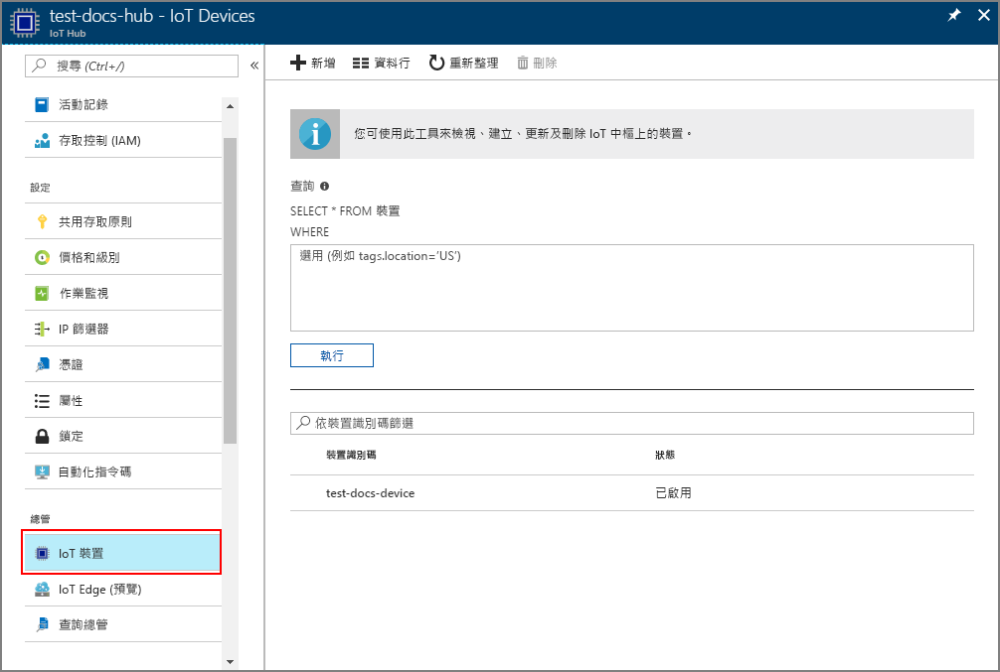

# <a name="create-and-provision-an-x509-simulated-device-using-nodejs-device-sdk-for-iot-hub-device-provisioning-service"></a>使用適用於 IoT 中樞裝置佈建服務的 Node.js 裝置 SDK 來建立及佈建 X.509 模擬裝置
[!INCLUDE [iot-dps-selector-quick-create-simulated-device-x509](../../includes/iot-dps-selector-quick-create-simulated-device-x509.md)]

IoT 中樞裝置佈建服務是 IoT 中樞適用的協助程式服務，可自動將裝置佈建到 IoT 中樞。 這項裝置佈建服務可以讓您以安全且可調整的方式佈建數百萬個裝置。

裝置佈建包含兩個步驟。 第一個步驟是根據方案的特定需求，在裝置佈建服務中建立適當的註冊項目。  第二個步驟是建立裝置與裝置佈建服務之間的連線，並將裝置註冊至 IoT 中樞。 這兩個步驟都完成後，裝置即完成佈建。 裝置佈建服務會自動進行這兩個步驟，以提供順暢的裝置佈建體驗。 如需詳細資訊，請參閱[裝置佈建服務概念](https://docs.microsoft.com/en-us/azure/iot-dps/concepts-service)。

下列步驟說明如何在裝置佈建服務中建立註冊項目、在您的開發電腦上模擬 X.509 裝置、將模擬裝置與裝置佈建服務連線，並使用 [Azure IoT 中樞 Node.js 裝置 SDK](https://github.com/Azure/azure-iot-sdk-node) 在您的 IoT 中樞上註冊裝置。

[!INCLUDE [IoT DPS basic](../../includes/iot-dps-basic.md)]

## <a name="prepare-the-environment"></a>準備環境 

1. 請先完成[使用 Azure 入口網站設定 IoT 中樞裝置佈建服務](./quick-setup-auto-provision.md)中的步驟，再繼續作業。

1. 請確定您在電腦上已安裝 [Node.js 4.0 或更新版本](https://nodejs.org)。

1. 確定 [Git](https://git-scm.com/download/) 已安裝在電腦上，並已新增至命令視窗可存取的環境變數。 

1. 確定 [OpenSSL](https://www.openssl.org/) 已安裝在電腦上，並已新增至命令視窗可存取的環境變數。 此程式庫可從來源建置並安裝，或從[第三方](https://wiki.openssl.org/index.php/Binaries) (例如[這個](https://sourceforge.net/projects/openssl/)) 下載並安裝。 

    > [!NOTE]
    > 如果您已建立_根_、_中繼_和 (或) _分葉_ X.509 憑證，您可以略過此步驟和後續有關於憑證產生的所有步驟。
    >


## <a name="create-an-enrollment-entry"></a>建立註冊項目

註冊是在某種程度上已儲存在裝置佈建服務中的裝置或裝置群組的記錄。 註冊記錄包含裝置或裝置群組的相關資訊 (包括 X.509 憑證的詳細資料)，以及其他註冊資訊。 裝置佈建服務支援兩種類型的註冊：_個別註冊_和_註冊群組_。 如需詳細資訊，請參閱[註冊概念](https://docs.microsoft.com/en-us/azure/iot-dps/concepts-service#enrollment)。

如果您要建立自己的 X.509 測試憑證，請參閱[安全性概念](https://docs.microsoft.com/en-us/azure/iot-dps/concepts-security#x509-certificates)以了解您的方案需要哪些憑證，並參閱[適用於 Azure IoT 裝置佈建裝置 SDK for Node.js 的工具](https://github.com/azure/azure-iot-sdk-node/tree/master/provisioning/tools)以取得實作詳細資料。

1. 開啟命令提示字元。 複製程式碼範例的 GitHub 存放庫：
    
    ```cmd/sh
    git clone https://github.com/Azure/azure-iot-sdk-node.git --recursive
    ```

1. 瀏覽至憑證產生器指令碼，並建置專案。 

    ```cmd/sh
    cd azure-iot-sdk-node/provisioning/tools
    npm install
    ```

1. 根據您的設定，使用下列其中一個方法來建立註冊資訊：

    - **個別註冊**：

        1. 使用您自己的_憑證名稱_執行指令碼，以建立_分葉_憑證。 請注意，分葉憑證的通用名稱會成為[註冊識別碼](https://docs.microsoft.com/en-us/azure/iot-dps/concepts-device#registration-id)，因此請務必一律使用小寫英數字元與連字號。

        ```cmd/sh
        node create_test_cert.js device {certificate-name}
        ```
         
        1. 在 **Azure** 入口網站中，開啟 [裝置佈建服務摘要] 摘要刀鋒視窗。 依序選取 [管理註冊]、[個別註冊] 索引標籤，然後按一下頂端的 [新增] 按鈕。 

        1. 在 [新增註冊清單項目] 之下，輸入下列資訊：
            - 選取 [X.509] 作為身分識別證明「機制」。
            - 在 *憑證 .pem 或 .cer 檔案*下，選取在先前的步驟中使用 [檔案總管] 小工具建立的憑證檔案 **_{certificate-name}\_cert.pem_**。
            - 您可以選擇性地提供下列資訊：
                - 選取與您的佈建服務連結的 IoT 中樞。
                - 輸入唯一的裝置識別碼。 替您的裝置命名時，務必避免使用敏感性資料。 
                - 使用裝置所需的初始組態更新**初始裝置對應項狀態**。
            - 完成後，按一下 [儲存] 按鈕。 

          

    註冊成功時，您的 X.509 裝置會在 [個別註冊] 索引標籤下的 [註冊識別碼] 資料行中顯示為 **{certificatename}**。請記下此值供後續使用。

    - **註冊群組**： 

        1. 使用您自己的_根名稱_執行指令碼，以建立_根_憑證。

        ```cmd/sh
        node create_test_cert.js root {root-name}
        ```

        1. 在 **Azure** 入口網站中，開啟 [裝置佈建服務摘要] 摘要刀鋒視窗。 選取 [憑證]，然後按一下頂端的 [新增] 按鈕。

        1. 在 [新增憑證] 之下，輸入下列資訊：
            - 請輸入唯一的憑證名稱。
            - 選取您先前建立的 **_{root-name}\_cert.pem_** 檔案。
            - 完成後，按一下 [儲存] 按鈕。

        

        1. 選取新建立的憑證：
            - 按一下 [產生驗證碼]。 複製已產生的程式碼。
            - 建立_驗證_憑證。 輸入_驗證碼_，或按一下滑鼠右鍵，在您執行中的節點指令碼視窗中貼上下列命令：

                ```cmd/sh
                node create_test_cert.js verification {rootname_cert} {verification code}
                ```

            - 在 *驗證憑證 .pem 或 .cer 檔案*下，選取在先前的步驟中使用 [檔案總管] 小工具建立的憑證檔案 **_verification_cert.pem_**。 按一下 [確認]。

            

        1. 選取 [管理註冊]。 選取 [註冊群組] 索引標籤，然後按一下頂端的 [新增] 按鈕。
            - 輸入唯一的群組名稱。
            - 選取先前建立的唯一憑證名稱
            - 您可以選擇性地提供下列資訊：
                - 選取與您的佈建服務連結的 IoT 中樞。
                - 使用裝置所需的初始組態更新**初始裝置對應項狀態**。

        

        成功註冊之後，您的 X.509 裝置群組會顯示在 [註冊群組] 索引標籤的 [群組名稱] 資料行之下。請記下此值供後續使用。

        1. 使用您自己的_憑證名稱_再加上先前使用的_根名稱_來執行指令碼，以建立_分葉_憑證。 分葉憑證的通用名稱會成為[註冊識別碼](https://docs.microsoft.com/en-us/azure/iot-dps/concepts-device#registration-id)，因此請務必一律使用小寫英數字元與連字號。

            ```cmd/sh
            node create_test_cert.js device {certificate-name} {root-name}
            ```

        > [!NOTE]
        > 您也可以使用 `node create_test_cert.js intermediate {certificate-name} {parent-name}` 建立_中繼_憑證。 但請務必建立_分葉_憑證，因為最後一個步驟會以最後一個_中繼_作為其根/父系。 如需詳細資訊，請參閱[控制裝置存取](https://docs.microsoft.com/en-us/azure/iot-dps/concepts-security#controlling-device-access-to-the-provisioning-service-with-x509-certificates)。
        >


## <a name="simulate-the-device"></a>模擬裝置

[Azure IoT 中樞 Node.js 裝置 SDK](https://github.com/Azure/azure-iot-sdk-node) 可讓您輕鬆模擬裝置。 如需詳細資訊，請參閱[裝置概念](https://docs.microsoft.com/en-us/azure/iot-dps/concepts-device)。

1. 在 Azure 入口網站中，選取裝置佈建服務的 [概觀] 刀鋒視窗，並記下 [全域裝置端點] 和 [識別碼範圍] 值。

     

1. 將您的_憑證_和_金鑰_複製到範例資料夾。

    ```cmd/sh
    copy .\{certificate-name}_cert.pem ..\device\samples\{certificate-name}_cert.pem
    copy .\{certificate-name}_key.pem ..\device\samples\{certificate-name}_key.pem
    ```

1. 瀏覽至裝置測試指令碼，並建置專案。 

    ```cmd/sh
    cd ..\device\samples
    npm install
    ```

1. 編輯 **register\_x509.js** 檔案。 在進行下列變更後儲存檔案。
    - 將 `provisioning host` 取代為先前在**步驟 1** 中記下的**_全域裝置端點_**。
    - 將 `id scope` 取代為先前在**步驟 1** 中記下的**_識別碼範圍_**。 
    - 將 `reigstration id` 取代為在上一節中記下的**_註冊識別碼_**或**_群組名稱_**。
    - 將 `cert filename` 和 `key filename` 取代為您先前在**步驟 2** 中複製的檔案。 

1. 執行指令碼，並確認裝置已成功佈建。

    ```cmd/sh
    node register_x509.js
    ```   

1. 在入口網站中，瀏覽到連結至您佈建服務的 IoT 中樞，並開啟 [IoT 裝置] 刀鋒視窗。 X.509 模擬裝置成功佈建到 IoT 中樞時，其裝置識別碼會出現在 [IoT 裝置] 刀鋒視窗上，且 [狀態] 顯示為 [已啟用]。 如果您在執行範例裝置應用程式之前開啟了刀鋒視窗，可能需要按一下頂端的 [重新整理] 按鈕。 

     

    如果您在裝置的註冊項目中變更了*初始裝置對應項狀態* (變更自預設值)，它即可從中樞提取所需的對應項狀態並採取適當的動作。 如需詳細資訊，請參閱[了解和使用 Azure IoT 中樞的裝置對應項](../iot-hub/iot-hub-devguide-device-twins.md)。


## <a name="clean-up-resources"></a>清除資源

如果您打算繼續使用並探索裝置用戶端範例，請勿清除在此快速入門中建立的資源。 如果您不打算繼續，請使用下列步驟來刪除本快速入門建立的所有資源。

1. 在您的電腦上關閉裝置用戶端範例輸出視窗。
1. 從 Azure 入口網站的左側功能表中，按一下 [所有資源]，然後選取您的裝置佈建服務。 開啟服務的 [管理註冊] 刀鋒視窗，然後按一下 [個別註冊] 或 [註冊群組] 索引標籤。選取您在本快速入門中註冊的裝置之 [註冊識別碼] 或 [群組名稱]，然後按一下頂端的 [刪除] 按鈕。 
1. 從 Azure 入口網站的左側功能表中，按一下 [所有資源]，然後選取您的 IoT 中樞。 開啟您中樞的 [IoT 裝置] 刀鋒視窗，選取您在本快速入門中註冊之裝置的 [裝置識別碼]，然後按一下頂端的 [刪除] 按鈕。


## <a name="next-steps"></a>後續步驟

在本快速入門中，您已建立 X.509 模擬裝置，並在入口網站使用 Azure IoT 中樞裝置佈建服務將它佈建到您的 IoT 中樞。 若要了解如何以程式設計方式註冊您的 X.509 裝置，請繼續閱讀以程式設計方式註冊 X.509 裝置的快速入門。 

> [!div class="nextstepaction"]
> [Azure 快速入門 - 向 Azure IoT 中樞裝置佈建服務註冊 X.509 裝置](quick-enroll-device-x509-node.md)
