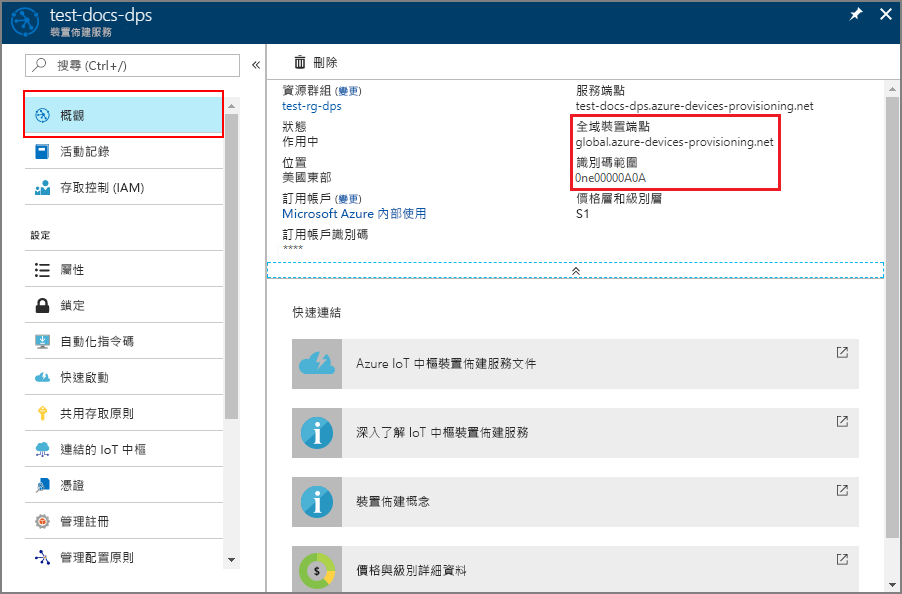
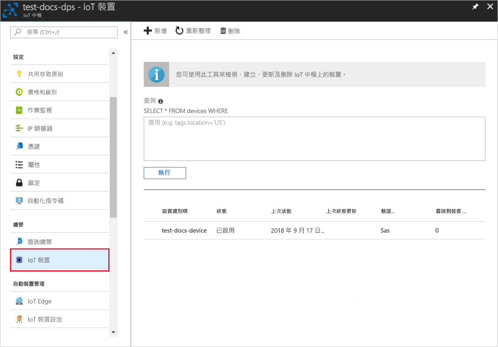

# <a name="create-and-provision-an-x509-simulated-device-using-nodejs-device-sdk-for-iot-hub-device-provisioning-service"></a>使用適用於 IoT 中樞裝置佈建服務的 Node.js 裝置 SDK 來建立及佈建 X.509 模擬裝置
[!INCLUDE [iot-dps-selector-quick-create-simulated-device-x509](../../includes/iot-dps-selector-quick-create-simulated-device-x509.md)]

下列步驟說明如何在裝置佈建服務中建立註冊項目、在您的開發電腦上模擬 X.509 裝置、將模擬裝置與裝置佈建服務連線，並使用 [Azure IoT 中樞 Node.js 裝置 SDK](https://github.com/Azure/azure-iot-sdk-node) 在您的 IoT 中樞上註冊裝置。

如果您不熟悉自動佈建程序，請務必也要檢閱[自動佈建概念](concepts-auto-provisioning.md)。 繼續之前，請務必完成[使用 Azure 入口網站設定 IoT 中樞裝置佈建服務](./quick-setup-auto-provision.md)中的步驟。 

[!INCLUDE [IoT Device Provisioning Service basic](../../includes/iot-dps-basic.md)]

## <a name="prepare-the-environment"></a>準備環境 

1. 請先完成[使用 Azure 入口網站設定 IoT 中樞裝置佈建服務](./quick-setup-auto-provision.md)中的步驟，再繼續作業。

2. 請確定您在電腦上已安裝 [Node.js 4.0 或更新版本](https://nodejs.org)。

3. 確定 [Git](https://git-scm.com/download/) 已安裝在電腦上，並已新增至命令視窗可存取的環境變數。 

4. 確定 [OpenSSL](https://www.openssl.org/) 已安裝在電腦上，並已新增至命令視窗可存取的環境變數。 此程式庫可從來源建置並安裝，或從[第三方](https://wiki.openssl.org/index.php/Binaries) (例如[這個](https://sourceforge.net/projects/openssl/)) 下載並安裝。 

    > [!NOTE]
    > 如果您已建立_根_、_中繼_和 (或) _分葉_ X.509 憑證，您可以略過此步驟和後續有關於憑證產生的所有步驟。
    >

## <a name="create-a-self-signed-x509-device-certificate-and-individual-enrollment-entry"></a>建立自我簽署的 X.509 裝置憑證和個別的註冊項目

在本節中，您會使用自我簽署 X.509 憑證，請務必記住下列事項：

* 自我簽署憑證僅適用於測試，不應該用於生產環境。
* 自我簽署憑證的預設到期日為 1 年。

您會使用[適用於 Node.js 的 Azure IoT SDK](https://github.com/Azure/azure-iot-sdk-node.git) 中的範例程式碼建立憑證，以便與模擬裝置的個別註冊項目搭配使用。


1. 開啟命令提示字元。 複製程式碼範例的 GitHub 存放庫：
    
    ```cmd/sh
    git clone https://github.com/Azure/azure-iot-sdk-node.git --recursive
    ```

2. 瀏覽至憑證產生器指令碼，並建置專案。 

    ```cmd/sh
    cd azure-iot-sdk-node/provisioning/tools
    npm install
    ```

3. 使用您自己的_憑證名稱_執行指令碼，以建立_分葉_ X.509 憑證。 請注意，分葉憑證的通用名稱會成為[註冊識別碼](https://docs.microsoft.com/azure/iot-dps/concepts-device#registration-id)，因此請務必一律使用小寫英數字元與連字號。

    ```cmd/sh
    node create_test_cert.js device {certificate-name}
    ```

4. 登入 [Azure 入口網站](https://portal.azure.com)，按一下左側功能表上的 [所有資源] 按鈕，然後開啟您的裝置佈建服務執行個體。

5. 在裝置佈建服務摘要刀鋒視窗上，選取 [管理註冊]。 選取 [個別註冊] 索引標籤，然後按一下頂端的 [新增個別註冊] 按鈕。 

6. 在 [新增註冊] 面板之下，輸入下列資訊：
    - 選取 [X.509] 作為身分識別證明「機制」。
    - 在 [主要 .pem 或 .cer 憑證檔案] 之下，按一下 [選取檔案] 以選取在先前步驟中建立的憑證檔案 **{certificate-name}_cert.pem**。  
    - 您可以選擇性地提供下列資訊：
      - 選取與您的佈建服務連結的 IoT 中樞。
      - 輸入唯一的裝置識別碼。 替您的裝置命名時，務必避免使用敏感性資料。 
      - 使用裝置所需的初始組態更新**初始裝置對應項狀態**。
   - 完成後，按一下 [儲存] 按鈕。 

    [](./media/quick-create-simulated-device-x509-node/device-enrollment.png#lightbox)

    註冊成功時，您的 X.509 裝置會在 [個別註冊] 索引標籤下的 [註冊識別碼] 資料行中顯示為 **{certificatename}**。請記下此值供後續使用。

## <a name="simulate-the-device"></a>模擬裝置

[Azure IoT 中樞 Node.js 裝置 SDK](https://github.com/Azure/azure-iot-sdk-node) 可讓您輕鬆模擬裝置。 如需詳細資訊，請參閱[裝置概念](https://docs.microsoft.com/azure/iot-dps/concepts-device)。

1. 在 Azure 入口網站中，選取裝置佈建服務的 [概觀] 刀鋒視窗，並記下 [全域裝置端點] 和 [識別碼範圍] 值。

     

2. 將您的_憑證_和_金鑰_複製到範例資料夾。

    ```cmd/sh
    copy .\{certificate-name}_cert.pem ..\device\samples\{certificate-name}_cert.pem
    copy .\{certificate-name}_key.pem ..\device\samples\{certificate-name}_key.pem
    ```

3. 瀏覽至裝置測試指令碼，並建置專案。 

    ```cmd/sh
    cd ..\device\samples
    npm install
    ```

4. 編輯 **register\_x509.js** 檔案。 在進行下列變更後儲存檔案。
    - 將 `provisioning host` 取代為先前在**步驟 1** 中記下的**_全域裝置端點_**。
    - 將 `id scope` 取代為先前在**步驟 1** 中記下的**_識別碼範圍_**。 
    - 將 `registration id` 取代為在上一節中記下的**_註冊識別碼_**。
    - 將 `cert filename` 和 `key filename` 取代為您先前在**步驟 2** 中複製的檔案。 

5. 執行指令碼，並確認裝置已成功佈建。

    ```cmd/sh
    node register_x509.js
    ```   

6. 在入口網站中，瀏覽到連結至您佈建服務的 IoT 中樞，並開啟 [IoT 裝置] 刀鋒視窗。 X.509 模擬裝置成功佈建到 IoT 中樞時，其裝置識別碼會出現在 [IoT 裝置] 刀鋒視窗上，且 [狀態] 顯示為 [已啟用]。 如果您在執行範例裝置應用程式之前開啟了刀鋒視窗，可能需要按一下頂端的 [重新整理] 按鈕。 

     

    如果您在裝置的註冊項目中變更了*初始裝置對應項狀態* (變更自預設值)，它即可從中樞提取所需的對應項狀態並採取適當的動作。 如需詳細資訊，請參閱[了解和使用 Azure IoT 中樞的裝置對應項](../iot-hub/iot-hub-devguide-device-twins.md)。


## <a name="clean-up-resources"></a>清除資源

如果您打算繼續使用並探索裝置用戶端範例，請勿清除在此快速入門中建立的資源。 如果您不打算繼續，請使用下列步驟來刪除本快速入門建立的所有資源。

1. 在您的電腦上關閉裝置用戶端範例輸出視窗。
2. 從 Azure 入口網站的左側功能表中，按一下 [所有資源]，然後選取您的裝置佈建服務。 開啟您服務的 [管理註冊] 刀鋒視窗，然後按一下 [個別註冊] 索引標籤。選取您在本快速入門中註冊的裝置之 [註冊識別碼]，然後按一下頂端的 [刪除] 按鈕。 
3. 從 Azure 入口網站的左側功能表中，按一下 [所有資源]，然後選取您的 IoT 中樞。 開啟您中樞的 [IoT 裝置] 刀鋒視窗，選取您在本快速入門中註冊之裝置的 [裝置識別碼]，然後按一下頂端的 [刪除] 按鈕。


## <a name="next-steps"></a>後續步驟

在本快速入門中，您已建立 X.509 模擬裝置，並在入口網站使用 Azure IoT 中樞裝置佈建服務將它佈建到您的 IoT 中樞。 若要了解如何以程式設計方式註冊您的 X.509 裝置，請繼續閱讀以程式設計方式註冊 X.509 裝置的快速入門。 

> [!div class="nextstepaction"]
> [Azure 快速入門 - 向 Azure IoT 中樞裝置佈建服務註冊 X.509 裝置](quick-enroll-device-x509-node.md)
