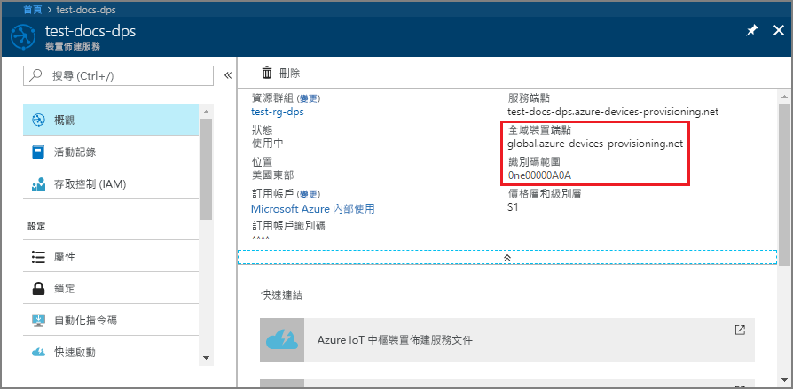
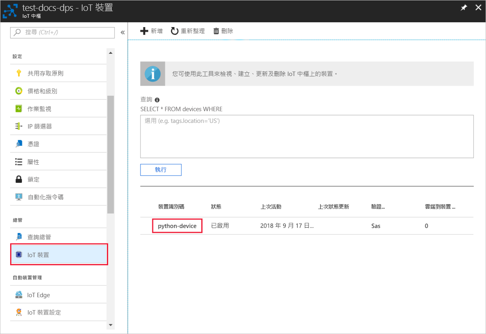

# <a name="create-and-provision-a-simulated-x509-device-using-python-device-sdk-for-iot-hub-device-provisioning-service"></a>使用適用於 IoT 中樞裝置佈建服務的 Python 裝置 SDK 來建立及佈建模擬 X.509 裝置
[!INCLUDE [iot-dps-selector-quick-create-simulated-device-x509](../../includes/iot-dps-selector-quick-create-simulated-device-x509.md)]

這些步驟顯示如何在執行 Windows OS 的開發電腦上模擬 X.509 裝置，並使用 Python 程式碼範例將此模擬裝置與裝置佈建服務和 IoT 中樞進行連線。 

如果您不熟悉自動佈建程序，請務必也要檢閱[自動佈建概念](concepts-auto-provisioning.md)。 繼續之前，請務必完成[使用 Azure 入口網站設定 IoT 中樞裝置佈建服務](./quick-setup-auto-provision.md)中的步驟。 

[!INCLUDE [IoT Device Provisioning Service basic](../../includes/iot-dps-basic.md)]

## <a name="prepare-the-environment"></a>準備環境 

1. 確定您已在電腦上安裝 [Visual Studio 2015](https://www.visualstudio.com/vs/older-downloads/) 或 [Visual Studio 2017](https://www.visualstudio.com/vs/)。 為了 Visual Studio 安裝，您必須啟用「C ++ 桌面開發」工作負載。

2. 下載並安裝 [CMake 建置系統](https://cmake.org/download/)。

3. 確定 `git` 已安裝在電腦上，並已新增至命令視窗可存取的環境變數。 請參閱[軟體自由保護協會的 Git 用戶端工具](https://git-scm.com/download/)以取得所要安裝的最新版 `git` 工具，其中包括 **Git Bash** (您可用來與本機 Git 存放庫互動的命令列應用程式)。 

4. 開啟命令提示字元或 Git Bash。 複製裝置模擬程式碼範例的 GitHub 存放庫。
    
    ```cmd/sh
    git clone https://github.com/Azure/azure-iot-sdk-python.git --recursive
    ```

5. 在此 GitHub 存放庫的本機複本中針對 CMake 建置流程建立資料夾。 

    ```cmd/sh
    cd azure-iot-sdk-python/c
    mkdir cmake
    cd cmake
    ```

6. 執行下列命令，為佈建用戶端建立 Visual Studio 解決方案。

    ```cmd/sh
    cmake -Duse_prov_client:BOOL=ON ..
    ```


## <a name="create-a-self-signed-x509-device-certificate-and-individual-enrollment-entry"></a>建立自我簽署的 X.509 裝置憑證和個別的註冊項目

在本節中，您會使用自我簽署 X.509 憑證。 請務必記住下列幾點：

* 自我簽署憑證僅適用於測試，不應該用於生產環境。
* 自我簽署憑證的預設到期日為一年。

您會使用 Azure IoT C SDK 中的範例程式碼建立憑證，以便與模擬裝置的個別註冊項目搭配使用。

1. 開啟在 *cmake* 資料夾中產生的方案 (名為 `azure_iot_sdks.sln`)，並且在 Visual Studio 中建置。

2. 以滑鼠右鍵按一下 **Provision\_Samples** 資料夾底下的 **dice\_device\_enrollment** 專案，然後選取 [設定為起始專案]。 執行方案。 

3. 在輸出視窗中，當出現提示時，針對個別註冊輸入 `i`。 輸出視窗會顯示針對您的模擬裝置在本機產生的 X.509 憑證。 
    
    將第一個憑證複製到剪貼簿。 開頭是第一次出現的以下內容：
    
        -----BEGIN CERTIFICATE----- 
        
    以第一次出現的以下內容結束複製：
    
        -----END CERTIFICATE-----
        
    請務必包含這兩行。 

    
 
4. 在 Windows 電腦上建立名為 X509testcertificate.pem 的檔案，在您選擇的編輯器中開啟該檔案，並將剪貼簿內容複製到這個檔案。 儲存檔案。 

5. 登入 Azure 入口網站，按一下左側功能表上的 [所有資源] 按鈕，然後開啟您的佈建服務。

6. 在裝置佈建服務摘要刀鋒視窗上，選取 [管理註冊]。 選取 [個別註冊] 索引標籤，然後按一下頂端的 [新增個別註冊] 按鈕。 

7. 在 [新增註冊] 面板之下，輸入下列資訊：
    - 選取 [X.509] 作為身分識別證明「機制」。
    - 在 [主要 .pem 或 .cer 憑證檔案] 之下，按一下 [選取檔案] 以選取在先前步驟中建立的憑證檔案 **X509testcertificate.pem**。
    - 您可以選擇性地提供下列資訊：
      - 選取與您的佈建服務連結的 IoT 中樞。
      - 輸入唯一的裝置識別碼。 替您的裝置命名時，務必避免使用敏感性資料。 
      - 使用裝置所需的初始組態更新**初始裝置對應項狀態**。
    - 完成後，按一下 [儲存] 按鈕。 

    [](./media/python-quick-create-simulated-device-x509/device-enrollment.png#lightbox)

   註冊成功時，您的 X.509 裝置會在 [個別註冊] 索引標籤之下的 [註冊識別碼] 資料行中顯示為 **riot-device-cert**。 

## <a name="simulate-the-device"></a>模擬裝置

1. 在裝置佈建服務摘要刀鋒視窗上，選取 [概觀]。 請注意您的 [識別碼範圍] 和 [全域服務端點]。

    

2. 下載並安裝 [Python 2.x 或 3.x](https://www.python.org/downloads/)。 請務必使用安裝程式所需的 32 位元或 64 位元安裝。 在安裝期間出現系統提示時，務必將 Python 新增至平台特有的環境變數。 如果您是使用 Python 2.x，可能需要[安裝或升級 pip (Python 套件管理系統](https://pip.pypa.io/en/stable/installing/))。
    
    > [!NOTE] 
    > 如果您使用 Windows，也請安裝[適用於 Visual Studio 2015 的 Visual C++ 可轉散發套件](http://www.microsoft.com/download/confirmation.aspx?id=48145)。 PIP 套件需要可轉散發套件才能載入/執行 C Dll。

3. 請遵循[這些指示](https://github.com/Azure/azure-iot-sdk-python/blob/master/doc/python-devbox-setup.md)來建置 Python 套件。

    > [!NOTE]
        > 如果是使用 `pip`，另請確定安裝 `azure-iot-provisioning-device-client` 套件。

4. 瀏覽至範例資料夾。

    ```cmd/sh
    cd azure-iot-sdk-python/provisioning_device_client/samples
    ```

5. 使用您的 Python IDE，編輯名為 **provisioning\_device\_client\_sample.py** 的 python 指令碼。 將 _GLOBAL\_PROV\_URI_ 和 _ID\_SCOPE_ 變數修改為先前所述的值。

    ```python
    GLOBAL_PROV_URI = "{globalServiceEndpoint}"
    ID_SCOPE = "{idScope}"
    SECURITY_DEVICE_TYPE = ProvisioningSecurityDeviceType.X509
    PROTOCOL = ProvisioningTransportProvider.HTTP
    ```

6. 執行範例。 

    ```cmd/sh
    python provisioning_device_client_sample.py
    ```

7. 應用程式會連線、註冊裝置，並顯示成功註冊訊息。

    

8. 在入口網站中，瀏覽到連結至您的佈建服務的 IoT 中樞，並開啟 [Device Explorer] 刀鋒視窗。 X.509 模擬裝置成功佈建到 IoT 中樞時，其裝置識別碼會出現在 [Device Explorer] 刀鋒視窗上，且 [狀態] 顯示為 [已啟用]。 如果您在執行範例裝置應用程式之前開啟了刀鋒視窗，可能需要按一下頂端的 [重新整理] 按鈕。 

     

> [!NOTE]
> 如果您在裝置的註冊項目中變更了*初始裝置對應項狀態* (變更自預設值)，它即可從中樞提取所需的對應項狀態並採取適當的動作。 如需詳細資訊，請參閱[了解和使用 Azure IoT 中樞的裝置對應項](../iot-hub/iot-hub-devguide-device-twins.md)。
>

## <a name="clean-up-resources"></a>清除資源

如果您打算繼續使用並探索裝置用戶端範例，請勿清除在此快速入門中建立的資源。 如果您不打算繼續，請使用下列步驟來刪除本快速入門建立的所有資源。

1. 在您的電腦上關閉裝置用戶端範例輸出視窗。
2. 從 Azure 入口網站的左側功能表中，按一下 [所有資源]，然後選取您的裝置佈建服務。 開啟您服務的 [管理註冊] 刀鋒視窗，然後按一下 [個別註冊] 索引標籤。選取您在本快速入門中註冊的裝置之 [註冊識別碼]，然後按一下頂端的 [刪除] 按鈕。 
3. 從 Azure 入口網站的左側功能表中，按一下 [所有資源]，然後選取您的 IoT 中樞。 開啟您中樞的 [IoT 裝置] 刀鋒視窗，選取您在本快速入門中註冊之裝置的 [裝置識別碼]，然後按一下頂端的 [刪除] 按鈕。

## <a name="next-steps"></a>後續步驟

在本快速入門中，您已在 Windows 電腦上建立 X.509 模擬裝置，並使用入口網站上的 Azure IoT 中樞裝置佈建服務，將它佈建到 IoT 中樞。 若要了解如何以程式設計方式註冊您的 X.509 裝置，請繼續閱讀以程式設計方式註冊 X.509 裝置的快速入門。 

> [!div class="nextstepaction"]
> [Azure 快速入門 - 向 Azure IoT 中樞裝置佈建服務註冊 X.509 裝置](quick-enroll-device-x509-python.md)
