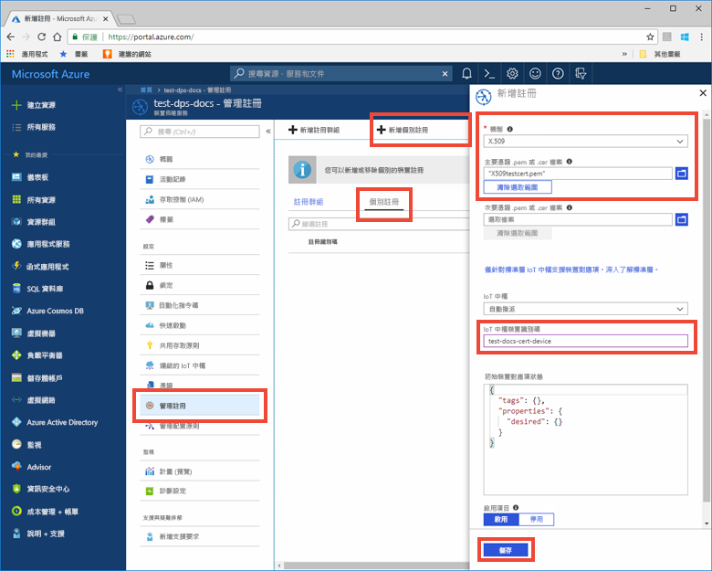

# <a name="create-and-provision-an-x509-simulated-device-using-c-device-sdk-for-iot-hub-device-provisioning-service"></a>使用適用於 IoT 中樞裝置佈建服務的 C 裝置 SDK 來建立及佈建 X.509 模擬裝置
[!INCLUDE [iot-dps-selector-quick-create-simulated-device-x509](../../includes/iot-dps-selector-quick-create-simulated-device-x509.md)]

這些步驟顯示如何在執行 Windows OS 的開發電腦上模擬 X.509 裝置，並使用程式碼範例來連線此模擬裝置與裝置佈建服務和 IoT 中樞。 

如果您不熟悉自動佈建程序，請務必也要檢閱[自動佈建概念](concepts-auto-provisioning.md)。 繼續之前，請務必完成[使用 Azure 入口網站設定 IoT 中樞裝置佈建服務](./quick-setup-auto-provision.md)中的步驟。 

[!INCLUDE [IoT DPS basic](../../includes/iot-dps-basic.md)]

<a id="setupdevbox"></a>

## <a name="prepare-the-development-environment"></a>準備開發環境 

1. 確定您已在電腦上安裝 Visual Studio 2015 或 [Visual Studio 2017](https://www.visualstudio.com/vs/)。 為了 Visual Studio 安裝，您必須啟用[「C ++ 桌面開發」](https://www.visualstudio.com/vs/support/selecting-workloads-visual-studio-2017/)工作負載。

2. 下載並安裝 [CMake 建置系統](https://cmake.org/download/)。 在 `cmake` 安裝**之前**，請務必將包含「C ++ 桌面開發」工作負載的 Visual Studio 安裝在您的電腦上。 

3. 確定 `git` 已安裝在電腦上，並已新增至命令視窗可存取的環境變數。 請參閱[軟體自由保護協會的 Git 用戶端工具](https://git-scm.com/download/)以取得所要安裝的最新版 `git` 工具，其中包括 **Git Bash** (您可用來與本機 Git 存放庫互動的命令列應用程式)。 

4. 開啟命令提示字元或 Git Bash。 複製裝置模擬程式碼範例的 GitHub 存放庫：
    
    ```cmd
    git clone https://github.com/Azure/azure-iot-sdk-c.git --recursive
    ```

5. 在此 GitHub 存放庫的本機複本中針對 CMake 建置流程建立資料夾。 

    ```cmd
    cd azure-iot-sdk-c
    mkdir cmake
    cd cmake
    ```

6. 程式碼範例會使用 X.509 憑證來提供透過 X.509 驗證的證明。 請執行下列命令，以建置您的開發用戶端平台和[證明機制](concepts-security.md#attestation-mechanism) (X.509 憑證) 特有的 SDK 版本。 這也會為模擬裝置產生 Visual Studio 解決方案。 

    ```cmd
    cmake -Duse_prov_client:BOOL=ON ..
    ```
    
    如果 `cmake` 找不到 C++ 編譯，您在執行上述命令時，可能會收到建置錯誤。 如果發生這種情況，請嘗試在 [Visual Studio 命令提示字元](https://docs.microsoft.com/dotnet/framework/tools/developer-command-prompt-for-vs)中執行此命令。 


<a id="portalenroll"></a>

## <a name="create-a-self-signed-x509-device-certificate-and-individual-enrollment-entry"></a>建立自我簽署的 X.509 裝置憑證和個別的註冊項目

1. 開啟在 *cmake* 資料夾中產生的方案 (名為 `azure_iot_sdks.sln`)，並且在 Visual Studio 中建置。

2. 以滑鼠右鍵按一下 **Provision\_Samples** 資料夾底下的 **dice\_device\_enrollment** 專案，然後選取 [設定為起始專案]。 執行方案。 在輸出視窗中，當出現提示時，針對個別註冊輸入 **i**。 輸出視窗會顯示針對您的模擬裝置在本機產生的 X.509 憑證。 將輸出 (從 -----BEGIN CERTIFICATE----- 開始並於第一個 -----END PUBLIC KEY----- 結束) 複製到剪貼簿，並確定包含這兩行文字。 請注意，您只需要輸出視窗中的第一個憑證。
 
3. 在 Windows 電腦上建立名為 X509testcert.pem 的檔案，在您選擇的編輯器中開啟該檔案，並將剪貼簿內容複製到這個檔案。 儲存檔案。 

4. 登入 Azure 入口網站，按一下左側功能表上的 [所有資源] 按鈕，然後開啟您的佈建服務。

5. 在裝置佈建服務摘要刀鋒視窗上，選取 [管理註冊]。 選取 [個別註冊] 索引標籤，然後按一下頂端的 [新增] 按鈕。 

6. 在 [新增註冊] 面板之下，輸入下列資訊：
    - 選取 [X.509] 作為身分識別證明「機制」。
    - 在 [主要 .pem 或 .cer 憑證檔案] 之下，按一下 [選取檔案] 以選取在先前步驟中建立的憑證檔案 **X509testcert.pem**。
    - 您可以選擇性地提供下列資訊：
      - 選取與您的佈建服務連結的 IoT 中樞。
      - 輸入唯一的裝置識別碼。 替您的裝置命名時，務必避免使用敏感性資料。 
      - 使用裝置所需的初始組態更新**初始裝置對應項狀態**。
    - 完成後，按一下 [儲存] 按鈕。 

    [](./media/quick-create-simulated-device-x509/individual-enrollment.png#lightbox)

   註冊成功時，您的 X.509 裝置會在 [個別註冊] 索引標籤之下的 [註冊識別碼] 資料行中顯示為 **riot-device-cert**。 


<a id="firstbootsequence"></a>

## <a name="simulate-first-boot-sequence-for-the-device"></a>模擬裝置的第一個開機順序

1. 在 Azure 入口網站中，選取您裝置佈建服務的 [概觀] 刀鋒視窗，並記下 [識別碼範圍] 值。

     

2. 在您電腦上的 Visual Studio 中，瀏覽到 **Provision\_Samples** 資料夾之下名為 **prov\_dev\_client\_sample** 的範例專案，然後開啟 **prov\_dev\_client\_sample.c** 檔案。

3. 將「識別碼範圍」值指派給 `id_scope` 變數。 

    ```c
    static const char* id_scope = "[ID Scope]";
    ```

4. 在相同檔案的 **main()** 函式中，請確定將 **SECURE_DEVICE_TYPE** 設為 X.509。

    ```c
    SECURE_DEVICE_TYPE hsm_type;
    hsm_type = SECURE_DEVICE_TYPE_X509;
    ```

   將可能出現的 `hsm_type = SECURE_DEVICE_TYPE_TPM;` 陳述式標記為註解或刪除。 

5. 以滑鼠右鍵按一下 **prov\_dev\_client\_sample** 專案，然後選取 [設定為起始專案]。 執行範例。 請注意，模擬裝置開機並連線至裝置佈建服務的訊息，以取得您的 IoT 中樞資訊。 尋找指出向您的中樞註冊成功的訊息：「從服務收到的註冊資訊：yourhuburl!」。 在出現提示時關閉視窗。

6. 在入口網站中，瀏覽到連結至您佈建服務的 IoT 中樞，並開啟 [IoT 裝置] 刀鋒視窗。 X.509 模擬裝置成功佈建到 IoT 中樞時，其裝置識別碼會出現在 [IoT 裝置] 刀鋒視窗上，且 [狀態] 顯示為 [已啟用]。 請注意，如果您在執行範例裝置應用程式之前開啟了刀鋒視窗，您可能需要按一下頂端的 [重新整理] 按鈕。 

     

    如果您在裝置的註冊項目中變更了*初始裝置對應項狀態* (變更自預設值)，它即可從中樞提取所需的對應項狀態並採取適當的動作。 如需詳細資訊，請參閱[了解和使用 Azure IoT 中樞的裝置對應項](../iot-hub/iot-hub-devguide-device-twins.md)。


> [!IMPORTANT]
> 您也可以執行 X.509 裝置的 [群組註冊]，方法是對本快速入門中的步驟進行下列修改：
>    1. 將您的 Windows 電腦設定為使用 **OpenSSL** 程式庫，而不使用預設的 **SChannel**，方法是遵循[設定 Microsoft 開發環境](https://github.com/Azure/azure-iot-sdk-c/blob/master/doc/devbox_setup.md#windows)指南中的 **WebSockets** 一節。 請注意，Linux 電腦依預設會使用 OpenSSL。 
>    2. 在上列[在裝置佈建服務中建立裝置註冊項目](#portalenroll)小節的步驟 2 中，針對群組註冊輸入 **g**。
>    3. 在[相同小節](#portalenroll)的步驟 4 和 5 中，選取 [註冊群組]，並輸入群組項目所需的資訊。  
>

## <a name="clean-up-resources"></a>清除資源

如果您打算繼續使用並探索裝置用戶端範例，請勿清除在此快速入門中建立的資源。 如果您不打算繼續，請使用下列步驟來刪除本快速入門建立的所有資源。

1. 在您的電腦上關閉裝置用戶端範例輸出視窗。
1. 從 Azure 入口網站的左側功能表中，按一下 [所有資源]，然後選取您的裝置佈建服務。 開啟您服務的 [管理註冊] 刀鋒視窗，然後按一下 [個別註冊] 索引標籤。選取您在本快速入門中註冊的裝置之 [註冊識別碼]，然後按一下頂端的 [刪除] 按鈕。 
1. 從 Azure 入口網站的左側功能表中，按一下 [所有資源]，然後選取您的 IoT 中樞。 開啟您中樞的 [IoT 裝置] 刀鋒視窗，選取您在本快速入門中註冊之裝置的 [裝置識別碼]，然後按一下頂端的 [刪除] 按鈕。

## <a name="next-steps"></a>後續步驟

在本快速入門中，您已在 Windows 電腦上建立 X.509 模擬裝置，並使用入口網站上的 Azure IoT 中樞裝置佈建服務，將它佈建到 IoT 中樞。 若要了解如何以程式設計方式註冊您的 X.509 裝置，請繼續閱讀以程式設計方式註冊 X.509 裝置的快速入門。 

> [!div class="nextstepaction"]
> [Azure 快速入門 - 向 Azure IoT 中樞裝置佈建服務註冊 X.509 裝置](quick-enroll-device-x509-java.md)
