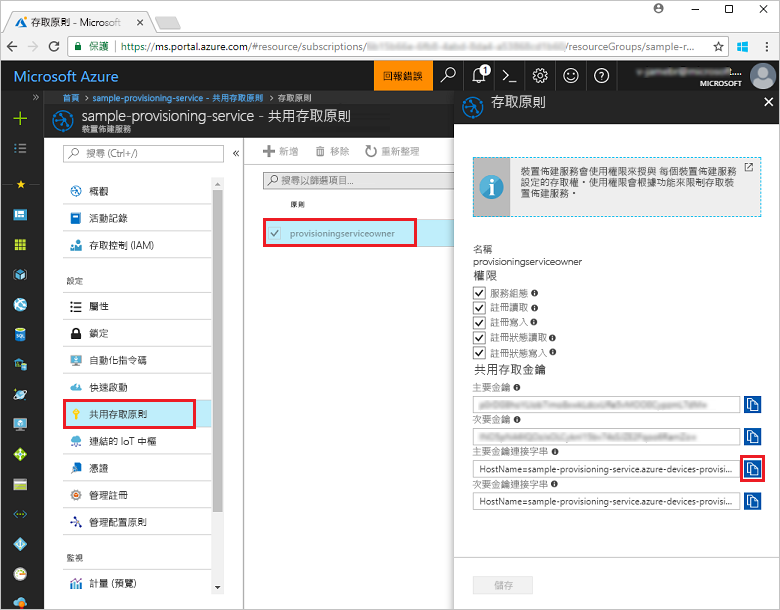
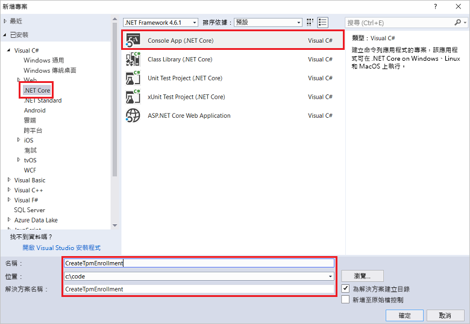
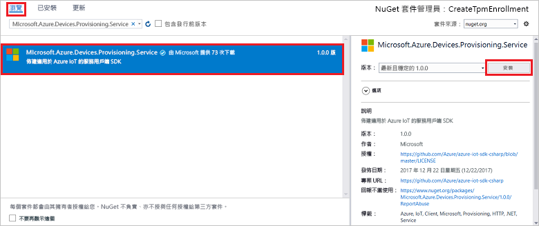

# <a name="enroll-tpm-device-to-iot-hub-device-provisioning-service-using-c-service-sdk"></a>使用 C# 服務 SDK 向 IoT 中樞裝置佈建服務註冊 TPM 裝置

[!INCLUDE [iot-dps-selector-quick-enroll-device-tpm](../../includes/iot-dps-selector-quick-enroll-device-tpm.md)]


這些步驟說明如何使用 [C# 服務 SDK](https://github.com/Azure/azure-iot-sdk-csharp) 以及範例 C# Core 應用程式，以程式設計方式在 Azure IoT 中樞裝置佈建服務中建立 TPM 裝置的個別註冊。 您可以使用此個別註冊項目，選擇性地向佈建服務註冊模擬 TPM 裝置。 雖然在 Windows 和 Linux 電腦上都可運作這些步驟，本文將使用 Windows 開發電腦。

## <a name="prepare-the-development-environment"></a>準備開發環境

1. 確定您已在電腦上安裝 [Visual Studio 2017](https://www.visualstudio.com/vs/)。 
2. 確定您已在電腦上安裝 [.Net Core SDK](https://www.microsoft.com/net/download/windows)。 
3. 繼續之前，請務必完成[使用 Azure 入口網站設定 IoT 中樞裝置佈建服務](./quick-setup-auto-provision.md)中的步驟。
4. (選擇性) 如果您需要註冊本快速入門結尾處的模擬裝置，請遵循[使用 C# 裝置 SDK 來建立及佈建模擬的 TPM 裝置](quick-create-simulated-device-tpm-csharp.md)中的步驟，直到您取得裝置之簽署金鑰的步驟為止。 請記下簽署金鑰、註冊 ID 和 (選擇性) 裝置識別碼，您稍後在本快速入門中需要用到它們。 **請勿遵循使用 Azure 入口網站建立個別註冊的步驟。**

## <a name="get-the-connection-string-for-your-provisioning-service"></a>取得佈建服務的連接字串

對於本快速入門中的範例，您需要佈建服務的連接字串。
1. 登入 Azure 入口網站，按一下左側功能表上的 [所有資源] 按鈕，然後開啟您的裝置佈建服務。 
2. 按一下 [共用存取原則]，然後按一下您要用來開啟其屬性的存取原則。 在 [存取原則] 視窗中，複製並記下主要索引鍵連接字串。 

    

## <a name="create-the-individual-enrollment-sample"></a>建立個別註冊範例 

本節中的步驟說明如何建立 .NET Core 主控台應用程式，以將 TPM 裝置的個別註冊新增至您的佈建服務。 進行一些修改後，您也可以遵循下列步驟來建立 [Windows IoT Core](https://developer.microsoft.com/en-us/windows/iot) 主控台應用程式以新增個別註冊。 若要深入了解如何使用 IoT Core 進行開發，請參閱 [Windows IoT Core 開發人員文件](https://docs.microsoft.com/windows/iot-core/)。
1. 在 Visual Studio 中，使用 [主控台應用程式 (.NET Core)] 專案範本，將 Visual C# .NET Core 主控台應用程式專案新增至新的解決方案。 確定 .NET Framework 為 4.5.1 或更新版本。 將專案命名為 **CreateTpmEnrollment**。

    

2. 在 [方案總管] 中，以滑鼠右鍵按一下 [CreateTpmEnrollment] 專案，然後按一下 [管理 NuGet 套件]。
3. 在 [Nuget 套件管理員] 視窗中選取 [瀏覽]、搜尋 **Microsoft.Azure.Devices.Provisioning.Service**、選取 [安裝] 以安裝 **Microsoft.Azure.Devices.Provisioning.Service** 套件，並接受使用規定。 此程序會下載及安裝 [Azure IoT 佈建服務用戶端 SDK](https://www.nuget.org/packages/Microsoft.Azure.Devices.Provisioning.Service/) NuGet 套件及其相依項目，並新增對它的參考。

    

4. 在 **Program.cs** 檔案的頂端，將下列 `using` 陳述式新增於其他 `using` 陳述式之後：
   
   ```csharp
   using System.Threading.Tasks;
   using Microsoft.Azure.Devices.Provisioning.Service;
   ```
    
5. 將下列欄位新增到 **Program** 類別。  
   - 使用您想要建立註冊之佈建服務的連接字串，取代 **ProvisioningConnectionString** 預留位置值。
   - 您可能會選擇性地變更註冊 ID、簽署金鑰、裝置識別碼和佈建狀態。 
   - 如果您使用本快速入門搭配[使用 C# 裝置 SDK 來建立及佈建模擬的 TPM 裝置](quick-create-simulated-device-tpm-csharp.md)快速入門來佈建模擬裝置，請使用您在該快速入門中記下的值，取代簽署金鑰和註冊識別碼。 您可以使用該快速入門中建議的值、使用您自己的值，或使用這個範例中的預設值來取代裝置識別碼。
        
   ```csharp
   private static string ProvisioningConnectionString = "{Your provisioning service connection string}";
   private const string RegistrationId = "sample-registrationid-csharp";
   private const string TpmEndorsementKey =
       "AToAAQALAAMAsgAgg3GXZ0SEs/gakMyNRqXXJP1S124GUgtk8qHaGzMUaaoABgCAAEMAEAgAAAAAAAEAxsj2gUS" +
       "cTk1UjuioeTlfGYZrrimExB+bScH75adUMRIi2UOMxG1kw4y+9RW/IVoMl4e620VxZad0ARX2gUqVjYO7KPVt3d" +
       "yKhZS3dkcvfBisBhP1XH9B33VqHG9SHnbnQXdBUaCgKAfxome8UmBKfe+naTsE5fkvjb/do3/dD6l4sGBwFCnKR" +
       "dln4XpM03zLpoHFao8zOwt8l/uP3qUIxmCYv9A7m69Ms+5/pCkTu/rK4mRDsfhZ0QLfbzVI6zQFOKF/rwsfBtFe" +
       "WlWtcuJMKlXdD8TXWElTzgh7JS4qhFzreL0c1mI0GCj+Aws0usZh7dLIVPnlgZcBhgy1SSDQMQ==";
       
   // Optional parameters
   private const string OptionalDeviceId = "myCSharpDevice";
   private const ProvisioningStatus OptionalProvisioningStatus = ProvisioningStatus.Enabled;
   ```
    
6. 將下列方法新增至 **Program** 類別。  此程式碼會建立個別註冊項目，然後在 **ProvisioningServiceClient** 上呼叫 **CreateOrUpdateIndividualEnrollmentAsync** 方法，以將個別註冊新增到佈建服務。
   
   ```csharp
   public static async Task RunSample()
   {
       Console.WriteLine("Starting sample...");

       using (ProvisioningServiceClient provisioningServiceClient =
               ProvisioningServiceClient.CreateFromConnectionString(ProvisioningConnectionString))
       {
           #region Create a new individualEnrollment config
           Console.WriteLine("\nCreating a new individualEnrollment...");
           Attestation attestation = new TpmAttestation(TpmEndorsementKey);
           IndividualEnrollment individualEnrollment =
                   new IndividualEnrollment(
                           RegistrationId,
                           attestation);

           // The following parameters are optional. Remove them if you don't need them.
           individualEnrollment.DeviceId = OptionalDeviceId;
           individualEnrollment.ProvisioningStatus = OptionalProvisioningStatus;
           #endregion

           #region Create the individualEnrollment
           Console.WriteLine("\nAdding new individualEnrollment...");
           IndividualEnrollment individualEnrollmentResult =
               await provisioningServiceClient.CreateOrUpdateIndividualEnrollmentAsync(individualEnrollment).ConfigureAwait(false);
           Console.WriteLine("\nIndividualEnrollment created with success.");
           Console.WriteLine(individualEnrollmentResult);
           #endregion
        
       }
   }
   ```
       
7. 最後，使用下列幾行取代 **Main** 方法的主體：
   
   ```csharp
   RunSample().GetAwaiter().GetResult();
   Console.WriteLine("\nHit <Enter> to exit ...");
   Console.ReadLine();
   ```
        
8. 建置方案。

## <a name="run-the-individual-enrollment-sample"></a>執行個別註冊範例
  
1. 在 Visual Studio 中執行此範例，為您的 TPM 裝置建立個別註冊。
 
2. 成功建立時，命令視窗會顯示新個別註冊的屬性。

    

3. 若要驗證是否已建立個別註冊，請在 Azure 入口網站的 [裝置佈建服務摘要] 刀鋒視窗上，選取 [管理註冊]，然後選取 [個別註冊] 索引標籤。您應會看到對應至您在此範例中使用之註冊識別碼的新註冊項目。 按一下此項目以確認該項目的簽署金鑰和其他屬性。

    
 
4. (選擇性) 如果您已遵循[使用 C# 裝置 SDK 來建立及佈建模擬的 TPM 裝置](quick-create-simulated-device-tpm-csharp.md)快速入門中的步驟，您可以繼續執行該快速入門中的其餘步驟來註冊虛擬裝置。 務必略過使用 Azure 入口網站建立個別註冊的步驟。

## <a name="clean-up-resources"></a>清除資源
如果您打算探索 C# 服務範例，請勿清除在此快速入門中建立的資源。 如果您不打算繼續，請使用下列步驟來刪除本快速入門建立的所有資源。

1. 在您的電腦上關閉 C# 範例輸出視窗。
2. 在 Azure 入口網站中，瀏覽至您的裝置佈建服務，按一下 [管理註冊]，然後選取 [個別註冊] 索引標籤。選取您使用本快速入門建立之註冊項目的 [註冊識別碼]，然後按一下刀鋒視窗頂端的 [刪除] 按鈕。 
3. 如果您已遵循[使用 C# 裝置 SDK 來建立及佈建模擬的 TPM 裝置](quick-create-simulated-device-tpm-csharp.md)快速入門中的步驟來建立模擬的 TPM 裝置： 

    1. 關閉模擬裝置的 TPM 模擬器視窗和範例輸出視窗。
    2. 在 Azure 入口網站中，瀏覽至已佈建您的裝置的 IoT 中樞。 在左側功能表的 [總管] 之下，按一下 [IoT 裝置]，選取您裝置旁邊的核取方塊，然後按一下視窗頂端的 [刪除]。
 
## <a name="next-steps"></a>後續步驟
在本快速入門中，您已透過程式設計方式建立 TPM 裝置的個別註冊項目，並選擇性地在電腦上建立 TPM 模擬裝置，且使用 Azure IoT 中樞裝置佈建服務將它佈建到 IoT 中樞。 若要深入了解裝置佈建，請繼續在 Azure 入口網站中進行裝置佈建服務設定的教學課程。 
 
> [!div class="nextstepaction"]
> [Azure IoT 中樞裝置佈建服務教學課程](./tutorial-set-up-cloud.md)

