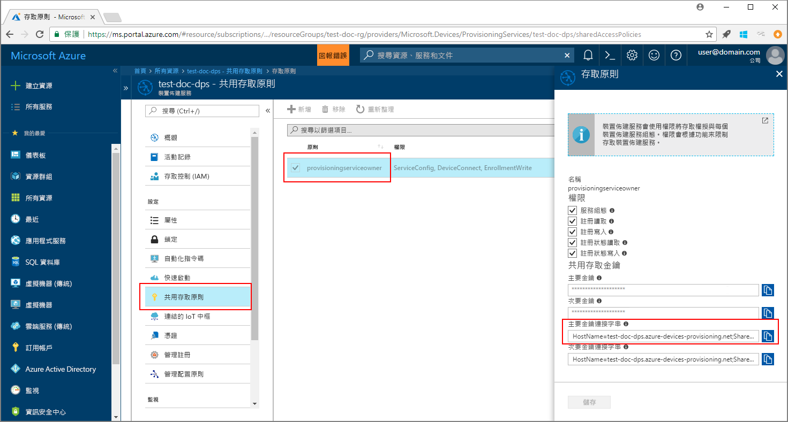

# <a name="enroll-tpm-device-to-iot-hub-device-provisioning-service-using-java-service-sdk"></a>使用 Java 服務 SDK 向 IoT 中樞裝置佈建服務註冊 TPM 裝置

[!INCLUDE [iot-dps-selector-quick-enroll-device-tpm](../../includes/iot-dps-selector-quick-enroll-device-tpm.md)]


這些步驟顯示如何使用 [Java 服務 SDK](https://azure.github.io/azure-iot-sdk-java/service/) 與範例 Java 應用程式的協助，以程式設計方式向 Azure IoT 中樞裝置佈建服務註冊 TPM 模擬裝置。 雖然 Java 服務 SDK 在 Windows 和 Linux 電腦上都適用，本文會使用 Windows 開發電腦來逐步引導進行註冊程序。

繼續之前，請務必[使用 Azure 入口網站設定 IoT 中樞裝置佈建服務](./quick-setup-auto-provision.md)，以及[模擬 TPM 裝置](quick-create-simulated-device.md#simulatetpm)。

<a id="setupdevbox"></a>

## <a name="prepare-the-development-environment"></a>準備開發環境 

1. 請確定您已在電腦上安裝 [Java SE 開發套件 8](http://www.oracle.com/technetwork/java/javase/downloads/jdk8-downloads-2133151.html)。 

2. 設定您 Java 安裝的環境變數。 `PATH` 變數應該包含 jdk1.8.x\bin 目錄的完整路徑。 如果這是您第一次在電腦上安裝 Java，請建立名為 `JAVA_HOME` 的新環境變數，並加以指向 jdk1.8.x 目錄的完整路徑。 在 Windows 電腦上，此目錄通常是位於 C:\\Program Files\\Java\\ 資料夾，您可以在 Windows 電腦的 [控制台] 上搜尋 [編輯系統環境變數] 來建立或編輯環境變數。 

  您可以在命令視窗中執行下列命令，查看 Java 是否在您的電腦上成功設定：

    ```cmd\sh
    java -version
    ```

3. 下載並擷取您電腦上的 [Maven 3](https://maven.apache.org/download.cgi)。 

4. 編輯環境變數 `PATH`，在擷取 Maven 的資料夾內，指向 apache-maven-3.x.x\\bin 資料夾。 您可以在命令視窗中執行此命令，來確認 Maven 已成功安裝：

    ```cmd\sh
    mvn --version
    ```

5. 確定 [git](https://git-scm.com/download/) 已安裝在電腦上，並已新增至環境變數 `PATH`。 


<a id="javasample"></a>

## <a name="download-and-modify-the-java-sample-code"></a>下載並修改 Java 範例程式碼

本節說明如何將 TPM 裝置的佈建詳細資料新增至範例程式碼。 

1. 開啟命令提示字元。 使用 Java 服務 SDK 來複製裝置註冊程式碼範例的 GitHub 存放庫：
    
    ```cmd\sh
    git clone https://github.com/Azure/azure-iot-sdk-java.git --recursive
    ```

2. 在下載的原始程式碼中，瀏覽至 _azure-iot-sdk-java/provisioning/provisioning-samples/service-enrollment-sample_ 範例資料夾。 在您選擇的編輯器中開啟檔案 _/src/main/java/samples/com/microsoft/azure/sdk/iot/ServiceEnrollmentSample.java_，並新增下列詳細資料：

    1. 從入口網站針對佈建服務新增 `[Provisioning Connection String]`，如下所示：
        1. 在 [Azure 入口網站](https://portal.azure.com)中，瀏覽至您的佈建服務。 
        2. 開啟 [共用存取原則]，並選取具有 EnrollmentWrite 權限的原則。
        3. 複製 [主索引鍵連接字串]。 

              

        4. 在範例程式碼檔案 _ServiceEnrollmentSample.java_ 中，將 `[Provisioning Connection String]` 取代為**主索引鍵連接字串**。
    
            ```Java
            private static final String PROVISIONING_CONNECTION_STRING = "[Provisioning Connection String]";
            ```

    2. 新增 TPM 裝置詳細資料：
        1. 取得 TPM 裝置模擬的註冊識別碼和 TPM 簽署金鑰，方法是遵循[模擬 TPM 裝置](quick-create-simulated-device.md#simulatetpm)一節的前置步驟。
        2. 使用上述步驟之輸出中的 [註冊識別碼]  和 [簽署金鑰]，來取代 **_ServiceEnrollmentSample.java_** 範例程式碼檔案中的 `[RegistrationId]` 和 `[TPM Endorsement Key]`：
        
            ```Java
            private static final String REGISTRATION_ID = "[RegistrationId]";
            private static final String TPM_ENDORSEMENT_KEY = "[TPM Endorsement Key]";
            ```

    3. (選擇性) 您可以透過範例程式碼來設定佈建服務：
        - 若要將此設定新增至範例，請遵循下列步驟：
            1. 在 [Azure 入口網站](https://portal.azure.com)中，瀏覽至連結到您佈建服務的 IoT 中樞。 開啟中樞的 [概觀] 索引標籤，並複製 [主機名稱]。 將此 [主機名稱] 指派給 IOTHUB_HOST_NAME 參數。
                ```Java
                private static final String IOTHUB_HOST_NAME = "[Host name].azure-devices.net";
                ```
            2. 指派易記的名稱給 DEVICE_ID 參數，並保留 PROVISIONING_STATUS 作為預設的 ENABLED 值。 
    
        - 或者，如果您選擇不設定佈建服務，請確定在 _ServiceEnrollmentSample.java_ 檔案中，將下列陳述式標記為註解或刪除：
            ```Java
            // The following parameters are optional. Remove it if you don't need.
            individualEnrollment.setDeviceId(DEVICE_ID);
            individualEnrollment.setIotHubHostName(IOTHUB_HOST_NAME);
            individualEnrollment.setProvisioningStatus(PROVISIONING_STATUS);
            ```

    4. 研究範例程式碼。 它會建立、更新、查詢並刪除個別的 TPM 裝置註冊。 若要確認入口網站中的註冊成功，請在 _ServiceEnrollmentSample.java_ 檔案的結尾處，將下列幾行程式碼暫時標記為註解：
    
        ```Java
        // *********************************** Delete info of individualEnrollment ************************************
        System.out.println("\nDelete the individualEnrollment...");
        provisioningServiceClient.deleteIndividualEnrollment(REGISTRATION_ID);
        ```

    5. 儲存 _ServiceEnrollmentSample.java_ 檔案。

<a id="runjavasample"></a>

## <a name="build-and-run-the-java-sample-code"></a>建置並執行 Java 範例程式碼

1. 開啟命令視窗，並瀏覽至 **_azure-iot-sdk-java/provisioning/provisioning-samples/service-enrollment-sample_** 資料夾。

2. 使用此命令來建置範例程式碼：

    ```cmd\sh
    mvn install -DskipTests
    ```

   這個命令會將 Maven 套件 [`com.microsoft.azure.sdk.iot.provisioning.service`](https://www.mvnrepository.com/artifact/com.microsoft.azure.sdk.iot.provisioning/provisioning-service-client) 下載到您的電腦。 此套件包含範例程式碼需要建置之 Java 服務 SDK 的二進位檔。 

3. 在命令視窗中使用這些命令來執行此範例：

    ```cmd\sh
    cd target
    java -jar ./service-enrollment-sample-{version}-with-deps.jar
    ```

4. 觀察成功註冊的輸出視窗。 

5. 在 Azure 入口網站中，瀏覽至您的佈建服務。 按一下 [管理註冊]，然後選取 [個別註冊] 索引標籤。請注意，現在會列出您的模擬 TPM 裝置註冊識別碼。 

      

## <a name="clean-up-resources"></a>清除資源
如果您打算探索 Java 服務範例，請勿清除在此快速入門中建立的資源。 如果您不打算繼續，請使用下列步驟來刪除本快速入門建立的所有資源。

1. 在您的電腦上關閉 Java 範例輸出視窗。
1. 將您所建立要模擬 TPM 裝置的 TPM 模擬器視窗關閉。
1. 在 Azure 入口網站中，瀏覽至您的裝置佈建服務，按一下 [管理註冊]，然後選取 [個別註冊] 索引標籤。選取您使用本快速入門註冊的裝置之 [註冊識別碼]，然後按一下刀鋒視窗頂端的 [刪除] 按鈕。 

## <a name="next-steps"></a>後續步驟
在本快速入門中，您已向裝置佈建服務註冊模擬 TPM 裝置。 若要深入了解裝置佈建，請繼續在 Azure 入口網站中進行裝置佈建服務設定的教學課程。 

> [!div class="nextstepaction"]
> [Azure IoT 中樞裝置佈建服務教學課程](./tutorial-set-up-cloud.md)
