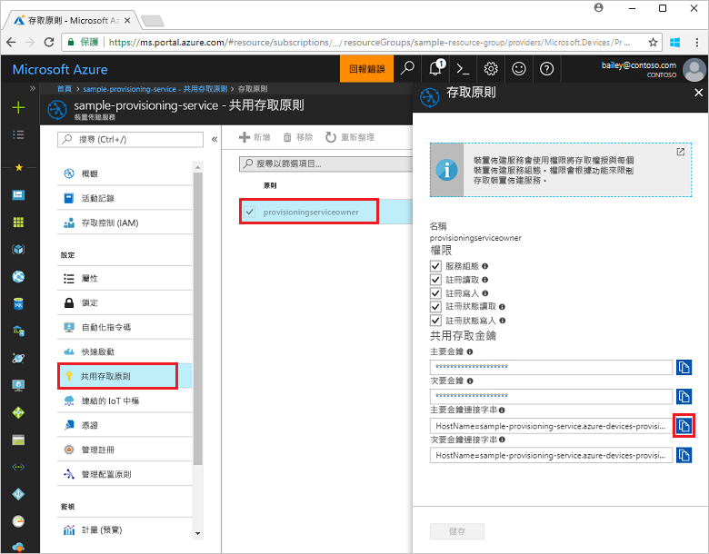
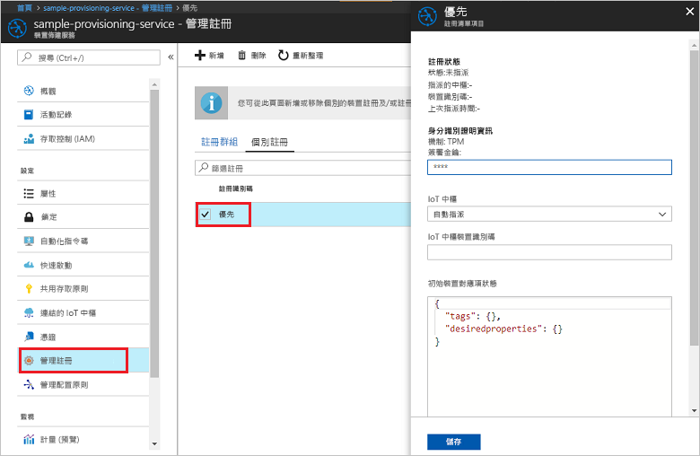

# <a name="enroll-tpm-device-to-iot-hub-device-provisioning-service-using-nodejs-service-sdk"></a>使用 Node.js 服務 SDK 向 IoT 中樞裝置佈建服務註冊 TPM 裝置

[!INCLUDE [iot-dps-selector-quick-enroll-device-tpm](../../includes/iot-dps-selector-quick-enroll-device-tpm.md)]


這些步驟說明如何使用 [Node.js 服務 SDK](https://github.com/Azure/azure-iot-sdk-node) 以及範例 Node.js 應用程式，以程式設計方式在 Azure IoT 中樞裝置佈建服務中建立 TPM 裝置的個別註冊。 您可以使用此個別註冊項目，選擇性地向佈建服務註冊模擬 TPM 裝置。 雖然在 Windows 和 Linux 電腦上都可運作這些步驟，針對本文的目的，我們將使用 Windows 開發電腦。

## <a name="prerequisites"></a>必要條件

- 繼續之前，請務必完成[使用 Azure 入口網站設定 IoT 中樞裝置佈建服務](./quick-setup-auto-provision.md)中的步驟。 
-  請確定您在電腦上已安裝 [Node.js 4.0 或更新版本](https://nodejs.org)。
- 如果您需要註冊本快速入門結尾處的模擬裝置，請遵循[建立及佈建模擬裝置](quick-create-simulated-device.md)中的步驟，直到您取得裝置之簽署金鑰的步驟為止。 請將簽署金鑰記下，您稍後在本快速入門中將會用到。 **請勿遵循使用 Azure 入口網站建立個別註冊的步驟。**
 
## <a name="create-the-individual-enrollment-sample"></a>建立個別註冊範例 

 
1. 從工作資料夾中的命令視窗中，執行：
  
    ```cmd\sh
    npm install azure-iot-provisioning-service
    ```  

2. 使用文字編輯器，在工作資料夾中建立 **create_individual_enrollment.js** 檔案。 將下列程式碼新增至檔案，並加以儲存：

    ```
    'use strict';

    var provisioningServiceClient = require('azure-iot-provisioning-service').ProvisioningServiceClient;

    var serviceClient = provisioningServiceClient.fromConnectionString(process.argv[2]);
    var endorsementKey = process.argv[3];

    var enrollment = {
      registrationId: 'first',
      attestation: {
        type: 'tpm',
        tpm: {
          endorsementKey: endorsementKey
        }
      }
    };

    serviceClient.createOrUpdateIndividualEnrollment(enrollment, function(err, enrollmentResponse) {
      if (err) {
        console.log('error creating the individual enrollment: ' + err);
      } else {
        console.log("enrollment record returned: " + JSON.stringify(enrollmentResponse, null, 2));
      }
    });
    ````

## <a name="run-the-individual-enrollment-sample"></a>執行個別註冊範例
  
1. 若要執行範例，您需要佈建服務的連接字串。 
    1. 登入 Azure 入口網站，按一下左側功能表上的 [所有資源] 按鈕，然後開啟您的裝置佈建服務。 
    2. 按一下 [共用存取原則]，然後按一下您要用來開啟其屬性的存取原則。 在 [存取原則] 視窗中，複製並記下主要索引鍵連接字串。 

     


2. 您還需要裝置的簽署金鑰。 如果您已遵循[建立及佈建模擬裝置](quick-create-simulated-device.md)快速入門建立模擬的 TPM 裝置，請使用針對該裝置建立的金鑰。 否則，若要建立範例個別註冊，您可以使用下列隨 SDK 提供的簽署金鑰：

    ```
    AToAAQALAAMAsgAgg3GXZ0SEs/gakMyNRqXXJP1S124GUgtk8qHaGzMUaaoABgCAAEMAEAgAAAAAAAEAxsj2gUScTk1UjuioeTlfGYZrrimExB+bScH75adUMRIi2UOMxG1kw4y+9RW/IVoMl4e620VxZad0ARX2gUqVjYO7KPVt3dyKhZS3dkcvfBisBhP1XH9B33VqHG9SHnbnQXdBUaCgKAfxome8UmBKfe+naTsE5fkvjb/do3/dD6l4sGBwFCnKRdln4XpM03zLpoHFao8zOwt8l/uP3qUIxmCYv9A7m69Ms+5/pCkTu/rK4mRDsfhZ0QLfbzVI6zQFOKF/rwsfBtFeWlWtcuJMKlXdD8TXWElTzgh7JS4qhFzreL0c1mI0GCj+Aws0usZh7dLIVPnlgZcBhgy1SSDQMQ==
    ```

3. 若要建立 TPM 裝置的個別註冊，請執行下列命令 (包括命令列引數的括號)：
 
     ```cmd\sh
     node create_individual_enrollment.js "<the connection string for your provisioning service>" "<endorsement key>"
     ```
 
3. 成功建立時，命令視窗會顯示新個別註冊的屬性。

     

4. 請確認已建立個別註冊。 在 Azure 入口網站的 [裝置佈建服務摘要] 刀鋒視窗上，選取 [管理註冊]。 選取 [個別註冊] 索引標籤，按一下新的註冊項目 (第一個) 來驗證簽署金鑰和項目的其他屬性。

     
 
現在，您已建立 TPM 裝置的個別註冊，如果您需要註冊模擬的裝置，可以繼續進行[建立及佈建模擬裝置](quick-create-simulated-device.md)中的其餘步驟。 請務必略過該快速入門中使用 Azure 入口網站建立個別註冊的步驟。

## <a name="clean-up-resources"></a>清除資源
如果您打算探索 Node.js 服務範例，請勿清除本快速入門中建立的資源。 如果您不打算繼續，請使用下列步驟來刪除本快速入門建立的所有資源。

1. 在您的電腦上關閉 Node.js 範例輸出視窗。
1. 如果您建立了模擬的 TPM 裝置，請關閉 TPM 模擬器視窗。
2. 在 Azure 入口網站中，瀏覽至您的裝置佈建服務，按一下 [管理註冊]，然後選取 [個別註冊] 索引標籤。選取您使用本快速入門建立之註冊項目的 [註冊識別碼]，然後按一下刀鋒視窗頂端的 [刪除] 按鈕。 
 
## <a name="next-steps"></a>後續步驟
在本快速入門中，您已透過程式設計方式建立 TPM 裝置的個別註冊項目，並選擇性地在電腦上建立 TPM 模擬裝置，且使用 Azure IoT 中樞裝置佈建服務將它佈建到 IoT 中樞。 若要深入了解裝置佈建，請繼續在 Azure 入口網站中進行裝置佈建服務設定的教學課程。 
 
> [!div class="nextstepaction"]
> [Azure IoT 中樞裝置佈建服務教學課程](./tutorial-set-up-cloud.md)