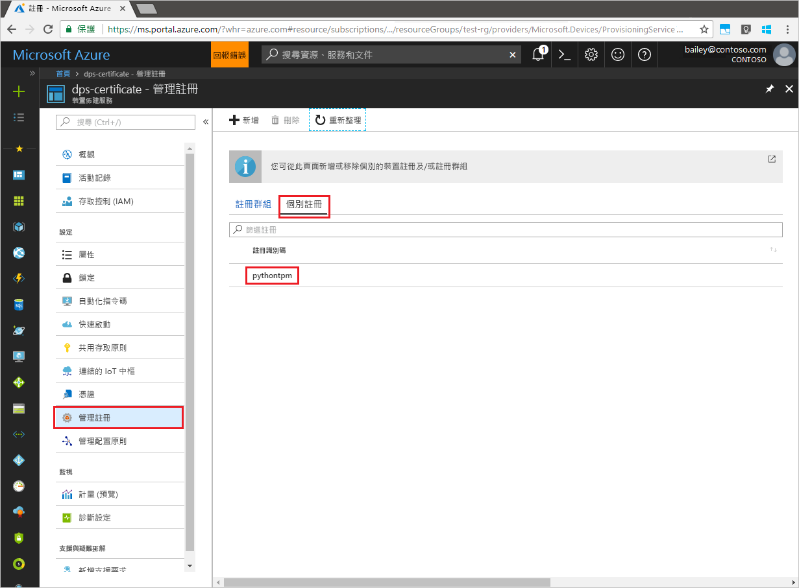

# <a name="enroll-tpm-device-to-iot-hub-device-provisioning-service-using-python-provisioning-service-sdk"></a>使用 Python 佈建服務 SDK 向 IoT 中樞裝置佈建服務註冊 TPM 裝置
[!INCLUDE [iot-dps-selector-quick-enroll-device-tpm](../../includes/iot-dps-selector-quick-enroll-device-tpm.md)]

下列步驟說明如何使用 [Python 佈建服務 SDK](https://github.com/Azure/azure-iot-sdk-python/tree/master/provisioning_service_client) 和範例 Python 應用程式的說明，以程式設計方式在 Azure IoT 中樞裝置佈建服務中建立 TPM 裝置的個別註冊。 雖然 Python 服務 SDK 在 Windows 和 Linux 電腦上都適用，本文會使用 Windows 開發電腦逐步引導您進行註冊程序。

繼續之前，請務必[使用 Azure 入口網站設定 IoT 中樞裝置佈建服務](./quick-setup-auto-provision.md)。


<a id="prepareenvironment"></a>

## <a name="prepare-the-environment"></a>準備環境 

1. 下載並安裝 [Python 2.x 或 3.x](https://www.python.org/downloads/)。 請務必使用安裝程式所需的 32 位元或 64 位元安裝。 在安裝期間出現系統提示時，務必將 Python 新增至平台特有的環境變數。 

1. 選擇下列其中一個選項：

    - 建置和編譯 **Azure IoT Python SDK**。 請遵循[這些指示](https://github.com/Azure/azure-iot-sdk-python/blob/master/doc/python-devbox-setup.md)來建置 Python 套件。 如果您使用 Windows 作業系統，則請同時安裝 [Visual C++ 可轉散發套件](http://www.microsoft.com/download/confirmation.aspx?id=48145)，以允許使用 Python 的原生 DLL。

    - [安裝或升級 *pip* (Python 套件管理系統)](https://pip.pypa.io/en/stable/installing/)，並透過下列命令安裝套件：

        ```cmd/sh
        pip install azure-iothub-provisioningserviceclient
        ```

1. 您需要裝置的簽署金鑰。 如果您已遵循[建立及佈建模擬裝置](quick-create-simulated-device.md)快速入門建立模擬的 TPM 裝置，請使用針對該裝置建立的金鑰。 否則，您可以使用下列隨 SDK 提供的簽署金鑰：

    ```
    AToAAQALAAMAsgAgg3GXZ0SEs/gakMyNRqXXJP1S124GUgtk8qHaGzMUaaoABgCAAEMAEAgAAAAAAAEAtW6MOyCu/Nih47atIIoZtlYkhLeCTiSrtRN3q6hqgOllA979No4BOcDWF90OyzJvjQknMfXS/Dx/IJIBnORgCg1YX/j4EEtO7Ase29Xd63HjvG8M94+u2XINu79rkTxeueqW7gPeRZQPnl1xYmqawYcyzJS6GKWKdoIdS+UWu6bJr58V3xwvOQI4NibXKD7htvz07jLItWTFhsWnTdZbJ7PnmfCa2vbRH/9pZIow+CcAL9mNTNNN4FdzYwapNVO+6SY/W4XU0Q+dLMCKYarqVNH5GzAWDfKT8nKzg69yQejJM8oeUWag/8odWOfbszA+iFjw3wVNrA5n8grUieRkPQ==
    ```


## <a name="modify-the-python-sample-code"></a>修改 Python 範例程式碼

本節說明如何將 TPM 裝置的佈建詳細資料新增至範例程式碼。 

1. 使用文字編輯器建立新的 **TpmEnrollment.py** 檔案。

1. 在 **TpmEnrollment.py** 檔案開頭處新增下列 `import` 陳述式和變數。 然後，將 `dpsConnectionString` 取代為您的連接字串；您可以使用 **Azure 入口網站** 在您**裝置佈建服務**的**共用存取原則**下找到此字串。 將 `endorsementKey` 取代為先前在[準備環境](quick-enroll-device-tpm-python.md#prepareenvironment)中記下的值。 最後，建立唯一 `registrationid`；切記其中只能包含小寫英數字元與連字號。  
   
    ```python
    from provisioningserviceclient import ProvisioningServiceClient
    from provisioningserviceclient.models import IndividualEnrollment, AttestationMechanism

    CONNECTION_STRING = "{dpsConnectionString}"

    ENDORSEMENT_KEY = "{endorsementKey}"

    REGISTRATION_ID = "{registrationid}"
    ```

1. 新增下列函式和函式呼叫，以實作群組註冊建立：
   
    ```python
    def main():
        print ( "Starting individual enrollment..." )

        psc = ProvisioningServiceClient.create_from_connection_string(CONNECTION_STRING)

        att = AttestationMechanism.create_with_tpm(ENDORSEMENT_KEY)
        ie = IndividualEnrollment.create(REGISTRATION_ID, att)

        ie = psc.create_or_update(ie)
    
        print ( "Individual enrollment successful." )
    
    if __name__ == '__main__':
        main()
    ```

1. 儲存並關閉 **TpmEnrollment.py** 檔案。
 

## <a name="run-the-sample-tpm-enrollment"></a>執行範例 TPM 註冊

1. 開啟命令提示字元，並執行指令碼。

    ```cmd/sh
    python TpmEnrollment.py
    ```

1. 觀察成功註冊的輸出。

1. 在 Azure 入口網站中，瀏覽至您的佈建服務。 按一下 [管理註冊]。 請注意，您的 TPM 裝置會出現在 [個別註冊] 索引標籤下，並使用先前建立的名稱 `registrationid`。 

      


## <a name="clean-up-resources"></a>清除資源
如果您打算探索 Java 服務範例，請勿清除在此快速入門中建立的資源。 如果您不打算繼續，請使用下列步驟來刪除本快速入門建立的所有資源。

1. 在您的電腦上關閉 Python 範例輸出視窗。
1. 如果您建立了模擬的 TPM 裝置，請關閉 TPM 模擬器視窗。
1. 在 Azure 入口網站中，瀏覽至您的裝置佈建服務，按一下 [管理註冊]，然後選取 [個別註冊] 索引標籤。選取您使用本快速入門建立之註冊項目的 [註冊識別碼]，然後按一下刀鋒視窗頂端的 [刪除] 按鈕。  


## <a name="next-steps"></a>後續步驟
在本快速入門中，您已透過程式設計方式建立 TPM 裝置的個別註冊項目，並選擇性地在電腦上建立 TPM 模擬裝置，且使用 Azure IoT 中樞裝置佈建服務將它佈建到 IoT 中樞。 若要深入了解裝置佈建，請繼續在 Azure 入口網站中進行裝置佈建服務設定的教學課程。

> [!div class="nextstepaction"]
> [Azure IoT 中樞裝置佈建服務教學課程](./tutorial-set-up-cloud.md)
