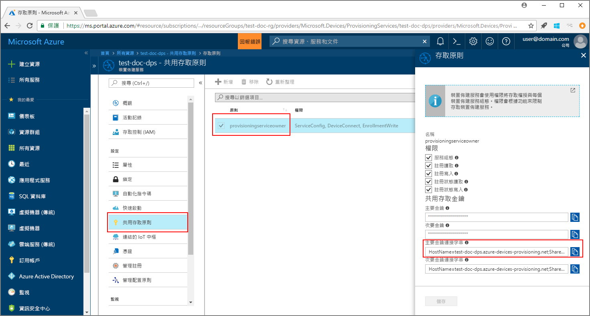
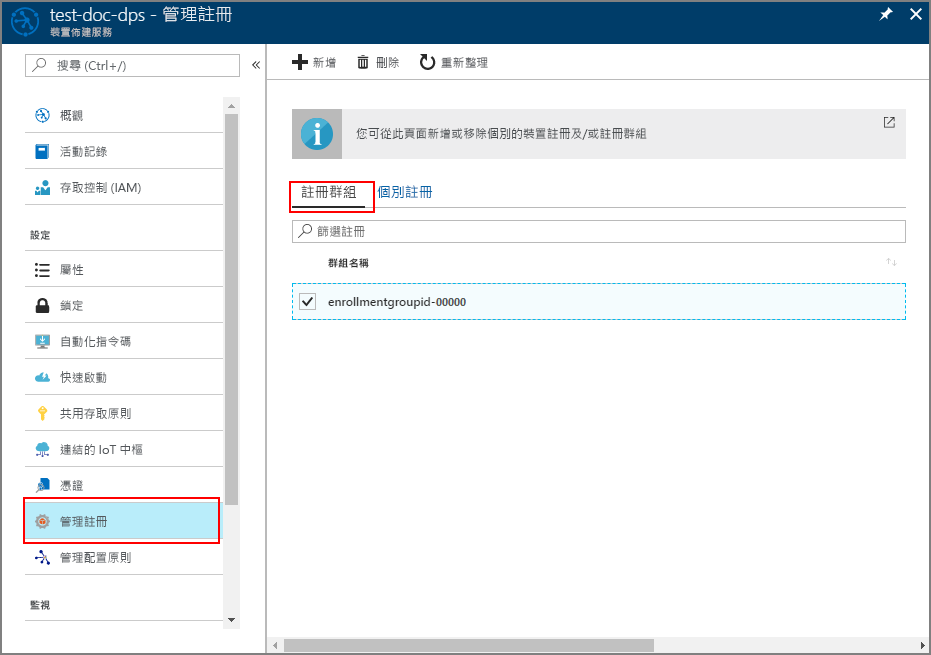

# <a name="quickstart-enroll-x509-devices-to-the-device-provisioning-service-using-java"></a>快速入門：使用 Java 向裝置佈建服務註冊 X.509 裝置

[!INCLUDE [iot-dps-selector-quick-enroll-device-x509](../../includes/iot-dps-selector-quick-enroll-device-x509.md)]

本快速入門說明如何使用 Java 以程式設計方式向 Azure IoT 中樞裝置佈建服務註冊 X.509 模擬裝置的群組。 藉由建立[註冊群組](concepts-service.md#enrollment-group)或[個別註冊](concepts-service.md#individual-enrollment)，可將裝置註冊到佈建服務執行個體。 本快速入門說明如何建立這兩種類型的註冊。 註冊可使用 [Java 服務 SDK](https://azure.github.io/azure-iot-sdk-java/service/) 並輔以範例 Java 應用程式來建立。 

本快速入門預期您已建立 IoT 中樞和裝置佈建服務執行個體。 如果您尚未建立這些資源，請先完成[使用 Azure 入口網站設定 IoT 中樞裝置佈建服務](./quick-setup-auto-provision.md)快速入門，再繼續閱讀本文。

雖然 Java 服務 SDK 在 Windows 和 Linux 電腦上都適用，本文會使用 Windows 開發電腦來逐步引導進行註冊程序。

[!INCLUDE [quickstarts-free-trial-note](../../includes/quickstarts-free-trial-note.md)]

## <a name="prerequisites"></a>必要條件

* 安裝 [Java SE 開發套件 8](http://www.oracle.com/technetwork/java/javase/downloads/jdk8-downloads-2133151.html)。
* 安裝 [Maven 3](https://maven.apache.org/download.cgi)。 您可以執行下列作業，以確認您目前的 Maven 版本：

    ```cmd/sh
    mvn --version
    ```

* 安裝 [Git](https://git-scm.com/download/)。


<a id="javasample"></a>

## <a name="download-and-modify-the-java-sample-code"></a>下載並修改 Java 範例程式碼

本節使用自我簽署 X.509 憑證，請務必留意下列事項：

* 自我簽署憑證僅適用於測試，不應該用於生產環境。
* 自我簽署憑證的預設到期日為一年。

下列步驟說明如何將 X.509 裝置的佈建詳細資料新增至範例程式碼。 

1. 開啟命令提示字元。 使用 Java 服務 SDK 來複製裝置註冊程式碼範例的 GitHub 存放庫：
    
    ```cmd\sh
    git clone https://github.com/Azure/azure-iot-sdk-java.git --recursive
    ```

2. 在下載的原始程式碼中，瀏覽至 _azure-iot-sdk-java/provisioning/provisioning-samples/service-enrollment-group-sample_ 範例資料夾。 在您選擇的編輯器中開啟檔案 _/src/main/java/samples/com/microsoft/azure/sdk/iot/ServiceEnrollmentGroupSample.java_，並新增下列詳細資料：

    1. 從入口網站針對佈建服務新增 `[Provisioning Connection String]`，如下所示：
        1. 在 [Azure 入口網站](https://portal.azure.com)中，瀏覽至您的佈建服務。 
        2. 開啟 [共用存取原則]，並選取具有 EnrollmentWrite 權限的原則。
        3. 複製 [主索引鍵連接字串]。 

              

        4. 在範例程式碼檔案 **_ServiceEnrollmentGroupSample.java_** 中，將 `[Provisioning Connection String]` 取代為**主索引鍵連接字串**。

            ```Java
            private static final String PROVISIONING_CONNECTION_STRING = "[Provisioning Connection String]";
            ```

    2. 新增裝置群組的根憑證。 如果您需要範例根憑證，請使用 _X.509 憑證產生器_工具，如下所示：
        1. 在命令視窗中，瀏覽至資料夾 _azure-iot-sdk-java/provisioning/provisioning-tools/provisioning-x509-cert-generator_。
        2. 執行下列命令來建置工具：

                ```cmd\sh
                mvn clean install
                ```

        4. 使用下列命令來執行工具：

                ```cmd\sh
                cd target
                java -jar ./provisioning-x509-cert-generator-{version}-with-deps.jar
                ```

        5. 出現提示時，您可以選擇輸入憑證的_一般名稱_。
        6. 此工具會在本機產生**用戶端憑證**、**用戶端憑證私密金鑰**和**根憑證**。
        7. 複製**根憑證**，包括 **_-----BEGIN CERTIFICATE-----_** 和 **_-----END CERTIFICATE-----_** 行。 
        8. 將**根憑證**的值指定為參數 **PUBLIC_KEY_CERTIFICATE_STRING**，如下所示：

                ```Java
                private static final String PUBLIC_KEY_CERTIFICATE_STRING =
                        "-----BEGIN CERTIFICATE-----\n" +
                        "XXXXXXXXXXXXXXXXXXXXXXXXXXXXXXXXXXXXXXXXXXXXXXXXXXXXXXXXXXXXXXXX\n" +
                        "XXXXXXXXXXXXXXXXXXXXXXXXXXXXXXXXXXXXXXXXXXXXXXXXXXXXXXXXXXXXXXXX\n" +
                        "XXXXXXXXXXXXXXXXXXXXXXXXXXXXXXXXXXXXXXXXXXXXXXXXXXXXXXXXXXXXXXXX\n" +
                        "XXXXXXXXXXXXXXXXXXXXXXXXXXXXXXXXXXXXXXXXXXXXXXXXXXXXXXXXXXXXXXXX\n" +
                        "XXXXXXXXXXXXXXXXXXXXXXXXXXXXXXXXXXXXXXXXXXXXXXXXXXXXXXXXXXXXXXXX\n" +
                        "XXXXXXXXXXXXXXXXXXXXXXXXXXXXXXXXXXXXXXXXXXXXXXXXXXXXXXXXXXXXXXXX\n" +
                        "XXXXXXXXXXXXXXXXXXXXXXXXXXXXXXXXXXXXXXXXXXXXXXXXXXXXXXXXXXXXXXXX\n" +
                        "XXXXXXXXXXXXXXXXXXXXXXXXXXXXXXXXXXXXXXXXXXXXXXXXXXXXXXXXXXXXXXXX\n" +
                        "XXXXXXXXXXXXXXXXXXXXXXXXXXXXXXXXXXXXXXXXXXXXXXXXXXXXXXXXXXXXXXXX\n" +
                        "XXXXXXXXXXXXXXXXXXXXXXXXXXXXXXXXXXXXXXXXXXXXXXXXXXXXXXXXXXXXXXXX\n" +
                        "-----END CERTIFICATE-----\n";
                ```

        9. 關閉命令視窗，或在出現提示要求「驗證碼」時，輸入 **n**。 
 
    3. (選擇性) 您可以透過範例程式碼來設定佈建服務：
        - 若要將此設定新增至範例，請遵循下列步驟：
            1. 在 [Azure 入口網站](https://portal.azure.com)中，瀏覽至連結到您佈建服務的 IoT 中樞。 開啟中樞的 [概觀] 索引標籤，並複製 [主機名稱]。 將此 [主機名稱] 指派給 IOTHUB_HOST_NAME 參數。

                ```Java
                private static final String IOTHUB_HOST_NAME = "[Host name].azure-devices.net";
                ```
            2. 指派易記的名稱給 DEVICE_ID 參數，並保留 PROVISIONING_STATUS 作為預設的 ENABLED 值。 

        - 或者，如果您選擇不設定佈建服務，請確定在 _ServiceEnrollmentGroupSample.java_ 檔案中，將下列陳述式標記為註解或刪除：

            ```Java
            enrollmentGroup.setIotHubHostName(IOTHUB_HOST_NAME);                // Optional parameter.
            enrollmentGroup.setProvisioningStatus(ProvisioningStatus.ENABLED);  // Optional parameter.
            ```

    4. 研究範例程式碼。 它會建立、更新、查詢並刪除 X.509 裝置的群組註冊。 若要確認入口網站中的註冊成功，請在 _ServiceEnrollmentGroupSample.java_ 檔案的結尾處，將下列幾行程式碼暫時標記為註解：

        ```Java
        // ************************************** Delete info of enrollmentGroup ***************************************
        System.out.println("\nDelete the enrollmentGroup...");
        provisioningServiceClient.deleteEnrollmentGroup(enrollmentGroupId);
        ```

    5. 儲存 _ServiceEnrollmentGroupSample.java_ 檔案。 
 

<a id="runjavasample"></a>

## <a name="build-and-run-sample-group-enrollment"></a>建置並執行範例群組註冊

1. 開啟命令視窗，並瀏覽至 **_azure-iot-sdk-java/provisioning/provisioning-samples/service-enrollment-group-sample_** 資料夾。

2. 使用此命令來建置範例程式碼：

    ```cmd\sh
    mvn install -DskipTests
    ```

   這個命令會將 Maven 套件 [`com.microsoft.azure.sdk.iot.provisioning.service`](https://www.mvnrepository.com/artifact/com.microsoft.azure.sdk.iot.provisioning/provisioning-service-client) 下載到您的電腦。 此套件包含範例程式碼需要建置之 Java 服務 SDK 的二進位檔。 如果您已執行上一節中的 _X.509 憑證產生器_工具，此套件就已下載至您的電腦上。 

3. 在命令視窗中使用這些命令來執行此範例：

    ```cmd\sh
    cd target
    java -jar ./service-enrollment-group-sample-{version}-with-deps.jar
    ```

4. 觀察成功註冊的輸出視窗。

5. 在 Azure 入口網站中，瀏覽至您的佈建服務。 按一下 [管理註冊]。 請注意，您 X.509 裝置的群組會顯示在 [註冊群組] 索引標籤之下，包含自動產生的群組名稱。 

      

## <a name="modifications-to-enroll-a-single-x509-device"></a>註冊單一 X.509 裝置的修改

若要註冊單一 X.509 裝置，請修改[使用 Java 服務 SDK 向 IoT 中樞裝置佈建服務註冊 TPM 裝置](quick-enroll-device-tpm-java.md#javasample)中使用的個別註冊範例程式碼，如下所示：

1. 將 X.509 用戶端憑證的一般名稱複製到剪貼簿。 如果您要使用[上述範例程式碼區段](#javasample)中所示的 _X.509 憑證產生器_工具，請輸入憑證的_一般名稱_，或是使用預設的 **microsoftriotcore**。 使用這個**一般名稱**作為 REGISTRATION_ID 變數的值。 

    ```Java
    // Use common name of your X.509 client certificate
    private static final String REGISTRATION_ID = "[RegistrationId]";
    ```

2. 將變數 TPM_ENDORSEMENT_KEY 重新命名為 PUBLIC_KEY_CERTIFICATE_STRING。 從 _X.509 憑證產生器_工具的輸出複製用戶端憑證或**用戶端憑證**，作為 PUBLIC_KEY_CERTIFICATE_STRING 變數的值。 

    ```Java
    // Rename the variable *TPM_ENDORSEMENT_KEY* as *PUBLIC_KEY_CERTIFICATE_STRING*
    private static final String PUBLIC_KEY_CERTIFICATE_STRING =
            "-----BEGIN CERTIFICATE-----\n" +
            "XXXXXXXXXXXXXXXXXXXXXXXXXXXXXXXXXXXXXXXXXXXXXXXXXXXXXXXXXXXXXXXX\n" +
            "XXXXXXXXXXXXXXXXXXXXXXXXXXXXXXXXXXXXXXXXXXXXXXXXXXXXXXXXXXXXXXXX\n" +
            "XXXXXXXXXXXXXXXXXXXXXXXXXXXXXXXXXXXXXXXXXXXXXXXXXXXXXXXXXXXXXXXX\n" +
            "XXXXXXXXXXXXXXXXXXXXXXXXXXXXXXXXXXXXXXXXXXXXXXXXXXXXXXXXXXXXXXXX\n" +
            "XXXXXXXXXXXXXXXXXXXXXXXXXXXXXXXXXXXXXXXXXXXXXXXXXXXXXXXXXXXXXXXX\n" +
            "XXXXXXXXXXXXXXXXXXXXXXXXXXXXXXXXXXXXXXXXXXXXXXXXXXXXXXXXXXXXXXXX\n" +
            "XXXXXXXXXXXXXXXXXXXXXXXXXXXXXXXXXXXXXXXXXXXXXXXXXXXXXXXXXXXXXXXX\n" +
            "XXXXXXXXXXXXXXXXXXXXXXXXXXXXXXXXXXXXXXXXXXXXXXXXXXXXXXXXXXXXXXXX\n" +
            "XXXXXXXXXXXXXXXXXXXXXXXXXXXXXXXXXXXXXXXXXXXXXXXXXXXXXXXXXXXXXXXX\n" +
            "XXXXXXXXXXXXXXXXXXXXXXXXXXXXXXXXXXXXXXXXXXXXXXXXXXXXXXXXXXXXXXXX\n" +
            "-----END CERTIFICATE-----\n";
    ```
3. 在 **main** 函式中，將 `Attestation attestation = new TpmAttestation(TPM_ENDORSEMENT_KEY);` 這行取代為以下列項目，才能使用 X.509 用戶端憑證：
    ```Java
    Attestation attestation = X509Attestation.createFromClientCertificates(PUBLIC_KEY_CERTIFICATE_STRING);
    ```

4. 使用[建置及執行個別註冊的範例程式碼](quick-enroll-device-tpm-java.md#runjavasample)一節中的步驟，儲存、建置及執行個別註冊範例檔案。


## <a name="clean-up-resources"></a>清除資源
如果您打算探索 Java 服務範例，請勿清除在此快速入門中建立的資源。 如果您不打算繼續，請使用下列步驟來刪除本快速入門建立的所有資源。

1. 在您的電腦上關閉 Java 範例輸出視窗。
1. 在您的電腦上關閉 _X509 憑證產生器_ 視窗。
1. 在 Azure 入口網站中，瀏覽至您的裝置佈建服務，按一下 [管理註冊]，然後選取 [註冊群組] 索引標籤。選取您使用本快速入門註冊之 X.509 裝置的群組名稱，然後按一下刀鋒視窗頂端的 [刪除] 按鈕。  

## <a name="next-steps"></a>後續步驟
在本快速入門中，您已向裝置佈建服務註冊 X.509 裝置的模擬群組。 若要深入了解裝置佈建，請繼續在 Azure 入口網站中進行裝置佈建服務設定的教學課程。 

> [!div class="nextstepaction"]
> [Azure IoT 中樞裝置佈建服務教學課程](./tutorial-set-up-cloud.md)
