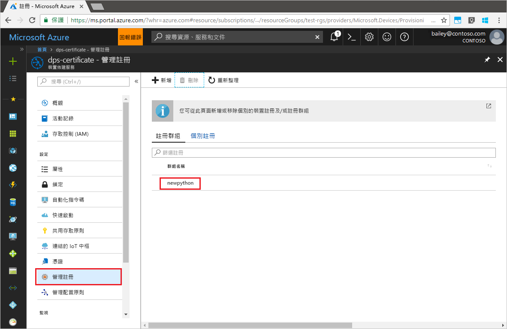

# <a name="quickstart-enroll-x509-devices-to-the-device-provisioning-service-using-python"></a>快速入門：使用 Python 向裝置佈建服務註冊 X.509 裝置

[!INCLUDE [iot-dps-selector-quick-enroll-device-x509](../../includes/iot-dps-selector-quick-enroll-device-x509.md)]

藉由建立[註冊群組](concepts-service.md#enrollment-group)或[個別註冊](concepts-service.md#individual-enrollment)，可將裝置註冊到佈建服務執行個體。 本快速入門說明如何使用 Python 以程式設計方式建立中繼或根 CA X.509 憑證的[註冊群組](concepts-service.md#enrollment-group)。 註冊群組可針對共用憑證鏈結中通用簽署憑證的裝置，控制對於佈建服務的存取權。 註冊群組可使用 [Python 佈建服務 SDK](https://github.com/Azure/azure-iot-sdk-python/tree/master/provisioning_service_client) 和範例 Python 應用程式來建立。 經由 *Python 佈建服務 SDK* 建立個別註冊的功能仍在建置中。 若要深入了解，請參閱[使用 X.509 憑證控制對於佈建服務的裝置存取](./concepts-security.md#controlling-device-access-to-the-provisioning-service-with-x509-certificates)。 如需使用以 X.509 憑證為基礎的公開金鑰基礎結構 (PKI) 搭配 Azure IoT 中樞和裝置佈建服務的詳細資訊，請參閱 [X.509 CA 憑證安全性概觀](https://docs.microsoft.com/azure/iot-hub/iot-hub-x509ca-overview)。 

本快速入門預期您已建立 IoT 中樞和裝置佈建服務執行個體。 如果您尚未建立這些資源，請先完成[使用 Azure 入口網站設定 IoT 中樞裝置佈建服務](./quick-setup-auto-provision.md)快速入門，再繼續閱讀本文。

雖然本文中的步驟在 Windows 和 Linux 電腦上都可運作，但本文是針對 Windows 開發電腦而撰寫的。

[!INCLUDE [quickstarts-free-trial-note](../../includes/quickstarts-free-trial-note.md)]


## <a name="prerequisites"></a>必要條件

- 安裝 [Python 2.x 或 3.x](https://www.python.org/downloads/)。 請務必使用安裝程式所需的 32 位元或 64 位元安裝。 在安裝期間出現系統提示時，務必將 Python 新增至平台特有的環境變數。
- [安裝或升級 pip (Python 套件管理系統)](https://pip.pypa.io/en/stable/installing/)。
- 安裝 [Git](https://git-scm.com/download/)。


## <a name="prepare-test-certificates"></a>準備測試憑證

在進行本快速入門時，您必須要有 .pem 或 .cer 檔案，且該檔案必須包含中繼或根 CA X.509 憑證的公開部分。 此憑證必須上傳至佈建服務，並由服務驗證。 

[Azure IoT C SDK](https://github.com/Azure/azure-iot-sdk-c) 包含的測試工具可協助您建立 X.509 憑證鏈結、從該鏈結上傳根或中繼憑證，並使用驗證憑證的服務來執行所有權證明。 使用 SDK 工具建立的憑證依設計**僅供開發測試之用**。 這些憑證**不可用於生產環境中**。 其中包含會在 30 天後到期的硬式編碼密碼 ("1234")。 若要了解如何取得生產環境適用的憑證，請參閱 Azure IoT 中樞文件中的[如何取得 X.509 CA 憑證](https://docs.microsoft.com/azure/iot-hub/iot-hub-x509ca-overview#how-to-get-an-x509-ca-certificate)。

若要使用這項測試工具來產生憑證，請執行下列步驟： 
 
1. 開啟命令提示字元或 Git Bash 殼層中，並切換至電腦上的工作資料夾。 執行下列命令以複製 [Azure IoT C SDK](https://github.com/Azure/azure-iot-sdk-c) GitHub 存放庫：
    
  ```cmd/sh
  git clone https://github.com/Azure/azure-iot-sdk-c.git --recursive
  ```

  此存放庫的大小目前約為 220 MB。 預期此作業需要幾分鐘的時間才能完成。

  測試工具位於您所複製的存放庫 *azure-iot-sdk-c/tools/CACertificates* 中。    

2. 依照[管理用於範例和教學課程的測試 CA 憑證](https://github.com/Azure/azure-iot-sdk-c/blob/master/tools/CACertificates/CACertificateOverview.md)中的步驟操作。 


## <a name="modify-the-python-sample-code"></a>修改 Python 範例程式碼

本節說明如何將 X.509 裝置的佈建詳細資料新增至範例程式碼。 

1. 使用文字編輯器建立新的 **EnrollmentGroup.py** 檔案。

1. 在 **EnrollmentGroup.py** 檔案開頭處新增下列 `import` 陳述式和變數。 然後，將 `dpsConnectionString` 取代為您的連接字串；您可以使用 **Azure 入口網站** 在您**裝置佈建服務**的**共用存取原則**下找到此字串。 將憑證預留位置取代為先前在[準備測試憑證](quick-enroll-device-x509-python.md#prepare-test-certificates)中建立的憑證。 最後，建立唯一 `registrationid`；切記其中只能包含小寫英數字元與連字號。  
   
    ```python
    from provisioningserviceclient import ProvisioningServiceClient
    from provisioningserviceclient.models import EnrollmentGroup, AttestationMechanism

    CONNECTION_STRING = "{dpsConnectionString}"

    SIGNING_CERT = """-----BEGIN CERTIFICATE-----
    XXXXXXXXXXXXXXXXXXXXXXXXXXXXXXXXXXXXXXXXXXXXXXXXXXXXXXXXXXXXXXXX
    XXXXXXXXXXXXXXXXXXXXXXXXXXXXXXXXXXXXXXXXXXXXXXXXXXXXXXXXXXXXXXXX
    XXXXXXXXXXXXXXXXXXXXXXXXXXXXXXXXXXXXXXXXXXXXXXXXXXXXXXXXXXXXXXXX
    XXXXXXXXXXXXXXXXXXXXXXXXXXXXXXXXXXXXXXXXXXXXXXXXXXXXXXXXXXXXXXXX
    XXXXXXXXXXXXXXXXXXXXXXXXXXXXXXXXXXXXXXXXXXXXXXXXXXXXXXXXXXXXXXXX
    XXXXXXXXXXXXXXXXXXXXXXXXXXXXXXXXXXXXXXXXXXXXXXXXXXXXXXXXXXXXXXXX
    XXXXXXXXXXXXXXXXXXXXXXXXXXXXXXXXXXXXXXXXXXXXXXXXXXXXXXXXXXXXXXXX
    XXXXXXXXXXXXXXXXXXXXXXXXXXXXXXXXXXXXXXXXXXXXXXXXXXXXXXXXXXXXXXXX
    XXXXXXXXXXXXXXXXXXXXXXXXXXXXXXXXXXXXXXXXXXXXXXXXXXXXXXXXXXXXXXXX
    XXXXXXXXXXXXXXXXXXXXXXXXXXXXXXXXXXXXXXXXXXXXXXXXXXXXXXXXXXXXXXXX
    XXXXXXXXXXXXXXXXXXXXXXXXXXXXXXXXXXXXXXXXXXXXXXXXXXXXXXXXXXXXXXXX
    XXXXXXXXXXXXXXXXXXXXXXXXXXXXXXXXXXXXXXXXXXXXXXXXXXXXXXXXXXXXXXXX
    XXXXXXXXXXXXXXXXXXXXXXXXXXXXXXXXXXXXXXXXXXXXXXXXXXXXXXXXXXXXXXXX
    XXXXXXXXXXXXXXXXXXXXXXXXXXXXXXXXXXXXXXXXXXXXXXXXXXXXXXXXXXXXXXXX
    XXXXXXXXXXXXXXXXXXXXXXXXXXXXXXXXXXXXXXXXXXXXXXXXXXXXXXXX
    -----END CERTIFICATE-----"""

    GROUP_ID = "{registrationid}"
    ```

1. 新增下列函式和函式呼叫，以實作群組註冊建立：
   
    ```python
    def main():
        print ( "Initiating enrollment group creation..." )

        psc = ProvisioningServiceClient.create_from_connection_string(CONNECTION_STRING)
        att = AttestationMechanism.create_with_x509_signing_certs(SIGNING_CERT)
        eg = EnrollmentGroup.create(GROUP_ID, att)

        eg = psc.create_or_update(eg)
    
        print ( "Enrollment group created." )

    if __name__ == '__main__':
        main()
    ```

1. 儲存並關閉 **EnrollmentGroup.py** 檔案。
 

## <a name="run-the-sample-group-enrollment"></a>執行範例群組註冊

1. 開啟命令提示字元並執行下列命令，以安裝 [azure-iot-provisioning-device-client](https://pypi.org/project/azure-iot-provisioning-device-client)。

    ```cmd/sh
    pip install azure-iothub-provisioningserviceclient    
    ```

2. 在命令提示字元中，執行指令碼。

    ```cmd/sh
    python EnrollmentGroup.py
    ```

3. 觀察成功註冊的輸出。

4. 在 Azure 入口網站中，瀏覽至您的佈建服務。 按一下 [管理註冊]。 請注意，您 X.509 裝置的群組會出現在 [註冊群組] 索引標籤下，並使用先前建立的名稱 `registrationid`。 

      


## <a name="clean-up-resources"></a>清除資源
如果您打算探索 Java 服務範例，請勿清除在此快速入門中建立的資源。 如果您不打算繼續，請使用下列步驟來刪除本快速入門建立的所有資源。

1. 在您的電腦上關閉 Java 範例輸出視窗。
1. 在您的電腦上關閉 _X509 憑證產生器_ 視窗。
1. 在 Azure 入口網站中，瀏覽至您的裝置佈建服務，按一下 [管理註冊]，然後選取 [註冊群組] 索引標籤。選取您使用本快速入門註冊之 X.509 裝置的群組名稱，然後按一下刀鋒視窗頂端的 [刪除] 按鈕。  


## <a name="next-steps"></a>後續步驟
在本快速入門中，您已向裝置佈建服務註冊 X.509 裝置的模擬群組。 若要深入了解裝置佈建，請繼續在 Azure 入口網站中進行裝置佈建服務設定的教學課程。 

> [!div class="nextstepaction"]
> [Azure IoT 中樞裝置佈建服務教學課程](./tutorial-set-up-cloud.md)
