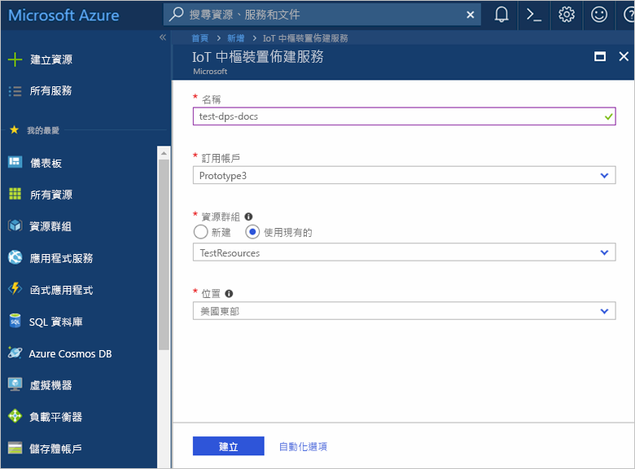
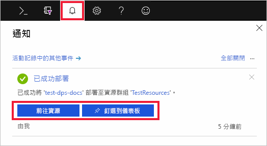
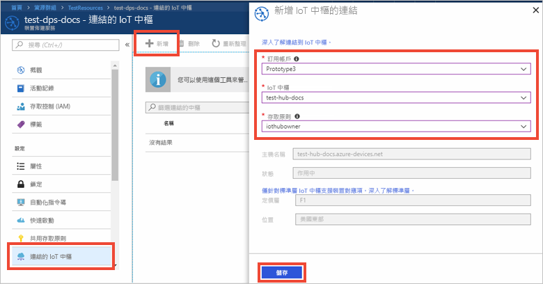

# 快速入門：使用 Azure 入口網站設定 IoT 中樞裝置佈建服務

這些步驟顯示如何在入口網站中設定 Azure 雲端資源，以便佈建裝置。 本文包含以下作業的步驟：建立 IoT 中樞、建立新的 IoT 中樞裝置佈建服務，以及將兩項服務連結在一起。 

如果您沒有 Azure 訂用帳戶，請在開始前建立[免費帳戶](https://azure.microsoft.com/free/?WT.mc_id=A261C142F)。

## 建立 IoT 中樞

[!INCLUDE [iot-hub-include-create-hub](../../includes/iot-hub-include-create-hub.md)]

## 建立 IoT 中樞裝置佈建服務的新執行個體

1. 再次選取 [+ 建立資源]  按鈕。

2. *搜尋 Marketplace* 中是否有**裝置佈建服務**。 選取 [IoT 中樞裝置佈建服務]  ，然後點擊 [建立]  按鈕。 

3. 提供新的「裝置佈建服務」執行個體的下列資訊，然後點擊 [建立]  。

    * **名稱：** 提供新的「裝置佈建服務」執行個體的唯一名稱。 如果您輸入的名稱可用，則會出現綠色核取記號。
    * **訂用帳戶︰** 選擇您想要用於建立此裝置佈建服務執行個體的訂用帳戶。
    * **資源群組：** 此欄位可讓您建立新的資源群組，或選擇現有群組以包含新的執行個體。 選擇包含您先前所建立 IoT 中樞的相同資源群組，例如 **TestResources**。 您可以將所有相關資源一起放在群組中，一併加以管理。 例如，刪除資源群組時，將會刪除該群組中包含的所有資源。 如需詳細資訊，請參閱[管理 Azure Resource Manager 資源群組](../azure-resource-manager/manage-resource-groups-portal.md)。
    * **位置：** 選取最接近裝置的位置。

        

4. 選取通知按鈕，以監視資源執行個體的建立情形。 在服務成功部署後，選取 [釘選到儀表板]  ，然後選取 [前往資源]  。

    

## 連結 IoT 中樞與裝置佈建服務

在本節中，您會將組態新增至裝置佈建服務執行個體。 此組態會設定要對其佈建裝置的 IoT 中樞。

1. 選取 Azure 入口網站左側功能表中的 [所有資源]  按鈕。 選取您在上一節中建立的裝置佈建服務執行個體。  

2. 在裝置佈建服務的功能表中，選取 [連結的 IoT 中樞]  。 點擊位於頂端的 [+ 新增]  按鈕。 

3. 在 [將連結新增至 IoT 中樞]  頁面上，提供下列資訊，以將新「裝置佈建服務」執行個體連結至 IoT 中樞。 然後，點擊 [儲存]  。 

    * **訂用帳戶︰** 選取訂用帳戶，其中包含您想要與新「裝置佈建服務」執行個體連結的 IoT 中樞。
    * **IoT 中樞：** 選取要與新「裝置佈建服務」執行個體連結的 IoT 中樞。
    * **存取原則：** 選取 **iothubowner** 作為認證，以建立與 IoT 中樞的連結。  

        

3. 您現在應會在 [連結的 IoT 中樞]  刀鋒視窗之下看到所選的中樞。 您可能需要點擊 [重新整理]  ，才會顯示中樞。

## 清除資源

此集合中的其他快速入門會以本快速入門為基礎。 如果您打算繼續進行後續的快速入門或教學課程，請勿清除在此快速入門中建立的資源。 如果您不打算繼續，請使用下列步驟，在 Azure 入口網站中刪除本快速入門所建立的所有資源。

1. 從 Azure 入口網站的左側功能表中，選取 [所有資源]  ，然後選取您的裝置佈建服務。 在 [裝置詳細資料] 窗格的頂端，選取 [刪除]  。  
2. 從 Azure 入口網站的左側功能表中，選取 [所有資源]  ，然後選取您的 IoT 中樞。 在 [中樞詳細資料] 窗格的頂端，選取 [刪除]  。  

## 後續步驟

在本快速入門中，您已部署 IoT 中樞和裝置佈建服務執行個體，並已連結這兩個資源。 若要深入了解如何使用這項設定來佈建模擬裝置，請繼續進行建立模擬裝置的快速入門。

> [!div class="nextstepaction"]
> [建立模擬裝置的快速入門](./quick-create-simulated-device.md)
