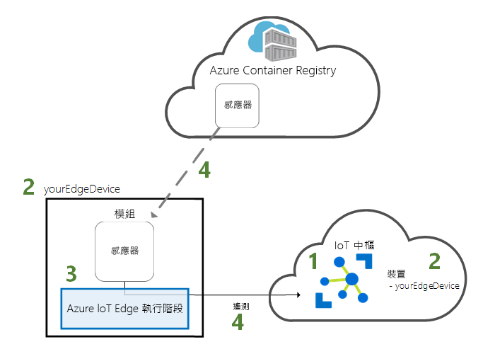
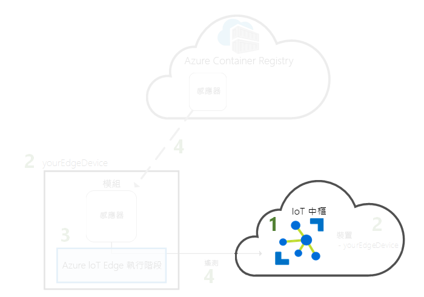
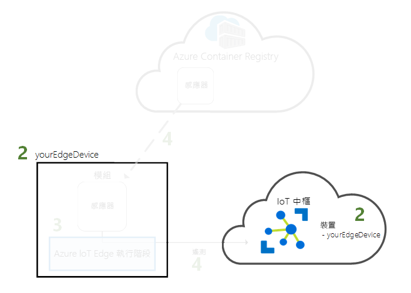
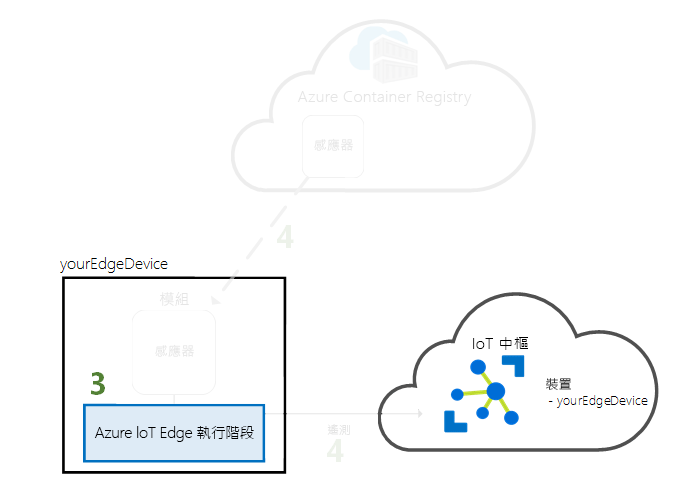
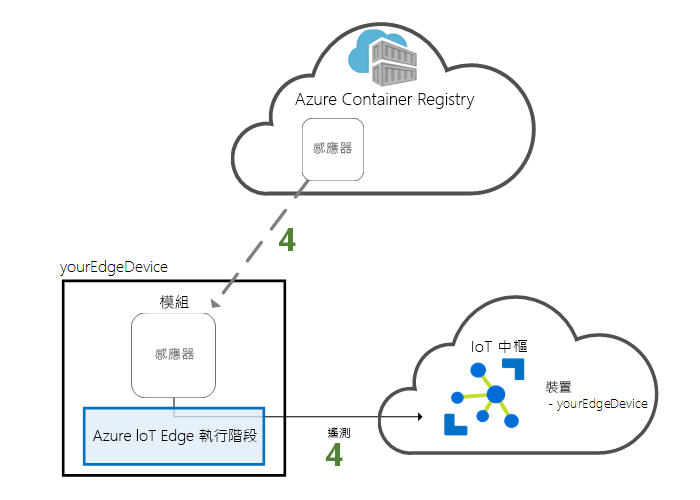

# <a name="quickstart-deploy-your-first-iot-edge-module-to-a-linux-x64-device"></a>快速入門：將您的第一個 IoT Edge 模組部署至 Linux x64 裝置

Azure IoT Edge 會將雲端的強大功能移至您的物聯網裝置。 在本快速入門中，了解如何使用雲端介面將預先建置的程式碼從遠端部署到 IoT Edge 裝置。

在此快速入門中，您將了解如何：

1. 建立 IoT 中樞。
2. 向 IoT 中樞註冊 IoT Edge 裝置。
3. 在裝置上安裝並啟動 IoT Edge 執行階段。
4. 將模組從遠端部署到 IoT Edge 裝置。



本快速入門會讓 Linux 電腦或虛擬機器變成 IoT Edge 裝置。 接著，您可以從 Azure 入口網站將模組部署至裝置。 您在本快速入門中部署的模組是一個模擬感應器，會產生溫度、溼度和壓力資料。 其他 Azure IoT Edge 教學課程會以您在此所做的工作為基礎，部署模組來分析模擬資料以產生商業見解。

如果您沒有使用中的 Azure 訂用帳戶，請在開始前建立[免費帳戶](https://azure.microsoft.com/free)。

[!INCLUDE [cloud-shell-try-it.md](../../includes/cloud-shell-try-it.md)]

您可以使用 Azure CLI 來完成本快速入門中的許多步驟，而且 Azure IoT 有擴充功能可供啟用其他功能。 

將 Azure IoT 擴充功能新增至 Cloud Shell 執行個體。

   ```azurecli-interactive
   az extension add --name azure-cli-iot-ext
   ```

## <a name="prerequisites"></a>必要條件

雲端資源： 

* 一個資源群組，用以管理本快速入門中使用的所有資源。 

   ```azurecli-interactive
   az group create --name IoTEdgeResources --location westus2
   ```

IoT Edge 裝置：

* 當作 IoT Edge 裝置的 Linux 裝置或虛擬機器。 建議使用 Microsoft 提供的 [Azure IoT Edge on Ubuntu](https://azuremarketplace.microsoft.com/en-us/marketplace/apps/microsoft_iot_edge.iot_edge_vm_ubuntu) \(英文\)虛擬機器，它會預先安裝在裝置上執行 IoT Edge 所需的所有項目。 請使用下列命令建立此虛擬機器：

   ```azurecli-interactive
   az vm create --resource-group IoTEdgeResources --name EdgeVM --image microsoft_iot_edge:iot_edge_vm_ubuntu:ubuntu_1604_edgeruntimeonly:latest --admin-username azureuser --generate-ssh-keys --size Standard_DS1_v2
   ```

   建立和啟動新的虛擬機器可能需要幾分鐘的時間。 

   當您建立新的虛擬機器時，請記住在建立命令輸出中提供的 **publicIpAddress**。 您稍後將在本快速入門中使用此公用 IP 位址來連線到虛擬機器。

* 如果您想要在本機系統上執行 Azure IoT Edge 執行階段，請依照[在 Linux (x64) 上安裝 Azure IoT Edge 執行階段](how-to-install-iot-edge-linux.md)的指示操作。

* 如果您想要使用 ARM32 型裝置 (例如 Raspberry Pi)，請依照[在 Linux (ARM32v7/armhf) 上安裝 Azure IoT Edge 執行階段](how-to-install-iot-edge-linux-arm.md)的指示操作。

## <a name="create-an-iot-hub"></a>建立 IoT 中樞

使用 Azure CLI 建立 IoT 中樞，開始進行此快速入門。



此快速入門適用於 IoT 中樞的免費層級。 如果您在過去已使用過 IoT 中樞，並已建立可用的中樞，您可以使用該 IoT 中樞。 每個訂用帳戶只能有一個免費的 IoT 中樞。 

下列程式碼會在資源群組 **IoTEdgeResources** 中建立免費的 **F1** 中樞。 請以 IoT 中樞的唯一名稱取代 {hub_name}。

   ```azurecli-interactive
   az iot hub create --resource-group IoTEdgeResources --name {hub_name} --sku F1 
   ```

   如果因您的訂用帳戶中已有免費中樞而發生錯誤，請將 SKU 變更為 **S1**。 如果您收到無法使用 IoT 中樞名稱的錯誤，則表示其他人已經有該名稱的中樞。 請嘗試新的名稱。 

## <a name="register-an-iot-edge-device"></a>註冊 IoT Edge 裝置

向新建立的 IoT 中樞註冊 IoT Edge 裝置。



建立 IoT Edge 裝置的裝置身分識別，使它能與 IoT 中樞通訊。 裝置身分識別存在於雲端，您可以使用唯一的裝置連接字串，讓實體裝置與裝置身分識別建立關聯。 

由於 IoT Edge 裝置的行為和管理方式不同於典型 IoT 裝置，請使用 `--edge-enabled` 旗標將此身分識別宣告為 IoT Edge 裝置。 

1. 在 Azure Cloud Shell 中輸入下列命令，以在中樞內建立名為 **myEdgeDevice** 的裝置。

   ```azurecli-interactive
   az iot hub device-identity create --hub-name {hub_name} --device-id myEdgeDevice --edge-enabled
   ```

   如果您收到有關 iothubowner 原則金鑰的錯誤，請確定 Cloud Shell 正在執行最新版的 azure-cli-iot-ext 擴充功能。 

2. 擷取裝置的連接字串，此字串將作為連結實體裝置與其在 IoT 中樞內的身分識別。 

   ```azurecli-interactive
   az iot hub device-identity show-connection-string --device-id myEdgeDevice --hub-name {hub_name}
   ```

3. 從 JSON 輸出中複製並儲存連接字串。 您將在下一節中使用此值設定 IoT Edge 執行階段。

   

## <a name="configure-your-iot-edge-device"></a>設定您的 IoT Edge 裝置

在您的 IoT Edge 裝置上啟動 Azure IoT Edge 執行階段。 



IoT Edge 執行階段會在所有 IoT Edge 裝置上部署。 它有三個元件。 **IoT Edge 安全性精靈**會在每次 Edge 裝置開機時啟動，並藉由啟動 IoT Edge 代理程式來啟動該裝置。 **IoT Edge 代理程式**有助於在 IoT Edge 裝置 (包括 IoT Edge 中樞) 上部署及監視模組。 **IoT Edge 中樞**會管理 IoT Edge 裝置上的模組通訊，以及裝置與 IoT 中樞之間的通訊。 

在執行階段設定期間，您必須提供裝置連接字串。 請使用您從 Azure CLI 擷取到的字串。 這個字串會讓實體裝置與 Azure 中的 IoT Edge 裝置身分識別建立關聯。 

### <a name="set-the-connection-string-on-the-iot-edge-device"></a>設定 IoT Edge 裝置的連接字串

如果您是使用必要條件中推薦的「Azure IoT Edge on Ubuntu」，則您的裝置已經安裝 IoT Edge 執行階段。 您只需要使用在上一節中擷取的裝置連接字串來設定裝置。 您可以從遠端設定，而不需要連線到虛擬機器。 執行下列命令，將 **{device_connection_string}** 取代為您自己的字串。 

   ```azurecli-interactive
   az vm run-command invoke -g IoTEdgeResources -n EdgeVM --command-id RunShellScript --script '/etc/iotedge/configedge.sh "{device_connection_string}"'
   ```

如果您是在本機電腦或 ARM32 裝置上執行 IoT Edge，則您需要在您的裝置上安裝 IoT Edge 執行階段及其必要項目。 遵循[在 Linux (x64) 上安裝 Azure IoT Edge 執行階段](how-to-install-iot-edge-linux.md)或[在 Linux (ARM32v7/armhf) 上安裝 Azure IoT Edge 執行階段](how-to-install-iot-edge-linux-arm.md)中的指示操作，然後返回此快速入門。 

### <a name="view-the-iot-edge-runtime-status"></a>檢視 IoT Edge 執行階段狀態

此快速入門中的其餘命令，會在您的 IoT Edge 裝置本身上執行，讓您可以查看在裝置上發生的事。 如果您是使用虛擬機器，現在請使用建立命令所輸出的公用 IP 位址來連線到該機器。 您也可在 Azure 入口網站中您虛擬機器的 [概觀] 頁面上找到該公用 IP 位址。 使用下列命令連線到您的虛擬機器。 如果您使用的使用者名稱，與必要條件中建議的不同，請將 **{azureuser}** 取代為該名稱。 以您的電腦位址取代 **{publicIpAddress}**。 

   ```azurecli-interactive
   ssh azureuser@{publicIpAddress}
   ```

確認執行階段已在您的 IoT Edge 裝置上成功安裝並設定。 

>[!TIP]
>您必須要有提高的權限才能執行 `iotedge` 命令。 當您在安裝 IoT Edge 執行階段之後登出機器，並第一次重新登入時，您的權限將會自動更新。 在那之前，請在這些命令前面使用 **sudo**。 

1. 確認 Edge 安全性精靈正以系統服務的形式執行。

   ```bash
   sudo systemctl status iotedge
   ```

   

2. 如果您需要對服務進行疑難排解，請擷取服務記錄。 

   ```bash
   journalctl -u iotedge
   ```

3. 檢視在您的裝置上執行的模組。 

   ```bash
   sudo iotedge list
   ```

   

IoT Edge 裝置現已設定完成。 並已準備好執行雲端部署的模組。 

## <a name="deploy-a-module"></a>部署模組

從雲端管理您的 Azure IoT Edge 裝置，以部署會將遙測資料傳送到 IoT 中樞的模組。


[!INCLUDE [iot-edge-deploy-module](../../includes/iot-edge-deploy-module.md)]

## <a name="view-generated-data"></a>檢視產生的資料

在此快速入門中，您可以建立新的 IoT Edge 裝置，並在其中安裝 IoT Edge 執行階段。 然後，您會使用 Azure 入口網站來推送 IoT Edge 模組，讓其無須變更裝置本身就能在裝置上執行。 在此案例中，您推送的模組會建立可在教學課程中使用的環境資料。

在您的 IoT Edge 裝置上再次開啟命令提示字元，或從 Azure CLI 使用 SSH 連線。 確認從雲端部署的模組正在 IoT Edge 裝置上執行：

   ```bash
   sudo iotedge list
   ```

   

檢視從溫度感應器模組傳送的訊息：

   ```bash
   sudo iotedge logs SimulatedTemperatureSensor -f
   ```

   >[!TIP]
   >IoT Edge 命令在在參考模組名稱時會區分大小寫。

   

如果您在記錄中看到的最後一行是 **Using transport Mqtt_Tcp_Only**，表示溫度感應器模組可能正在等候連線至 Edge 中樞。 請嘗試停止此模組，並讓 Edge 代理程式重新啟動模組。 您可以使用 `sudo docker stop SimulatedTemperatureSensor` 命令來停止模組。

您也可以使用[適用於 Visual Studio Code 的 Azure IoT 中樞工具組擴充功能](https://marketplace.visualstudio.com/items?itemName=vsciot-vscode.azure-iot-toolkit) (先前稱為 Azure IoT 工具組擴充功能)，查看送達 IoT 中樞的訊息。 

## <a name="clean-up-resources"></a>清除資源

如果您想要繼續進行 IoT Edge 教學課程，您可以使用在本快速入門中註冊和設定的裝置。 否則，您可以刪除您所建立的 Azure 資源，並從裝置中移除 IoT Edge 執行階段。

### <a name="delete-azure-resources"></a>刪除 Azure 資源

如果您是在新的資源群組中建立虛擬機器和 IoT 中樞，您可以刪除該群組和所有相關聯的資源。 再次檢查資源群組的內容，確定沒有您想要保留的內容。 如果您不想刪除整個群組，可改為刪除個別資源。

移除 **IoTEdgeResources** 群組。

   ```azurecli-interactive
   az group delete --name IoTEdgeResources 
   ```

### <a name="remove-the-iot-edge-runtime"></a>移除 IoT Edge 執行階段

如果您想要從裝置移除這些安裝，請使用下列命令。  

移除 IoT Edge 執行階段。

   ```bash
   sudo apt-get remove --purge iotedge
   ```

IoT Edge 執行階段移除後，它所建立的容器隨即停止，但仍會存在於您的裝置上。 檢視所有容器。

   ```bash
   sudo docker ps -a
   ```

刪除 IoT Edge 執行階段在您的裝置上建立的容器。 

   ```bash
   sudo docker rm -f SimulatedTemperatureSensor
   sudo docker rm -f edgeHub
   sudo docker rm -f edgeAgent
   ```

移除容器執行階段。

   ```bash
   sudo apt-get remove --purge moby-cli
   sudo apt-get remove --purge moby-engine
   ```

## <a name="next-steps"></a>後續步驟

本快速入門是所有 IoT Edge 教學課程的先決條件。 您可以繼續閱讀其他任何教學課程，以了解 Azure IoT Edge 可如何協助您將此資料轉換成具有優勢的商業洞見。

> [!div class="nextstepaction"]
> [使用 Azure 函式篩選感應器資料](tutorial-deploy-function.md)
