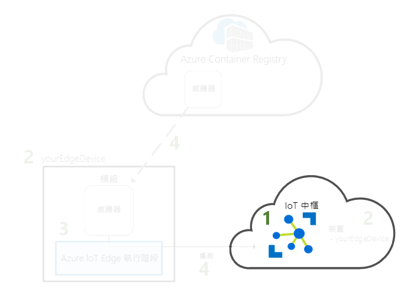
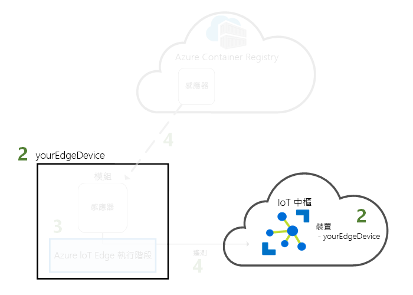
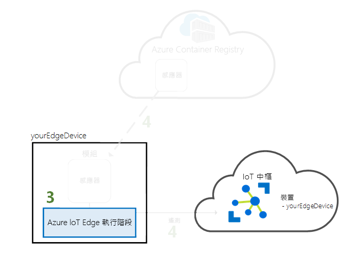
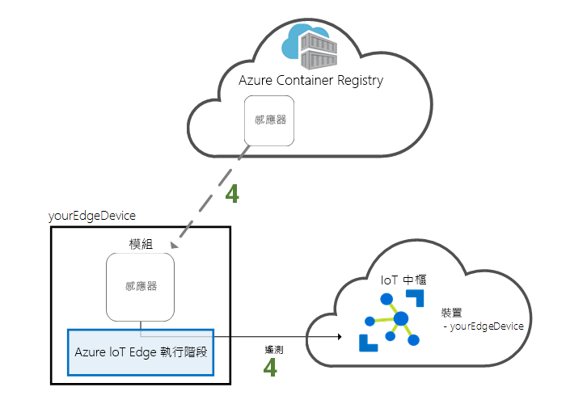

# <a name="quickstart-deploy-your-first-iot-edge-module-to-a-virtual-windows-device"></a>快速入門：將您的第一個 IoT Edge 模組部署至虛擬 Windows 裝置

藉由將容器化程式碼部署至虛擬 IoT Edge 裝置，在本快速入門中測試 Azure IoT Edge。 IoT Edge 可讓您從遠端管理裝置上的程式碼，以便可以將更多的工作負載傳送到邊緣。 在本快速入門中，建議您對 IoT Edge 裝置使用 Azure 虛擬機器，以便您可以快速建立測試機器、安裝必要條件，然後在完成時將它刪除。 

在此快速入門中，您將了解如何：

1. 建立 IoT 中樞。
2. 向 IoT 中樞註冊 IoT Edge 裝置。
3. 在虛擬裝置上安裝並啟動 IoT Edge 執行階段。
4. 將模組從遠端部署至 IoT Edge 裝置，並將遙測資料傳送至 IoT 中樞。


本快速入門會逐步引導您建立 Windows 虛擬機器並將其設定為 IoT Edge 裝置。 接著，您可以從 Azure 入口網站將模組部署至裝置。 您在本快速入門中部署的模組是一個模擬感應器，會產生溫度、溼度和壓力資料。 其他 Azure IoT Edge 教學課程會以您在此所做的工作為基礎，部署模組來分析模擬資料以產生商業見解。

如果您沒有使用中的 Azure 訂用帳戶，請在開始前建立[免費帳戶](https://azure.microsoft.com/free)。

[!INCLUDE [cloud-shell-try-it.md](../../includes/cloud-shell-try-it.md)]

您可以使用 Azure CLI 來完成本快速入門中的許多步驟，而且 Azure IoT 有擴充功能可供啟用其他功能。

將 Azure IoT 擴充功能新增至 Cloud Shell 執行個體。

   ```azurecli-interactive
   az extension add --name azure-cli-iot-ext
   ```

## <a name="prerequisites"></a>必要條件

雲端資源：

* 一個資源群組，用以管理本快速入門中使用的所有資源。

   ```azurecli-interactive
   az group create --name IoTEdgeResources --location westus2
   ```

IoT Edge 裝置：

* 一部 Windows 虛擬機器，可當作您的 IoT Edge 裝置。 您可以建立使用下列命令，並將 *{password}* 取代為安全密碼，來建立此虛擬機器：

  ```azurecli-interactive
  az vm create --resource-group IoTEdgeResources --name EdgeVM --image MicrosoftWindowsDesktop:Windows-10:rs5-pro:latest --admin-username azureuser --admin-password {password} --size Standard_DS1_v2
  ```

  建立和啟動新的虛擬機器可能需要幾分鐘的時間。 然後，在連接到您的虛擬機器時，您可以下載 RDP 檔案以便使用：

  1. 巡覽至您在 Azure 入口網站中的第一個 Windows 虛擬機器。
  1. 選取 [ **連接**]。
  1. 在 [RDP]  索引標籤上，選取 [下載 RDP 檔案]  。

  使用您以 `az vm create`命令指定的系統管理員名稱和密碼，用遠端桌面連線連線到您的 Windows 虛擬機器，以開啟此檔案。


> [!NOTE]
> 為了簡單起見，本快速入門使用的是 Windows 桌面虛擬機器。 如需正式生產情境下一般何種 Windows 作業系統可供使用的資訊，請參閱 [Azure IoT Edge 支援系統](support.md)。
>
> 如果您已經準備好為 IoT Edge 設定自己的 Windows 裝置，包括執行 IoT 核心版的裝置，請遵循[在 Windows 上安裝 Azure IoT Edge 執行階段](how-to-install-iot-edge-windows.md)中的步驟。

## <a name="create-an-iot-hub"></a>建立 IoT 中樞

使用 Azure CLI 建立 IoT 中樞，開始進行此快速入門。



此快速入門適用於 IoT 中樞的免費層級。 如果您在過去已使用過 IoT 中樞，並已建立可用的中樞，您可以使用該 IoT 中樞。 每個訂用帳戶只能有一個免費的 IoT 中樞。

下列程式碼會在資源群組 **IoTEdgeResources** 中建立免費的 **F1** 中樞。 請以 IoT 中樞的唯一名稱取代 {hub_name}  。

   ```azurecli-interactive
   az iot hub create --resource-group IoTEdgeResources --name {hub_name} --sku F1
   ```

   如果因您的訂用帳戶中已有免費中樞而發生錯誤，請將 SKU 變更為 **S1**。 如果您收到無法使用 IoT 中樞名稱的錯誤，則表示其他人已經有該名稱的中樞。 請嘗試新的名稱。

## <a name="register-an-iot-edge-device"></a>註冊 IoT Edge 裝置

向新建立的 IoT 中樞註冊 IoT Edge 裝置。


建立模擬裝置的裝置身分識別，以便與 IoT 中樞通訊。 裝置身分識別存在於雲端，您可以使用唯一的裝置連接字串，讓實體裝置與裝置身分識別建立關聯。

由於 IoT Edge 裝置的行為和管理方式不同於典型 IoT 裝置，請使用 `--edge-enabled` 旗標將此身分識別宣告為 IoT Edge 裝置。

1. 在 Azure Cloud Shell 中輸入下列命令，以在中樞內建立名為 **myEdgeDevice** 的裝置。

   ```azurecli-interactive
   az iot hub device-identity create --device-id myEdgeDevice --hub-name {hub_name} --edge-enabled
   ```

   如果您收到有關 iothubowner 原則金鑰的錯誤，請確定 Cloud Shell 正在執行最新版的 azure-cli-iot-ext 擴充功能。

2. 擷取裝置的連接字串，此字串將作為連結實體裝置與其在 IoT 中樞內的身分識別。

   ```azurecli-interactive
   az iot hub device-identity show-connection-string --device-id myEdgeDevice --hub-name {hub_name}
   ```

3. 從 JSON 輸出複製 `connectionString` 金鑰值並加以儲存。 此值示裝置連接字串。 您將在下一節中使用此連接字串來設定 IoT Edge 執行階段。

   

## <a name="install-and-start-the-iot-edge-runtime"></a>安裝並啟動 IoT Edge 執行階段

在 IoT Edge 裝置上安裝 Azure IoT Edge 執行階段，並使用裝置連接字串進行設定。


IoT Edge 執行階段會在所有 IoT Edge 裝置上部署。 它有三個元件。 **IoT Edge 安全性精靈**會在每次 IoT Edge 裝置開機時啟動，並藉由啟動 IoT Edge 代理程式來啟動該裝置。 **IoT Edge 代理程式**可管理模組在 IoT Edge 裝置 (包括 IoT Edge 中樞) 上的部署和監視。 **IoT Edge 中樞**可處理 IoT Edge 裝置上的模組通訊，以及裝置與 IoT 中樞之間的通訊。

安裝指令碼也包含名為 Moby 的容器引擎，可用來管理 IoT Edge 裝置上的容器映像。

在執行階段安裝期間，系統會要求您提供裝置連接字串。 請使用您從 Azure CLI 擷取到的字串。 這個字串會讓實體裝置與 Azure 中的 IoT Edge 裝置身分識別建立關聯。

### <a name="connect-to-your-iot-edge-device"></a>連線到 IoT Edge 裝置

在本節中所有的步驟皆在您的 IoT Edge 裝置上執行，因此您現在要透過遠端桌面連線到該虛擬機器。

### <a name="install-and-configure-the-iot-edge-service"></a>安裝並設定 IoT Edge 服務

使用 PowerShell 下載並安裝 IoT Edge 執行階段。 使用從 IoT 中樞擷取到的裝置連接字串來設定裝置。

1. 如果您尚未註冊，請依照[註冊新的 Azure IoT Edge 裝置](how-to-register-device.md)中的步驟註冊您的裝置，並擷取裝置連接字串。

2. 以系統管理員身分執行 PowerShell。

   >[!NOTE]
   >使用 PowerShell 的 AMD64 工作階段來安裝 IoT Edge，而不是使用 PowerShell (x86)。 如果您不確定正在使用的工作階段類型，請執行下列命令：
   >
   >```powershell
   >(Get-Process -Id $PID).StartInfo.EnvironmentVariables["PROCESSOR_ARCHITECTURE"]
   >```

3. **部署 IoTEdge** 命令會檢查您的 Windows 電腦上支援的版本、開啟容器功能、下載 Moby 執行階段，然後下載 IoT Edge 執行階段。

   ```powershell
   . {Invoke-WebRequest -useb aka.ms/iotedge-win} | Invoke-Expression; `
   Deploy-IoTEdge -ContainerOs Windows
   ```

4. 您的電腦可能會自動重新啟動。 如果 Deploy-IoTEdge 提示您重新啟動，請立即重新啟動。 

5. 再次以系統管理員身分執行 PowerShell。

6. **Initialize-IoTEdge** 命令會設定機器的 IoT Edge 執行階段。 此命令預設為 Windows 容器的手動佈建。 

   ```powershell
   . {Invoke-WebRequest -useb aka.ms/iotedge-win} | Invoke-Expression; `
   Initialize-IoTEdge -ContainerOs Windows
   ```

7. 當系統提示您提供 **DeviceConnectionString** 時，請提供上一節所複製的字串。 請勿在連接字串兩側加上引號。

### <a name="view-the-iot-edge-runtime-status"></a>檢視 IoT Edge 執行階段狀態

確認已成功安裝並設定執行階段。

1. 檢查 IoT Edge 服務的狀態。

   ```powershell
   Get-Service iotedge
   ```

2. 如果您需要對服務進行疑難排解，請擷取服務記錄。

   ```powershell
   . {Invoke-WebRequest -useb aka.ms/iotedge-win} | Invoke-Expression; Get-IoTEdgeLog
   ```

3. 檢視在 IoT Edge 裝置上執行的所有模組。 由於服務只有第一次會啟動，您應該只會看到 **edgeAgent** 模組正在執行。 EdgeAgent 模組預設會執行，且有助於安裝及啟動您部署至裝置的任何其他模組。

   ```powershell
   iotedge list
   ```

   

完成安裝及 IoT Edge 代理程式模組啟動可能需要幾分鐘時間。

IoT Edge 裝置現已設定完成。 並已準備好執行雲端部署的模組。

## <a name="deploy-a-module"></a>部署模組

從雲端管理您的 Azure IoT Edge 裝置，以部署會將遙測資料傳送到 IoT 中樞的模組。


[!INCLUDE [iot-edge-deploy-module](../../includes/iot-edge-deploy-module.md)]

## <a name="view-generated-data"></a>檢視產生的資料

在本快速入門中，您已註冊 IoT Edge 裝置，並在其中安裝 IoT Edge 執行階段。 然後，您已使用 Azure 入口網站來部署 IoT Edge 模組，使其無須變更裝置本身就能在裝置上執行。

在此案例中，您推送的模組建立了可用於測試的範例資料。 模擬溫度感應器模組產生了後續可用於測試的環境資料。 模擬感應器會同時監視機器本身和機器的周邊環境。 例如，此感應器可能位於伺服器機房中、廠房中或風力發電機上。 訊息包含周圍溫度和溼度、機器溫度和壓力，以及時間戳記。 IoT Edge 教學課程會使用此模組所建立的資料作為分析的測試資料。

確認從雲端部署的模組是在 IoT Edge 裝置上執行。

```powershell
iotedge list
```

   

檢視從溫度感應器模組傳送至雲端的訊息。

```powershell
iotedge logs SimulatedTemperatureSensor -f
```

   >[!TIP]
   >IoT Edge 命令在在參考模組名稱時會區分大小寫。

   

您也可以使用[適用於 Visual Studio Code 的 Azure IoT 中樞工具組擴充功能](https://marketplace.visualstudio.com/items?itemName=vsciot-vscode.azure-iot-toolkit) (先前稱為 Azure IoT 工具組擴充功能)，查看送達 IoT 中樞的訊息。

## <a name="clean-up-resources"></a>清除資源

如果您想要繼續進行 IoT Edge 教學課程，您可以使用在本快速入門中註冊和設定的裝置。 否則，您可以刪除您建立的 Azure 資源，以避免產生費用。

如果您是在新的資源群組中建立虛擬機器和 IoT 中樞，您可以刪除該群組和所有相關聯的資源。 再次檢查資源群組的內容，確定沒有您想要保留的內容。 如果您不想刪除整個群組，可改為刪除個別資源。

移除 **IoTEdgeResources** 群組。

```azurecli-interactive
az group delete --name IoTEdgeResources
```

## <a name="next-steps"></a>後續步驟

在本快速入門中，您已建立 IoT Edge 裝置，並使用 Azure IoT Edge 雲端介面將程式碼部署至裝置上。 現在，您已有測試裝置，可產生其環境的相關原始資料。

下一個步驟是設定您的本機開發環境，以便您可以開始建立 IoT Edge 模組執行您的商務邏輯。 

> [!div class="nextstepaction"]
> [開始開發 Windows 裝置適用的 IoT Edge 模組](tutorial-develop-for-windows.md)
