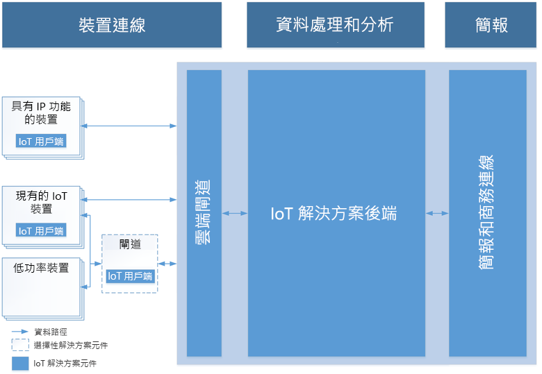

# Azure 和物聯網簡介

Azure IoT 是由三個領域的技術和解決方案所組成：解決方案，平台服務和 Edge，全部都是為了加速 IoT 應用程式開發全程而設計。 本文一開始會描述雲端中 IoT 解決方案的共同特性，然後概述 Azure IoT 如何面對 IoT 專案中的挑戰，以及為什麼您應該考慮採用 Azure IoT。

## IoT 解決方案架構

IoT 解決方案需要裝置 (可能數以百萬計) 與解決方案後端之間有安全、雙向的通訊。 例如，解決方案可能會使用自動化的預測性分析，以從裝置到雲端的事件串流中發掘出有用見解。 

下圖顯示典型 IoT 解決方案架構的重要元素。 此圖表與不限定於特定實作詳細資料 (如所使用的 Azure 服務和裝置作業系統)。 在此架構中，IoT 裝置會收集其傳送到雲端閘道的資料。 雲端閘道可讓資料供其他後端服務處理。 這些後端服務可以將資料提供給：

* 其他企業營運應用程式。
* 操作人員 (透過儀表板或其他簡報裝置)。

> [!NOTE]
> 如需 IoT 架構的深入討論，請參閱 [Microsoft Azure IoT 參考架構](https://aka.ms/iotrefarchitecture)。

### 裝置連線能力

在 IoT 解決方案架構中，裝置通常會將遙測傳送至雲端進行儲存和處理。 例如，在預測性維護案例中，解決方案後端可能會使用感應器資料流，來判斷特定幫浦何時需要維護。 裝置也可以透過讀取來自雲端端點的訊息，以接收和回應雲端到裝置訊息。 在某些例子中，解決方案後端可能會傳送訊息給幫浦站的其他幫浦，以在維護應開始之前先重新路由流量。 此程序可確保維護工程師一到場時即可開始工作。

安全、可靠的裝置連線通常是 IoT 方案中的最大挑戰。 這是因為相較於其他用戶端 (例如瀏覽器和行動應用程式)，IoT 裝置有不同的特性。 具體來說，IoT 裝置有以下特性：

* 通常是無人操作的嵌入式系統 (不同於手機)。
* 可以部署於實體存取成本昂貴的遠端位置。
* 可能只能透過解決方案後端來存取。 沒有其他方式可與裝置互動。
* 能力和/或處理資源可能都有限。
* 網路連線能力可能不穩定、緩慢或昂貴。
* 可能需要使用專屬、自訂或業界特定的應用程式通訊協定。
* 可以使用一組大型常見的硬體和軟體平台來建立。

除了上述限制，IoT 解決方案還必須是可擴充、安全和可靠的。

根據不同通訊協定和網路可用性，裝置可以與雲端直接通訊或透過中繼閘道通訊。 IoT 架構通常會是這兩種通訊模式的混合。

### 資料處理和分析

在最新的 IoT 解決方案中，資料處理可以在雲端或裝置端進行。 裝置端處理指的是「邊緣運算」。 選擇資料處理位置的決定因素如下：

* 網路條件。 如果裝置與雲端之間的頻寬有限，就需要進行更多邊緣處理。
* 回應時間。 如果要在裝置上執行幾乎需要即時處理的動作，可能比較適合在裝置本身中處理回應。 例如，機器人手臂需要在發生緊急狀況時停止。
* 法規環境。 某些資料無法傳送至雲端。

一般來說，邊緣和雲端中的資料處理皆包含下列功能：

* 接收大規模來自裝置的遙測資料，並判斷如何處理與儲存該資料。
* 分析遙測資料並提供見解 (即時或事後)。
* 將命令從雲端或閘道裝置傳送到特定裝置。

此外，IoT 雲端後端應提供：

* 裝置註冊功能，讓您可以：
    * 佈建裝置。
    * 控制哪些裝置可連接到您的基礎結構。
* 可讓您控制裝置狀態並監視其活動的裝置管理。

例如，在預測性維護案例中，雲端後端會儲存歷史遙測資料。 解決方案會使用此資料來識別特定幫浦上的潛在異常行為，以免真的發生問題。 使用資料分析，雲端後端就可以識別預防性解決方案要將命令傳回裝置，並採取矯正措施。 此程序會在裝置與雲端間產生自動回應迴圈，大幅提升解決方案的效率。

### 簡報及商務連線

簡報及商務連線層可讓終端使用者與 IoT 解決方案及裝置互動。 其讓使用者能夠檢視和分析從他們的裝置所收集的資料。 這些檢視可以採用儀表板或 BI 報表的格式，以顯示歷程記錄資料及/或接近即時的資料。 例如，操作員可確認特定幫浦站的狀態，並查看系統產生的任何警示。 此層也可整合 IoT 解決方案與現有企業營運應用程式，以連結企業商務程序或工作流程。 比方說，預測性維護解決方案可整合排程系統，以在解決方案識別出需要維護的幫浦時，預約工程師到幫浦站檢查。

## 為何選擇 Azure IoT？

Azure IoT 簡化了 IoT 專案的複雜性，並解決了諸如安全性、基礎結構不相容以及調整 IoT 解決方案規模等挑戰。 方法說明如下：

### 敏捷

加速您的 IoT 旅程。

* 規模：從小型專案開始，無論何處都可擴展到任何規模，涵蓋全球大多數地區的數百萬部裝置和以 TB 計的資料。

* 開放：藉由連接到任何裝置、軟體或服務來使用您手邊所擁有的解決方案，或是進行現代化以供未來使用。

* 混合：藉由在 Edge、雲端或兩者之間任何位置部署您的 IoT 解決方案，以根據需求來建置。

* 步調：藉由 IoT 解決方案加速器和創新步伐的領先優勢，以加快部署、加速產品上市時間並保持競爭優勢。

### 完整

為您的業務帶來影響力。

* 完整：只有 Microsoft 所提供的 IoT 解決方案能夠涵蓋裝置到雲端的完整平台，遍及大數據、進階分析，並具有受控服務。

* 邁向成功的合作夥伴：運用全球最大的合作夥伴生態系統的力量，並在全球跨越產業以實現企業營運和技術。

* 資料驅動：IoT 的核心就是資料。最佳的 IoT 解決方案將儲存、解譯、轉換、分析和呈現資料所需的所有工具匯集在一起，以便在適當的時間和地點帶給適當的使用者。

* 以裝置為中心：Microsoft IoT 允許您連線任何裝置，從傳統設備到通過認證的廣泛硬體生態系統，以及在 Edge、行動和內嵌系統中自行建置裝置的能力。

### 安全

解決 IoT 中最難的部分，也就是安全性。

* 更多功能：您可以透過 Microsoft IoT，結合願景與技術、最佳作法和功能，以解決 IoT 最難的部分，也就是安全性。

* 採取行動：透過身分識別和存取管理、威脅和資訊保護以及安全性管理，以保護您的 IoT 資料並管理風險。

* 安心：確保跨裝置、軟體、應用程式和雲端服務，以及內部部署環境中的機密資訊安全性。

* 合規性：針對 IoT 裝置、資料和服務，Microsoft 一直引領業界建立滿足多種國際和業界特定標準的安全性需求。

## 後續步驟

探索下列技術和解決方案領域。

**解決方案**

* [IoT 解決方案加速器](/azure/iot-suite)
* [IoT 中心](/azure/iot-central)

**平台服務**

* [IoT 中心](/azure/iot-hub)
* [IoT 中樞裝置佈建服務](/azure/iot-dps)
* [Azure 地圖服務](/azure/azure-maps/)
* [時間序列深入解析](/azure/time-series-insights)

**Edge**

* [IoT Edge 概觀](/azure/iot-edge)
* [什麼是 IoT Edge](/azure/how-iot-edge-works)
