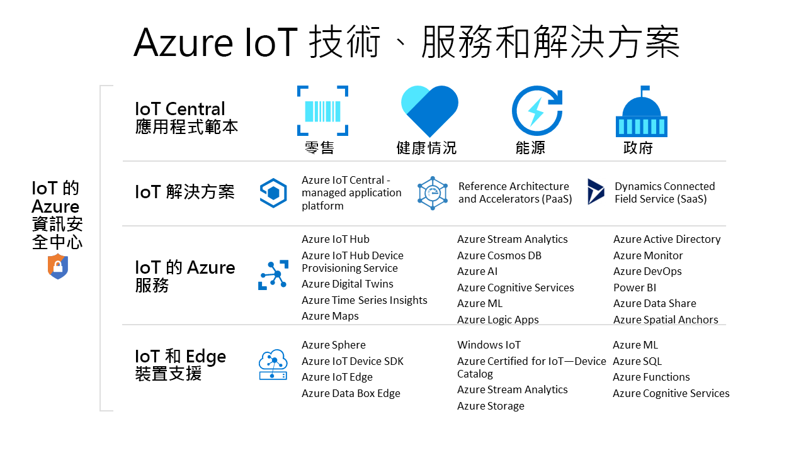

# 用來建立 IoT 解決方案的 Azure 技術和服務

Azure IoT 技術和服務可讓您選擇建立各種 IoT 解決方案，以便讓組織進行數位轉型。 例如，您可以：

- 使用 [Azure IoT Central](https://apps.azureiotcentral.com) (受控 IoT 應用程式平台) 來建置及部署安全的企業級 IoT 解決方案。 IoT Central 具有一系列產業專屬的應用程式範本 (例如零售和醫療保健)，可加速您的解決方案開發流程。
- 擴充適用於 Azure IoT [解決方案加速器](https://www.azureiotsolutions.com)的開放原始碼程式碼基底，以實作常見的 IoT 案例，例如遠端監視或預測性維護。
- 使用 Azure IoT 平台服務 (例如 [Azure IoT 中樞](../iot-hub/about-iot-hub.md)和 [Azure IoT 裝置 SDK](../iot-hub/iot-hub-devguide-sdks.md)) 從頭開始建置自訂的 IoT 解決方案。

## Azure IoT 中心

[IoT Central 應用程式平台](https://apps.azureiotcentral.com)可降低開發、管理及維護企業級 IoT 解決方案的負擔和成本。 IoT Central 的可自訂 Web UI 能讓您監視裝置狀況、建立規則，以及在數百萬個裝置的整個生命週期中管理裝置及其資料。 IoT Central 中的 API 介面可讓您獲得程式設計權限，以設定 IoT 解決方案並與其互動。

Azure IoT Central 是完全受控的應用程式平台，可供您用來建立自訂的 IoT 解決方案。 IoT Central 會使用應用程式範本來建立解決方案。 有適用於一般解決方案的範本，也有適用於特定產業 (例如能源、醫療保健、政府和零售) 的範本。 IoT Central 應用程式範本可讓您在幾分鐘內就部署好 IoT Central 應用程式，然後再使用主題、儀表板和檢視加以自訂。

從 [Azure IoT 認證裝置目錄](https://catalog.azureiotsolutions.com)選擇裝置，以快速連線到您的解決方案。 使用 IoT Central Web UI 來監視和管理您的裝置，讓這些裝置保持良好且連線的狀態。 使用連接器和 API 來整合 IoT Central 應用程式與其他商務應用程式。

作為完全受控的應用程式平台，IoT Central 具有簡單且可預測的定價模型。

## Azure IoT 解決方案加速器

[Azure IoT 解決方案加速器](https://www.azureiotsolutions.com)是企業級可自訂解決方案的集合。 您可以原封不動地部署這些解決方案，也可以使用開放原始碼 Java 或 .NET 原始程式碼來開發自訂的 IoT 解決方案。

Azure IoT 解決方案加速器可提升您對 IoT 解決方案的控制能力。 解決方案加速器包含預先建置而可用於常見 IoT 案例的解決方案，因此您可以在幾分鐘內就部署到 Azure 訂用帳戶中。 這些案例包括：

  - 遠端監視
  - 連線的處理站
  - 預測性維護
  - 裝置模擬

所有解決方案加速器的開放原始碼程式碼基底都可以在 GitHub 上取得。 請下載程式碼以自訂解決方案加速器來符合您特有的 IoT 需求。

解決方案加速器會使用必須在 Azure 訂用帳戶中才能管理的 Azure 服務 (例如 Azure IoT 中樞和 Azure 儲存體)。

## 自訂解決方案

若要從頭開始建置 IoT 解決方案，或擴充使用 IoT Central 或解決方案加速器所建立的解決方案，請使用下列一或多項 Azure IoT 技術和服務：

### 裝置

使用其中一個 [Azure IoT 入門套件](https://catalog.azureiotsolutions.com/kits)來開發 IoT 裝置，或從 [Azure IoT 認證裝置目錄](https://catalog.azureiotsolutions.com)中選擇要使用的裝置。 使用開放原始碼[裝置 SDK](../iot-hub/iot-hub-devguide-sdks.md) 來實作內嵌程式碼。 裝置 SDK 支援多種作業系統，例如 Linux、Windows 和即時作業系統。 有適用於多種程式設計語言的 SDK，例如 [C](https://github.com/Azure/azure-iot-sdk-c)、[Node.js](https://github.com/Azure/azure-iot-sdk-node)、[Java](https://github.com/Azure/azure-iot-sdk-java)、[.NET](https://github.com/Azure/azure-iot-sdk-csharp) 和 [Python](https://github.com/Azure/azure-iot-sdk-python)。

您可以使用 [IoT 隨插即用預覽版](../iot-pnp/overview-iot-plug-and-play.md)服務，進一步簡化為裝置建立內嵌程式碼的方式。 IoT 隨插即用可讓解決方案開發人員將裝置與解決方案整合，而不需要撰寫任何內嵌程式碼。 IoT 隨插即用的核心是說明裝置功能的「裝置功能模型」  結構描述。 使用裝置功能模型來產生內嵌裝置程式碼，並設定雲端式解決方案，例如 IoT Central 應用程式。

[Azure IoT Edge](../iot-edge/about-iot-edge.md) 可讓您將部分的 IoT 工作負載從 Azure 雲端服務卸載至您的裝置。 IoT Edge 可以減少解決方案中的延遲、減少裝置與雲端交換的資料量，以及啟用離線案例。 您可以從 IoT Central 和一些解決方案加速器來管理 IoT Edge 裝置。

[Azure Sphere](https://docs.microsoft.com/azure-sphere/product-overview/what-is-azure-sphere) 是安全且高階應用程式平台，搭配可供連網裝置使用的內建通訊及安全性功能。 其包含安全的微控制器單元、自訂的 Linux 型作業系統，以及可提供持續、可更新安全性的雲端式安全性服務。

### 雲端連線能力

[Azure IoT 中樞](../iot-hub/about-iot-hub.md)服務可在數百萬個 IoT 裝置和一個雲端式解決方案之間實現可靠且安全的雙向通訊。 [Azure IoT 中樞裝置佈建服務](../iot-dps/about-iot-dps.md)是 IoT 中樞的協助程式服務。 此服務可自動就將裝置以 Just-in-Time 的方式佈建到正確的 IoT 中樞，您完全不必介入。 這些功能可讓客戶以安全且可擴充的方式佈建數百萬個裝置。

IoT 中樞是解決方案加速器的核心元件，可供您用來因應 IoT 實作挑戰，例如：

* 大量裝置的連線能力和管理。
* 大量的遙測資料擷取。
* 裝置的命令與控制。
* 裝置安全性的強制執行。

### 消除實體和數位世界的隔閡

[Azure Digital Twins](../digital-twins/about-digital-twins.md) 是一項 IoT 服務，可讓您建立實體環境的模型。 其會使用空間智慧圖形，以建立人員、空間和裝置之間的關聯性模型。 讓數位世界與實體世界之間的資料相互關聯，您即可建立內容感知的解決方案。

Iot Central 使用 Digital Twins 來讓真實世界中的裝置和資料與數位模型保持同步，從而讓使用者能夠監視和管理已連線的裝置。

### 資料與分析

IoT 裝置通常會產生大量的時間序列資料，例如來自感應器的溫度讀數。 [Azure 時間序列深入解析](../time-series-insights/time-series-insights-overview.md)可以連線到 IoT 中樞、從您的裝置讀取遙測串流、儲存該資料，以及讓您查詢該資料並將其視覺化。

## 後續步驟

如需實際操作體驗，請嘗試下列其中一個快速入門：

- [建立 Azure IoT Central 應用程式](../iot-central/core/quick-deploy-iot-central.md)
- [將遙測資料從裝置傳送到 IoT 中樞](../iot-hub/quickstart-send-telemetry-cli.md)
- [試用雲端式遠端監視解決方案](../iot-accelerators/quickstart-remote-monitoring-deploy.md)
