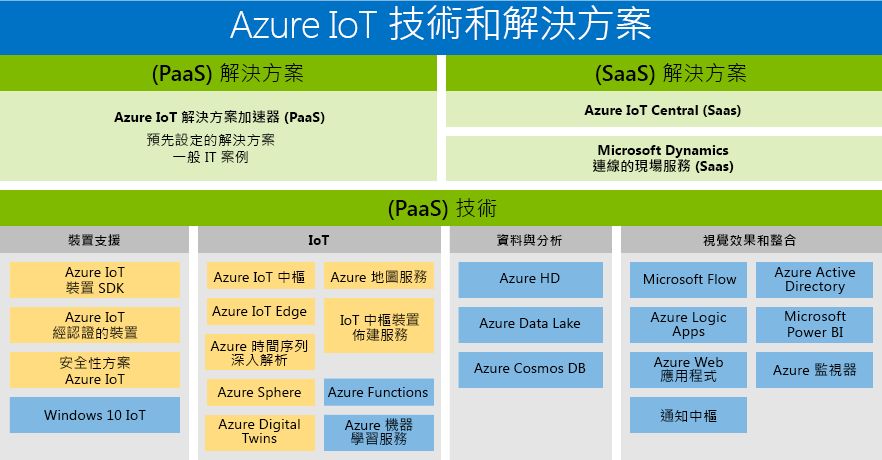

# Azure 物聯網技術與解決方案：PaaS 與 SaaS

Microsoft 已建立一個能支援所有客戶需求的產品組合，讓每個人都能享用數位轉換的優點。 Azure IoT 產品組合概述可用的 PaaS/SaaS 技術與解決方案。 它提供兩種途徑讓您建立自己的解決方案：

- 平台即服務 (PaaS)：使用下列任何服務建置您的應用程式。
    - [Azure IoT 解決方案加速器](https://www.azureiotsolutions.com/)是預先設定的企業級解決方案集合，可讓您加快自訂 IoT 解決方案的開發速度，或是 
    - [Azure Digital Twins](https://azure.microsoft.com/services/digital-twins/) 服務，可讓您建立實體環境的模型，以使用空間智慧圖形和特定網域物件模型建立內容感知的 IoT 解決方案。

- 軟體即服務 (SaaS)：可讓您快速開始使用 [Azure IoT 中心](https://azure.microsoft.com/services/iot-central/)這個新的 SaaS 解決方案，來開發 IoT 應用程式，而無須接觸到複雜的 IoT 解決方案。 如果您的組織缺少資源而無法建立您自己的 IoT 解決方案，Azure IoT 中心是一種無程式碼的 IoT 解決方案，可以在數分鐘內建立裝置型號、儀表板和規則。

## 解決方案

快速開始使用解決方案加速器和 SaaS 供應項目。 選擇預先設定的解決方案，讓您能夠使用常見的 IoT 案例，例如遠端監視、預測性維護，以及連線的處理站，以建立可完全自訂的解決方案。 或使用 Azure IoT 中心這個完全受控、端對端解決方案，讓您無須具備雲端解決方案的專長，也能運用強大的 IoT 情節。

### Azure IoT 解決方案加速器 (PaaS)

Azure IoT 解決方案加速器是可自訂的 PaaS 解決方案，能提供高階功能來控管您的 IoT 解決方案。 如果您的企業正為已連線作業實作 IoT，或有物聯網產品方面的特定自訂需求，Azure IoT 解決方案加速器會提供您所需要的控制項。 

有大量裝置或裝置型號的組織，以及尋求連線的處理站解決方案的製造商，都是從 IoT 解決方案加速器獲益的例子。 IoT 解決方案加速器會建立針對複雜需求量身打造且可高度自訂的解決方案，以提供： 

- 預先建置的解決方案
    - 遠端監視
    - 連線的處理站
    - 預測性維護
    - 裝置模擬
- 能夠快速部署
- 縮短價值時間
- 具備強大控管功能的解決方案 
 
### Azure IoT 中心 (SaaS)

Azure 的 IoT 中心是完全受控的 SaaS 解決方案，讓您無須具備豐富的 IoT 體驗也能快速開始使用。 如果您的企業追求速度勝於自訂，SaaS 模型最符合您的 IoT 實作需求。 

裝置型號較少、可預測情節較多，且 IoT/IT 能力有限的組織，現在能夠透過 SaaS 方法享有 IoT 的優點。 過去缺乏時間、經費與專業能力而無法開發物聯網產品的公司，現在可以快速地開始使用 Azure IoT 中心。 Microsoft 一直領導產業提供成熟的 SaaS 解決方案，以處理常見的 IoT 實作需求。 

- 完全受控的 IoT SaaS
- 無須具備雲端解決方案開發專業能力
- 可針對您的需求設定
- 適用於簡單的 IoT 需求

### 比較 Azure IoT 解決方案加速器與 Azure IoT 中心

若要實作典型的 [IoT 解決方案架構](/azure/iot-fundamentals/iot-introduction#iot-solution-architecture)，Azure IoT 提供了 [Azure IoT 解決方案加速器](/azure/iot-suite)及 [Azure IoT 中心](https://www.microsoft.com/internet-of-things/iot-central-saas-solutions)等數種選擇，分別滿足不同的客戶需求。

[Azure IoT 中樞](https://azure.microsoft.com/services/iot-hub/)是 Azure IoT 中心和 Azure IoT 解決方案加速器都會使用的核心 Azure PaaS。 IoT 中樞可在數百萬個 IoT 裝置和一個雲端解決方案之間啟用可靠且安全的雙向通訊。 IoT 中樞可協助您因應 IoT 實作挑戰，例如：

* 大量裝置的連線能力和管理。
* 大量的遙測資料擷取。
* 裝置的命令與控制。
* 裝置安全性的強制執行。

選擇 Azure IoT 產品是規劃您 IoT 解決方案的重要部分。 IoT 中樞是獨立的 Azure 服務，本身不會提供端對端的 IoT 解決方案。 IoT 中樞可以作為任何 IoT 解決方案的起點，而且不需要透過 Azure IoT 解決方案加速器或 Azure IoT 中心就可使用。 Azure IoT 解決方案加速器和 Azure IoT 中心都會使用 IoT 中樞與其他 Azure 服務。 下表彙總了 Azure IoT 解決方案加速器和 Azure IoT 中心之間的主要差異，可協助您根據需求做出正確的選擇：

|                        | Azure IoT 解決方案加速器 | Azure IoT 中心 |
| ---------------------- | --------- | ----------- |
| 主要用途 | 加速開發需要最大彈性的自訂 IoT 解決方案。 | 加速簡易 IoT 解決方案上市時間，不需要深入的服務自訂。 |
| 存取基礎 PaaS 服務          | 您可存取基礎 Azure 服務來加以管理，或視需要加以取代。 | SaaS。 完全受控的解決方案，不會公開基礎服務。 |
| 彈性            | 高。 微服務的程式碼是開放原始碼，您可以使用任何您認為合適的方式修改它。 此外，您可以自訂部署基礎結構。| 中。 您可以使用以內建瀏覽器為基礎的使用者體驗，自訂解決方案模型和 UI 層面。 基礎結構無法自訂，因為並不會公開各種元件。|
| 技能層級                 | 中高。 需要 Java 或 .NET 技能來自訂解決方案後端。 您需要 JavaScript 技能來自訂視覺效果。 | 低。 您需要有建立模型的技能來自訂解決方案。 不需要編寫程式碼的技能。 |
| 上手體驗 | 解決方案加速器可實作常見的 IoT 案例。 可在幾分鐘內部署完成。 | 應用程式範本和裝置範本會提供預先建置的模型。 可在幾分鐘內部署完成。 |
| 價格                | 您可以微調該服務以控制成本。 | 簡單且可預測的定價結構。 |

決定使用哪個產品來建置 IoT 解決方案的最重要因素如下：

* 您的業務需求
* 您要建置的解決方案類型
* 以長期來看，貴組織建置與維護解決方案的一套技能

## 技術 (PaaS)

透過平台服務最完整的 IoT 產品組合，跨越 Azure 平台的平台即服務 (PaaS) 技術可讓您輕鬆地建立、自訂及控制您 IoT 解決方案的各個層面。 與數十億個 IoT 裝置建立雙向溝通，並大規模地管理您的 IoT 裝置。 然後將您的 IoT 裝置資料與如 Azure Cosmos DB 與 Azure 時間序列深入解析等其他平台服務整合，以加強整個解決方案中的見解。 

### 裝置支援

善用 [Azure IoT 入門套件](https://catalog.azureiotsuite.com/kits)或從[裝置目錄](http://catalog.azureiotsuite.com/)的上百個 IoT 認證裝置中作出選擇，充滿自信地開始您的 IoT 專案。 所有裝置皆為平台中立並經過測試，能夠順暢連接 IoT 中樞。
使用開放原始碼[裝置 SDK](/azure/iot-hub/iot-hub-devguide-sdks)，將您所有的裝置連接至 Azure IoT。 SDK 支援多種作業系統，例如 Linux、Windows 及即時作業系統，並支援多種程式設計語言，像是 [C](https://github.com/Azure/azure-iot-sdk-c)、[Node.js](https://github.com/Azure/azure-iot-sdk-node)、[Java](https://github.com/Azure/azure-iot-sdk-java)、[.NET](https://github.com/Azure/azure-iot-sdk-csharp) 及 [Python](https://github.com/Azure/azure-iot-sdk-python)。

### IoT 
[Azure IoT 中樞](https://azure.microsoft.com/services/iot-hub/)是一項完全受控的服務，可在數百萬個 IoT 裝置和一個解決方案後端之間啟用可靠且安全的雙向通訊。 Azure IoT 中樞裝置佈建服務是 IoT 中樞的協助程式服務，無須人為介入，即可對正確的 IoT 中樞進行 Just-In-Time 自動佈建，讓客戶能以安全又可調整的方式佈建數百萬個裝置。

### Edge
[Azure IoT Edge](https://azure.microsoft.com/services/iot-edge/) 是一項 IoT 服務。 這項服務提供客戶在裝置上分析資料的服務，也稱為 「就地型」。 將部分的工作負載就地化，便可減少延遲並能選擇離線情節。

### 空間智慧
[Azure Digital Twins](https://azure.microsoft.com/services/digital-twins/) 是一項 IoT 服務，可讓您建立實體環境的模型。 它可提供空間智慧圖形，以建立人員、空間和裝置之間的關聯性模型。 讓數位世界與實體世界之間的資料相互關聯，您即可建立內容感知的解決方案。  

### 資料與分析
充分運用您 IoT 解決方案中一系列的 Azure 資料與分析 PaaS 供應項目，從透過 Azure 機器學讓雲端智慧就地化、使用 Azure Data Lake 以符合經濟效益的方法儲存 IoT 裝置資料，一直到使用 [Azure 時間序列深入解析](https://azure.microsoft.com/services/time-series-insights/)視覺化 IoT 裝置中的大量資料。

### 視覺效果與整合
Microsoft Azure 提供完整的雲端解決方案，其中結合了持續成長的整合式雲端服務集合，透過業界領先的承諾來為您的資料提供保護與隱私權。 深入了解 [Microsoft Azure](https://azure.microsoft.com/)。

## 後續步驟

請參閱 [IoT 中樞文件的開始使用一節](/azure/iot-hub/iot-hub-get-started) (英文) 以快速輕鬆地體驗 IoT 功能。 如需更深入的實際操作體驗，請嘗試其中一個 [IoT Edge 教學課程](/azure/iot-edge/tutorial-simulate-device-windows) (英文)。
