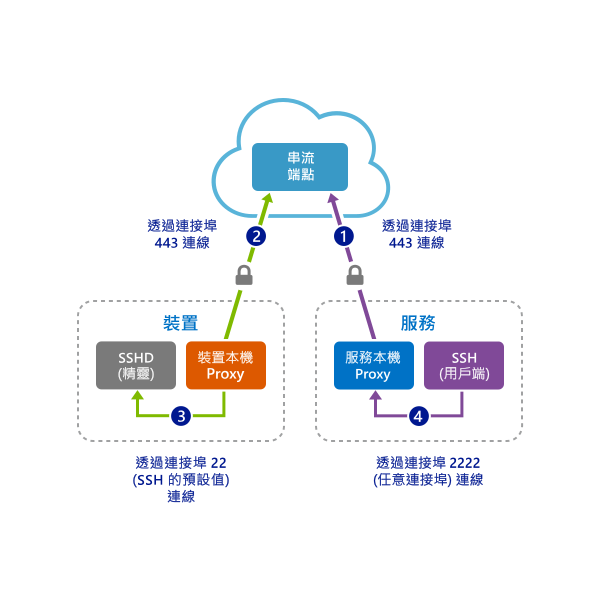
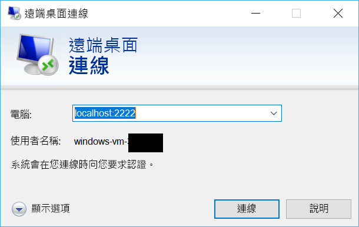

# <a name="quickstart-sshrdp-over-iot-hub-device-streams-using-c-proxy-applications-preview"></a>快速入門：使用 C# Proxy 應用程式透過 IoT 中樞裝置串流進行 SSH/RDP 輸送 (預覽)

[!INCLUDE [iot-hub-quickstarts-4-selector](../../includes/iot-hub-quickstarts-4-selector.md)]

Microsoft Azure IoT 中樞目前支援裝置串流作為[預覽功能](https://azure.microsoft.com/support/legal/preview-supplemental-terms/)。

[IoT 中樞裝置串流](./iot-hub-device-streams-overview.md)可讓服務和裝置應用程式以安全且便於設定防火牆的方式進行通訊。 本快速入門指南會使用兩個 C# 程式，讓用戶端/伺服器應用程式流量 (例如 SSH 和 RDP) 能夠透過以 IoT 中樞建立的裝置串流進行傳送。 如需設定概觀，請參閱[這裡](./iot-hub-device-streams-overview.md#local-proxy-sample-for-ssh-or-rdp)。

我們會先說明 SSH 的設定 (使用連接埠 22)。 接著會說明如何針對 RDP 修改設定的連接埠。 由於裝置串流與應用程式或通訊協定無關，因此相同的範例可在修改後用於其他類型的應用程式流量。 這通常只牽涉到將通訊連接埠變更為預定應用程式所使用的連接埠。

## <a name="how-it-works"></a>運作方式

下圖說明如何在此範例中設定將會在 SSH 用戶端與 SSH 服務精靈之間啟用端對端連線的裝置和服務本機 Proxy 程式。 在此，我們假設精靈與裝置本機 Proxy 執行於相同的裝置上。



1. 服務本機 Proxy 會連線至 IoT 中樞，並使用其裝置識別碼起始對目標裝置的裝置串流。

2. 裝置本機 Proxy 完成串流起始交握，並透過 IoT 中樞對服務端的串流端點建立端對端串流通道。

3. 裝置本機 Proxy 連線至在裝置上接聽連接埠 22 的 SSH 精靈 (SSHD) (此連接埠可依照[以下](#run-the-device-local-proxy)說明進行設定)。

4. 服務本機 Proxy 藉由接聽指定的連接埠 (在此案例中為連接埠 2222，也可以依照[以下](#run-the-service-local-proxy)說明進行設定) 等候來自使用者的新 SSH 連線。 當使用者透過 SSH 用戶端連線時，通道可讓應用程式流量能夠在 SSH 用戶端與伺服器程式之間進行交換。

> [!NOTE]
> 透過串流傳送的 SSH 流量將經由 IoT 中樞的串流端點進行輸送，而不是直接在服務與裝置之間傳送。 此做法有[這些優點](./iot-hub-device-streams-overview.md#benefits)。

[!INCLUDE [cloud-shell-try-it.md](../../includes/cloud-shell-try-it.md)]

如果您沒有 Azure 訂用帳戶，請在開始前建立[免費帳戶](https://azure.microsoft.com/free/?WT.mc_id=A261C142F) 。

## <a name="prerequisites"></a>必要條件

裝置串流的預覽版目前僅支援在下列區域建立的 IoT 中樞：

  - **美國中部**
  - **美國中部 EUAP**

您在此快速入門中執行的兩個範例應用程式是使用 C# 所撰寫的。 您的開發電腦上需要有 .NET Core SDK 2.1.0 或更高版本。

您可以從 [.NET](https://www.microsoft.com/net/download/all) 下載適用於多種平台的 .NET Core SDK。

您可以使用下列命令，以確認開發電腦上目前的 C# 版本：

```
dotnet --version
```

執行下列命令，將適用於 Azure CLI 的 Microsoft Azure IoT 擴充功能新增至您的 Cloud Shell 執行個體。 IoT 擴充功能可將 IoT 中樞、IoT Edge 和 IoT 裝置佈建服務的特定命令新增至 Azure CLI。

```azurecli-interactive
az extension add --name azure-cli-iot-ext
```

從 https://github.com/Azure-Samples/azure-iot-samples-csharp/archive/master.zip 下載範例 C# 專案並將 ZIP 封存檔解壓縮。

## <a name="create-an-iot-hub"></a>建立 IoT 中樞

[!INCLUDE [iot-hub-include-create-hub](../../includes/iot-hub-include-create-hub-device-streams.md)]

## <a name="register-a-device"></a>註冊裝置

裝置必須向的 IoT 中樞註冊，才能進行連線。 在本快速入門中，您會使用 Azure Cloud Shell 來註冊模擬的裝置。

1. 在 Azure Cloud Shell 中執行下列命令，以建立裝置身分識別。

   **YourIoTHubName**：以您為 IoT 中樞選擇的名稱取代此預留位置。

   **MyDevice**：這是為已註冊裝置指定的名稱。 使用所示的 MyCDevice。 如果您為裝置選擇不同的名稱，則也必須在本文中使用該名稱，並先在範例應用程式中更新該裝置名稱，再執行應用程式。

    ```azurecli-interactive
    az iot hub device-identity create --hub-name YourIoTHubName --device-id MyDevice
    ```

2. 在 Azure Cloud Shell 中執行下列命令，以針對您剛註冊的裝置取得_裝置連接字串_：

   **YourIoTHubName**：以您為 IoT 中樞選擇的名稱取代此預留位置。

    ```azurecli-interactive
    az iot hub device-identity show-connection-string --hub-name YourIoTHubName --device-id MyDevice --output table
    ```

    記下裝置連接字串，如下列範例所示：

   `HostName={YourIoTHubName}.azure-devices.net;DeviceId=MyDevice;SharedAccessKey={YourSharedAccessKey}`

    您稍後會在快速入門中使用此值。

3. 您也需要 IoT 中樞的_服務連接字串_，讓服務端應用程式能夠連線到您的 IoT 中樞並建立裝置串流。 下列命令會擷取您 IoT 中樞的這個值：

   **YourIoTHubName**：以您為 IoT 中樞選擇的名稱取代此預留位置。

    ```azurecli-interactive
    az iot hub show-connection-string --policy-name service --name YourIoTHubName
    ```

    記下顯示如下的傳回值：

   `"HostName={YourIoTHubName}.azure-devices.net;SharedAccessKeyName=service;SharedAccessKey={YourSharedAccessKey}"`
    

## <a name="ssh-to-a-device-via-device-streams"></a>透過裝置串流使用 SSH 連線至裝置

### <a name="run-the-device-local-proxy"></a>執行裝置本機 Proxy

在解壓縮的專案資料夾中，瀏覽至 `device-streams-proxy/device`。 您必須備妥下列資訊：

| 引數名稱 | 引數值 |
|----------------|-----------------|
| `deviceConnectionString` | 您先前建立之裝置的連接字串。 |
| `targetServiceHostName` | SSH 伺服器接聽所在的 IP 位址 (如果是裝置本機 Proxy 執行所在的相同 IP，則會是 `localhost`)。 |
| `targetServicePort` | 您的應用程式通訊協定所使用的連接埠 (SSH 的預設值為連接埠 22)。  |

編譯並執行程式碼，如下所示：

```
cd ./iot-hub/Quickstarts/device-streams-proxy/device/

# Build the application
dotnet build

# Run the application
# In Linux/MacOS
dotnet run $deviceConnectionString localhost 22

# In Windows
dotnet run %deviceConnectionString% localhost 22
```

### <a name="run-the-service-local-proxy"></a>執行服務本機 Proxy

在解壓縮的專案資料夾中，瀏覽至 `device-streams-proxy/service`。 您必須備妥下列資訊：

| 參數名稱 | 參數值 |
|----------------|-----------------|
| `iotHubConnectionString` | IoT 中樞的服務連接字串。 |
| `deviceId` | 您先前建立之裝置的識別碼。 |
| `localPortNumber` | 您的 SSH 用戶端所將連線到的本機連接埠。 在此範例中我們使用連接埠 2222，但您可以將其修改為其他任意數字。 |

編譯並執行程式碼，如下所示：

```
cd ./iot-hub/Quickstarts/device-streams-proxy/service/

# Build the application
dotnet build

# Run the application
# In Linux/MacOS
dotnet run $serviceConnectionString MyDevice 2222

# In Windows
dotnet run %serviceConnectionString% MyDevice 2222
```

### <a name="run-ssh-client"></a>執行 SSH 用戶端

現在，使用您的 SSH 用戶端程式，並經由連接埠 2222 連線至服務本機 Proxy (而不是直接使用 SSH 精靈)。 

```
ssh <username>@localhost -p 2222
```

此時，您會看到要求您輸入認證的 SSH 登入提示。

服務端的主控台輸出 (服務本機 Proxy 會接聽連接埠 2222)：


經由 `IP_address:22` 連線至 SSH 精靈的裝置本機 Proxy 上的主控台輸出：


SSH 用戶端程式的主控台輸出 (SSH 用戶端藉由連線至服務本機 Proxy 所接聽的連接埠 22 與 SSH 精靈通訊)：


## <a name="rdp-to-a-device-via-device-streams"></a>透過裝置串流使用 RDP 連線至裝置

RDP 的設定與 SSH 大致相同 (如前所述)。 基本上，我們必須改用 RDP 目的地 IP 和連接埠 3389，並使用 RDP 用戶端 (而不是 SSH 用戶端)。

### <a name="run-the-device-local-proxy-rdp"></a>執行裝置本機 Proxy (RDP)

在解壓縮的專案資料夾中，瀏覽至 `device-streams-proxy/device`。 您必須備妥下列資訊：

| 引數名稱 | 引數值 |
|----------------|-----------------|
| `DeviceConnectionString` | 您先前建立之裝置的連接字串。 |
| `targetServiceHostName` | RDP 伺服器執行所在的主機名稱或 IP 位址 (如果是裝置本機 Proxy 執行所在的相同 IP，則會是 `localhost`)。 |
| `targetServicePort` | 您的應用程式通訊協定所使用的連接埠 (RDP 的預設值為連接埠 3389)。  |

編譯並執行程式碼，如下所示：

```
cd ./iot-hub/Quickstarts/device-streams-proxy/device

# Run the application
# In Linux/MacOS
dotnet run $DeviceConnectionString localhost 3389

# In Windows
dotnet run %DeviceConnectionString% localhost 3389
```

### <a name="run-the-service-local-proxy-rdp"></a>執行服務本機 Proxy (RDP)

在解壓縮的專案資料夾中，瀏覽至 `device-streams-proxy/service`。 您必須備妥下列資訊：

| 參數名稱 | 參數值 |
|----------------|-----------------|
| `iotHubConnectionString` | IoT 中樞的服務連接字串。 |
| `deviceId` | 您先前建立之裝置的識別碼。 |
| `localPortNumber` | 您的 SSH 用戶端所將連線到的本機連接埠。 在此範例中我們使用連接埠 2222，但您可以將其修改為其他任意數字。 |

編譯並執行程式碼，如下所示：

```
cd ./iot-hub/Quickstarts/device-streams-proxy/service/

# Build the application
dotnet build

# Run the application
# In Linux/MacOS
dotnet run $serviceConnectionString MyDevice 2222

# In Windows
dotnet run %serviceConnectionString% MyDevice 2222
```

### <a name="run-rdp-client"></a>執行 RDP 用戶端

現在，使用您的 RDP 用戶端程式，並經由連接埠 2222 (這是您先前任意選擇的可用連接埠) 連線至服務本機 Proxy。



## <a name="clean-up-resources"></a>清除資源

[!INCLUDE [iot-hub-quickstarts-clean-up-resources](../../includes/iot-hub-quickstarts-clean-up-resources-device-streams.md)]

## <a name="next-steps"></a>後續步驟

在本快速入門中，您已設定 IoT 中樞、註冊裝置、部署裝置和服務本機 Proxy 程式以透過 IoT 中樞建立裝置串流，並使用 Proxy 輸送 SSH 或 RDP 流量。 相同的範例可用於其他用戶端/伺服器通訊協定 (其中，伺服器執行於 SSH 精靈之類的裝置上)。

使用下列連結深入了解裝置串流：

> [!div class="nextstepaction"]
> [裝置串流概觀](./iot-hub-device-streams-overview.md)
