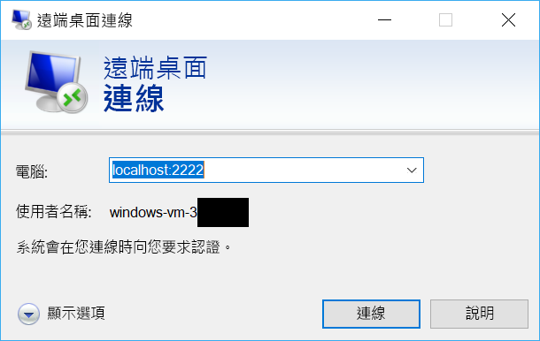

# <a name="quickstart-sshrdp-over-iot-hub-device-streams-using-nodejs-proxy-application-preview"></a>快速入門：使用 Node.js Proxy 應用程式透過 IoT 中樞裝置串流進行 SSH/RDP 輸送 (預覽)

[!INCLUDE [iot-hub-quickstarts-4-selector](../../includes/iot-hub-quickstarts-4-selector.md)]

[IoT 中樞裝置串流](./iot-hub-device-streams-overview.md)可讓服務和裝置應用程式以安全且便於設定防火牆的方式進行通訊。 本快速入門指南說明如何在服務端執行 Node.js Proxy 應用程式，使 SSH 和 RDP 流量能夠透過裝置串流傳送至裝置。 如需設定概觀，請參閱[這裡](./iot-hub-device-streams-overview.md#local-proxy-sample-for-ssh-or-rdp)。 在公開預覽期間，Node.js SDK 僅支援服務端上的裝置串流。 因此，本快速入門指南僅提供執行服務本機 Proxy 的指示。 您應執行 [C 快速入門](./quickstart-device-streams-proxy-c.md)或 [C# 快速入門](./quickstart-device-streams-proxy-csharp.md)指南中提及的隨附裝置端 Proxy。

我們會先說明 SSH 的設定 (使用連接埠 22)。 接著會說明如何針對 RDP 修改設定 (使用連接埠 3389)。 由於裝置串流與應用程式或通訊協定無關，因此相同的範例可在修改後用於其他類型的用戶端/伺服器應用程式流量 (通常藉由修改通訊連接埠)。


[!INCLUDE [cloud-shell-try-it.md](../../includes/cloud-shell-try-it.md)]

如果您沒有 Azure 訂用帳戶，請在開始前建立[免費帳戶](https://azure.microsoft.com/free/?WT.mc_id=A261C142F) 。


## <a name="prerequisites"></a>必要條件

若要執行本快速入門中的服務本機應用程式，您的開發電腦上需要 Node.js 4.x.x 版或更新版本。

您可以從 [nodejs.org](https://nodejs.org) 下載適用於多種平台的 Node.js。

您可以使用下列命令，以確認開發電腦上目前的 Node.js 版本：

```
node --version
```

如果您尚未這樣做，請從 https://github.com/Azure-Samples/azure-iot-samples-node/archive/streams-preview.zip 下載範例 Node.js 專案並將 ZIP 封存檔解壓縮。


## <a name="create-an-iot-hub"></a>建立 IoT 中樞

如果您已完成先前的[快速入門：將遙測從裝置傳送到 IoT 中樞](quickstart-send-telemetry-node.md)，則可以略過此步驟。

[!INCLUDE [iot-hub-include-create-hub](../../includes/iot-hub-include-create-hub-device-streams.md)]


## <a name="register-a-device"></a>註冊裝置

如果您已完成先前的[快速入門：將遙測從裝置傳送到 IoT 中樞](quickstart-send-telemetry-node.md)，則可以略過此步驟。

裝置必須向的 IoT 中樞註冊，才能進行連線。 在本快速入門中，您會使用 Azure Cloud Shell 來註冊模擬的裝置。

1. 在 Azure Cloud Shell 中執行下列命令，以新增 IoT 中樞 CLI 擴充功能和建立裝置身分識別。 

   **YourIoTHubName**：以您為 IoT 中樞選擇的名稱取代此預留位置。

   **MyDevice**：這是為已註冊裝置指定的名稱。 使用所示的 MyCDevice。 如果您為裝置選擇不同的名稱，則也必須在本文中使用該名稱，並先在範例應用程式中更新該裝置名稱，再執行應用程式。

    ```azurecli-interactive
    az extension add --name azure-cli-iot-ext
    az iot hub device-identity create --hub-name YourIoTHubName --device-id MyDevice
    ```

2. 您也需要_服務連接字串_，讓後端應用程式能夠連線到您的 IoT 中樞並擷取訊息。 下列命令可擷取 IoT 中樞的服務連接字串：

    **YourIoTHubName**：以您為 IoT 中樞選擇的名稱取代此預留位置。

    ```azurecli-interactive
    az iot hub show-connection-string --policy-name service --hub-name YourIoTHubName
    ```

    記下顯示如下的傳回值：

   `"HostName={YourIoTHubName}.azure-devices.net;SharedAccessKeyName=service;SharedAccessKey={YourSharedAccessKey}"`


## <a name="ssh-to-a-device-via-device-streams"></a>透過裝置串流使用 SSH 連線至裝置

### <a name="run-the-device-local-proxy"></a>執行裝置本機 Proxy

如先前所說明，IoT 中樞 Node.js SDK 僅支援服務端上的裝置串流。 對於裝置端應用程式，請使用 [C 快速入門](./quickstart-device-streams-proxy-c.md)或 [C# 快速入門](./quickstart-device-streams-proxy-csharp.md)指南中提及的隨附裝置 Proxy 程式。 繼續進行下一個步驟前，請先確定裝置端 Proxy 正在執行中。


### <a name="run-the-service-local-proxy"></a>執行服務本機 Proxy

假設[裝置端 Proxy](#run-the-device-local-proxy) 正在執行中，請依照下列步驟來執行以 Node.js 撰寫的服務本機 Proxy。

- 提供您的服務認證、SSH 精靈執行所在的目標裝置識別碼，以及在裝置上執行的 Proxy 所使用的連接埠號碼，作為環境變數。
```
  # In Linux
  export IOTHUB_CONNECTION_STRING="<provide_your_service_connection_string>"
  export STREAMING_TARGET_DEVICE="MyDevice"
  export PROXY_PORT=2222

  # In Windows
  SET IOTHUB_CONNECTION_STRING=<provide_your_service_connection_string>
  SET STREAMING_TARGET_DEVICE=MyDevice
  SET PROXY_PORT=2222
```
變更上述的值，使其符合您的裝置識別碼和連線字串。

- 在解壓縮的專案資料夾中瀏覽至 `Quickstarts/device-streams-service`，並執行服務本機 Proxy。
```
  cd azure-iot-samples-node-streams-preview/iot-hub/Quickstarts/device-streams-service

  # Install the preview service SDK, and other dependencies
  npm install azure-iothub@streams-preview
  npm install

  # Run the service-local proxy application
  node proxy.js
```

### <a name="ssh-to-your-device-via-device-streams"></a>透過裝置串流使用 SSH 連線至您的裝置
在 Linux 中，在終端機上使用 `ssh $USER@localhost -p 2222` 執行 SSH。 在 Windows 中，請使用您慣用的 SSH 用戶端 (例如 PuTTY)。

服務本機的主控台輸出會在 SSH 工作階段結束後建立 (服務本機 Proxy 會接聽連接埠 2222)：


SSH 用戶端程式的主控台輸出 (SSH 用戶端藉由連線至服務本機 Proxy 所接聽的連接埠 22 與 SSH 精靈通訊)：


### <a name="rdp-to-your-device-via-device-streams"></a>透過裝置串流使用 RDP 連線至您的裝置

現在，使用您的 RDP 用戶端程式，並經由連接埠 2222 (這是您先前任意選擇的可用連接埠) 連線至服務 Proxy。

> [!NOTE]
> 請確定您的裝置 Proxy 已正確設定 RDP，並且已設定 RDP 連接埠 3389。




## <a name="clean-up-resources"></a>清除資源

[!INCLUDE [iot-hub-quickstarts-clean-up-resources](../../includes/iot-hub-quickstarts-clean-up-resources-device-streams.md)]

## <a name="next-steps"></a>後續步驟

在本快速入門中，您已設定 IoT 中樞、註冊裝置，並且部署服務 Proxy 程式以啟用透過 RDP 和 SSH 連線至 IoT 裝置的功能。 RDP 和 SSH 流量將會經由 IoT 中樞透過裝置串流輸送。 這樣就不需要直接連線至裝置。

使用下列連結深入了解裝置串流：

> [!div class="nextstepaction"]
> [裝置串流概觀](./iot-hub-device-streams-overview.md)
