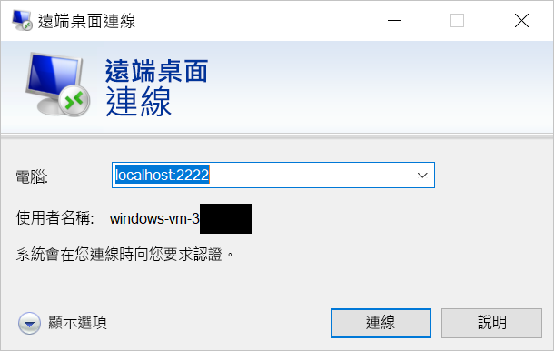

# <a name="quickstart-enable-ssh-and-rdp-over-an-iot-hub-device-stream-by-using-a-nodejs-proxy-application-preview"></a>快速入門：使用 Node.js Proxy 應用程式透過 IoT 中樞裝置串流進行 SSH 和 RDP 輸送 (預覽)

[!INCLUDE [iot-hub-quickstarts-4-selector](../../includes/iot-hub-quickstarts-4-selector.md)]

Microsoft Azure IoT 中樞目前支援裝置串流作為[預覽功能](https://azure.microsoft.com/support/legal/preview-supplemental-terms/)。

[IoT 中樞裝置串流](./iot-hub-device-streams-overview.md)可讓服務和裝置應用程式以安全且便於設定防火牆的方式進行通訊。 

本快速入門說明如何在服務端執行 Node.js Proxy 應用程式，讓安全殼層 (SSH) 和遠端桌面通訊協定 (RDP) 流量能夠透過裝置串流傳送至裝置。 如需設定的概觀，請參閱[本機 Proxy 範例](./iot-hub-device-streams-overview.md#local-proxy-sample-for-ssh-or-rdp)。 

在公開預覽期間，Node.js SDK 僅支援服務端上的裝置串流。 因此，本快速入門僅提供執行裝置本機 Proxy 應用程式的指示。 若要執行裝置本機 Proxy 應用程式，請參閱：  

   * [使用 C Proxy 應用程式透過 IoT 中樞裝置串流進行 SSH 和 RDP 輸送](./quickstart-device-streams-proxy-c.md)
   * [使用 C# Proxy 應用程式透過 IoT 中樞裝置串流進行 SSH 和 RDP 輸送](./quickstart-device-streams-proxy-csharp.md)

本文說明 SSH 的設定 (使用連接埠 22)，接著說明如何針對 RDP 修改設定 (其使用連接埠 3389)。 由於裝置串流與應用程式或通訊協定無關，因此您可以修改相同的範例，以用於其他類型的主從應用程式流量 (通常藉由修改通訊連接埠)。

[!INCLUDE [cloud-shell-try-it.md](../../includes/cloud-shell-try-it.md)]

如果您沒有 Azure 訂用帳戶，請在開始前建立[免費帳戶](https://azure.microsoft.com/free/?WT.mc_id=A261C142F) 。

## <a name="prerequisites"></a>必要條件

* 裝置串流的預覽版目前僅支援在下列區域建立的 IoT 中樞：

  * 美國中部
  * 美國中部 EUAP

* 若要執行本快速入門中的服務本機應用程式，您的開發電腦上需要 Node.js 10.x.x 版或更新版本。
  * 下載適用於多種平台的 [Node.js](https://nodejs.org)。
  * 使用下列命令，確認開發電腦上目前的 Node.js 版本：

   ```
   node --version
   ```

* 執行下列命令，將適用於 Azure CLI 的 Azure IoT 擴充功能新增至您的 Cloud Shell 執行個體。 IoT 擴充功能可將 IoT 中樞、IoT Edge 和 IoT 裝置佈建服務的特定命令新增至 Azure CLI。

    ```azurecli-interactive
    az extension add --name azure-cli-iot-ext
    ```

* 如果您尚未這樣做，請[下載範例 Node.js 專案](https://github.com/Azure-Samples/azure-iot-samples-node/archive/streams-preview.zip)並將 ZIP 封存檔解壓縮。

## <a name="create-an-iot-hub"></a>建立 IoT 中樞

如果您已完成先前的[快速入門：將遙測從裝置傳送到 IoT 中樞](quickstart-send-telemetry-node.md)，則可以略過此步驟。

[!INCLUDE [iot-hub-include-create-hub-device-streams](../../includes/iot-hub-include-create-hub-device-streams.md)]

## <a name="register-a-device"></a>註冊裝置

如果您已完成[快速入門：將遙測從裝置傳送到 IoT 中樞](quickstart-send-telemetry-node.md)，則可以略過此步驟。

裝置必須向的 IoT 中樞註冊，才能進行連線。 在這一節中，您會使用 Azure Cloud Shell 來註冊模擬的裝置。

1. 若要建立裝置身分識別，請在 Cloud Shell 中執行下列命令：

   > [!NOTE]
   > * 以您為 IoT 中樞選擇的名稱取代 YourIoTHubName  預留位置。
   > * 使用所示的 MyCDevice  。 這是為已註冊裝置指定的名稱。 如果您為裝置選擇不同的名稱，請在本文中使用該名稱，並先在應用程式範例中更新該裝置名稱，再執行應用程式。

    ```azurecli-interactive
    az iot hub device-identity create --hub-name YourIoTHubName --device-id MyDevice
    ```

1. 若要讓後端應用程式能夠連線到您的 IoT 中樞並擷取訊息，您也需要*服務連接字串*。 下列命令會為您的 IoT 中樞擷取字串：

   > [!NOTE]
   > 以您為 IoT 中樞選擇的名稱取代 YourIoTHubName  預留位置。

    ```azurecli-interactive
    az iot hub show-connection-string --policy-name service --name YourIoTHubName
    ```

    記下傳回的值，以便稍後在本快速入門中使用。 看起來會像下列範例：

   `"HostName={YourIoTHubName}.azure-devices.net;SharedAccessKeyName=service;SharedAccessKey={YourSharedAccessKey}"`

## <a name="ssh-to-a-device-via-device-streams"></a>透過裝置串流使用 SSH 連線至裝置

在本節中，您會建立端對端串流來以通道輸送 SSH 流量。

### <a name="run-the-device-local-proxy-application"></a>執行裝置本機 Proxy 應用程式

如先前所說明，IoT 中樞 Node.js SDK 僅支援服務端上的裝置串流。 對於裝置本機應用程式，請使用下列快速入門中可取得的裝置 Proxy 應用程式程式：

   * [使用 C Proxy 應用程式透過 IoT 中樞裝置串流進行 SSH 和 RDP 輸送](./quickstart-device-streams-proxy-c.md)
   * [使用 C# Proxy 應用程式透過 IoT 中樞裝置串流進行 SSH 和 RDP 輸送](./quickstart-device-streams-proxy-csharp.md) 

繼續進行下一個步驟前，請先確定裝置本機 Proxy 應用程式正在執行中。

### <a name="run-the-service-local-proxy-application"></a>執行服務本機 Proxy 應用程式

如果裝置本機 Proxy 應用程式正在執行中，請依照下列步驟來執行以 Node.js 撰寫的服務本機 Proxy 應用程式：

1. 針對環境變數，提供您的服務認證、SSH 精靈執行所在的目標裝置識別碼，以及在裝置上執行的 Proxy 所使用的連接埠號碼。

   ```
   # In Linux
   export IOTHUB_CONNECTION_STRING="<provide_your_service_connection_string>"
   export STREAMING_TARGET_DEVICE="MyDevice"
   export PROXY_PORT=2222

   # In Windows
   SET IOTHUB_CONNECTION_STRING=<provide_your_service_connection_string>
   SET STREAMING_TARGET_DEVICE=MyDevice
   SET PROXY_PORT=2222
   ```

   變更前述的值，使其符合您的裝置識別碼和連線字串。

1. 在解壓縮的專案資料夾中，移至 *Quickstarts/device-streams-service* 目錄，然後執行服務本機 Proxy 應用程式。

   ```
   cd azure-iot-samples-node-streams-preview/iot-hub/Quickstarts/device-streams-service

   # Install the preview service SDK, and other dependencies
   npm install azure-iothub@streams-preview
   npm install

   # Run the service-local proxy application
   node proxy.js
   ```

### <a name="ssh-to-your-device-via-device-streams"></a>透過裝置串流使用 SSH 連線至您的裝置

在 Linux 中，在終端機上使用 `ssh $USER@localhost -p 2222` 執行 SSH。 在 Windows 中，請使用您慣用的 SSH 用戶端 (例如 PuTTY)。

服務本機的主控台輸出會在 SSH 工作階段結束後建立 (服務本機 Proxy 應用程式會接聽連接埠 2222)：


SSH 用戶端應用程式的主控台輸出 (SSH 用戶端藉由連線至服務本機 Proxy 應用程式所接聽的連接埠 22 與 SSH 精靈通訊)：


### <a name="rdp-to-your-device-via-device-streams"></a>透過裝置串流使用 RDP 連線至您的裝置

現在，使用您的 RDP 用戶端應用程式並經由連接埠 2222 (您先前選擇的任意連接埠) 連線至服務本機。

> [!NOTE]
> 請確定您的裝置 Proxy 已正確設定 RDP，並且已設定 RDP 連接埠 3389。



## <a name="clean-up-resources"></a>清除資源

[!INCLUDE [iot-hub-quickstarts-clean-up-resources](../../includes/iot-hub-quickstarts-clean-up-resources-device-streams.md)]

## <a name="next-steps"></a>後續步驟

在本快速入門中，您已設定 IoT 中樞、註冊裝置並部署服務 Proxy 應用程式，以在 IoT 裝置上啟用 RDP 和 SSH。 RDP 和 SSH 流量將會經由 IoT 中樞透過裝置串流輸送。 這程序就不需要直接連線至裝置。

若要深入了解裝置串流，請參閱：

> [!div class="nextstepaction"]
> [裝置串流概觀](./iot-hub-device-streams-overview.md)
