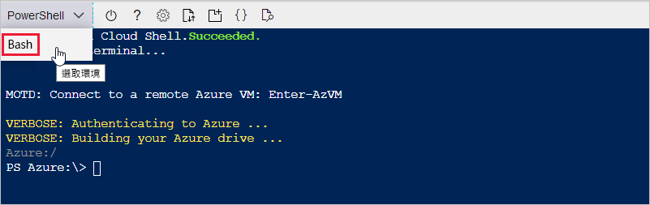
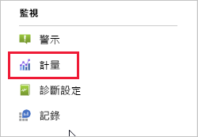
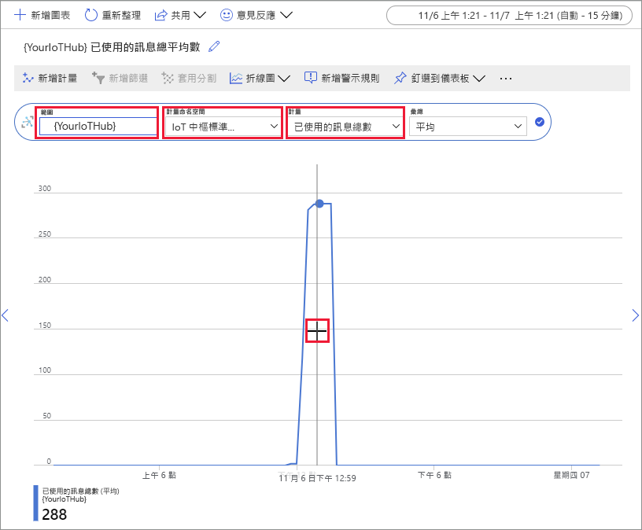

# <a name="quickstart-send-telemetry-from-a-device-to-an-iot-hub-and-monitor-it-with-the-azure-cli"></a>快速入門：使用 Azure CLI 將遙測資料從裝置傳送至 IoT 中樞並加以監視

[!INCLUDE [iot-hub-quickstarts-1-selector](../../includes/iot-hub-quickstarts-1-selector.md)]

IoT 中樞是一項 Azure 服務，可讓您從 IoT 裝置將大量的遙測擷取到雲端進行儲存或處理。 在本快速入門中，您會使用 Azure CLI 建立 IoT 中樞和模擬裝置、將裝置遙測資料傳送至中樞，以及傳送從雲端到裝置的訊息。 您也會使用 Azure 入口網站將裝置計量視覺化。 這是使用 CLI 與 IoT 中樞應用程式互動的開發人員適用的基本工作流程。

## <a name="prerequisites"></a>必要條件
- 如果您沒有 Azure 訂用帳戶，請在開始之前[建立免費帳戶](https://azure.microsoft.com/free/?WT.mc_id=A261C142F)。
- Azure CLI。 您可以使用 Azure Cloud Shell (在瀏覽器中執行的互動式 CLI Shell) 來執行本快速入門中的所有命令。 如果您使用 Cloud Shell，就不需要安裝任何項目。 如果您偏好在本機使用 CLI，本快速入門需要有 Azure CLI 2.0.76 版或更新版本。 執行 az --version 以尋找版本。 若要安裝或升級，請參閱[安裝 Azure CLI]( /cli/azure/install-azure-cli)。

## <a name="sign-in-to-the-azure-portal"></a>登入 Azure 入口網站
在 https://portal.azure.com 登入 Azure 入口網站。

無論您是在本機還是在 Cloud Shell 中執行 CLI，均請在瀏覽器中保持入口網站的開啟狀態。  您稍後會在本快速入門中使用此入口網站。

## <a name="launch-the-cloud-shell"></a>啟動 Cloud Shell
在本節中，您會啟動 Azure Cloud Shell 的執行個體。 如果您在本機使用 CLI，請跳至[準備兩個 CLI 工作階段](#prepare-two-cli-sessions)一節。

若要啟動 Cloud Shell：
1. 在 Azure 入口網站右上角的功能表列中，選取 [Cloud Shell]  按鈕。 

    

    > [!NOTE]
    > 如果這是您第一次使用 Cloud Shell，它將會提示您建立使用 Cloud Shell 所需的儲存體。  選取用來建立儲存體帳戶和 Microsoft Azure 檔案共用的訂用帳戶。 

1. 在 [選取環境]  下拉式清單中，選取您慣用的 CLI 環境。 本快速入門會使用 **Bash** 環境。 下列所有 CLI 命令也都可在 Powershell 環境中運作。 

    

## <a name="prepare-two-cli-sessions"></a>準備兩個 CLI 工作階段
在本節中，您將準備兩個 Azure CLI 工作階段。 如果您使用 Cloud Shell，您將在個別的瀏覽器索引標籤中執行兩個工作階段。 如果使用本機 CLI 用戶端，則會執行兩個不同的 CLI 執行個體。 您將以第一個工作階段作為模擬裝置，並使用第二個工作階段來監視和傳送訊息。 若要執行命令，請選取 [複製]  以複製本快速入門中的程式碼區塊，將其貼入您的 Shell 工作階段中，然後加以執行。

使用 Azure CLI 時，您必須登入 Azure 帳戶。 您的 Azure CLI Shell 工作階段與 IoT 中樞之間的所有通訊都會經過驗證和加密。 因此，本快速入門不需要您用於實際裝置的其他驗證，例如連接字串。

1. 執行 [az extension add](https://docs.microsoft.com/cli/azure/extension?view=azure-cli-latest#az-extension-add) 命令，將適用於 Azure CLI 的 Microsoft Azure IoT 擴充功能新增至您的 CLI Shell。 IoT 擴充功能可將 IoT 中樞、IoT Edge 和 IoT 裝置佈建服務的特定命令新增至 Azure CLI。

   ```azurecli
   az extension add --name azure-cli-iot-ext
   ```
    安裝 Azure IOT 擴充功能後，您不需要在任何 Cloud Shell 工作階段中再次加以安裝。 

1. 開啟第二個 CLI 工作階段。  如果您使用 Cloud Shell，請選取 [開啟新的工作階段]  。 如果您在本機使用 CLI，請開啟第二個執行個體。 

    

## <a name="create-an-iot-hub"></a>建立 IoT 中樞
在本節中，您將使用 Azure CLI 建立資源群組和 IoT 中樞。  Azure 資源群組是在其中部署與管理 Azure 資源的邏輯容器。 IoT 中樞可作為 IoT 應用程式與裝置之間雙向通訊的中央訊息中樞。 

> [!TIP]
> (選擇性) 您可以使用 [Azure 入口網站](iot-hub-create-through-portal.md)、[Visual Studio Code](iot-hub-create-use-iot-toolkit.md) 或其他程式設計方法，來建立 Azure 資源群組、IoT 中樞和其他資源。  

1. 執行 [az group create](https://docs.microsoft.com/cli/azure/group?view=azure-cli-latest#az-group-create) 命令以建立資源群組。 下列命令會在 eastus  位置中建立名為 MyResourceGroup  的資源群組。 

    ```azurecli
    az group create --name MyResourceGroup --location eastus
    ```

1. 使用 [az iot hub create](https://docs.microsoft.com/cli/azure/iot/hub?view=azure-cli-latest#az-iot-hub-create) 命令建立 IoT 中樞。 建立 IoT 中樞可能需要幾分鐘的時間。 

    *YourIotHubName*。 以您為 IoT 中樞選擇的名稱取代此預留位置。 IoT 中樞名稱在 Azure 中必須是全域唯一的。 本快速入門的其餘部分都會使用此預留位置來代表您的 IoT 中樞名稱。

    ```azurecli
    az iot hub create --resource-group MyResourceGroup --name {YourIoTHubName}
    ```

## <a name="create-and-monitor-a-device"></a>建立和監視裝置
在本節中，您將在第一個 CLI 工作階段中建立模擬裝置。 模擬裝置會將裝置遙測資料傳送至您的 IoT 中樞。 在第二個 CLI 工作階段中，您會監視事件和遙測，並將雲端到裝置的訊息傳送至模擬裝置。

若要建立並啟動模擬裝置：
1. 在第一個 CLI 工作階段中，執行 [az iot hub device-identity create](https://docs.microsoft.com/cli/azure/ext/azure-cli-iot-ext/iot/hub/device-identity?view=azure-cli-latest#ext-azure-cli-iot-ext-az-iot-hub-device-identity-create) 命令。 這會建立模擬裝置身分識別。 

    *YourIotHubName*。 以您為 IoT 中樞選擇的名稱取代此預留位置。 

    *simDevice*。 您可以在本快速入門的其餘部分直接對模擬裝置使用此名稱。 您也可以選擇使用不同的名稱。 

    ```azurecli
    az iot hub device-identity create --device-id simDevice --hub-name {YourIoTHubName} 
    ```

1. 在第一個 CLI 工作階段中，執行 [az iot device simulate](https://docs.microsoft.com/cli/azure/ext/azure-cli-iot-ext/iot/device?view=azure-cli-latest#ext-azure-cli-iot-ext-az-iot-device-simulate) 命令。  這會啟動模擬裝置。 裝置會將遙測資料傳送至您的 IoT 中樞，並接收來自該處的訊息。  

    *YourIotHubName*。 以您為 IoT 中樞選擇的名稱取代此預留位置。 

    ```azurecli
    az iot device simulate -d simDevice -n {YourIoTHubName}
    ```

若要監視裝置：
1. 在第二個 CLI 工作階段中，執行 [az iot hub monitor-events](https://docs.microsoft.com/cli/azure/ext/azure-cli-iot-ext/iot/hub?view=azure-cli-latest#ext-azure-cli-iot-ext-az-iot-hub-monitor-events) 命令。 這會開始監視模擬裝置。 輸出會顯示模擬裝置傳送至 IoT 中樞的遙測資料。

    *YourIotHubName*。 以您為 IoT 中樞選擇的名稱取代此預留位置。 

    ```azurecli
    az iot hub monitor-events --output table --hub-name {YourIoTHubName}
    ```

    

1. 在第二個 CLI 工作階段中監視模擬裝置之後，請按 Ctrl+C 以停止監視。 

## <a name="use-the-cli-to-send-a-message"></a>使用 CLI 傳送訊息
在本節中，您將使用第二個 CLI 工作階段將訊息傳送至模擬裝置。

1. 在第一個 CLI 工作階段中，確認模擬裝置正在執行中。 如果裝置已停止，請執行下列命令加以啟動：

    *YourIotHubName*。 以您為 IoT 中樞選擇的名稱取代此預留位置。 

    ```azurecli
    az iot device simulate -d simDevice -n {YourIoTHubName}
    ```

1. 在第二個 CLI 工作階段中，執行 [az iot device c2d-message send](https://docs.microsoft.com/cli/azure/ext/azure-cli-iot-ext/iot/device/c2d-message?view=azure-cli-latest#ext-azure-cli-iot-ext-az-iot-device-c2d-message-send) 命令。 這會將雲端到裝置的訊息從您的 IoT 中樞傳送至模擬裝置。 訊息中包含字串和兩個索引鍵/值組。  

    *YourIotHubName*。 以您為 IoT 中樞選擇的名稱取代此預留位置。 

    ```azurecli
    az iot device c2d-message send -d simDevice --data "Hello World" --props "key0=value0;key1=value1" -n {YourIoTHubName}
    ```
    (選擇性) 您可以使用 Azure 入口網站來傳送雲端到裝置的訊息。 若要這麼做，請瀏覽至 IoT 中樞的概觀頁面，選取 [IoT 裝置]  ，選取模擬裝置，然後選取 [傳訊到裝置]  。 

1. 在第一個 CLI 工作階段中，確認模擬裝置已收到訊息。 

    

1. 檢視訊息之後，請關閉第二個 CLI 工作階段。 請將第一個 CLI 工作階段保持開啟。 您可在後續步驟中用它來清除資源。

## <a name="view-messaging-metrics-in-the-portal"></a>在入口網站中檢視訊息計量
Azure 入口網站可讓您管理 IoT 中樞和裝置的所有層面。 在從裝置擷取遙測資料的一般 IoT 中樞應用程式中，您可能會想要監視裝置或檢視裝置遙測的計量。 

若要將 Azure 入口網站中的訊息計量視覺化：
1. 在入口網站的左側導覽功能表中，選取 [所有資源]  。 這會列出您訂用帳戶中的所有資源，包括您所建立的 IoT 中樞。 

1. 選取您建立的 IoT 中樞上的連結。 入口網站會顯示中樞的概觀頁面。

1. 在 IoT 中樞的左窗格中選取 [計量]  。 

    

1. 在 [範圍]  中輸入您的 IoT 中樞名稱。

2. 選取 [計量命名空間]  中的 [Iot 中樞標準計量]  。

3. 在 [計量]  中，選取 [已使用的訊息總數]  。 

4. 將滑鼠指標停留在您的裝置傳送訊息的時間軸區域上方。 某個時間點的訊息總數會出現在時間軸的左下角。

    

5. (選擇性) 使用 [計量]  下拉式清單，顯示模擬裝置的其他計量。 例如，*已完成 C2D 訊息傳遞數*或*裝置總計 (預覽)* 。 

## <a name="clean-up-resources"></a>清除資源
如果您不再需要在本快速入門中建立的 Azure 資源，您可以使用 Azure CLI 將其刪除。

如果您要繼續閱讀下一篇建議的文章，則可以保留已建立的資源並重複使用。 

> [!IMPORTANT]
> 刪除資源群組是無法回復的動作。 資源群組和其中包含的所有資源都將永久刪除。 請確定您不會不小心刪除錯誤的資源群組或資源。 

若要依名稱刪除資源群組：
1. 執行 [az group delete](https://docs.microsoft.com/cli/azure/group?view=azure-cli-latest#az-group-delete) 命令。 這會移除資源群組、IoT 中樞，和您建立的裝置註冊。

    ```azurecli
    az group delete --name MyResourceGroup
    ```
1. 執行 [az group list](https://docs.microsoft.com/cli/azure/group?view=azure-cli-latest#az-group-list) 命令，以確認資源群組已刪除。  

    ```azurecli
    az group list
    ```

## <a name="next-steps"></a>後續步驟
在本快速入門中，您已使用 Azure CLI 建立 IoT 中樞、建立模擬裝置、傳送遙測資料、監視遙測資料、傳送雲端到裝置的訊息，並清除資源。 您已使用 Azure 入口網站將裝置上的訊息計量視覺化。

如果您是裝置開發人員，建議您接下來應參閱使用「適用於 C 的 Azure IoT 裝置 SDK」的遙測快速入門。您也可以選擇依據您慣用的語言或 SDK，參閱其中一篇可用的 Azure IoT 中樞遙測快速入門文章。

> [!div class="nextstepaction"]
> [快速入門：將遙測資料從裝置傳送到 IoT 中樞 (C)](quickstart-send-telemetry-c.md)
