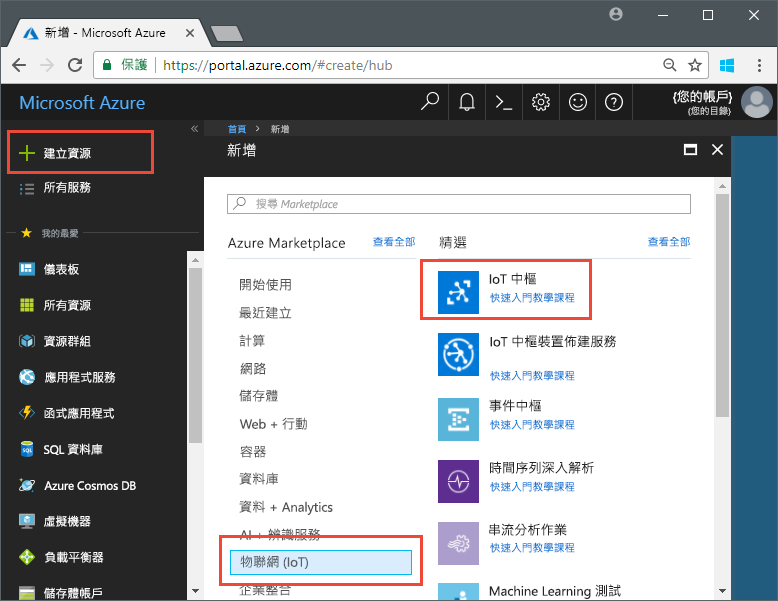
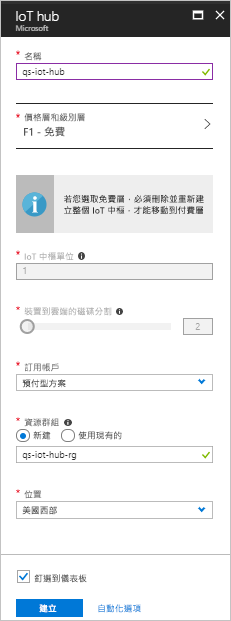

# <a name="send-telemetry-from-a-device-to-an-iot-hub-swift"></a>將遙測從裝置傳送到 IoT 中樞 (Swift)

IoT 中樞是一項 Azure 服務，可讓您從 IoT 裝置將大量的遙測擷取到雲端進行儲存或處理。 在本文中，您會將遙測從模擬的裝置應用程式傳送到 IoT 中樞。 然後您可以從後端應用程式檢視資料。 

本文會使用預先撰寫的 Swift 應用程式傳送遙測，以及使用 CLI 公用程式從 IoT 中樞讀取遙測。 

[!INCLUDE [cloud-shell-try-it.md](../../includes/cloud-shell-try-it.md)]

如果您沒有 Azure 訂用帳戶，請在開始前建立[免費帳戶](https://azure.microsoft.com/free/?WT.mc_id=A261C142F) 。

## <a name="prerequisites"></a>先決條件

- 從 [Azure 範例](https://github.com/Azure-Samples/azure-iot-samples-ios/archive/master.zip)下載程式碼範例 
- 最新版的 [XCode](https://developer.apple.com/xcode/)，其執行最新版的 iOS SDK。 本快速入門已使用 XCode 9.3 和 iOS 11.3 進行測試。
- 最新版的 [CocoaPods](https://guides.cocoapods.org/using/getting-started.html)。
- iothub-explorer CLI 公用程式，其可從 IoT 中樞讀取遙測。 若要安裝，請先安裝 [Node.js](https://nodejs.org) v4.x.x 或更高版本，然後執行下列命令： 

   ```sh
   sudo npm install -g iothub-explorer
   ```

## <a name="create-an-iot-hub"></a>建立 IoT 中樞

第一個步驟是使用 Azure 入口網站在您的訂用帳戶中建立 IoT 中樞。 IoT 中樞可讓您從許多裝置將大量的遙測擷取到雲端。 然後中樞會啟用在雲端執行的一或多項後端服務，以讀取和處理該遙測。

1. 登入 [Azure 入口網站](http://portal.azure.com)。

1. 選取 [建立資源] > [物聯網] > [IoT 中樞]。 

   

1. 若要建立 IoT 中樞，請使用下表中的值：

    | 設定 | 值 |
    | ------- | ----- |
    | Name | 中樞的唯一名稱 |
    | 定價與級別層 | F1 免費 |
    | IoT 中樞單位 | 1 |
    | 裝置到雲端的分割區 | 2 個分割區 |
    | 訂用帳戶 | 您的 Azure 訂用帳戶。 |
    | 資源群組 | 新建。 輸入資源群組的名稱。 |
    | 位置 | 最靠近您的位置。 |
    | 釘選到儀表板 | yes |

1. 按一下頁面底部的 [新增] 。  

   

1. 記下您的 IoT 中樞與資源群組名稱。 您稍後會在本快速入門中使用這些值。

## <a name="register-a-device"></a>註冊裝置

裝置必須向的 IoT 中樞註冊，才能進行連線。 在本快速入門中，您會使用 Azure CLI 來註冊模擬的裝置。

1. 新增 IoT 中樞 CLI 擴充功能，並建立裝置身分識別。 以您的 IoT 中樞名稱取代 `{YourIoTHubName}`：

   ```azurecli-interactive
   az extension add --name azure-cli-iot-ext
   az iot hub device-identity create --hub-name {YourIoTHubName} --device-id myiOSdevice
   ```

    如果您為裝置選擇不同的名稱，請先在範例應用程式中更新該裝置名稱，再執行應用程式。

1. 執行下列命令，以針對您剛註冊的裝置取得_裝置連接字串_：

   ```azurecli-interactive
   az iot hub device-identity show-connection-string --hub-name {YourIoTHubName} --device-id myiOSdevice --output table
   ```

   記下裝置連接字串，它看似 `Hostname=...=`。 您稍後會在本文中使用此值。

1. 您也需要_服務連接字串_，讓後端應用程式能夠連接到 IoT 中樞並擷取裝置到雲端的訊息。 下列命令可擷取 IoT 中樞的服務連接字串：

   ```azurecli-interactive
   az iot hub show-connection-string --hub-name {YourIoTHubName} --output table
   ```

   記下服務連接字串，它看似 `Hostname=...=`。 您稍後會在本文中使用此值。

## <a name="send-simulated-telemetry"></a>傳送模擬的遙測

範例應用程式會在 iOS 裝置上執行，它會連線到 IoT 中樞上的裝置特定端點，並且傳送模擬的溫度和溼度遙測。 

### <a name="install-cocoapods"></a>安裝 CocoaPods

CocoaPods 可針對使用第三方程式庫的 iOS 專案管理相依性。

在終端機視窗中，巡覽至您在必要條件中下載的 Azure-IoT-Samples-iOS 資料夾。 然後，巡覽至範例專案：

```sh
cd quickstart/sample-device
```

確定已關閉 XCode，然後執行下列命令，以安裝在 **podfile** 檔案中宣告的 CocoaPods：

```sh
pod install
```

在安裝您的專案所需的 pod 時，安裝命令也建立了 XCode 工作區檔案，而該檔案已經設定為將 pod 使用於相依性。 

### <a name="run-the-sample-application"></a>執行範例應用程式 

1. 在 XCode 中開啟範例工作區。

   ```sh
   open "MQTT Client Sample.xcworkspace"
   ```

2. 展開 [MQTT 用戶端範例] 專案，然後展開同名的資料夾。  
3. 開啟 **ViewController.swift** 以便在 XCode 中編輯。 
4. 搜尋 **connectionString** 變數，並使用您先前記下的裝置連接字串來更新此值。
5. 儲存您的變更。 
6. 使用 [建置並執行] 按鈕或 **Command + r** 按鍵組合，在裝置模擬器中執行專案。 

   

7. 當模擬器開啟時，在範例應用程式中選取 [啟動]。

下列螢幕擷取畫面顯示應用程式將模擬的遙測傳送到 IoT 中樞時的一些範例輸出：

   

## <a name="read-the-telemetry-from-your-hub"></a>從您的中樞讀取遙測

您在 XCode 模擬器上執行的範例應用程式會顯示裝置所傳送訊息的相關資料。 您也可以透過 IoT 中樞檢視所收到的資料。 `iothub-explorer` CLI 公用程式會連線到您 IoT 中樞上的服務端 [事件] 端點。 

開啟新的終端機視窗。 執行下列命令，以您在本文開頭擷取的服務連接字串取代 {您的中樞服務連接字串}：

```sh
iothub-explorer monitor-events myiOSdevice --login "{your hub service connection string}"
```

下列螢幕擷取畫面顯示您在終端機視窗中看到的遙測類型：


如果您在執行 iothub-explorer 命令時收到錯誤，請重複檢查您是使用 IoT 中樞的*服務連接字串*，而非 IoT 裝置的*裝置連接字串*。 這兩個連接字串的開頭都是 **Hostname={iothubname}**，但服務連接字串包含 **SharedAccessKeyName** 屬性，而裝置連接字串包含 **DeviceID**。 

## <a name="clean-up-resources"></a>清除資源

如果您打算繼續進行其他文件中的測試 IoT 中樞，請保留您的資源群組和 IoT 中樞，稍後重複使用。

如果您不再需要 IoT 中樞，請在入口網站中刪除它和資源群組。 若要這樣做，請選取包含 IoT 中樞的資源群組，然後按一下 [刪除]。

## <a name="next-steps"></a>後續步驟

在本文中，您已設定 IoT 中樞、註冊裝置，將模擬的遙測從 iOS 裝置傳送到中樞，並從中樞讀取遙測。 

若要繼續了解 iOS 裝置搭配 IoT 中樞的運作方式，請參閱[在 iOS 中傳送雲端到裝置的訊息 (Swift)](iot-hub-ios-swift-c2d.md)

<!-- Links -->
[lnk-process-d2c-tutorial]: iot-hub-csharp-csharp-process-d2c.md
[lnk-device-management]: iot-hub-node-node-device-management-get-started.md
[lnk-iot-edge]: ../iot-edge/tutorial-simulate-device-linux.md
[lnk-connect-device]: https://azure.microsoft.com/develop/iot/
