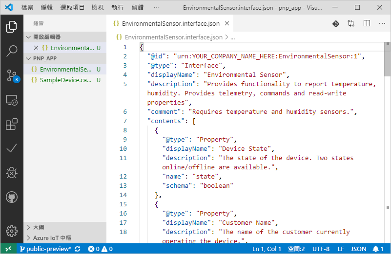
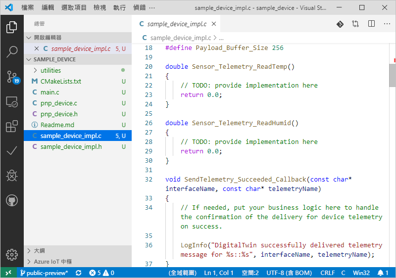

# <a name="quickstart-use-a-device-capability-model-to-create-an-iot-plug-and-play-preview-device-linux"></a>快速入門：使用裝置功能模型建立 IoT 隨插即用預覽版裝置 (Linux)

_裝置功能模型_ (DCM) 可說明 IoT 隨插即用裝置的功能。 DCM 通常會與產品 SKU 相關聯。 DCM 中定義的功能會組織成可重複使用的介面。 您可以從 DCM 產生基本架構裝置程式碼。 本快速入門說明如何在 Ubuntu Linux 上使用 VS Code，以便使用 DCM 建立 IoT 隨插即用裝置。

## <a name="prerequisites"></a>必要條件

本快速入門假設您使用的是 Ubuntu Linux 搭配桌上型電腦環境。 本教學課程中的步驟已使用 Ubuntu 18.04 進行測試。

若要完成本快速入門，您必須在本機 Linux 電腦上安裝下列軟體：

* 使用 `apt-get` 命令，安裝 **GCC**、**Git**、**cmake** 和所有相依性：

    ```sh
    sudo apt-get update
    sudo apt-get install -y git cmake build-essential curl libcurl4-openssl-dev libssl-dev uuid-dev
    ```

    確認 `cmake` 的版本高於 **2.8.12**，而且 **GCC** 的版本高於 **4.4.7**。

    ```sh
    cmake --version
    gcc --version
    ```

* [Visual Studio Code](https://code.visualstudio.com/)。

### <a name="install-azure-iot-tools"></a>安裝 Azure IoT Tools

請使用下列步驟安裝[適用於 VS Code 的 Azure IoT Tools](https://marketplace.visualstudio.com/items?itemName=vsciot-vscode.azure-iot-tools) \(英文\) 擴充套件：

1. 在 VS Code 中，選取 [延伸模組]  索引標籤。
1. 搜尋 **Azure IoT Tools**。
1. 選取 [安裝]  。

### <a name="get-the-connection-string-for-your-company-model-repository"></a>取得公司模型存放庫的連接字串

當您使用 Microsoft 工作或學校帳戶，或您的 Microsoft 合作夥伴識別碼 (如果您有的話) 登入時，您可以在 [Azure IoT 認證入口網站](https://preview.catalog.azureiotsolutions.com)中找到您的_公司模型存放庫連接字串_。 在登入後，依序選取 [公司存放庫]  和 [連接字串]  。

[!INCLUDE [cloud-shell-try-it.md](../../includes/cloud-shell-try-it.md)]

## <a name="prepare-an-iot-hub"></a>準備 IoT 中樞

您的 Azure 訂用帳戶中也必須要有 Azure IoT 中樞，才能完成本快速入門。 如果您沒有 Azure 訂用帳戶，請在開始前建立[免費帳戶](https://azure.microsoft.com/free/?WT.mc_id=A261C142F)。 如果您還沒有可使用的 IoT 中樞，請遵循本節的後半段來建立一個。

如果您在本機使用 Azure CLI，`az` 版本應該是 **2.0.75** 或更新版本，Azure Cloud Shell 會使用最新版本。 使用 `az --version` 命令檢查電腦上所安裝的版本。

執行下列命令，將適用於 Azure CLI 的 Microsoft Azure IoT 擴充功能新增至您的 Cloud Shell 執行個體：

```azurecli-interactive
az extension add --name azure-cli-iot-ext
```

本快速入門中的步驟需要 **0.8.5** 版或更新版本的延伸模組。 使用 `az extension list` 命令檢查您已安裝的版本，必要時，使用 `az extension update` 命令更新。

如果沒有 IoT 中樞，請使用下列命令建立一個，並將 `<YourIoTHubName>` 取代為您選擇的唯一名稱。 如果您要在本機執行這些命令，請先使用 `az login` 登入您的 Azure 訂用帳戶。 如果您要在 Azure Cloud Shell 中執行這些命令，則會自動登入：

  ```azurecli-interactive
  az group create --name pnpquickstarts_rg --location centralus
  az iot hub create --name <YourIoTHubName> \
    --resource-group pnpquickstarts_rg --sku S1
  ```

先前的命令會在美國中部區域建立一個名為 `pnpquickstarts_rg` 的資源群組和 IoT 中樞。

> [!IMPORTANT]
> 在公開預覽期間，IoT 隨插即用功能只能在**美國中部**、**歐洲北部**和**日本東部**區域中建立的 IoT 中樞上使用。

執行下列命令，在 IoT 中樞建立裝置身分識別。 將 **YourIoTHubName** 和 **YourDeviceID** 預留位置取代為您自行選擇的「IoT 中樞名稱」  和「裝置識別碼」  。

```azurecli-interactive
az iot hub device-identity create --hub-name <YourIoTHubName> --device-id <YourDeviceID>
```

執行下列命令，以針對您剛註冊的裝置取得「裝置連接字串」  (請將其記下，以便稍後使用)。

```azurecli-interactive
az iot hub device-identity show-connection-string --hub-name <YourIoTHubName> --device-id <YourDevice> --output table
```

## <a name="prepare-the-development-environment"></a>準備開發環境

在本快速入門中，您會使用 [Vcpkg](https://github.com/microsoft/vcpkg) 程式庫管理員，在您的開發環境中安裝 Azure IoT C 裝置 SDK。

開啟殼層。 執行下列命令來安裝 Vcpkg：

```bash
cd ~
git clone https://github.com/microsoft/vcpkg
cd vcpkg
./bootstrap-vcpkg.sh
./vcpkg install azure-iot-sdk-c[public-preview,use_prov_client]
```

預期此作業需要幾分鐘的時間才能完成。

## <a name="author-your-model"></a>製作您的模型

在本快速入門中，您會使用現有的範例裝置功能模型和相關聯的介面。

1. 在您的本機磁碟機中建立 `pnp_app` 目錄。 您可以使用此資料夾來存放裝置模型檔案和裝置程式碼 Stub。

    ```bash
    cd ~
    mkdir pnp_app
    ```

1. 將裝置功能模型和介面範例檔案下載到 `pnp_app` 資料夾中。

    ```bash
    cd pnp_app
    curl -O -L https://raw.githubusercontent.com/Azure/IoTPlugandPlay/master/samples/SampleDevice.capabilitymodel.json
    curl -O -L https://raw.githubusercontent.com/Azure/IoTPlugandPlay/master/samples/EnvironmentalSensor.interface.json
    ```

1. 使用 VS Code 開啟 `pnp_app` 資料夾。 您可以使用 IntelliSense 來檢視檔案：

    

1. 在您下載的檔案中，將 `@id` 和 `schema` 欄位中的 `<YOUR_COMPANY_NAME_HERE>` 取代為唯一值。 您只能使用字元 a-z、A-Z、0-9 和底線。 如需詳細資訊，請參閱[數位對應項識別碼格式](https://github.com/Azure/IoTPlugandPlay/tree/master/DTDL#digital-twin-identifier-format)。

## <a name="generate-the-c-code-stub"></a>產生 C 程式碼 Stub

既然您已經有 DCM 及其相關聯的介面，您可以產生實作模型的裝置程式碼。 若要在 VS Code 中產生 C 程式碼 Stub：

1. 當 `pnp_app` 資料夾在 VS Code 中開啟時，使用 **Ctrl+Shift+P** 開啟命令選擇區、輸入 **IoT 隨插即用**，然後選取 [產生裝置程式碼 Stub]  。

    > [!NOTE]
    > 第一次使用 IoT 隨插即用程式碼產生器公用程式時，需要幾秒鐘的時間才能自動下載並安裝。

1. 選擇要用來產生裝置程式程式碼 Stub 的 **SampleDevice.capabilitymodel.json** 檔案。

1. 輸入專案名稱 **sample_device**。 這會是您裝置應用程式的名稱。

1. 選擇 [ANSI C]  作為您的語言。

1. 選擇 [透過 IoT 中樞裝置連接字串]  作為連線方式。

1. 選擇 [Linux 上的 CMake 專案]  作為專案範本。

1. 選擇 [透過 Vcpkg]  作為包含裝置 SDK 的方式。

1. 系統會在與 DCM 檔案相同的位置中建立一個名為 **sample_device** 的新資料夾，而且其中是產生的裝置程式碼 Stub 檔案。 VS Code 會開啟新的視窗來顯示這些內容。
    

## <a name="build-and-run-the-code"></a>建置並執行程式碼

您可以使用裝置 SDK 原始程式碼建置產生的裝置程式碼 Stub。 您所建置的應用程式會模擬連線至 IoT 中樞的裝置。 應用程式會傳送遙測資料和屬性，並接收命令。

1. 為 **sample_device** 應用程式建立 **CMake** 組建資料夾：

    ```bash
    cd ~/pnp_app/sample_device
    mkdir cmake
    cd cmake
    ```

1. 使用 SDK 執行 CMake 來建置您的應用程式。 下列命令會假設您已在主資料夾中安裝 **vcpkg**：

    ```bash
    cmake .. -DCMAKE_TOOLCHAIN_FILE=~/vcpkg/scripts/buildsystems/vcpkg.cmake -Duse_prov_client=ON -Dhsm_type_symm_key:BOOL=ON
    cmake --build .
    ```

1. 組建順利完成後，請將 IoT 中樞裝置連接字串傳入作為參數，執行您的應用程式。

    ```sh
    cd ~/pnp_app/sample_device/cmake
    ./sample_device "<YourDeviceConnectionString>"
    ```

1. 裝置應用程式會開始將資料傳送至 IoT 中樞。

    

## <a name="validate-the-code"></a>驗證程式碼

### <a name="publish-device-model-files-to-model-repository"></a>將裝置模型檔案發佈至模型存放庫

若要使用 **az** CLI 驗證裝置程式碼，您必須將檔案發佈至模型存放庫。

1. 當 `pnp_app` 資料夾在 VS code 中開啟時，使用 **Ctrl+Shift+P** 開啟命令選擇區，然後輸入並選取 **[IoT 隨插即用：將檔案提交至模型存放庫]** 。

1. 選取 `SampleDevice.capabilitymodel.json` 和`EnvironmentalSensor.interface.json` 檔案。

1. 輸入您的公司模型存放庫連接字串。

    > [!NOTE]
    > 只有在第一次連線至存放庫時，才需要連接字串。

1. 在 VS Code 輸出視窗和通知中，您可以確認檔案是否已成功發佈。

    > [!NOTE]
    > 如果在發佈裝置模型檔案時發生錯誤，您可以嘗試使用命令 **[IoT 隨插即用：登出模型存放庫]** 來登出，然後重新執行步驟。

### <a name="use-the-azure-iot-cli-to-validate-the-code"></a>使用 Azure IoT CLI 驗證程式碼

當裝置用戶端範例啟動之後，您可以檢查它是否與 Azure CLI 搭配運作。

使用下列命令檢視範例裝置正在傳送的遙測。 您可能需要等候一或兩分鐘，才會在輸出中看到任何遙測：

```azurecli-interactive
az iot dt monitor-events --hub-name <YourIoTHubNme> --device-id <YourDevice>
```

使用下列命令檢視裝置所傳送的所有屬性：

```azurecli-interactive
az iot dt list-properties --device-id <YourDevice> --hub-name <YourIoTHubNme> --source private --repo-login "<YourCompanyModelRepositoryConnectionString>"
```

[!INCLUDE [iot-pnp-clean-resources.md](../../includes/iot-pnp-clean-resources.md)]

## <a name="next-steps"></a>後續步驟

在本快速入門中，您已了解如何使用 DCM 建立 IoT 隨插即用裝置。

若要深入了解 DCM 以及如何建立您自己的模型，請繼續進行教學課程：

> [!div class="nextstepaction"]
> [教學課程：使用 Visual Studio Code 建立和測試裝置功能模型](tutorial-pnp-visual-studio-code.md)
