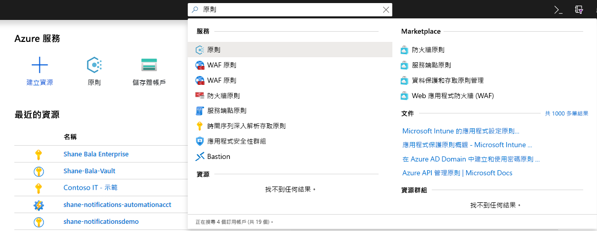
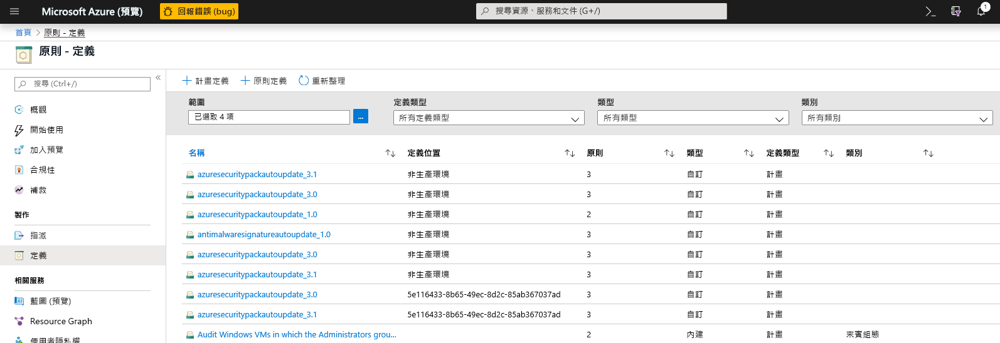
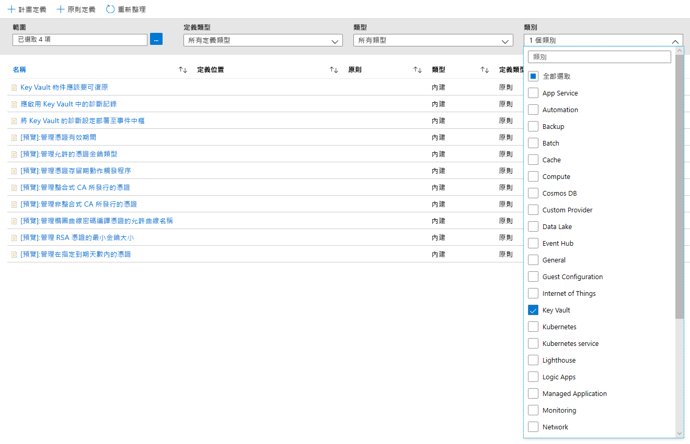
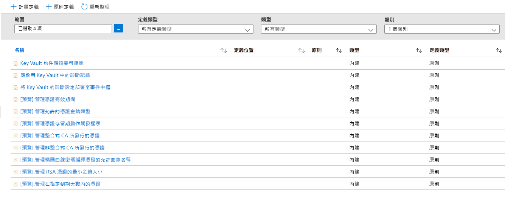
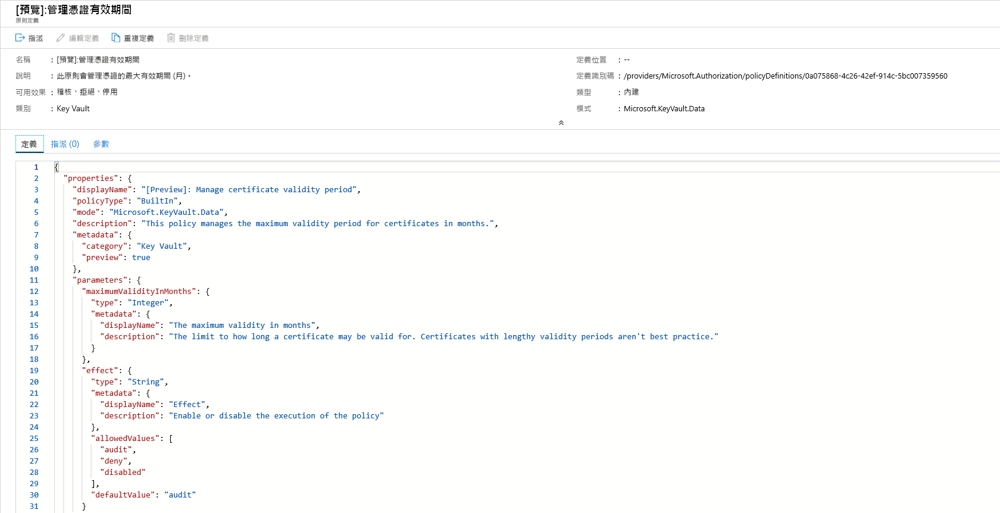
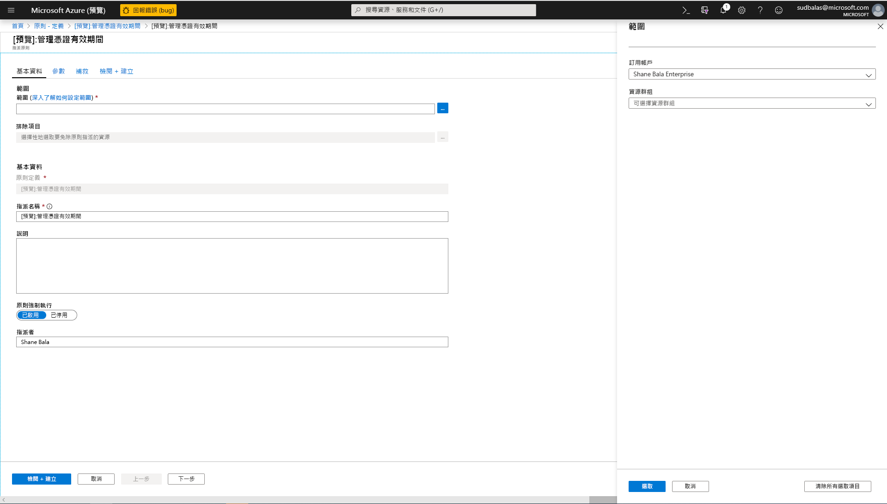
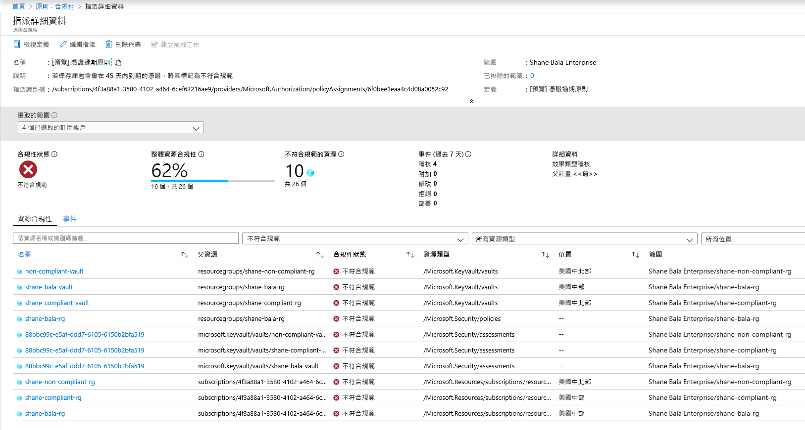
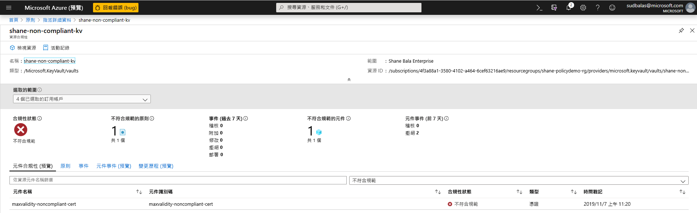
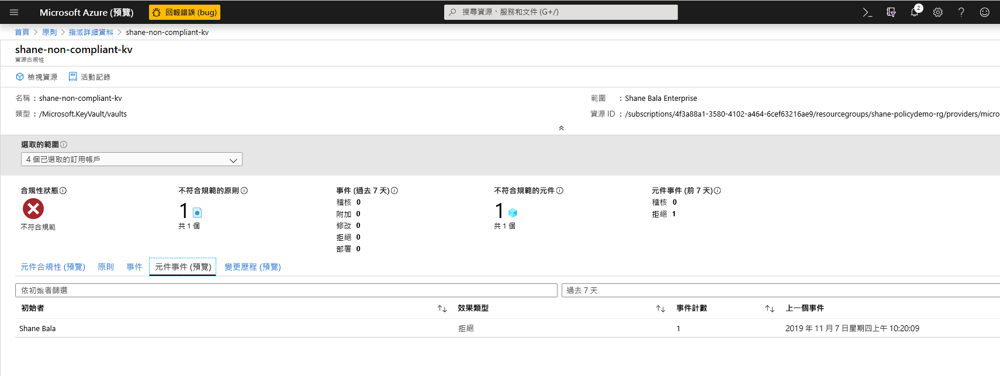

# 整合 Azure Key Vault 與 Azure 原則

[Azure 原則](../governance/policy/index.yml)是一個治理工具，可讓使用者大規模地稽核和管理其 Azure 環境。 Azure 原則可為 Azure 資源提供防護措施，確保其符合指派的原則規則。 可讓使用者對其 Azure 環境執行稽核、即時強制作業及補救。 使用者可以在合規性儀表板中取得由原則執行的稽核結果，還可以讓他們深入查看符合及不符合規範的資源和元件。  如需詳細資訊，請參閱 [Azure 原則服務概觀](../governance/policy/overview.md)。

使用案例範例：

- 您希望在公司金鑰保存庫中實作金鑰大小最小化和憑證有效期間最大化的要求，以改善公司的安全性狀態，但您不知道可符合及不符合規範的小組有哪些。 
- 您目前沒有可在整個組織中執行稽核的解決方案，或者您正藉由要求組織內的個別小組報告其合規性，以手動方式進行環境的稽核。 您正在尋找方法來自動化這項工作，並且要能即時執行稽核和保證稽核的正確性。
- 您想要強制執行公司的安全性原則，並防止個人建立自我簽署的憑證，但是您沒有自動化的方式可防止他們建立。 
- 您想要放寬測試小組的一些需求，但仍想要對生產環境維持嚴格的控管。 您需要簡單的自動化方式來區隔資源的強制執行作業。 
- 您想要確定當即時網站發生問題時，您可以回復新原則的強制執行。 您需要單鍵解決方案來關閉原則的強制執行。 
- 您依賴第三方解決方案來稽核您的環境，但您想要使用內部的 Microsoft 供應項目。 

## 原則效用的類型和指引

**稽核**：當原則的效用設定為 [稽核] 時，原則將不會對您的環境造成任何重大變更。 其只會在元件 (例如憑證) 不符合指定範圍內的原則定義時，藉由在原則合規性儀表板中將這些元件標示為不符合規範，來對您發出警示。 [稽核] 是未選取任何原則效用時的預設值。 

**拒絕**：當原則的效用設定為 [拒絕] 時，原則將會阻止您建立新元件 (例如憑證)，並防止不符合原則定義的現有元件建立新版本。 金鑰保存庫內不符合規範的現有資源不會受到影響。 [稽核] 功能將會繼續運作。

## 可用的「內建」原則定義

Key Vault 已建立一組原則，您可以在常見案例中指派這些原則來管理憑證。 這些原則都是「內建」的，表示您不需要撰寫任何自訂 JSON 來啟用原則，而且您可以在 Azure 入口網站中指派這些原則。 您仍然可以自訂特定參數，以符合您組織的需求。 

下方列出八個預覽原則。

### 管理憑證有效期間 (預覽)

此原則可讓您管理金鑰保存庫中所儲存憑證的有效期間上限。 這是限制憑證有效期間上限的有效安全性做法。 如果您憑證的私密金鑰在沒人發現的情況下遭到入侵，使用存留期較短的憑證會可將受到損害的時間範圍降到最低，並降低攻擊者可利用的憑證價值。 

### 管理允許的憑證金鑰類型 (預覽)
此原則可讓您限制金鑰保存庫中的憑證類型。 您可以使用此原則來確保您憑證的私密金鑰是受到 RSA、ECC 或 HSM 的支援。 您可以從下列清單中選擇允許的憑證類型。
- RSA
- RSA - HSM
- ECC 
- ECC - HSM 

### 管理憑證存留期動作觸發程序 (預覽)

此原則可讓您管理存留期動作，也就是針對特定到期天數內的憑證，或達到憑證可用期限的特定百分比時，所指定的存留期動作。 

### 管理整合式 CA 所發行的憑證 (預覽)

如果您使用與 Key Vault 整合的憑證授權單位 (Digicert 或 GlobalSign)，而您想要讓使用者使用其中一個提供者，您可以使用此原則來稽核或強制執行您的選取項目。 此原則也可以用來稽核或拒絕在金鑰保存庫中建立自我簽署憑證。 

### 管理整合式 CA 所發行的憑證 (預覽)

如果您使用內部憑證授權單位或未與金鑰保存庫整合的憑證授權單位，而且您想要讓使用者使用您清單中的憑證授權單位，那麼您可以使用此原則來建立憑證授權單位的允許清單 (以簽發者名稱列出)。 此原則也可以用來稽核或拒絕在金鑰保存庫中建立自我簽署憑證。 

### 管理橢圓曲線密碼編譯憑證的允許曲線名稱 (預覽)
如果您使用橢圓曲線密碼編譯或 ECC 憑證，您可以從下列清單中自訂允許的曲線名稱清單。 預設選項允許下列所有曲線名稱。 
- P-256
- P-256K
- P-384
- P-521

### 管理 RSA 憑證的最小金鑰大小 (預覽)
如果您使用 RSA 憑證，您可以選擇憑證必須具備的最小金鑰大小。 您可以從下列清單中選取一個選項。 
- 2048 位元
- 3072 位元
- 4096 位元

### 管理在指定到期天數內的憑證 (預覽)
如果未受到適當監視的憑證不會在到期前輪替，您的服務就可能會發生中斷。 此原則非常重要，可確保您儲存在金鑰保存庫中的憑證受到監視。 建議您多次套用此原則，並使用不同的到期閾值，例如 180、90、60 和 30 天的閾值。 此原則可用來監視您組織中的憑證到期情況，並加以分級。 

## 範例案例

您管理包含 100 個憑證且由多個小組使用的金鑰保存庫，而且您會想要確定金鑰保存庫中沒有任何憑證的有效期超過 2 年。

1. 您可以指派[管理憑證有效期間](#manage-certificate-validity-period-preview)的原則，將憑證的有效期間上限指定為 24 個月，並將原則的效用設定為「稽核」。 
1. 您[在 Azure 入口網站上查看合規性報告](#view-compliance-results)，並發現 20 個憑證不符合規範，且有效期間大於 2 年，其餘憑證則符合規範。 
1. 您會連絡這些憑證的擁有者，並告訴他們新的安全性需求，也就是憑證的有效期間不得超過 2 年。 某些小組回應了，並且有 15 個憑證的有效期間已更新為 2 年或少於 2 年。 其他小組則未回應，而且您的金鑰保存庫中仍有 5 個不符合規範的憑證。
1. 您可以將指派的原則效用變更為「拒絕」。 這 5 個不符合規範的憑證不會撤銷，而且會繼續運作。 不過，他們無法以超過 2 年的有效期間來進行更新。 

## 透過 Azure 入口網站啟用和管理 Key Vault 原則

### 選取原則定義

1. 登入 Azure 管理入口網站。 
1. 在搜尋列中搜尋「原則」，然後選取 [原則]  。

    

1. 在 [原則] 視窗中，選取 [定義]  。

    

1. 在 [類別] 篩選中，取消選取 [全選]  ，然後選取 [Key Vault]  。 

    

1. 現在您應該可以看到所有適用 Azure Key Vault 公開預覽版的原則。 請確定您已閱讀並了解上一節的原則指引，並選取您想要指派給某個範圍的原則。  

    

### 將原則指派給某個範圍 

1. 選取您想要套用的原則，此範例會顯示 [管理憑證有效期間]  原則。 請按一下左上角的指派按鈕。

    
  
1. 選取您要套用原則的訂用帳戶。 您可以選擇將範圍限制在訂用帳戶內的單一資源群組。 如果您想要將原則套用到整個訂用帳戶，但排除某些資源群組，您也可以設定排除清單。 如果您想要執行原則的效用 (稽核或拒絕)，請將原則強制選取器設定為 [啟用]  ，或是設定為 [停用]  來關閉效用 (稽核或拒絕)。 

    

1. 請按一下畫面頂端的參數索引標籤，以指定您需要的有效期間上限 (以月為單位)。 依照上述各節中的指引，選取 [稽核]  或 [拒絕]  來作為原則的效用。 然後選取 [檢閱 + 建立] 按鈕。 

    

### 檢視合規性結果

1. 回到 [原則] 分頁，然後選取 [合規性] 索引標籤。按一下您想要查看其合規性結果的原則指派。

    

1. 在此頁面中，您可以根據符合規範或不符合規範的保存庫來篩選結果。 在這裡，您可以看到原則指派範圍內不符合規範的金鑰保存庫清單。 如果保存庫中有任何元件 (憑證) 不符合規範，則保存庫就會被視為不符合規範。 您可以選取個別的保存庫，以檢視不符合規範的個別元件 (憑證)。 

    

1. 檢視保存庫中不符合規範的元件名稱

    

1. 如果您需要確認使用者是否無法在金鑰保存庫中建立資源，您可以按一下 [元件事件 (預覽)]  索引標籤，以檢視遭到拒絕的憑證作業摘要，其中包括要求者和要求的時間戳記。 

    

## 功能限制

指派具有「拒絕」效用的原則最多可能需要 30 分鐘 (平均案例) 和 1 小時 (最差案例)，才能開始拒絕建立不符合規範的資源。 保存庫中現有元件的原則評估最多可能需要1小時 (平均案例) 和 2 小時 (最差案例)，才能在入口網站 UI 中可看到合規性結果。 如果合規性結果顯示為「未啟動」，則可能是下列原因所造成：
- 原則評估尚未完成。 在最糟的情況下，初始評估的延遲可能會多達 2 小時。 
- 原則指派的範圍中沒有任何金鑰保存庫。
- 原則指派的範圍中沒有任何包含憑證的金鑰保存庫。 

## 後續步驟

- 深入了解 [Azure 原則服務](../governance/policy/overview.md)
- 查看範例：[無虛擬網路端點的 Key Vault 保存庫](../governance/policy/samples/keyvault-no-vnet-rules.md)

