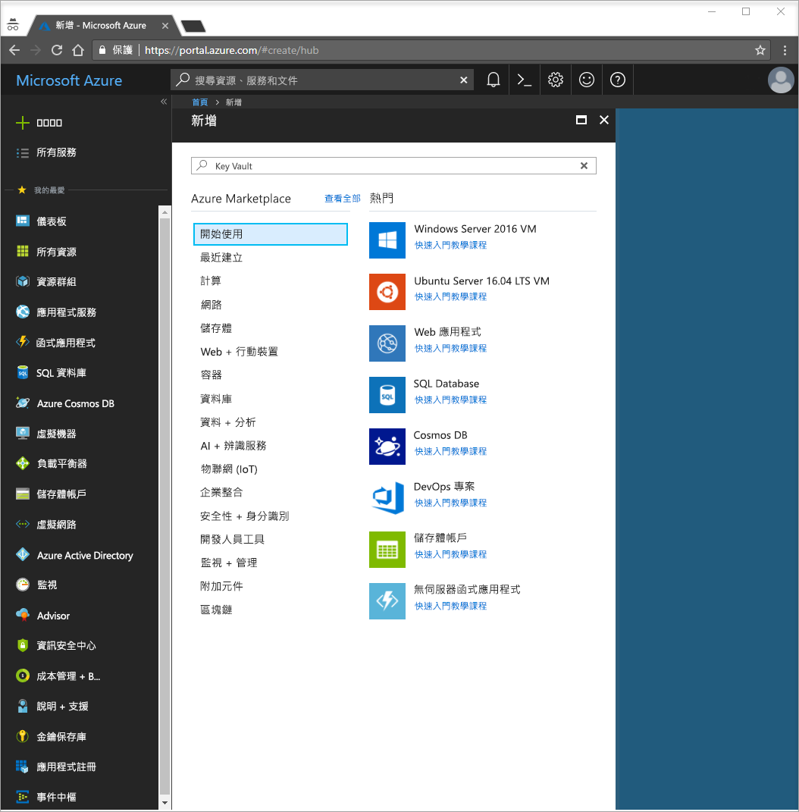
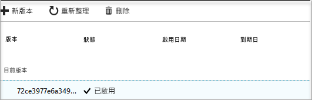

# 快速入門：使用 Azure 入口網站從 Azure Key Vault 設定及擷取祕密

Azure Key Vault 是一項雲端服務，可為祕密提供安全的存放區。 您也可以安全地儲存金鑰、密碼、憑證和其他祕密。 您可以透過 Azure 入口網站建立和管理 Azure 金鑰保存庫。 在本快速入門中，您會建立金鑰保存庫，然後用它來儲存祕密。 如需 Key Vault 的詳細資訊，您可以檢閱[概觀](key-vault-overview.md)。

如果您沒有 Azure 訂用帳戶，請在開始前建立 [免費帳戶](https://azure.microsoft.com/free/?WT.mc_id=A261C142F) 。

## 登入 Azure

在 http://portal.azure.com 登入 Azure 入口網站。

## 建立保存庫

1. 選取 Azure 入口網站左上角的 [建立資源] 選項。

    
2. 在 [搜尋] 方塊中輸入 **Key Vault**。
3. 從結果清單中，選擇 [Key Vault]。
4. 在 [金鑰保存庫] 區段上選擇 [建立]。
5. 在 [建立金鑰保存庫] 區段上提供下列資訊：
    - **名稱**：唯一的名稱是必要項。 在本快速入門中，我們使用 **Contoso-vault2**。 
    - **訂用帳戶**：選擇訂用帳戶。
    - 在 [資源群組] 下選擇 [新建]，然後輸入資源群組名稱。
    - 在 [位置] 下拉式功能表中選擇位置。
    - 檢查 [釘選到儀表板] 核取方塊。
    - 將其他的選項保留預設值。
6. 提供上述資訊之後，請選取 [建立]。

請記下下列兩個屬性：

* **保存庫名稱**：在此範例中是 **Contoso-Vault2**。 您將在其他步驟中使用此名稱。
* **保存庫 URI**：在此範例中是 https://contoso-vault2.vault.azure.net/。 透過其 REST API 使用保存庫的應用程式必須使用此 URI。

此時，您的 Azure 帳戶是唯一獲得授權在此新保存庫上執行作業的帳戶。

## 將祕密新增至 Key Vault

若要將祕密新增至保存庫，您只需要採取一些額外步驟。 在此情況下，我們會新增應用程式可以使用的密碼。 此密碼稱為 **ExamplePassword**，我們會在其中儲存 **Pa$$w0rd** 值。

1. 在 [金鑰保存庫屬性] 頁面中，選取 [祕密]。
2. 按一下 [產生/匯入]。
3. 在 [建立祕密] 畫面上選擇下列值：
    - **上傳選項**：手動。
    - **名稱**：ExamplePassword。
    - **Value**：Pa$$w0rd。
    - 將其他的值保留預設值。 按一下頁面底部的 [新增] 。

一旦收到已成功建立祕密的訊息，即可按一下清單上的祕密。 您可以接著看見某些屬性。 如果您按一下目前的版本，您可以看到您在上一個步驟中指定的值。

## 清除資源

其他 Key Vault 快速入門和教學課程會以本快速入門為基礎。 如果您打算繼續進行後續的快速入門和教學課程，您可以讓這些資源留在原處。
如果不再需要，請刪除資源群組，這會刪除 Key Vault 和相關資源。 若要透過入口網站刪除資源群組：

1. 在入口網站頂端的 [搜尋] 方塊中，輸入資源群組的名稱。 當您在搜尋結果中看到本快速入門中使用的資源群組時，請加以選取。
2. 選取 [刪除資源群組]。
3. 在 [輸入資源群組名稱:] 方塊中輸入資源群組的名稱，然後選取 [刪除]。

## 後續步驟

在本快速入門中，您已建立 Key Vault 並儲存祕密。 若要深入了解 Key Vault 以及如何使用它搭配您的應用程式，請繼續進行 Web 應用程式搭配 Key Vault 運作的教學課程。

> [!div class="nextstepaction"]
> 若要了解如何從針對 Azure 資源使用受控識別的 Web 應用程式讀取 Key Vault 中的祕密，請繼續進行以下教學課程[將 Azure Web 應用程式設定為從 Key Vault 讀取祕密](quick-create-net.md)。
